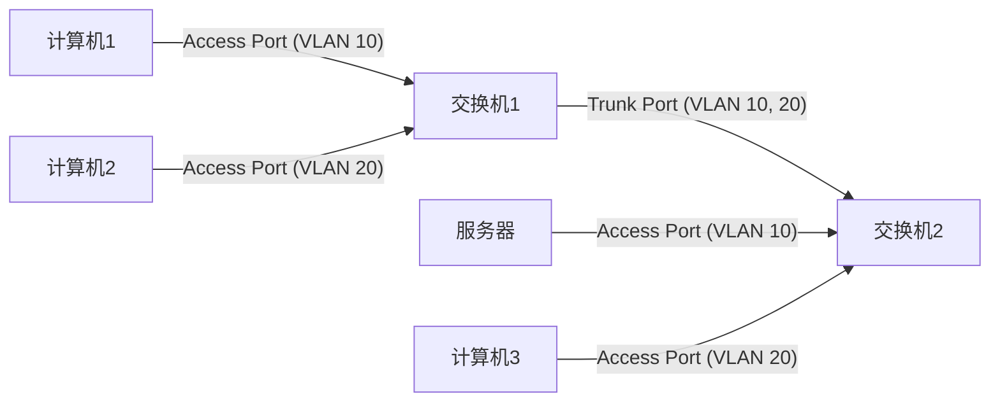

网络构架才是构架师最应该掌握的第一个技能。网络构架是所有其他构架的基础。

构架俯瞰：

- 单个Region/VPC：
  - 一个VPC，一个网关，一个ApplicationLoadBalancer，三层构架。
  - AZ两个/各自配置公共子网（NAT），私有子网（网络应用），私有子网（数据库）
  - Region中的其他AWS服务：VPC Endpoint（Gateway/Interface）
  - 连接到其他VPC网络应用：应用通过NetworkLoadBalancer暴露，LB连接PrivateLink，然后接入本VPC的Endpoint（上一个项目中的实现原理也是PrivateLink，它的目的是，VPC的对象不是另一个大范围的VPC网络，而是单个应用）
  - IP转换为DomainName：使用Route53，设置DNS服务器
  - 全球边缘内容分发服务：CloudFront会接入LoadBalancer，降低延迟，保证安全
- 多个VPC
  - VPC Peering
- VPC连接On-premise
  - Site2SiteVPN（经过Internet）：VGW-IPSecVPN连接本地
  - Client2VPC（通过客户端访问）：连接到VPC的ClientVPNEndpoint
  - DirectConnect（最安全选项）：物理
- 混合环境（VPC，VPN，Direct Connect）
  - Transit Gateway

- OTHER THOUGH
  - 网关是网络自治系统（AS）的分界
  - 涉及到网关的服务Gateway，一般都只涉及路由设置。涉及Interface，IP等，一般会涉及路由表和DNS解析。
  - 整个云构架中重要的部分：
    - API到处都是，DNS解析非常重要
    - PrivateLink和ENI功能强大
    - 混合云的需求，多VPC和本地相连

## VPC

### 非云的虚拟网络拓扑

- 非云的构架拓扑结构：internet - router（Internet Gateway，从这里进入局域网=VPC）- 内部router - hub/switch交换机（从这里进入子网LAN（local area network）=subnet）
- switch交换机是LAN的入口，帮助将packets传送到正确的host主机。
- 而云的VPC和非云的网络拓扑其实在本质上是一样的。

### VPC Scope layers

- Global：
  - AWS Account：账户级别应该是最高的，你的账户可以跨很多Region，是全球的
  - Route53，Billing是全球服务
  - IAM是全球服务，跟着账户，根据权限，可以允许访问各个区域的服务
- Region：
  - VPC是Region级别的，VPC只能构建在一个Region中，然后跨好几个AZ
  - 一个Region中可以设置好几个VPC，有上限，可以申请上限增加
  - ELB是VPC级别的，可以在VPC级别上进行服务器负载均衡
  - S3，DynamoDB是Region级别的，你不能把他们放在VPC中，他们由AWS的Region网络管理
- AZ：Subnet和EC2，RDS等是AZ级别的

### VPC Building Blocks

- 当要创建构架的时候画一个构架图总是好的
- VPC Region choice
  - Default VPC是为了方便起见为用户创建的Region级别的VPC，若手动删除，也可以右上角随时恢复，没什么特别的地方
- VPC CIDR
  - IP也是一种协议，8x4bit数字，8bit代表0～255
  - CIDR是传统的网络类型ABC的替代品，有更高的分配和路由效率，灵活的子网划分，避免了浪费
  - Mask后算出的IP范围是从IP的起始位开始的 2^(32-mask) 个IP数量
  - 0-4和255不可用，是AWS在用：0是网址，1是VPC Router，2映射到Amazon-provided DNS（Route53 DNS Resolver），3是给future预留，255是NetworkBroadcastAddress，因为VPC不支持内部广播功能（计算网址数量的时候，要想到这5个不能用）
  - IPv4一般是/16（max）或者/28（min），IPv6一般是是固定/56或者/64
  - IPv6地址全是Public的并且具有全球唯一性。不可以自己设定子网range，并且不提供Amazon Provided DNS hostname。
  - IPv6不支持Site2siteVPN，CustomGateway，NatDevice，和VPC Endpoint。只有IPv4支持。
  - EC2实例的IPv6地址在正常重启的情况下是保持不变的。只有在终止旧实例并启动新实例、手动关联新地址或发生故障迁移等情况下，IPv6地址才可能发生变化。AWS的这种设计提高了IPv6地址的可预测性和持久性。
  - Dual-stack mode是指具有IPv4和IPv6的地址。
- Route Tables：可以在VPC级别，也可以在Subnet级别
  - 创建VPC后，默认的RouteTable，默认VPC内的所有IP，服务器相互可以通信，比如Destination:10.10.0.0/16,Target:local
  - 如果将Route Table设置在Subnet级别，就可以控制子网的网络访问，这个时候，子网不会再看默认的路由表，而是使用自己的表
  - 如果有自定义的子网级别的路由表，优先级高于主路由表的路由
  - 如果要控制两个子网之间的通信还可以引入防火墙，路由表和防火墙是两个概念
  - 控制server级别的通信则需要，Security Group
- Subnets，CIDR，server
  - Subnet分为Public和Private
  - Public Subnet中服务：Web server，Load Balancer，NAT
  - Private Subnet中的服务：DB，App Server，没有Public IP，使用NAT进行网络通信
- IGW：接入外网
  - 前提是你的服务器PrivateIP对应有PublicIP（通过AWS的公共IP池分配）
  - 连接网络的条件，一个是IGW的设置，一个是0.0.0.0/0登陆到路由表
- Elastic IP
  - 通常我们自己的IP地址在路由器重启等情况会被自动分配IPv4地址，EC2自动分配（Amazon Pool within Region）的IP也是这样，当服务器重启，IP会变动。
  - 只有当你的ElasticIP和运行中的服务器绑定的时候不需要付费，其他时候，没绑定或者绑定了没有启动服务器，都是要付费的，因为这是浪费IP地址资源的行为。
  - 可以被attach到server，website，LB上。
- Security Group：EC2 level
  - 源可以是Port，可以是IP地址。还可以是另一个Security Group，当你需要接收很多EC2为源的时候，将他们和同一个SG绑定，就可以只设置这个SG为源了，当再添加新的EC2到源SG的时候，就不需要多余设置了。
  - Statefull
  - troubleshoting：如果APP（private subnet）显示timeout，可能是SG问题；如果APP显示Connection Refused，那就是APP错误或者还没running。
  - Default：inbound all blocked，outbound all authrized，可后续更改
  - 只能设置allow规则，也就是只有白名单
  - 创建EC2的时候需要设置SG
- NACL：Subnet level
  - Stateless
  - 通过设置端口范围(1024-65535)来允许这类端口的流量通过。同时可以结合其他条件(IP、协议等)来控制流量
  - 可以设置allow和deny规则，黑白名单，并且按照编号递增评估
  - 创建EC2的时候不需要设置NACL，因为和Subnet绑定就行了
- NAT：
  - NATGateway
    - Managed by AWS，5GB带宽可以scalingUpto100GB
    - 高可用性：AWS的NAT高可用性功能通过在指定的可用区内使用冗余实例来实现高可用性。如果发生故障，AWS会自动重新分配 NAT 网关资源。只需在创建时启用该功能。
    - 设置在PublicSubnet，在PrivateSubnet的路由表中路由到该nat
    - AZ level，使用EIP
    - 支持协议TCP，UDP，ICMP
    - 1024-65535 port用于outbound connection
    - NAT本身就设置在公有子网，只要公有子网的路由可以接IGW，NAT就可以接，并且NAT被分配了EIP，天生就是向外连接的
  - NATInstance
    - 放在PublicSubnet，有效化公有IP，option：设置EIP
    - 需要用AWS的NAT AMIs
    - Disable Source/Destination Check：NAT实例的作用是将发自私有子网的流量进行源网络地址转换(SNAT)，使用自身的公有IP地址访问互联网，同时将互联网响应流量进行目标网络地址转换(DNAT)，发回发起请求的私有实例。源/目标检查是EC2实例的默认安全机制，它要求实例只能发送/接收使用自身IP地址作为源/目标的流量。但是对于充当NAT角色的实例，它需要转换流量的源IP和目标IP，这与源/目标检查机制相矛盾，所以要关闭。
    - PrivateSubnet的路由要路由到NatInstance的EIP，或者这个instance的ID本身（没有EIP的情况）
    - 因为它是一个EC2所以它有自己的好处，可能比较便宜，并且可以有自己的SG，可以设置portforward，或者bastion
- DNS：Route53 Resolver

*Tips*

- 当创建Subnet的时候，一般顺便创建对应的路由表，然后和Subnet相关联
- 当创建EC2的时候，一般顺便创建对应的SG，顺便在SG中添加白名单 

### Advanced Topics（CIDR，ENI，BYOIP）

- 拓展VPC地址空间，增加第二个CIDRs（上限5个）
  - 不能和现存（包括peering）的地址空间CIDRs有重叠
  - 如果你的主CIDR是RFC1918的一个range，那你的第二个CIDR不可以是另一个RFC1918的不同range，*因为不同的range不能构成一个子网*。
    - RFC 1918是一份互联网标准文件，定义了专门保留用于私有网络使用的IP地址范围。这些私有IP地址范围包括:
      1. 10.0.0.0 - 10.255.255.255 (10.0.0.0/8前缀)
      2. 100.64.0.0 - 10.127.255.255  (100.64.0.0/10前缀)作为RFC 6598新增的共享地址空间，扩充了可用作本地网络和地址共享的IPv4地址池，是对RFC 1918的一个补充。
      3. 172.16.0.0 - 172.31.255.255 (172.16.0.0/12前缀) 
      4. 192.168.0.0 - 192.168.255.255 (192.168.0.0/16前缀)
      这些IP地址范围被*专门预留，用于构建私有的本地网络*，如家庭或企业内部网络。私有IP地址在互联网上是不可路由的，因此不会与公网上的IP地址冲突。
    - 扩展的时候必须是同一种range，比如主是10.0.0.0/16，增加第二个是10.1.0.0/16就可以
  - 如果你VPC的RouteTable中有某个CIDR（比如10.2.0.0/16）是destination，那么也不能设置和那个CIDR相同或者比他大的第二CIDR，可以设置比他小的CIDR（比如10.2.0.0/25）。

- **ENI弹性网卡**（*重新认识到了它的强大，哆啦A梦的传送门*）
  - 虚拟网卡的逻辑组件，基本相当于IP本身，一个主机可以有多个网卡（如ifconfig命令的结果所示）
  - 和EC2一样是AZlevel的
  - 可以包括以下属性：
    - 一个primary私有IPv4，一个主IPv6（6不需要私有）
    - 每个私有IPv4有一个ElasticIP
    - 一个或多个secondary pravite IPv4
    - 一个公有IPv4
    - 一个或多个IPv6
    - 一个或多个SG（安全组是和网卡绑定的）
    - 一个MAC地址（涉及使用的软件的license的时候经常是和MAC绑定的，所以将网卡带走就可以继续用软件）
    - 一个source/destination check flog（源/目标检查也是和网卡绑定的）
  - 一个EC2可以绑定多个ENI，但是Primary的ENI不能detach，可以将第二个之后的ENI进行detach，然后atach到其他的EC2上
  - 一个EC2可以拥有的IPv4地址上限是由，EC2的instance type，和ENI数量上限决定的
  - 不支持NIC Teaming（是一种将多个网络接口卡(NIC)绑定在一起作为一个虚拟接口使用的技术。主要目的是提高网络吞吐量和冗余性。），因为EC2的带宽上限是在创建时候决定好的
  - 如果对一个EC2附加来自同一个subnet的*两个ENI*可能会引起*非对称路由(Asymmetric Routing)*等网络问题，所以最好是一个EC2一个ENI，附加多个IP地址。路由表可能会基于不同的路由策略(如成本最优)选择不同的出站ENI，入站流量则倾向于沿原路径返回，与出站路径不同，形成非对称。
  - Use Cases：
    - *Requester Managed ENI*：是指在 AWS 云环境中，由客户(requester)自行管理和配置弹性网络接口(Elastic Network Interface, ENI)的一种模式。它让AWS的很多服务和网卡分离，实现用户对资源的（通过SG）管理。例如：
      - RDS创建仔AWS管理的VPC中，但是它的ENI创建在客户的VPC中，被用户控制。（lambda等其他服务也是）
      - EKS的Control-Plane master nodes创建在AWS管理的VPC中，但是它的ENI创建在客户的VPC中，就可以和worker nodes（是由客户在自己的 VPC 中创建的 EC2 实例）进行通信。
      - AWS Workspace和Appstream2.0的底层host是创建在AWS管理的VPC中，但是ENI创建在客户的VPC中，实现和客户的资源通信。
    - 创建Management network/Dual-homed instance（是指在AWS的虚拟私有云(VPC)环境中,一个EC2实例同时连接到两个不同的子网的配置，使得一个EC2可以同时访问两个子网的资源，或者实现不同的功能）
    - High Availability solution：只用一个ENI作为IP端口，当后面的EC2不可用，不删除ENI，而将该ENI atach到新的hot-standby的EC2上，实现高可用性，而不需要变更DNS等网络配置。如果对网络延迟不是很在意的小的APP可以进行这样的设计。
    - *Secondary IPs for PODs in EKS*

- BYOIP（Bring your own IP）
  - 迁移已有的公共IPv4或者IPv6路由到AWS（目的是为了继续使用自己的IP，比如该IP已经被客户使用，或者有自己的reputation，所以不想改变，或者可以*将AWS作为一个hot standby*之类的原因）
  - YourIP必须是在RIR注册过的。区域互联网注册管理机构 (RIR) 是负责特定地区内IP地址和自治系统号码（ASN）分配与管理的组织，确保网络资源的公平分配和互联网的稳定运行。支持三个：ARIN是美国，APNIC是亚太，RIPE是中东和欧洲。
  - YourIP必须历史干净，不然AWS有权拒绝你的IP迁移。
  - YourIPv4-range最多可以到/24，不能超过24（不能是25，可以是23）
  - YourIPv6-range最多可以到/48，但是如果你不想公开或者是在内部DirectConnect则最多可以到/56
  - 每个区域最多迁移5个IP range（包括4和6）
  - 授权：使用资源公共密钥基础设施（RPKI）创建一个路由原始授权（ROA：RouteOriginAuthorization）以授权AWS的自治系统号码ASN（16509和14618）来广播你的IP地址。
    - 这是为了确保你的IP地址只能通过指定的ASN进行广播，从而防止IP地址劫持和其他安全问题。
    - 通过创建和发布这个ROA，你告诉全球的路由器，只有AWS的指定ASN被授权广播你的IP地址前缀，从而提高网络安全性。
    - 简化的过程示例：1-登录RPKI管理平台：进入你所属RIR的管理界面。2-创建新ROA：填写你的IP前缀和AWS的ASN。3-确认和发布：确认信息无误并发布ROA。自治系统号码（ASN）通过边界网关协议（BGP）来广播其路由信息。BGP是一种用于在不同自治系统（AS）之间交换路由信息的标准协议。

## VPC DNS & DHCP

### VPC DNS Server（Route53 Resolver）

- **这部分内容专注于从VPC内部进行DNS解决。Route53的部分有更大的Scope。**
- 功能是：解决VPC内部资源（EC2）的DNS问题。
- 创建VPC就会被自动创建一个内部的DNS server，IP地址是VPCbaseIP+2，就是上面提到的AWS预用5个IP之一。或者IP地址也可以是一个虚拟IP：169.254.169.253(这个只能从VPC内部连)
- 通过以下方式解决request：这三者是*有顺序的*，按照顺序，自上而下进行DNS解决
  - *Route53 Private Hosted Zone*
  - *VPC internal DNS* 
  - Forwards other requests to *Public DNS*（including Route53 Public Hosted Zone，提到公共的就是指公共的互联网上的DNS服务）

- Route53 Private Hosted Zone（Route53的一项功能）*目的就是自定义自己VPC内的私有域名：域名：私有ip地址*
  - Private Hosted Zone 允许你在 Amazon VPC 中创建自定义的 DNS 命名空间，从而可以在私有网络内解析 DNS 名称。这些域名不会在公共互联网 DNS 服务器上可见，因此它们只在你指定的 VPC 内部有效。
  - 首先需要创建 Private Hosted Zone：
    - 在 AWS 管理控制台中，进入 Route 53 服务，选择“Hosted Zones”，然后创建一个新的“Private Hosted Zone”。
    - 为你的私有域名指定一个 DNS 名称（例如 example.internal）。
    - 选择一个或多个 VPC 与这个 Hosted Zone 关联。只有关联的 VPC 中的资源才能解析这个私有域名。
  - 然后配置资源记录：
    - 在 Hosted Zone 中，创建资源记录集（例如 A 记录、CNAME 记录），这些记录将指向你 VPC 内的资源（如 EC2 实例的私有 IP 地址）。
    - 例如一个 A 记录 webserver.example.internal 指向某个 EC2 实例的私有 IP 地址 10.0.0.5。
  - 进行 DNS 解析：
    - 当 VPC 内的资源（如 EC2 实例）发出对 webserver.example.internal 的 DNS 查询时，Route 53 使用 Private Hosted Zone 中的配置解析这个域名，并返回相应的 IP 地址。
    - 这保证了域名解析请求不会离开 AWS 网络，增强了安全性和性能。
  - 权限控制：
    - 通过关联特定的 VPC，确保只有这些 VPC 内的资源才能访问和解析 Private Hosted Zone 中的域名。你也可以使用 IAM 策略控制对 Hosted Zone 配置的访问权限。

- VPC（internal）DNS
  - 负责解析在VPC中的资源（如EC2实例、RDS实例等）的域名，确保它们能够通过内网进行通信。
  - 当你创建一个EC2的时候勾选为他分配DNS网址，会自动分配一个类似`ip-<ip address>.region.compute.internal`这样的地址，就可以使用内部的VPC DNS进行解决。
  - 但是相比这个不如用自己定义的域名，也就是在 Private Hosted Zone 中定义自己的域名。

- *Public DNS*（including Route53 Public Hosted Zone）
  - 在外网中递归地查询域名。
  - 这部分在Route53中更细致。
  - 这个部分的resolution和上面的不同之处在于，它*需要通过一个网关和互联网连接*，而上面两个不需要，是内部的resolution。

- Route53 Resolver Endpoint
  - 用于在VPC和本地on-premise网络之间进行DNS解析
  - 将DNS端点*ENI*配置在VPC中的subnet中，通过ENI进行request转发，实现解析
  - ENI包括Inbound和Outbound：Inbound是DNS在AWSVPC中，本地request到ENI，然后被转发到Route53Resolver解析。Outbound是DNS在本地服务器中，当VPC中的服务器请求解析时，如果内部无法解决，会根据条件通过ENI转发request到本地数据中心的DNS进行解析。

### DHCP Option sets

- **DHCP**（Dynamic Host Configuration Protocol）是一种网络管理协议，用于自动分配IP地址和其他网络配置参数给客户端设备，以便它们可以在网络上通信。DHCP简化了网络管理，不需要手动为每个设备配置网络设置。
- 工作原理如下：
  - 发现（Discover）：新设备（客户端）连接到网络时，会广播一个DHCP Discover消息，寻找可用的DHCP服务器。
  - 提供（Offer）：DHCP服务器收到Discover消息后，会返回一个DHCP Offer消息，提供一个可用的IP地址和其他网络配置信息（如子网掩码、网关地址、DNS服务器）。
  - 请求（Request）：客户端收到Offer后，选择一个DHCP服务器，并广播一个DHCP Request消息，表明它接受所提供的IP地址。
  - 确认（Acknowledge）：选定的DHCP服务器收到Request消息后，确认并发送一个DHCP Acknowledgment（ACK）消息，正式分配IP地址给客户端，同时提供其他必要的网络配置信息。
  - 租约lease管理：分配的IP地址有一个租约期限。在租约到期前，客户端需要向DHCP服务器请求续租，以继续使用该IP地址。

- 上一个部分的内部DNS解决可以达成，那么*EC2是如何知道要去2号IP找到这个VPC DNS的*，就是通过DHCP的设置。
- **DHCP Option Sets**：
  - 包括Domain Name，DNS设置，NTP服务器，和NetBIOS node type。
  - NTP（Network Time Protocol）是一种网络协议，用于同步计算机系统之间的时钟，以确保它们的时间一致。
  - NetBIOS（Network Basic Input/Output System）是一种用于局域网（LAN）中的通信协议，提供网络基本输入/输出服务。它允许应用程序在网络上的计算机之间进行通信，包括名称解析（将计算机名称转换为IP地址）、会话管理（建立和管理连接）、和数据传输。NetBIOS常用于早期的Windows网络环境，但在现代网络中，许多功能已被其他协议（如DNS和TCP/IP）所取代。
- 在VPC中创建的时候会生成一个默认的DHCP Option sets：
  - Domain-name={region}.compute.internal
  - name-servers=AmazonProvidedDNS
  - 它会为新创建的EC2创建内部hostname：<ip-ip-address>.<region>.compute.internal（美国东部US-east-1是<ip-ip-address>.ec2.internal），和`/etc/resolv.conf`，记载nameserver服务器的地址，和域名后缀<region>.compute.internal，这意味着你可以直接ping <ip-ip-address>也可以成功。
  - 它会为有publicIP的EC2创建外部hostname：ec2-<ip-address>.<region>.amazonaws.com（美国东部US-east-1是ec2-<ip-address>.compute-1.amazonaws.com）
  - 如果要给一个在public subnet中的EC2分配public ip，需要Enable DNS hostname。
  - 从内部的EC2进行ping Private EC2的时候，会返回私有ip，从外部进行ping的时候会返回公有ip。
- 无法对已有的DHCP进行更改，只能*创建一个新的DHCP*，然后attach到VPC中，以此*创建自己的内部域名（使用新创建的Private Hosted Zone）*，或者*不使用AmazonProvidedDNS，而是指向自己定义的DNS服务器*。设置后，需要等待内部租约lease更新，或者使用command（sudo dhclient -r eth0）进行手动更新。（一个VPC只能绑定一个DHCP option sets）
  - 自己的DNS服务器，需要UDP53端口进行通信。
- VPC DNS Attributes：
  - enableDnsSupport（DNS Resolution setting）是 AWS 中用于配置 VPC 的一个功能，它允许 VPC 中的实例使用默认的 DNS 解析服务来解析公共 DNS 域名，从而能够与互联网上的资源进行通信。默认启用，但是关闭了也可以自己设置Custom DNS Server。
  - enableDnsHostname（DNS Hostname setting）是 AWS VPC 中的一个配置选项，它允许 VPC 内的实例分配具有公开可解析主机名的 DNS 记录，从而使其他网络中的资源可以通过主机名来访问 VPC 中的实例。新VPC默认是禁用的。前置条件是 enableDnsSupport 为 True。
  - 使用Private Hosted Zone的前提是这两种属性都设置为True。

## Network Performance & Optimization

### Network Performance基础

**基础概念**

- *Bandwidth*带宽是指，在数据通信过程中，在单位时间从网络中的某一点能够通过的最大数据量。bit为单位。（byte是字节是8bit）
- *Latency*（延迟）是指数据从源发送到目的地所需的时间延迟，通常以毫秒(ms)为单位测量。它反映了网络传输的速度和响应时间，延迟越低，网络性能越好。
- hop是指数据包在传输过程中经过的一个*中间设备*（如路由器或网关）。每经过一个设备就算作一个hop，hop数越多，通常意味着数据包的路径越长，可能增加延迟。
- *Jitter*是指在网络中，数据包传输延迟的变化或波动，通常是指连续数据包之间到达时间的变动。高jitter会导致实时应用（如视频会议和在线游戏）的质量下降，因为数据包到达时间不一致会影响*流畅性*。
- *Throughput*是指在网络中单位时间内成功传输的数据量，通常以比特bit每秒（bps）、千比特每秒（kbps）或兆比特每秒（Mbps）等单位表示。它衡量网络传输效率和容量，throughput越高，网络能够处理的数据量就越大。受到带宽，延迟等的影响。
- PPS（Packets Per Second）是指网络设备每秒钟*处理的数据包数量*。它是衡量网络设备（如路由器、交换机）性能的一个重要指标，PPS越高，*设备处理数据包的能力*越强。
- *MTU*（Maximum Transmission Unit）是指网络中单个数据包的最大字节大小。MTU值*决定了数据包的最大尺寸*，设置合适的MTU可以优化网络性能，避免数据包分片，提高传输效率。
  - "Don't Fragment"是IP数据包中的一个标志位，指示网络设备不要对该数据包进行分片。如果数据包超过路径中的MTU值且设置了“Don't Fragment”标志（DF=1代表不允许分片），数据包将被丢弃并返回一个ICMP（*MTU path discovery*中，该协议必须被允许）错误消息，而不是被分片传输。
  - 受到错误消息后，client就会传输几个较小的数据包，重新传输。
  - 在EC2的设置，依赖于instance type是否支持
  - 在*ENI level*定义
  - check path MTU: tracepath amazon.com
  - check the MTU on your interface: ip link show eth0
  - set MTU value on Linux: sudo ip link set dev etho mtu 9001
- *Jumbo Frame*是指超过标准MTU（通常为1500字节）的以太网帧，通常大小在9000字节左右，几乎是MTU的六倍。使用Jumbo Frame可以*减少数据包数量*，从而降低CPU负载和提高网络效率，但需要所有网络设备都支持Jumbo Frame才能发挥其优势。
  - AWS的*内部*默认支持JumboFrame
    - 注意：如果通过IGW或Peering出去了就不支持了，降低为1500，所以*这里的使用要非常小心*，最好在可以使用的scope使用
    - 在*EC2集群放置组*（EC2 Cluster Placement Group）内使用JumboFrame，可以最大化throughput。（EC2集群放置组是一种用于容纳具有特定亲和性或亲缘性的EC2实例的逻辑分组。也许他们放置在同一个物理主机上。它可以提供更低的网络延迟和更高的网络吞吐量，适用于需要在集群中的实例之间进行低延迟和高吞吐量通信的应用程序。
    - *VPC Endpoint*：支持MTU 8500 bytes
    - *Internet Gateway*：出界进入互联网MTU变为1500 bytes
    - *Intra Region VPC peering*：区域内部，MTU 9001 bytes
    - *inter Region VPC peering*：区域之间的peering，MTU 1500 bytes
  - On-premise的情况
    - 使用VGW的VPN：MTU 1500 bytes
    - 通过Transit Gateway的VPN：Site2siteVPN：MTU 1500 bytes
    - 使用*AWS Direct Connect*，那么VPC之间和VPC与on-premise之间也支持JumboFrame
    - 通过Transit Gateway的Direct Connect：MTU 8500 bytes（VPC -> TransitGateway -> DX -> on-premise）

### EC2 Network performance Optimization

**这部分的加速，都是在传输距离，网卡专用，绕过系统，绕过中介上做功夫。**

- **Cluster Placement Group**
  - 逻辑组，同一个AZ内
  - 满足分布式应用，低延迟需求，比如HPC（高性能计算机，使用大规模的并行计算系统，以高速处理复杂的数学模型和大规模的数据集。）
- **EBS Optimized Instance**
  - EBS是一种网络存储drive，通过网络和instance通信，所以是有延迟的
  - EBS和instance之间通过ENI通信，那么和其他通信内容共享就会有较低的带宽
  - Optimized的版本，是IO接口是dedicated专有接口，以此优化EBS的通信性能，不需要和其他traffic进行竞争

- **Enhanced Networking**
  - Enhanced Networking是一种技术，旨在提高云计算环境（如AWS EC2实例）中的网络性能。通过使用特定的网络接口（如Elastic Network Adapter, ENA）和网络虚拟化技术，Enhanced Networking提供更高的带宽、更低的延迟和更低的抖动（jitter），适用于对网络性能要求较高的应用程序，如高性能计算（HPC）、大数据分析和实时应用。
  - 意味着PPS可能超过1M（每秒要传输100万数据包），目的是降低instance之间的传输延迟
    - 我的理解就是*EC2的通信可以直接绕过虚拟层，而是通过物理主机的网卡进行通信（通过ixgbevf或ENA），以降低延迟。*
    - SR-IOV（Single Root I/O Virtualization）是一种技术，用于提高虚拟化环境中网络和存储设备的性能和效率。它允许物理网络适配器（如以太网卡）在多个虚拟机之间直接共享，而不是通过主机操作系统进行中介。
    - PCI（Peripheral Component Interconnect 周边组件互联）是一种计算机总线标准，用于连接各种外部设备（如网卡、显卡、存储控制器等）到计算机的主板。PCI设备可以是物理设备，也可以是虚拟设备，SR-IOV则是针对虚拟化环境中PCI设备的一种技术扩展。PCI允许你的**VM和物理NIC网卡直接通信**，这里的VM就是EC2，也就是让EC2，和它所在的物理服务器的NIC进行通信。以此实现*低延迟，高传输*。
  - 支持Enhanced Networking的可用的Instance type：
    - *VirtualFunction（VF）uses ixgbevf driver*（up to 10GGbps）`ethtool -i eth0`输出driver:ixgbevf
    - *Elastic Network Adapter（ENA）*（up to 100Gbps）`ethtool -i eht0`输出driver:ena
    - ixgbevf驱动程序是Intel开发的一种用于虚拟功能设备的网络驱动程序，特别针对Intel 10 Gigabit Ethernet硬件。它支持SR-IOV技术，允许虚拟机直接访问物理网络适配器的虚拟功能（Virtual Function），从而提高网络性能和效率，减少延迟和CPU开销。
    - Elastic Network Adapter（ENA）是AWS提供的一种高性能网络接口，用于EC2实例。ENA支持高达100 Gbps的网络吞吐量，提供低延迟和高数据包处理能力。
  - 除此之外，也必须是支持Enhanced Networking的操作系统AMI

- **DPDK**
  - DPDK，全称为Data Plane Development Kit，它主要用于*加速网络数据包处理*，通常应用于网络设备和服务器上。DPDK通过*绕过bypass操作系统的内核网络栈*，直接在用户态进行数据包处理，从而大大提高数据包处理的速度和效率。所以它的目的是加速**操作系统内的包处理**。（SR-IOV是*加速instance和hypervisor之间的*包处理，这个还要经过一下操作系统再去网卡呢，DPDK直接操作系统都直接绕过了），算法很cool。

- **EFA**
  - 是ENA的一种类型，只能用于Linux系统，才能发挥它的功能，如果你放在Windows上，它就只是一个ENA了。
  - EFA，全称为Elastic Fabric Adapter，是亚马逊AWS提供的一种高性能网络接口。EFA旨在加速HPC（高性能计算）和机器学习应用中的网络通信。使得HPC内部使用MPI（Message Passing Interface，是一种用于编写*并行程序*的标准通信协议和编程模型），绕过bypass OS内核，直接和EFA进行包通信。总之，EFA通过支持RDMA（Remote Direct Memory Access）和OS Bypass，允许应用程序直接访问*网络硬件*（这里就是EFA），从而减少了通信延迟和CPU开销。

### Bandwidth limits（inside & outside VPC）

- 这部分的基础概念：**Network Flow 5 - tuple**
  - 在网络流量分析和网络流识别中，"5-tuple" 是指用于唯一标识网络流的一组五个参数。这五个参数是：
    * 源IP地址（Source IP Address）：数据包的发送方IP地址。
    * 目的IP地址（Destination IP Address）：数据包的接收方IP地址。
    * 源端口号（Source Port Number）：发送方应用程序的端口号。
    * 目的端口号（Destination Port Number）：接收方应用程序的端口号。
    * 协议（Protocol）：传输层协议，如TCP（传输控制协议）或UDP（用户数据报协议）。
  - 这五个参数组合起来可以唯一标识一个网络流，区分不同的通信会话。
  - 每个flow都有带宽限制，所以增加带宽，可以通过*Multiple-Flows*实现。这部分的内容，基本都是通过多个Flows的叠加来提升带宽。

- VPC的带宽限制包括：Internet Gateway，NAT Gateway，VPC Peering
  - No VPC specific limits
  - No limit for any Internet Gateway
  - No limit for VPC Peering
  - NAT Gateway每个带宽都是45Gbps，可以使用多个NAT Gateway来增加带宽到45Gbps以上。但是要注意不要跨到别的AZ去，那会另外付数据传输费。

- EC2的带宽限制
  - 受到instance本身的instance family，vCPU，传输目的地的影响
  - 在*region内传输*可以利用最大带宽
  - 通过Internet Gateway或者DX*传输到其他region*，最大可以利用*50%带宽*，并且需要是*Current Generation instance with 32vCPUs*，*32vCPUs以下*的实例只能限制在*5Gbps内*。
  - 通过VF提升单Flows带宽到5Gbps，集合带宽到10Gbps
  - 通过ENA提升
    - 单Flows带宽到*5Gbps*（outside placement group），*10Gbps*（inside placement group）
    - 集合Flows带宽到*100Gbps*，通过Multiple-Flows（在同VPC内 / VPC-peering / 通过VPC-endpoint到同区域的S3）
  - 一个特例AWS的 P4d instance，集群超级计算机可以有400Gbps的带宽

- VPN Connection & Direct Connect & Transit Gateway
  - VPG（*Virtual Private Gateway*）到On-premise之间的带宽限制是*1.25Gbps*。由于单个VPC不支持ECMP（Equal-Cost Multi-Path）功能，所以上限就是1.25Gbps了。
  - 通往*同一个VPG的VPN聚合*的带宽上限也是*1.25Gbps*
  - *DX*的带宽通过Port Speed限制
  - DX通往VPG的带宽也取决于Port的speed限制
  - 总之**涉及到DX就是取决于它自己的Port Speed，而关于VPC自身的VPN连接则上限为1.25Gbps。**
  - *TransitGateway*则支持ECMP，所以可以多路径提升聚合带宽。单个VPN带宽1.25Gbps上限，聚合带宽上限为*50Gbps*。

（**上面的数字会变化，会进化，但是底层原理是不变的，理解为什么很重要。**）

### Network I/O Credits

在AWS EC2中，Network I/O Credit是一种用于衡量和管理实例网络性能的机制，类似于EC2的CPU Credit系统。它主要用于突发型实例（如T3和T4g实例），帮助这些实例在需要时能够临时获得更高的网络带宽。以下是有关Network I/O Credit的详细解释：

1. **突发型实例**：
   - AWS的突发型实例（T3、T4g，R4等）设计用于处理偶尔的高负载工作，但通常在较低的基线性能下运行。
   - 这些实例在低负载时期会积累网络I/O Credit，当需要更高的网络带宽时，可以使用这些积累的Credit来提升网络性能。
2. **网络I/O Credit机制**：
   - 每个突发型实例在较低负载时会以一定速率积累Network I/O Credit。
   - 当实例需要更高的网络带宽（例如数据传输量突然增加）时，可以使用积累的Network I/O Credit来实现临时的网络性能提升。
3. **基线性能和突发性能**：
   - 突发型实例有一个基线baseline网络带宽限制，在这个限制内实例能够持续传输数据而不会消耗Network I/O Credit。
   - 如果实例需要超过基线带宽，系统会检查是否有足够的Network I/O Credit。如果有，实例可以短时间内使用更高的带宽。
4. **适用场景**：
   - 突发型实例适用于大多数时间网络需求较低，但偶尔需要较高网络带宽的工作负载。
   - 例如，开发和测试环境、小型网站和博客、突发性流量的应用等。
5. **监控和管理**：
   - AWS提供了工具和指标来监控Network I/O Credit的使用情况，如CloudWatch中的指标，可以帮助用户了解实例的网络性能和Credit使用情况。

通过使用Network I/O Credit，AWS突发型实例能够在需要时提供高网络性能，同时在大多数时间保持低成本。这种机制确保了灵活性和成本效益，适合处理不均衡的网络流量需求。

## VPC traffic Monitoring & Troubleshooting & Analysis

**网卡NIC才是网络世界的核心：Network Interface Card / Elastic Network Interface**

### VPC flow logs

- 捕获in/out *ENIs* 的IP traffic信息，因此它可以帮助troubleshooting连接问题
- 这些ENI包括：ELB，RDS，ElastiCache，Redshift，workspaces，NATGateway，TransitGateway等，这些服务会在你的EC2中创建ENI，因此也会被捕获
- VPC level / subnet level / ENI level
- 存储目的地：S3（用Athena分析）/ CWlogs（用insights分析）/ KinesisDataFirehose（送至其他服务数据库）
- 需要创建IAM Role，拥有相应的写入log的权限
- 收集这些信息不会对你的ENI造成inpect影响
- Log信息有固定的格式（@timestamp/@message），并且可以自定义custom的fields（在VPC页面点击创建VPCflowlogs处可以定义）
- SG和NACL的troubleshooting，主要记住SG是statefull而NACL是stateless的就ok
- 一些高级的内置既存traffic不会被捕获，比如非自定义的DNS服务器流量，DHCP（动态主机IP配置）流量，EC2元数据网址（196.254.196.254）流量，TimeSync（169.254.169.123），Windows license activation server，Mirrored traffic等。
- 传统的网络监控工具：
  - packet capture：wireshark / tcpdump
  - traceroute：网络诊断工具，用于追踪数据包从源计算机到目的计算机所经过的路径，以及沿途每一跳的响应时间。
  - telnet：打开与指定IP地址（或主机名）的Telnet会话，允许用户进行远程管理。
  - nslookup：查询域名系统（DNS）记录
  - ping：需要SG打开ICMP协议（专为网络诊断和错误报告设计。它用于发送控制消息和错误报告，帮助检测和解决网络问题。）

### VPC Traffic Mirroring

- 将EC2的ENI的流量进行copy，将流量重定向到目标存储位置以进行后续分析。
- VPC中的创建方法：
  - Create the mirror target：可以是EC2或者是ELB/NLB（UDP-4789） -> 之后就可以接一个或者一组Traffic Analyzer
  - Define the traffic filter：过滤内容：
    - Direction：inbound/outbound
    - Action：Accept/Reject
    - Protocol：Layer4
    - Source Port Range/Destination Port Range
    - Source CIDR block/Destination CIDR block
  - Create the mirror session
- VPC传输（Source-Target）*范围限制*：
  - 同一个VPC内
  - 或者同一个Region中的不同VPC（通过Peering或者TransitGateway连接起来的VPC）
  - 不同Region无法设置
  - Source和Target还可以是不同的AWS account

### VPC Network Analysis

- *Reachability Analyzer* （在Network Manager中是monitoring和troubleshooting工具）
  - 点（hop）到点的连接是否可行的分析工具，比如EC2到EC2，workspace到EC2等
    - 支持的Source/Destination（还在增加）：Instance, Internet Gateway, Network Interface, Transit Gateway, VPC Endpoint, VPC peering, VPN Gateway
    - 中间的组件支持：ALB，NLB，NAT Gateway，TGW，VPC peering
  - 范围限制：同VPC，同Region不同VPC（通过Peering或者TGW连接），不同AWSAccount（和Mirroring一样的限制范围）
  - 中间经过的SG，NACL，ELB，Peering，等防火墙和连接是否有问题，会给出细节
  - 会指出block了通信的组件是什么
  - 原理：不是通过send packets，而是使用*network configurations*来找到原因。因此use case主要是找到因为设置问题，出现的网络不通问题。
  - *怀疑它内部用的是Infra的code进行分析的
  - 所以当你是Iac的CI/CD集成构架时，就可将该功能加入CI/CD流程，保证你的设置按预期设定
  - 暂时只支持IPv4

- *Network Access Analyzer* （在Network Manger中是Security和Governance工具）
  - 分析从一个点到另一个点的各种path，审查这些path是否合规：比如你的一个EC2直接通外网了，那么你可以用该工具检测，判定不合规，并修复
  - UseCase：信任网络路径，信任连接检测，隔离网络区域检测等
  - 需要设置一个NNetwork Access Scope，有AWS预设的也可以自定义，定义后实质是一个json格式定义

## Pravite Connection

### AWS的托管服务构架

在 AWS 中，托管服务可以大致分为两种类型：通过 API 访问的托管服务和实例在用户 VPC 中的托管服务。这两种类型在架构和操作上有明显的区别。以下是对这两种类型的详细解释和它们的架构原理：

**1. 通过 API 访问的托管服务**

这些服务由 AWS 完全管理，用户通过 API 接口与这些服务交互，而不需要关心底层的基础设施和实例配置。服务的实例通常运行在 AWS 自己的基础设施中，而不是用户的 VPC 中。

- **完全托管**：AWS 负责所有的基础设施管理，包括服务器配置、扩展、维护和安全。
- **抽象化**：用户只需调用 API 接口进行操作，底层细节被完全抽象掉。
- **高可用性**：AWS 提供了内建的高可用性和故障恢复机制。
- **自动扩展**：服务会根据需求自动扩展，无需用户干预。

**示例服务**
- Amazon S3：对象存储服务，通过 API 进行文件的上传、下载和管理。
- Amazon DynamoDB：NoSQL 数据库服务，通过 API 进行数据操作。
- AWS Lambda：无服务器计算服务，通过 API 触发函数执行。

**架构原理**
- 客户端请求：用户通过 SDK 或 RESTful API 发送请求到 AWS 服务端点。
- 服务处理：AWS 接收到请求后，在其管理的基础设施上处理请求。
- 结果返回：处理结果通过 API 响应返回给用户。

**2. 实例在用户 VPC 中的托管服务**

这些服务运行在用户的 VPC 中，使用户可以对网络环境进行更细致的控制，同时享受托管服务的便利。这些服务实例需要用户在自己的 VPC 中配置，但管理和维护仍由 AWS 负责。

- **网络控制**：用户可以控制服务实例所在的网络环境，包括子网、路由和安全组配置。
- **托管维护**：虽然实例在用户的 VPC 中，但 AWS 仍负责服务的维护、打补丁和自动备份等任务。
- **与其他 VPC 资源整合**：这些实例可以直接与同一 VPC 中的其他资源（如 EC2、RDS 等）通信。

**示例服务**
- Amazon RDS：关系数据库服务，数据库实例运行在用户的 VPC 中。
- Amazon ElastiCache：内存缓存服务（Redis、Memcached），缓存节点运行在用户的 VPC 中。
- Amazon Redshift：数据仓库服务，集群实例运行在用户的 VPC 中。
- 当然还有EC2。

**架构原理**
- **实例部署**：用户在自己的 VPC 中创建和配置服务实例。
- **AWS 管理**：AWS 自动处理实例的维护、监控、扩展和故障恢复。
- **VPC 网络**：用户可以通过 VPC 网络配置（如子网和安全组）来控制实例的网络流量和安全策略。

**比较和选择**
- 通过 API 访问的托管服务
  - **优点**：无需管理底层基础设施，自动扩展，高可用性。
  - **缺点**：网络配置和控制能力有限，可能无法满足对网络细节有严格要求的应用。

- 实例在用户 VPC 中的托管服务
  - **优点**：提供对网络环境的更高控制权，能与 VPC 内其他资源更紧密地整合。
  - **缺点**：需要配置和管理 VPC 内的网络环境，尽管实例的运维工作仍由 AWS 负责。

- 选择依据
  - **简单性和抽象化**：如果希望尽可能简化基础设施管理，使用通过 API 访问的托管服务。
  - **网络控制和整合**：如果需要对网络配置有更高的控制权，并希望与 VPC 内其他资源无缝集成，选择实例在用户 VPC 中的托管服务。

### 关于私有连接
- 包括VPC Peering，VPC Gateway Endpoint，VPC Interface Endpoint，PrivateLink
- TransitGateway可以实现，私有和公有的混合构架
- 私有连接的目的：
  - 外网连接不安全，所以我们需要TCP传输层连接，应用层连接则需要HTTPS等安全连接
  - 外网连接的带宽和延迟限制，会影响服务体验
  - NAT连接会产生额外的Cost
  - 数据库和应用服务器等不应该暴露在外网的部分需要私有连接

### VPC Peering

- 是AWS Network管理的组件
- 现在可以同region也可以跨region
- 同一个AZ中进行Peering的VPC之间的data transfer是免费的，但是跨AZ的需要付费
- 可以跨账户
- CIDR不能有overlapping
- 不具有传递性，必须两两连接
- 两个VPC之间只能设置一个Peering，不具有冗余性
- 一个VPC可以设置的最大上限数量是125个Peering
- 必须更新*每个VPC的subnet*的*route table*，以确保双方允许通信
- 需要一个请求方VPC和一个接受方VPC授权连接
- 限制Case：如果VPCA-VPCB之间是Peering：
  - VPCA无法利用VPCB的Internet Gateway，NAT Gateway，或者VPC Endpoint（Gateway）
  - 如果VPCB和一个On-premise之间是VPN或者DX，VPCA也*无法连接到On-premise*，需要其他Proxy设置。

- 补充：*Proxy*是指一种代理服务器：比如负载均衡，CDN内容分发服务，身份代理，API网关，地址转换NAT等都是代理形式。

### VPC Endpoint

- VPC Endpoint在不经过公共互联网的情况下，将VPC私有连接到支持的 AWS 服务。这种连接是安全的、可靠的，低成本，并且简化了与这些服务的交互。
- AWS 提供两种类型的 VPC Endpoint：接口端点 (Interface Endpoint) 和网关端点 (Gateway Endpoint)。
- 接口端点是基于 AWS PrivateLink 的，使用弹性网络接口 (ENI) 在您的 VPC 中为支持的服务提供私有 IP 地址。
  - 访问支持 PrivateLink 的服务，例如 Amazon S3、DynamoDB 之外的 AWS 服务（如 EC2、Systems Manager、Kinesis 等）。
  - 连接第三方 SaaS 应用程序或您自己的服务，通过 PrivateLink 在您的 VPC 中公开这些服务。
  - 现在S3也有了Interface端点了。

- 网关端点是针对 Amazon S3 和 DynamoDB 提供的，使用 VPC 路由表将流量定向到这些服务。
  - 访问 Amazon S3 和 DynamoDB，而无需通过公共互联网。
  - 在数据处理、分析和存储工作流中，确保数据在 VPC 内部安全传输。

**设置 VPC Endpoint 的步骤**
- 登录到 AWS 管理控制台，导航到 VPC 控制台，选择“Endpoints”，并点击 “Create Endpoint”。
- 选择服务类型：
  - 对于接口端点，选择所需的 AWS 服务或第三方服务。
  - 对于网关端点，选择 Amazon S3 或 DynamoDB。
- 选择 VPC 和子网：
  - 对于接口端点，选择将创建弹性网络接口 (ENI) 的子网。
- 配置安全组（仅适用于接口端点）：
  - 设置安全组以控制访问权限。
- 更新路由表：
  - 对于网关端点，选择要更新的路由表，并添加指向目标服务的路由。

**接口interface和网关gateway**
- *接口Interface端点*
  - 通过 AWS PrivateLink 实现，通过在用户 VPC 的子网中创建**弹性网络接口（Elastic Network Interface, ENI）**，将流量定向到支持 *PrivateLink* 的 AWS 服务。
  - VPC 内的资源是通过私有 IP 地址*路由访问* ENI，流量通过 PrivateLink 路由到 AWS 服务。
  - 内部启用私有 *DNS 名称解析*后，服务的标准 DNS 名称会解析为 ENI 的**私有 IP 地址**，确保请求流量通过接口端点。
- *网关Gateway端点*
  - 网关端点通过*更新 VPC 路由表*，将流量定向到支持网关端点的 AWS 服务，如 Amazon S3 和 DynamoDB。
  - 无网络接口
  - 网关端点通过在 VPC **路由表中添加特殊路由**，将流量安全地定向到 AWS 内部管理的虚拟网关。类似于一个特殊的黑洞路由，但它实际上会处理特定服务的流量。
- 网关路由示例：
```scss
Destination      | Target
----------------|----------------
0.0.0.0/0       | igw-abcdefgh  (Internet Gateway)
10.0.0.0/16     | local         (Local VPC)
pl-xxxxxxxxxxxxx| vpce-12345678 (Gateway Endpoint)
```

- 网关Gateway是是*网络边界*的重要组件，管理着进出网络的流量。实现不同网络之间的连接和通信。控制数据的进出和*路由*。
- 接口是网络设备（如计算机、路由器、交换机）上的连接点，用于与其他设备或网络进行通信。在计算机网络中，接口通常是物理网卡或虚拟网卡的概念。用于接收和发送*数据包。*接口需要配置 IP 地址、子网掩码等网络参数，以便与网络进行通信。
- 网关是*网络的边界设备*，控制流量的进出和路由；而接口是*设备内部的组成部分*，用于连接设备与网络。
- **PrivateLink** 提供的专用连接传输是通过 AWS 内部网络基础设施进行的，确保了数据在 VPC 内部的安全、高效传输。AWS 的全球网络、专用线路和虚拟专用云等服务，为 PrivateLink 提供了可靠的基础设施，使得用户可以在 VPC 内部安全地访问托管服务或其他服务，而无需经过公共互联网。
- PrivateLink就像是服务和你的VPC中的虚拟网卡之间的量子连接。这只是一种比喻，意思是他们之间看似分离，但是维持着一种安全可靠的私有连接。

### VPC Gateway Endpoint

- 路由表设置，在创建S3的GatewayEndpoint的时候，选择了私有子网，创建后会帮助*自动登录路由表*
  - ip目标为一个AWS创建的prefix list，它包括了所有的S3的ip，形式为`pl-xxxxx`，可以用于设置你的安全组和*路由表*
  - EC2的话，*SecurityGroup*的 default 的 rule 是 allow all，但是如果你用的是 custom outbound rule 的话，需要添加针对`pl-xxxxx`的 http 和 https 的 outbound rules
  - EC2还需要一个 IAM role 用于access S3/DynamoDB
  - target是vpce-<id>
- **VPC Endpoint Pollicy**
  - 通过定义一个IAM Policy，内部限定要访问的S3 bucket为特定的Resource桶，以及特定的Action
  - 不定义的情况下default为允许对拥有的所有的S3的bucket的所有的Actions

- **S3 Bucket Policy**
  - 在Bucket level可以定义policy限制条件condition，只允许从*vpce*通过的Access，或者只从某*vpc*来的Access（表示该vpc中所有的endpoints）
  - S3的Policy中的条件不能用 SourceIP 条件来定义，因为它只能定义 publicIP 或者 Elastic IP address，而不能定义privateIP。（当然，因为S3是在AWS的VPC中，无法去定义你的VPC中的私有IP）
- Troubleshooting：
  - 检查安全组是否有custom rule没有开放对pl地址的outbound
  - 检查VPC Endpoint Policy是否设置了deny
  - 检查私有子网的路由表是否有路由到vpce的pl地址条件（正常的话是自动被设置的）
  - 检查VPC的DNSresolution是否是enabled
  - 检查S3 Bucket Policy是否允许对bucket的访问
  - 检查IAM permission，user permission和IAM Role

- **Remote Network**（VPN/DX或者PeeringVPC）连接问题
  - 结论是*不能*。因为Gateway是VPC和AWS的VPC之间的网关（两个网络的边界点），只能处理路由表所在的私有子网的通信。VPN/DX或者Peering的信息进来后，他们没有路由指示，找不到要跳的点。

### VPC Interface Endpoint（PrivateLink）

Interface功能可以说是VPC Endpoint的一个Extension。

- **VPC Endpoint Interface（通过PrivateLink实现）**
  - 需要进行DNS查询
  - 创建的ENI会创建一个local IP在你的VPC中
  - 通过对多个AZ中进行ENI的设置，实现服务的高可用性
  - support all service except DynamoDB。
  - 依赖SG进行安全设置，在创建interface endpoint的时候就设置其interface的安全组。HTTPS的inbound rules。（可以把它想象成就是一个VPC中的带网卡的服务了）
  - 需要DNSresolution解决服务的公共域名到私有hostname的映射。注意：这个可以通过 Site-to-site-VPN 和 Direct Connect 进行跨VPC访问。
  - Region/Zonal DNS entries：地区级别的DNS入口是，会提供多个endpoint域名，作为入口并实现高可用性，但是费用包括了跨AZ的部分，Zonal的DNS入口是单个AZ的，不会有那么多域名，可用性降低，价格也低。
  - 考虑到每一个服务都是一个API（所以他们都需要解决域名，进行IP接口访问！），如果设置interface，有时候需要设置非常多接口，用于多种服务组合。
  - 只支持IPv4 traffic
  - *只支持TCP协议*通信
- *troubleshooting*：check DNS resolution 和 route table 

- **PrivateLink**
  - 目的是expose一个VPC中的应用（SAAS）给其他很多VPC（可暴露给1000个VPC）而不需要通过Internet Gateway，peering（可联通100个VPC），nat等。
  - 高可用性，安全性。
  - NLB+SAAS构架：消费端VPC（ENI（可设置多个，以提高可用性））--> PrivateLink --> 服务端VPC（NLB --> multi-servers(SAAS)）
  - NLB+On-premise构架：消费端VPC（ENI）--> PrivateLink --> EdgeVPC（NLB）--> VPN/DX（安全连接On-premise（SAAS））
  - ECS构架：多task多应用 --> ALB --> NLB --> PrivateLink --> ENI-of-VPC/VGW连接的其他VPN网络
  - VPC Endpoint构架：VPC Endpoint interface --> PrivateLink --> S3
  - *Snowflake的PrivateLink构架*：构架连接的是客户的S3到SF的内部stage（也是一个S3）。步骤如下：
    - Enable the PrivateLink internal stage feature：这是一个SF的功能，需要开启
    - Retrieve your snowflake account's internal stage URL：他是一个包含了S3存储桶id的链接
    - Create an S3 Private Endpoint：选择AWS service类型的endpoint interface类型创建
    - Record the VPCE DNS name：得到了vpce的那个长串的domain名，这个domain名有一个*.vpce的url连接，**这个通配符表示该终端节点可以连接到的所有的AWS S3服务的所有区域而已，但是你能访问的还是你相关的有权限的bucket**
    - Summary：下面的步骤要用到这里的SF的internal stage的S3的bucket的name，和上面的vpce端点的domain URL。将*.vpce连接中的通配符替换为你的internal stage的S3桶的name，就是下面要用到的*对象域名*
    - DNS configuration：
      - 方法一，创建一个Private Hosted Zone域名为s3.region.amazonaws.com，使用*CNAME*，当你*这个zone中没有别的S3桶需要访问*的时候可以用这个（不然的话用方法二）：record name指向s3桶，然后value是对象域名
      - 方法二，创建一个Private Hosted Zone域名为bucket_name.s3.region.amazonaws.com，使用*A record*，record name为空，value直接指向vpce的纯ip地址
      - 方法二中的ip地址必须是静态的，也就是不变的。
      - 方法二通过指明Snowflake的桶为一个域名，就不会覆盖这个region中其他的你的S3桶了。因为**这确保了该托管区域专门用于解析与snowflake的internel stage相关的DNS请求，而对于其他的S3的域名完全不冲突了，因为他们根本就不是一个域名，也不会存在record冲突了**


- **DNS resolution**
  - ENI会在VPC中创建一个private endpoint interface hostname
  - SETTINGS：
    - 转换内容：服务的public hostname需要resolve为private endpoint interface hostname
    - *DNS解析需要enable VPC的两个设置：*
    - *enableDnsSupport* 是 AWS 中用于配置 VPC 的一个功能，它允许 VPC 中的实例使用默认的 DNS 解析服务来解析公共 DNS 域名，从而能够与互联网上的资源进行通信。默认启用，但是关闭了也可以自己设置Custom DNS Server。
    - *enableDnsHostname* 是 AWS VPC 中的一个配置选项，它允许 VPC 内的实例分配具有公开可解析主机名的 DNS 记录，从而使其他网络中的资源可以通过主机名来访问 VPC 中的实例。新VPC默认是禁用的。前置条件是 enableDnsSupport 为 True。
    - 通过设置Private DNS enabled，就可以使用PrivateDNS名，它是一个很短的以服务开头的hostname，比如sql.region.amazon.com。但是解析前的DNS名为vpce为开头的两个很长的DNS名，可以有很多个冗余设置。如果你没设置这个，就需要一个option：--endpoint-url手动设置endpoint的DNS名，自行解决。
    - 当enable了Private DNS设置后，内部使用的是AWS创建的Route53 Private Hosted Zone的域名解析功能。

- **Remote Network**（VPN/DX或者PeeringVPC）连接问题
  - 结论是*能*。
  - Peering的VPC的需要attached to *Custom Route53 Private Hosted Zone*
  - On-premise的DNS Query需要forwarded to *Custom Route53 Resolver*

- **VPCPeering和PrivateLink的选择**
  - Peering是多资源对多资源，PL是针对一个single服务点
  - PL不在乎CIDR的Overlapping
  - Peering最多创建125个，但是PL没有限制
  - Peering是*双向通信*的，PL是消费VPC向源服务的*单向通信*

## Transit Gateway

- 为了简化混合云的VPC内部环境：比如要连接6个VPC网络，如果用Peering，就需要组合算法C(6,2)也就是15条Peering来连接他们，但是使用Transit Gateway，就是一个星型图只需要6条线。
- 通过弹性网络接口（**ENI**, Elastic Network Interface）在子网中实现与VPC的连接，但其工作方式比简单的ENI配置更复杂和高效。
- 可以跨账户连接VPC（TGW Sharing）：
  - 使用Resource Access Manager进行资源共享：选择资源 - 设置权限 - 选择分享对象（用户，组织，IAM role和user）
  - 使用了S2SVPN的连接分享不能跨账户
  - 使用DX的连接分享可以跨账户
  - 对TGW的管理权限，不会让渡给被分享的账户
  - 需要使用AZ ID来保证AZ标识符的唯一性

**底层逻辑：**
- *网络虚拟化和分段：*
  Transit Gateway利用AWS的网络虚拟化技术，将不同的VPC、VPN连接和Direct Connect链接划分为隔离的网络段，确保流量隔离和安全性。它支持基于标签的路由和策略，允许灵活的流量管理。
- *边缘路由器：*
  Transit Gateway使用高性能的边缘路由器来管理和转发流量。这些路由器可以处理大量的网络流量，并支持高可用性和冗余设计，以确保连 接的可靠性。
- *软件定义网络（SDN）：*
  - 通过SDN，AWS可以快速部署和调整网络拓扑，满足用户需求。
  - 软件定义网络（SDN, Software-Defined Networking）是一种网络架构方法，通过将网络控制平面与数据平面分离，实现网络的集中管理和动态配置。SDN的核心思想是使用软件来集中控制网络行为，而不是依赖传统的硬件设备进行独立和分散的管理。
- *大规模路由表管理：*
  Transit Gateway使用高效的路由表管理技术，能够处理和维护大规模的路由表。可以通过Route Tables配置细粒度的路由策略，以控制流量的路径选择。

- **Attachments**
  - **VPCs**
    - 是一种Regional Route，用于连接同一个Region中的VPC
    - VPC的CIDR不能overlapping
    - RouteTable：TGW有所有VPC的路由表（ip via att-x），而各个VPC的路由表（或者subnet的路由表）也需要登录TGW的路由（tgw-ip:tgw-xxx）
  - **Other Transit Gateway**：跨区连接，则两个Region各一个TransitGateway，然后Peering他们
  - **A Connect SD-WAN/third-party network appliance**
  - **VPN**
  - **DX Gateway**

### TGW + VPCs构架

- **创建和设置方法（VPC之间）：**
  - 第一步，创建TGW（勾选enable传播和路由默认设置，也就是所有VPC可以互相连通）
  - 第二步，创建TGW Attachment：（为每一个连接对象）选择VPC/VPN/DX - 选择相关联的Subnet
  - 第三步（因为第一步的勾选，所以这里是自动的），通过创建Attachment，会自动创建出Accociations（连接信息），Propagations，和Routes
    - Propagations：传播指的是将路由信息从一个关联的网络资源传播到Transit Gateway路由表的过程
    - 启用传播，以便这些VPC和VPN连接的路由信息可以传播到Transit Gateway的路由表中
    - 发现Propagations的列表信息和Accociations的内容一样
    - Routes的内容中多了CIDR信息，和路由类型（Propagated）
  - 第四步，为每个VPC中连接的Subnet的路由表定义TransitGateway的路由信息（TGW的CIDR只要覆盖各个VPC的CIDR就可以了，比如各个VPC是16mask，那么TGW是8mask就可以了）
  - 如果想**限制某些VPC之间的通信**，则在第一步创建TGW的时候，不要勾选enable默认传播和路由设置，而是在之后设置。第二步Attachment和之前一样，第三步没有了自动设置，需要在路由表界面手动设置：
    - *Accociation*：为每个VPC创建路由表，并在Accociations的tab对每个VPC进行各自路由表的attachemnt添加（vpc：route-table的一一对应）。（Accociation=Attachment）
    - *Propagation*：为每个路由表添加要进行传播的对象VPC。
    - *Routes*：路由表有两种，一种是通过Propagation的设置而创建的动态路由，这种路由在VPC进行了CIDR修改后会自动更新。还有一种是手动静态路由，无法检测VPC中的CIDR变更，需要手动修改和维护。
    - 第四步，每个VPC中的*Subnet的路由表*，也需要设置为，在TGW中创建的，各个VPC自己的路由表（而不是原本的默认TGW公有默认路由表）
  
- **TGW VPC Network Patterns**
  - *Flat Network*：（VPC之间可全连通）上面第一个设置方式，使用TGW的默认路由，连接的所有VPC都可以互通，每个VPC的路由设置都指向TGW的默认路由。
  - *Segmented Network*：（VPC之间不可横向连通，只能是VPC - VPN本地的双向连通）
    - 分段网络构架为：多个VPC消费端 - TGW - VPN本地服务Service
    - 各个VPC的路由表为：指向VPN的CIDR：tgw-xxx
    - TGW的路由表有两个：
      - RT for VPCs：帮助VPCs路由到VPN的attachment：指向VPN的CIDR：vpn-att
      - RT for VPN：帮助VPN路由到各个VPCs的attachment：指向各个VPC的CIDR：各个vpc-att（有几个VPC就设置几个路由记录）

- **多AZ冗余设置**注意事项
  - 当谈论ENI的时候，在VPC中设置一个ENI点就可以实现多个服务器通信，但是在TGW的场合，需要在VPC所跨的每个AZ中都设置专用的Subnet和对应的路由表用于和TGW连接
  - 总之，ENI的连接scope是整个VPC，TGW的对应子网的路由连接scope是AZ，跨多个AZ的VPC需要在每个AZ都设置用于连接的专用子网路由（内置TGW的子网虚拟接口ENI，一般mask是/28，它包括所有workload子网的CIDR）

- 特性：**AZ affinity**
  - TGW会尽量保持流量在同一个AZ内传输，以减少跨AZ通信的开销和延迟。
  - 为了确保高可用性，TGW通常在多个AZ中部署ENI，这样即使一个AZ出现故障，流量仍然可以通过其他AZ进行路由。
  - 当用户创建VPC附件时，TGW会*自动选择*最优的AZ进行ENI的部署，确保流量路径最短且高效。
- 特性：**Appliance Mode**
  - flow hash 算法（通过关注5 tuples，source，destination信息），将流量 fix 在一个ENI上
  - 单向流量路由：在Appliance mode下，TGW会将进入和退出流量通过同一个ENI传输，确保流量路径的一致性。这种模式特别适合需要对进出流量进行同步处理的网络设备，如状态检测防火墙和负载均衡器。
  - 对称路由：通过确保流量的对称性，Appliance mode可以防止状态检测设备在处理不对称流量时（当仅有AZ affinity功能开启时，会出现不对称）出现问题。
- **应用场景：**
  - AZ Affinity：
    - 性能敏感应用：适用于需要低延迟和高性能的应用，如实时数据处理、金融交易系统等。
    - 跨区域备份和同步：优化跨AZ数据传输，减少同步延迟。
  - Appliance Mode：
    - 安全设备：适用于需要状态检测的安全设备，如防火墙、入侵检测/防御系统（IDS/IPS）。
    - 负载均衡器：确保负载均衡器能够对称地处理进出流量，提高负载分配的效率。
    - 特定网络服务：适用于需要对称流量处理的其他网络服务，如VPN网关、网络分析工具等。
- -option：ApplianceModeSupport=enable

### Transit Gateway Peering

- 跨区连接。
- 需要设置静态路由（Static）。而不是BGP边界网关的动态路由（Propagated）。也就是在各个VPC中的路由表中，设置到其他region的路由策略，是其他region中的子网CIDR，以及以TGW-peering为目标的，Static类型路由。
- 确保每个Transit Gateway使用唯一的自治系统编号（ASN, Autonomous System Number）是最佳实践。这主要是为了避免潜在的冲突和路由问题。（也许未来会拥有BGP边界网关路由的功能）
  - 路由器在交换路由信息时，能够明确区分路径，避免混淆。
  - 路由策略配置时，可以针对不同的ASN制定精确的规则，减少错误和冲突。
  - 网络扩展或变更时，能快速识别和配置新的对等连接，而不必担心ASN冲突。
- 自动传输加密，支持50Gbps带宽

### Transit Gateway Connect（SD-WAN/third-party network appliance）

- SD-WAN（Software-Defined Wide Area Network，软件定义广域网）和第三方网络设备是网络技术领域中的两个相关概念。
- SD-WAN是一种管理和控制广域网（WAN）的方式，通过软件来定义和管理网络。
- 第三方网络设备指的是由非主要网络服务提供商（如思科、华为等）生产的网络硬件设备。
- 在实际应用中，SD-WAN解决方案经常与第三方网络设备结合使用，例如，企业可以在其SD-WAN架构中集成第三方防火墙设备，以增强其网络安全性；或者使用第三方交换机和路由器来扩展网络覆盖范围和性能。

- 当你的一个VPC中有虚拟网络设备（virtual appliance）的时候，就可以用Transit Gateway Connect进行网络连接
- Transport Mechanism：需要设置传输机制
  - 虚拟网路设备在VPC的情况下，需要将VPC作为attachment
  - 虚拟网络设备在On-premise，需要DirectConnect作为attachment
  - 然后需要对TGW Connect进行attachment设置
- 通过设置就能建立**GRE隧道协议**，以及建立**BGP session连接**：
  - 隧道就像是外面的一个壳，需要一层attachment建立，会有一个IP地址；内部的session是私有连接，会有自己的connect的attachment连接，所以也有一个内部的IP。双IP。
  - GRE（Generic Routing Encapsulation）是一种隧道协议，用于将多种网络层协议封装在点对点连接中，以在IP网络上传输。它常用于创建VPN和在不同网络之间传输数据。
  - BGP（Border Gateway Protocol）是一种用于在互联网中交换路由信息的协议，支持动态路由主要用于控制不同自治系统（AS）之间的路由选择。（不同自治系统一般在Region不同的时候出现了）
  - 所以说Connect功能不支持静态路由，BGP是他的最低限制，很强。
- 单个Connect支持最大5Gbps带宽，想要达到5Gbps以上，需要对多个ConnectPeer使用same prefix。
  - 这意味着，如果希望通过多个 Connect Peer 实现带宽的叠加，可以将它们配置为同一子网的一部分，然后通过这些设备实现负载均衡或流量聚合，从而达到超过单个 Connect 带宽的总体吞吐量。
  - 最大可以配置4条ConnectPeer，意味着最大带宽可以达到20Gbps

### Transit Gateway VPN

- 少量的VPC和VPN连接可以使用S2SVPN的IPSec连接。
- 量多就要TransitGateway的VPN Attachment了。
- 混合环境
- VGW的S2SVPN构架下，VGW的带宽限制为1.25Gbps，同时因为VGW不支持ECMP流量分发技术，所以带宽上限就是1.25Gbps
  - 提高带宽，可以使用TransitGateway，因为他支持**ECMP和动态路由BGP**，而On-premise端也可以设置为支持BGP+ECMP支持，增加带宽。两条通道就可以增加到5Gbps带宽（2connection x 2tunnel x 1.25Gbps）
  - 通过ECMP技术可以给每个VPN connection分配CIDR，然后通过BGP动态路由最佳路径，同时提高带宽
- **Accelerator构架**，高速安全
  - VPN -> AWS Global Accelerator(edge location) -> Transit Gateway -> VPCs
  - 通过AGA可以进入高速网络，而从AGA到TGW的通信，都是在AWS网络内部的，很安全，减少了在外网暴露的风险
  - AGA的构架只能在TransitGateway下使用，S2SVPN的VGW（虚拟网关）没法用
  
### Transit Gateway DX

- Direct Connect是一种网络服务，它允许用户通过专用连接将其本地数据中心与AWS云连接起来，从而提高网络性能和安全性。在Direct Connect中，Private Virtual Interface (Private VIF) 是一种虚拟接口类型，用于在用户的本地网络和其在AWS VPC（虚拟私有云）中的资源之间建立私有连接。
- 普通的连接方式：
  - On-premise --> DX --> <Private VIF(virtual interface)> --> DX Gateway --> VGW --> VPCs
  - 但是这种连接可以连的VPC数量有限
- TGW的连接方式之一：
  - On-premise --> DX --> <Transit VIF(virtual interface)> --> DX Gateway --> TransitGateway --> VPCs
  - 最多可以连接4个Transit VIFs，6个Transit Gateway，这意味着在一个Region中可以连接最多24个TGW（数字可能会进化哦）
  - 但是上面这种Transit VIF连接方式是不安全的，没有加密。下面的较为安全。
- TGW的连接方式之二：
  - On-premise --> DX --> <Public VIF(virtual interface)> --> VPN Connection --> TransitGateway --> VPCs
  - 这种方式使用了IPSec加密，IPsec（Internet Protocol Security）是一套用于在IP网络中提供安全通信的协议和技术。它通过对IP数据包进行加密和认证，确保数据在传输过程中的机密性、完整性和真实性。IPsec通常用于建立虚拟专用网络（VPN）。Layer3加密。

### Multicast with Transit Gateway

- 在网络通信中，**多播（Multicast）**是一种向多个目标节点发送单个数据包的通信方法。与单播（Unicast）和广播（Broadcast）不同，单播是一对一的通信，广播是一对所有的通信，而多播则是一/多对多的通信。
- 多播通常用于以下场景：
  - 流媒体传输：*UDP*，在视频直播、音频流传输等场景中，多播可以使得服务器只需发送一份数据流，而多个客户端可以同时接收。
  - 组播会议：在网络会议、在线教育等场景中，多播可以将数据流有效地发送给多个参与者，减少网络带宽和资源消耗。
  - 分布式系统：在分布式系统中，多播可以用于节点之间的集群通信，有效地进行信息传递和同步。
  - 组播路由：多播也可以用于构建组播路由协议，使得路由器能够有效地处理多播数据包的转发和路由选择。
  - 总的来说，多播通过在网络中同时传输一份数据流，可以在一定程度上减少网络拥塞和资源消耗，提高数据传输的效率，是网络通信中的重要技术之一。
- 包括多组件：
  - 多播域（Multicast Domain）：指的是一个由支持组播协议的设备组成的逻辑网络子集，其中多播数据包可以在该子集内传输。
  - 发送者（Sender）：发送者是将数据包发送到多播组的节点或设备。
  - 接收者（Receiver）：接收者是从多播组接收数据包的节点或设备。
  - 多播组（Multicast Group）：多播组是一组具有共同目标的接收者。发送者将数据包发送到多播组的 IP 地址，而接收者通过订阅该地址来接收数据包。
  - IGMP（Internet Group Management Protocol）：IGMP是在 IPv4 网络中管理多播组成员的协议。它允许主机和路由器加入或离开多播组，并在网络中传播多播成员的信息。
  - MLD（Multicast Listener Discovery）：MLD是在 IPv6 网络中类似于 IGMP 的协议，用于管理多播组成员。
  - 组播路由协议：组播路由协议用于在网络中传输多播数据包，并确保它们能够到达多播组的所有成员。
  - 组播转发器（Multicast Forwarder）：组播转发器是负责在网络中转发多播数据包的设备或路由器。它们根据多播路由表来转发数据包，确保它们按照多播组成员的订阅信息进行传输。

- 创建TransitGateway的时候可以Enable这个功能
- 支持IPv4和IPv6地址
- 支持引入外部设备的混合部署方式
- 支持静态（static API call）和动态（IGMP）的群组管理
- Sender必须是Nitro实例
- 一个子网只能在一个多播域
- 一个ENI可以是多个群组的成员
- SG和NCAL设置流量允许IGMP协议的query，join，leave权限
- 多播域权限拥有者可以分享域到别的AWS账户，集成RAM，resource access manager

- **创建过程**：
  - 创建多播域和参加的子集
  - 创建多播群组和成员（就是ENI们）
  - 配置Group Membership（使用CLI/SDK的API静态方式或者IGMP的动态方式）
  - （此时就可以从sender端发送流量到Group中的member了）
  - 多VPC和多账户的构架也相似。

- 如何**集成外部多播服务**：
  - 先要构建一个传输机制（transport mechanisum）比如Internet，VPN，DX
  - 然后通过在本地端创建多播路由MR，在VPC创建对应的虚拟路由VR，来构架起来GRE通道和PIM多播协议
    - *详细：*
    - GRE（Generic Routing Encapsulation）隧道是一种在 IP 网络中传输数据的协议。它通过在两个网络设备之间封装数据包来创建虚拟的点对点连接。GRE 隧道通常用于将两个远程网络连接起来，或者在 Internet 上创建私有网络。
    - PIM（Protocol Independent Multicast）邻居是多播协议中的概念，用于在多播网络中管理邻居关系。PIM 协议是一种动态路由协议，用于在多播网络中选择最佳路径，并确保多播数据能够在网络中传递到正确的地方。
    - 在一些情况下，GRE 隧道和 PIM 邻居可能会结合使用，比如在建立跨越 Internet 的多播网络时。在这种情况下，GRE 隧道可以用来在 Internet 上创建虚拟的点对点连接，而 PIM 邻居可以用来在多播网络中管理邻居关系和路由信息，确保多播数据能够正确传递。
  - 最后在VPC中创建TransitGateway，将VPC中的服务器子网的ENI和虚拟路由的ENI构成多播domain，从而就可以进行多播了。

### TGW构架：中心化出站流量

（通过这个构架感觉到，最复杂的地方，在一，每一个VPC的子网，和每一个attachment都需要设置路由表）

- 意思是所有的VPC（Applications）的Internet出站流量都通过TGW，和他连接的一个VPC（Shared Service）的NAT进行出站。

- 路由设定：
- VPCs（没网络出口）子网路由：将Internet流量指向TGW
- TGW（内网VPCs）的Att路由：将Internet流量指向流量出口VPC的Att / 对入站其他VPC的流量，**将CIDR指向Black Hole**，这里的黑洞是为了**不让内网VPC之间进行流量通信**。如果允许通信，则需要添加对各个VPC的CIDR的Att指向设定 
- TGW（流量出口VPC）的Att路由：对各个VPC设置流量指向各个VPC的Att
- VPC（有网络出口）的子网路由：将Internet流量指向NAT子网
- VPC（有网络出口）的NAT子网路由：将Internet流量指向IGW / 对其他VPC的流量，将CIDR指向TGW（入站流量）

- 该构架会进行流量优化，试图将流量控制在同一个AZ中，如果一个AZ故障了，会自动引流到另一AZ，failover功能
- NAT能力：最大同时连接55000连接，带宽从5Gbps可以扩展到100Gbps
- 这个构架并不能省钱，目的是为了控制整体的网络流量的

### TGW构架：中心化网络检查+GLB

- Appliance设备在网络中是指，执行特定网络任务的专用设备。比如防火墙，负载均衡，入侵检测等。
- 这种构架的目的是中心化组织的网络流量，以便进行监督Inspection。
- 需要开启之前说的Appliance Mode，他保证了流量的对称性，适合这种构架。
- VPC之间的流量，都会通过GLB的Appliance监察设备
- 路由表还是一样的非常复杂，但是没有了刚刚的VPC之间的BlackHole路由，而是将VPC之间的流量都导向Traffice Inspection VPC的GLB进行流量过滤。
- 在这种构架下，在GLB后面增加一层NAT子网，则可以实现向IGW的出站流量，这时候，不管是出站还是入站流量，都会经过GLB的监察。
- GLB使用的是服务的Endpoint Interface，通过PrivateLink，流量是安全的
- GLB使用GENEVE（通用网络虚拟化封装协议），将IP地址封装在UDP网络报文中。

### TGW构架：中心化VPC Interface Endpoints

- 单个VPC构架的时候，使用服务，在该VPC中创建各个服务的ENI，但是如果有很多很多VPC，那么在每个里面都创建很多ENI则非常复杂和没必要。
- 这个构架使用TGW将所有的ENI集成到一个VPC中，然后通过TGW将该VPC和其他VPC连接（部署TGW ENI）
- 提到Interface Endpoints必定要涉及**DNS解决**：
  - 对中心化VPC的Private Hosted Zone无效化
  - 创建自定义的Private Hosted Zone
  - 为所有要用的服务创建Alias Record，从dns名（sqs.region.amazonaws.com）指向VPC Endpoint DNS
  - 将Private Hosted Zone添加到需要使用服务的，各个VPC中
- 如果是想省钱，则可以将他们用Peering进行多对1连接

## AWS的混合构架：S2SVPN和DX

- S2SVPN，使用IPSec安全协议 -> VGW
- Client2Site，使用客户端 -> Client VPN Endpoint
- Direct Connect

需要了解的基础概念在这部分：静态动态路由和BGP

### 静态和动态路由

- 自治系统AS（Autonomous System）是互联网中的一组IP地址，由一个或多个网络路由器管理，并遵循统一的路由政策。
  - 主要作用是使互联网中的不同网络能够相互通信，并通过路由协议来确定数据包的传输路径，从而实现全球范围内的网络连接和数据交换。
  - 可以被看作是路由器的管理单位，它包含了一组IP地址和一组路由器，这些路由器遵循相同的路由策略来管理这些IP地址。
  - 分为Public和Private：Public的范围是（1-64495），Private的范围是（64512-65534）
  - *所以每一个网络自治域都有自己的编号，并被路由器管理*。
  - 所以不同的网络系统，域，都是一个自治系统
  - Public ASN（Autonomous System Number）：是由互联网编号分配机构（如IANA、ARIN、RIPE等）分配的ASN。它们是全球唯一的ASN，用于在互联网上唯一标识一个自治系统（AS）。
  - Private ASN：是预留给内部使用的ASN，通常在私有网络中使用。私有ASN范围是64512至65535，不会在全球互联网上被路由器接受。它们用于在内部网络中模拟BGP路由器，或在BGP实验中使用。
  - 2Byte ASN：也称为16位ASN，是由两个字节（16位）表示的ASN。在过去的互联网协议版本中，ASN是使用两个字节表示的，范围是1到65535。这种ASN格式现在仍然被广泛使用，但随着互联网规模的增长，ASN号码的数量已经不够用了。
  - 4Byte ASN：也称为32位ASN，是由四个字节（32位）表示的ASN。由于全球互联网的增长，使用两字节ASN已经不够用，因此引入了4字节ASN。4Byte ASN的范围是65536到4294967295。这使得互联网能够支持更多的自治系统，并解决了ASN用尽的问题。

- 静态路由：手动配置的路由，管理员直接指定数据包的传输路径。
- 动态路由：通过路由协议自动学习和更新路由表，根据网络变化自动调整数据包的传输路径。
- 区别：静态路由由管理员手动配置，适用于小型网络或需要特定路径的情况；动态路由使用路由协议自动更新路由表，适用于大型网络或需要适应网络变化的情况。

### BGP 边界网关协议

- BGP（Border Gateway Protocol）是一种用于互联网中**自治系统**（也就是**网关Gateway**）之间交换路由信息的协议，它基于路径矢量算法Path-vector。
- Path-vector是BGP使用的路由选择算法，它不仅考虑了路径的长度，还考虑了路径上经过的自治系统的情况，以选择最佳路径。
- 两种类型：
  - iBGP：Routing within 自治系统
  - eBGP：Routing between 自治系统

- 自治系统之间的路由选择由多个因素决定，其中一些因素（attributes）包括：
  1. **权重（Weight）**：（*在自治系统内部交换信息*）本地路由器配置的一个用于标识优先级的非标准属性，越高的权重值表示优先级越高。
  2. **AS路径（AS Path）**：路由信息中包含的经过的自治系统的序列，用于避免循环并确定最佳路径。*如果为了选择最高带宽的路径，而不是最短hop跳数量的路径。可以手动使得一个路径的ASpath变长，比如可以对最短路径进行hop跳的增加，比如200，200，200，以使他超过最高带宽的路径，这样就会自动选择最高带宽的路径了。*
  3. **本地优先级（Local Preference）**：（*在自治系统内部交换信息*）或者叫局部路由偏好，用于在同一自治系统内部选择最佳路径的属性，本地优先级越高（通过数字表示），路径优先级越高。用于在BGP路由器内部选择最佳路径的属性，表示对特定路由的偏好程度。
  4. **自治系统接入点（Origin）**：指示路由信息的来源，如IGP（Interior Gateway Protocol）、EGP（Exterior Gateway Protocol）或Incomplete。
  5. **多路径（Multipath）**：允许路由器选择多个等效的最佳路径，并将流量分配给这些路径。
  6. **MED（Multi-Exit Discriminator）**：用于在同一自治系统内部选择最佳路径的可选属性，表示到达自治系统外部的最佳出口点的优先级。**MED越低，优先级越高**。*MED可以在自治系统之间交换。*

- BGP路由信息交换方法：
  - 每个BGP路由器向*相邻路由器*发送本地路由表中的路由信息，并接收相邻路由器发送的路由信息。（这就是动态路由）
  - 然后根据收到的相邻邻居路由的信息更新自己的路由表。通往一个目标的路径可能有多个，这也是一种failover。

### VPN Basics

- VPN（虚拟专用网络）是一种技术，通过**加密的隧道**在公共网络（如互联网）上创建安全的、*私密*的网络连接，允许用户安全地访问和传输数据。
- Layer 2 VPN（L2VPN）：在数据链路层（第2层）工作，直接连接两个或多个远程网络的链路层。常见技术包括VPLS和L2TP。它传输以太网帧等数据链路层的帧，通常用于连接同一广播域的远程站点。
- Layer 3 VPN（L3VPN）：在网络层（第3层）工作，连接不同的IP子网。常见技术包括MPLS VPN和IPsec VPN。它传输IP数据包，支持多个不同的子网和路由协议，可以实现更复杂的网络结构和路由策略。**AWS仅支持layer3的VPN**
- VPN的两种形式forms：
  - Site to site是网络之间的VPN
  - Client to site是设备和网络之间的VPN
- VPN的类型types：
  - **IPSec**：AWS支持，点对点的连接。本地数据中心的流量是通往IGW的，但是通过该协议，是被加密的。
  - *GRE/DMVPN*，AWS不支持。
    - *GRE（Generic Routing Encapsulation）*：一种隧道协议，用于在点对点的链路上封装多种网络层协议的数据包，允许在互联网上传输私有网络的多协议流量。它不提供加密。
    - *DMVPN（Dynamic Multipoint VPN）*：一种基于GRE和NHRP（Next Hop Resolution Protocol）的VPN技术，允许构建动态、按需创建的多点对多点VPN网络，适合大规模、分支机构间的动态连接。DMVPN通常与IPsec结合使用，以提供安全性。

## Site to site VPN

### S2SVPN 构架
- VGW（VirtualGateway，AWS端，ASN）- CGW（CustomGateway，本地端，ASN）
- VGW在AWS的两个不同的AZ中各创建Tunnel Endpoint，以提高可用性。
- 一个VPC只能设置一个VGW，所以一个VPC对接多个本地中心，都是通过这一个VGW实现。
- VGW使用BGP，支持静态和动态路由。
- 对于BGP可以自己设置自治系统编号，如果自己不设置，AWS会为他设置default的编号64512。
- VGW的数据加密算法：AES-256，SHA-2

- *创建步骤*简要包括：
  - 在控制台创建VPC端和本地端端VGW和CGW
  - 创建VPN连接，然后下载配置文件
  - 根据下载的配置文件，在本地VPN设备（如Cisco、Juniper或其他支持IPSec的设备）上配置IPSec隧道：
    - *设置IKE（Internet Key Exchange）参数*，其中有一个参数：`nat_traversal=yes`，这是**NAT-Traversal**机制：
      - VGW - NAT - CGW
      - NAT检测和处理：IKE在建立IPsec隧道时，会检测路径上的NAT设备。如果检测到NAT设备，IKE将启动NAT-T机制，通过UDP封装IPsec流量。
      - UDP端口：在启用NAT-T的情况下，IKE协商和IPsec流量使用的UDP端口为4500，而非传统的500端口。这样可以避免NAT设备修改IPsec报文头，导致连接失败。
      - 总之就是在原本的数据报头上，添加一层UDP（port4500）来交给NAT处理，防止它修改了原本的数据。
    - *设置IPSec参数（加密算法、身份验证算法等）*
    - *配置静态或动态路由*
  - 确认VPN隧道在AWS控制台上显示为“Up”状态，尝试连接

- VPN中的*静态路由和动态路由*：
  - 静态路由意味着，本地添加了新的CIDR，则AWS端需要自己手动添加对方子网的CIDR
  - 动态路由意味着，**使用BGP，之需要指定对方的ASN**，当本地添加了新的CIDR，则AWS端会自动添加，但是**限制条件是只能容忍100个动态路由添加**，解决方案是，**整合本地端CIDR为一个更大的CIDR range**，从而减少CIDR个数。

- *几个Scenario解析：*
  - CGW-VGW后能通过VPC的IGW连接互联网吗？
    - 不能。因为网关只是一个网关设备Gateway，不是ENI，它不像ENI那样会遵守子网的流量规则。
  - CGW-VGW，VPC的IGW前设置有NAT Gateway可以通互联网吗？
    - 还是不能的。VGW没有对NAT的控制权。Blocked by NAT restrictions。 
  - CGW-VGW，VPC的IGW前设置self-control的NAT EC2 Instance，可以连接互联网吗？
    - 可以。可以自己控制NAT的约束条件，打通VGW到NAT到IGW的路由流量。 
  - VGW-CGW，在本地DC端的NAT，可以让VPC来的流量通过吗？
    - 可以。如同上面的情况，只要这个NAT是可以完全自己控制的，就可以设置从CGW到外网的流量路由。
  - CGW-VGW的VPC后可以和其他Peering VPC互通流量吗？
    - 不能。PeeringVPC不具有传递性，它只接受从连通的VPC（必须是流量Origin）的情况。而CGW的流量并不是源。
  - CGW-VGW进来的流量可以通向VPC Gateway Endpoint而使用S3/DynamoDB吗？
    - 不能。
    - 源不同。VPC Gateway Endpoint的设计初衷是为了在VPC内部提供到AWS服务（如S3）的安全私有访问路径。虚拟网关处理的是来自外部网络的流量。这些外部流量在进入VPC之前，通常不被视为VPC内部的流量。
    - VPC Gateway Endpoint依赖于VPC路由表中的路由规则，而这些规则通常不会包含来自VGW的外部流量路径。
  - CGW-VGW-PrivateLink（VPC Interface Endpoint）连接AWS服务？
    - 可以。PrivateLink：使用AWS PrivateLink为外部网络提供到S3的私有连接。PrivateLink允许你在VPC中创建接口VPC端点（Interface VPC Endpoint），从而在VPC和外部网络之间建立私有连接。

### Tunnel的各种功能

- *VPN Tunnels Active/Passive Mode*
  - 在AWS中，当你创建一个VPN连接时，每个VPN连接通常会包含**两个IPSec隧道**。这两条隧道连接到不同的虚拟网关（VGW）或客户网关（CGW + FW（statefull））设备，从而提供上述的冗余和高可用性。
  - 静态路由，*Active/Active* mode：
    - 由于从AWS的VPC端来的流量是*随机选择一条tunnel*传送流量到CGW的。所以有可能引起非对称路由，所以**CGW端要开启非对称路由mode**，允许非对称路由（一条tunnel进另一条tunnel出）
  - 静态路由，*Active/Passive* mode：
    - 一次只有一条tunnel是up状态，用于双向通信。在本地端需要配置本地路由，比如加入moniter脚本，当一条隧道down了后要随时将另一条隧道up。
    - 这种情况两边通信用的是同一条tunnel，所以不会发生非对称路由。
  - 动态路由，*Active/Active* mode：
    - 开两条隧道，但是由于是动态路由，BGP协议，可以设置路由偏好ASPATH（shorter），MED（lower），从而避免非对称路由。

- *VPN Dead Peer Detection（DPD）*
  - 它是一种检测IPSec VPN 连接是否还活着的机制。
  - 如果enable DPD功能，AWS每十秒会对CGW发送一个确认信息：R-U-THERE 信息，然后如果收到一个ACK信息则说明对方还在。 
  - timeout默认是30秒。可以设置更长。
  - 使用UDP500协议或者UDP4500协议。
  - timeout后的action三种：
    - Clear（default action）：终止IPSec IKE session，停止隧道清理路由。
    - Restart：AWS重启IKE Phase 1
    - None：take no action
  - Custom 使用动态路由必须支持DPD，总之*动态路由必然支持DPD*，因为既然是动态肯定要有确认对方是否生存的功能。
  - *idle connection*：如果隧道上没有任何通信发生，隧道仍然会被关闭：对策来说：
    - 可以设置一个合适的idle timeout
    - 或在一端设置一个host，每隔5-10秒就向对方发生一个ping，来保证通道不会处于idle状态

### Monitoring

- **CloudWatch**进行进行监控的三个指标：
  - TunnelState：0代表隧道都down，1代表隧道都up，0到1之间代表总有隧道没有up。
  - TunnelDataIN：通过隧道收到的bytes
  - TunnelDataOut：通过隧道送出的bytes
- 可以创建CloudWatch Alarm，以及发送失败消息

- **PersonalHealth Dashboard（PHD）**
  - S2SVPN会自动给PHD发送notification
  - 包括（故障的时候）*通道端点replacement通知*和*单通道VPN通知（其中一个通道1小时以上没工作了的情况）*

### 组合构架：TGW，Multi-S2SVPN，冗余高可用性VPN

- 在VPC端的VGW可以被Transit Gateway所替代
- 1个TGW - 1个CGW：单VPN构架
- 1个VGW - 多个CGW：Multi-VPN构架，受到VGW的带宽限制，每个IPSec通道的带宽只有1.25Gbps
- 1个TGW - 多个CGW：Multi-VPN构架，每个VPC附件attachment的带宽最大为50 Gbps。
- 多个S2SVPN连接：比如两组连接，每组都有两条通道，提高可用性

**VPN Cloud Hub**

- VPN Gateway可以不*用attach*在任何VPC上
- VPN Gateway - 连接多个本地DC的 CGW（有各自的自治系统号码），从而达到*各个本地DC之间互相使用IPSec Tunnel建立VPN通信*的目的。这里面没有AWS的VPC参与。
- 每个CGW必须有unique的 BGP ASN，和动态路由
- 每个本地DC必须有不同（no overlapping）的CIDR range
- 最多可以连接10个本地DC的CGW
- 在本地DC之间实现failover功能
- VPN Gateway当然也*可以attach*在VPC上：这时候，各个本地DC之间可以通信，同时也可以都和VPC通信

### EC2 based VPN

- *VPN Termination*是指终止或结束VPN连接的过程或设备。在VPN（Virtual Private Network，虚拟专用网络）中，Termination指的是在网络中结束数据传输的点或设备。这通常是在连接两个网络或者连接用户设备和企业网络时发生的。VPN Termination点可以是网络设备，如路由器、防火墙或VPN服务器，它们负责加密和解密数据、处理连接请求，并终止连接。
- 使用EC2 based VPN的可是想使用其他的通道协议而不是IPSec，比如：GRE，dmvpn
- EC2实例作为VPN端点时，可以通过操作系统OS层面的*IP表（iptables）*来管理流量的转发和过滤。iptables是Linux系统上用于配置和管理网络规则的工具，可以用于实现诸如*路由、NAT、端口转发和访问控制*等功能。
  - *流量转发*：通过iptables设置规则，将VPN连接的流量从EC2实例转发到VPC或本地数据中心。这些规则可以指定特定的源、目标、端口等条件，以确保只有符合条件的流量被转发。
  - *NAT转换*：如果需要在VPN连接的两端进行地址转换，可以使用iptables设置NAT规则，将源地址或目标地址进行转换，以确保流量正确地在VPC和本地网络之间传递。
  - 这使得**VPC和本地DC之间可以有overlapping的CIDR**，而VGW的情况下是不允许的。
  - *安全性增强*：通过iptables可以实现对流量的深度检查和过滤，从而增强VPN连接的安全性。可以安装threat protection 软件，可以设置规则来防范DDoS攻击、阻止恶意流量、限制访问等。
- 可以达到Transitive Routing（流量传递）的目的。而网关系统VGW则不可以。
- 增强带宽，带宽是EC2的上限5Gbps，同时可以水平扩展。
- 提高性能，垂直扩展，需要提高instance size。
- 需要无效化源/目标检测，因为需要IPforwarding。这是因为启用源/目标检查会导致EC2实例丢弃转发的数据包，这会影响到流量的正常转发。
- 下面是一些使用IP转发需要禁用源/目标检查的情况：
  - *NAT网关*: 当EC2实例用作NAT网关时，它接收到的数据包的源IP地址是内部网络的私有IP地址，但目标IP地址是公共Internet IP地址。启用源/目标检查可能会导致EC2实例丢弃这些数据包，因为它们的目标IP地址不是实例的私有IP地址。禁用源/目标检查可以确保NAT网关可以正常转发数据包。
  - *VPN网关*: 当EC2实例用作VPN网关时，它可能需要将流量从VPC路由到VPN连接或从VPN连接路由到VPC。在这种情况下，启用源/目标检查可能会导致EC2实例丢弃转发的数据包，因为它们的目标或源地址与EC2实例本身不匹配。禁用源/目标检查可以确保VPN网关能够正常地转发流量。
  - *路由器或网关*: 在一些情况下，EC2实例可能被配置为路由器或网关，负责将流量从一个网络接口转发到另一个网络接口。启用源/目标检查可能会干扰EC2实例作为路由器或网关的功能，因为它可能会丢弃转发的数据包。
- 需要设置EC2的自动恢复，比如结合CloudWatch和System Manager，进行服务器重启之类。
- AWS不提供或者maintain第三方的VPN设备和软件你需要自己选择和安装。有些大企业比如Cisco提供AMI，你可以直接安装和使用。

### Transit VPC

- 多VPC对多本地DC的构架，一个复杂的mesh用一个VPC来替代的结构：Multi-VPC -- TransitVPC -- Multi-ON-premise-DC
- Transit VPC通过一个中心VPC来实现路由，从而简化了网络管理和路由策略的制定。所有的流量都会通过这个中心VPC进行转发和管理。
- 可以在VPC中的EC2上安装Advanced Threat Protection等软件 
- Transit VPC可以集中管理和监控流量，通过应用安全策略、访问控制列表（ACL）和防火墙来增强网络安全性。
- 可以有Overlapping CIDR，因为可以通过NAT转发功能（**TransitGateway不行，除了这一点其他的都可以通过TransitGateway实现。**）
- Transitive Routing：VPC Endpoints，IGW。因为它是一个EC2base的VPN
- Client - site 连接多个VPC资源

## Client VPN

### Components

- 通过Client VPN Endpoint，可以连接到AWS的VPC，通过该VPC还可以使用Peered VPC，Endpoint Services，IGW，On-premise等。
- 主要的Components：
  - Client 主机（CIDR range 不能和 VPC 的 CIDR range 有 overlapping）
  - VPC - VPN target Subnet
  - 认证机制，比如ACM，AD，SAML/SSO
  - Client VPN Endpoint（同时就会在target subnet中创建ENI，以及它的SG）
  - Client连接到VPN Endpoint的同时就是land到了这个subnet中，就可以使用各种资源了
  - VPN Endpoint关联的Route表，控制访问路由
  - Authorization Rules：用于对用户的更精细控制，比如在AD控制的基础上，设置部门分别的访问权限
  - Application Subnet（可访问的资源），IGW等其他VPC资源
- 限制：
  - Client CIDR range不能和VPC的local CIDR重合
  - CLient CIDR range也不能和手动添加到VPN Endpoint的路由重合
  - Client CIDR range的block size必须在/22到/12之间
  - Clinet CIDR range无法在创建了VPN Endpoint后改变
  - VPN Endpoint不能和AZ中的多个Subnet建立关系
  - VPN Endpoint不能和dedicated tenancy VPC中的Subnet建立联系
  - Client VPN只支持IPv4

### 创建流程

*创建认证证书并上传到ACM*

- git clone OpenVPN/easy-rsa.git仓库
- 初始化该easy-rsa pki环境
- 创建一个新的CA（root CA）
- 生成一个server的证书和密钥
- 生成一个client的证书和密钥
- 将上面生成的所有证书和密钥放入一个文件夹
- import所有的证书和密钥到ACM

*设置VPC环境*

- 创建VPC，APP子网和关联路由表，目标子网和关联路由表
- 创建目标子网的SG，没有inbound，只有outbound（通往0.0.0.0/0）
- 在APP子网中创建EC2，和它的相应SG，允许来自目标子网的SG的inbound流量

*创建Client VPN Endpoint*

- 填写 Client CIDR 地址
- 选择之前import的 ACM server和client 证书
- 选择正确的VPC和关联目标子网的SG信息

*关联VPN Endpoint到目标子网 & Authorize traffic*

- 在创建好的VPN Enpoint进行目标子网关联（有associate标签栏）
- 添加Authorization Rule，可设置目标子网范围，添加用户授权群组
- 根据上面的rule会自动设置路由记录，同时也可以自己手动添加其他路由记录

*下载和更新VPN configuration file*

- 下载文件到本地，修改文件
- 修改文件：对remote DNS记录，添加prefix，可随意添加没有规则（官方指定的步骤）
- 下载一开始创建的client端认证和密钥文件
- 修改文件：添加client认证和密钥的绝对路径

*连接测试*

- 下载并安装OpenVPN Client
- 导入VPN configuration file
- connect，ping app EC2
- 以上设置，没有涉及IGW，所以无法联网

### 如何从Clinet VPN访问外网

- 方法一是从VPC的IGW（打通三层路由设置）
  - VPN Endpoint route添加
  - Authorize traffic rule添加
  - Target subnet route添加
- 方法二是从本地split tunnel
  - 切断VPN，删除上述各种路由
  - 在VPN Endpoint进行变更设置，enable split tunnel有效化
  - 重连VPN即可

### 如何从Client VPN访问其他Peered VPC

- 更新target subnet的路由，指向Peered VPC
- 更新Peered VPC的资源SG，允许来自target subnet的SG的流量
- VPN Endpoint中为Authorize traffic rule添加Peered VPC的CIDR许可
- VPN Endpoint中为路由表添加到Peered VPC的CIDR许可

## Direct Connect（DX）

### 概要 definition

- OSI对照
  - 层 - 功能 - 协议和设备 - DX对照(并不能完全一一对照)
  - Application - End user layer - HTTP/FTP/SSH/DNS - *BGP*
  - Presentation - Syntax（语法，格式）layer - SSL/IMAP/MPEG/Encryption&Compression
  - Session - Synch&Send to Ports - APIs/Sockets/WinSock
  - Transport - End to end connections - TCP/UDP - *TCP(Port 179)*
  - Network - Packets - IP/ICMP/IPSec - *Peer & Amazon IP*
  - Datalink - Frames - Ethernet/PPP/Switch/Bridge - *Ethernet 802.1Q LAN(VLAN tagging)*
  - Physical - Physical structure - Coax/Fiber/Wireless/Hubs/Repeaters - *Single Mode Fiber 1G/10G/100G*

- Direct Connet Locations
  - 网络集线器，第三方协同管理各个数据中心，在*AWS Backbone Network*层面，这些Location已经和AWS建立了连接（直插AWS脊梁骨）
  - 全球100多个，选择最近的，建立和本地的私有连接
  - 低延迟和持续带宽
  - 降低数据传输成本，不用在跨VPC，跨区域上产生cost
  - 连接AWS Private Network（VPC）和AWS Public Services Endpoints（S3/DynamoDB）
  - 施工1～3个月
  - 专用连接1/10/100Gbps
  - 50Mbps～10Gbps的带宽，依靠APN Partner就可以了
  - 内部有两个路由router：*AWS Direct Connect Router*和*Customer Router*
  - *AWS Direct Connect Router*和VPC之间建立*VIF（Virtual Interface）*（也就是一种逻辑连接）
    - Public VIF - S3/SQS
    - Private VIF - VPC
    - Transit VIF - Transit Gateway
  - *Customer Router*和DC之间的连接是物理连接（比如layer2Link）

- Resilient DX Connection（弹性连接）
  - Cost考虑，可以设置VPN作为备用连接
  - Dual device：两条DX Connections（单一Location两条连接（development and test选项），或者分别的Location各设置连接（high resiliency选项））
  - 四条连接：两个Location，各两条Connections，这是可以设置的最大弹性连接上限（Maximum resiliency选项）
  - 使用BFD（双向连接检测）将failover的时间减少到1秒内；需要在Customer端router设置；不设置的情况下默认的是BGP keep-alives的hold down90秒

- Security
  - DX连接本来就是专有连接，也就是内部连接，所以是没有加密的
  - 实现流量加密的方法：
    - layer4:TLS加密（传输层，理想的方式）
    - layer3:VPN加密（网络层）使用Public VIF - VGW（IPSec）
    - layer2:MACSec加密（链路层）只支持dedicated连接

### 要求 requirements

- Single-mode Fiber：现在有1G，10G，100G光缆，这是一种*物理设置*而不是逻辑设置。
- 802.1Q VLAN encapsulation：802.1Q VLAN封装是一种通过在以太网帧中添加标签来支持VLAN的标准。它允许在同一物理网络上创建多个逻辑网络，从而实现流量隔离和网络管理的灵活性。
- Auto-Negotiation必须是disabled状态以保证速度1Gbps以上，改用*手动设定*
  - 自动协商（Auto-Negotiation）是一种网络协议，允许以太网设备在建立连接时自动协商共同支持的最佳传输速度、双工模式（全双工或半双工）和其他相关参数。这个过程在以太网网络中非常重要，因为它确保了设备之间能够以最佳性能进行通信，而无需手动配置。
- Custom路由必须支持BGP和BGP MD5认证：对每个消息都要验证哈希值，有一些零信任的特征，比如持续验证，但是在范围，管理，策略，细度上还是不及。另外MD5哈希算法已被证明在密码学上不安全，存在碰撞漏洞和破解风险。
-（Option）Enable BFD（Bidirectional Forwarding Detection，双向转发检测）是一种网络协议，用于快速检测IP网络中的链路故障。

### 类型 connection types

- Dedicated Connections：1Gbps，5Gbps，10Gbps
  - 物理以太网端口连接
  - 先向AWS提出要求，然后由AWS Direct Connect Partners进行作业，或者也可以选择自己的Network Provider进行作业
  - 层级权限：
    - 在主账户下创建了DX连接connection后，可以自行创建最多50个VIF（同账户）
    - 在主账户下创建了DX后，可以在组织中其他账户中创建*Hosted VIF*（不同账户）
    - **1conn = many VIFs，只要拥有一个dedicated conn，就可以创建多个VIF**
- Hosted Connections：50，100～500Mbps，and 1，2，5，10Gbps
  - 由Partners来向AWS提出要求，Partners提供作业，分割带宽
  - Gbps级别的只有selected几个Partners可以提供
  - 带宽限制，超出的流量会被dropped
  - 层级权限：这里会有一个Partner账户。**从Partner分割connection：1conn = 1VIF，所以要多少VIF就要多少Hosted Connection**

- VIF vs ENI
```mermaid
graph TD
  subgraph 虚拟化环境
    VIF1[虚拟接口 (VIF)]
    VIF2[虚拟接口 (VIF)]
    VSwitch[虚拟交换机 (vSwitch)]
    VM1[虚拟机 (VM1)]
    VM2[虚拟机 (VM2)]
    VIF1 -- 网络连接 --> VSwitch
    VIF2 -- 网络连接 --> VSwitch
    VM1 -- VIF1 --> VSwitch
    VM2 -- VIF2 --> VSwitch
    VSwitch -- 网络连接 --> PhysicalNIC[物理网卡]
  end

  subgraph 云服务环境
    VPC[VPC]
    Endpoint[接口端点 (Interface Endpoint)]
    CloudService[私有云服务 (S3, DynamoDB等)]
    VPC -- 私有连接 --> Endpoint
    Endpoint -- 私有连接 --> CloudService
  end
```

### 设置步骤 steps

**Dedicated Connection**

- 选择AWS region，DX location，然后提交请求给AWS，通过控制台console，CLI和API
- AWS会在72小时内提供给你端口Port，并提供给你文件LOA-CFA（letter of authorization - connection facility assignment），用于向APN Partner证明你的Port和应该提供的AWS router
- LOA包括了在设施中进行端口划界的细节
- 如果组织已经在该DX Location有物理服务器之类的存在，那么可以直接要求和AWS的device进行cross-connect
  - 如果没有，则你提供给APN Partner你的LOA的副本，那么APN Partner会帮你进行连接要求
- 连接UP后，就能够在设备中受到Tx/Rx optical signal
- 然后就可以创建Public或者Private VIF用于连接你的VPC或者Public AWS服务

**Hosted Connection**

- 不需要LOA，直接连接DX Partner来下单order连接
- 给Partner提供12位数字的AWS账号
- 告知需要的带宽
- Partner会在你的账户中建立Hosted Connection，然后需要你accept它，一旦接受就会开始billing（小时计费和数据传输计费）

*Hosted Connection & Hosted VIF不要混淆*

- Hosted Connection是Partner建立的dedicated connection中分出来的一条带宽
- Hosted VIF不管是Dedicated Connection还是Hosted Connection，可以被Connection的主账号，分配给组织中的任何账号，作为数据传输的接口。总之，Hosted VIF创建的时候可以选择其他账户，而其他账户必须接受它
- Hosted VIF可以是Public VIF（接S3等），可以是Private VIF（接私有VPC等）

### 虚拟接口 VIF

**802.1Q VLAN** 是一种技术，用于在单一的物理网络基础设施上创建多个*逻辑上*的隔离网络。这通过给数据帧添加一个*标签（VLAN Tag）*来实现，使得网络设备能够识别和处理属于不同 VLAN 的流量。

基本的 802.1Q VLAN 配置示意图：


**VIF三种类型**：

**Public VIF（公有虚拟接口）：**

- 连接性质：公有连接。尽管使用 Direct Connect 的专用链路。使用 AWS Direct Connect 的 Public VIF 连接到 AWS 的各种公有服务时，不会通过传统的互联网路径。这种连接通过 *AWS Direct Connect 的专用网络链路*，提供了一种更可靠、低延迟且高带宽的连接方式。
- 适用场景：你希望通过 Direct Connect 访问 AWS 的公有资源，而不通过互联网，以获得更高的性能、可靠性和安全性。
- 示例：直接访问 S3 存储桶中的数据或通过 Route 53 解析域名，而不使用互联网路径。
- Public VIF支持本地连接到AWS APIs，且低延迟，其他的VIF则需要额外的infra设置，更多的复杂度和延迟

- *DXGW 不适用于 Public VIF*，因为他是一种私有连接

- 连接到 AWS 公有服务的公有 IP 地址。
- 需要提供AWS和自己双方的router的Public IPs with /30 CIDR，如果自己的没有，也可以请求AWS提供/31 CIDR的Public IP ranges
- 你必须指出你要进行通告（advertise）的IPv4地址prefix（CIDR），AWS则会向注册机构进行验证你对这些地址prefix的所有权。*可以进行advertise的IP prefix的上限是1000个/BGP session，这是一个硬性上限*
  - Advertise IP prefix 是网络中动态路由协议的核心功能之一，通过发布 IP 地址范围，路由器能够相互通信并建立最优的路由路径。
- AWS会从BGP session通告所有的Amazon prefixs，从ip-ranges的json文件中的ip指定
- *ip-ranges.json*：文件路径: https://ip-ranges.amazonaws.com/ip-ranges.json
  - 用于列出其服务使用的 IP 地址范围。这个文件非常有用，特别是在设置防火墙规则、访问控制列表（ACL）或其他网络安全措施时。它允许用户识别和允许特定服务的流量，而无需手动维护和更新大量的 IP 地址。
  - 所以可以在customer router可以通过filter这个文件来设置指定区域的ip的防火墙白名单等
  - AWS 会定期更新这个文件，以反映其 IP 地址范围的变化。可以通过订阅AWS特有的SNStopic来收到更新通知
- Public VIF可以连接到所有的AWS*全球*服务，*跨区域的*服务。而Private VIF只能接到和DX设置在同区域的VPC，这是一个关键区别
- ip-ranges脚本例：
```python
import requests
import json

# 下载 AWS ip-ranges.json 文件
url = "https://ip-ranges.amazonaws.com/ip-ranges.json"
response = requests.get(url)
ip_ranges = response.json()

# 解析并打印所有 Amazon S3 服务的 IP 范围
for prefix in ip_ranges['prefixes']:
    if prefix['service'] == 'S3':
        print(f"IP Range: {prefix['ip_prefix']} in region {prefix['region']}")
```

- Public VIF不支持JumboFrames

**Private VIF（私有虚拟接口）：**

- 连接到你自己的 Amazon VPC（虚拟私有云）中的私有资源。
  - 无法连接到DNS resolver at Base+2
  - 无法连接到Gateway endpoint（因为他是一个gateway无法transit连接），相对的可以连接到Interface endpoint
- VPC - （attach）VGW - （associate）PrivateVIF
- *VGW* 和 Private VIF必须在同一个region
- *DXGW* 可以和不同的region中的VPCs创建 Private VIF 连接
- *DX Gateway*可以从一个DX连接多个VPCs
- 两种Gateway的构架区别：
  - DC - DX - 多个Private VIF 连接多个 VPCs的VGW （in 同一个region）
  - DC - DX - 一个Private VIF 连接一个 DXGW - 多个 VPCs （in 不同region不同account中的资源）（多个VPC不能有overlapping的CIDR）
  - 不像TGW，可以让VPC之间进行通信，DXGW*不允许VPC（和多个DC）之间的通信，只允许DC和VPC的通信*
  - 一个DXGW（现在）最多可以连接20个VGWs（VPCs），如果你不够，就多创建 n 个Private VIF，就可以多连接 n 个DXGW
  - DXGW 和 PrivateVIF 必须是同一个账户创建的
  - 多个DX连接，也可以连接到一个DXGW上，然后连接所有的VPC资源
  - 可见DXGW有更大的灵活性和更大的范围，多区域多账户
  - DXGW本身免费，但是通过DX port的每小时流量通信照样要付费
- 适用场景：你希望通过 Direct Connect 访问托管在 VPC 中的资源，如 EC2 实例、RDS 数据库、ECS 服务等。
- BGP session的全网通告：Custom Router会收到所有的VPC prefixes / Custom Router可以最多通告100个prefixes给AWS，路由会被自动更新到VPC的subnet路由表中（100个是上限，如果超出，BGP session会go down，解决方案依然是summerize CIDR到一个更高的位）
- MTU支持默认1500，*动态路由*支持JumboFrame 9001

**Transit VIF：**

- 通过（一个/多个 本地数据中心）建立*Transit VIF*（现在最多4个），连接到*Direct Connect Gateway*，再连接到（一个/多个）*Transit Gateway*（现在最多6个），可以访问多个 VPC。
- Transit VIF 和 DXGW 需要是同一个账户下的
- DX Gateway和Transit Gateway之间属于不同的自治区域，所以*ASN必须是不同的*，不然连接会失败
- DX Gateway虽然不具有transitive性质，不能让region之间的TGW通信。但是同region的，被TGW连接的VPC之间是可以（设置为）通信的
  - 不同region之间的VPC连接解决方案：是让跨region的*TGW之间Peering连接*
  - 不同DC之间的连接的解决方案：*每个DC都有自己的单独的 DXGW 连接 TGW*，然后通过TGW的跨region的Peering，进行DC之间的连接
- 因为Transit Gateway是*global router*，所以可以通过连接多个不同region的TGW来连接到多个region的不同VPC
- 连接性质：私有连接，但通过*Direct Connect Gateway*可以连接到多个区域的多个 VPC，适合复杂的多区域部署。
- 适用场景：需要通过单一 Direct Connect 连接多个 AWS 区域和多个 VPC。
- MTU支持默认1500，*动态路由*支持JumboFrame 8500

**DX SiteLink：**

- DC之间的连接一直以来的样子：走公网，固定连接，和网络供应商的长期合约，不灵活，很高的运维费用
- DC之间的连接通过AWS全球网络Backbone的连接：SiteLink：通过DC和DX Location的连接，直接走AWS的backbone，通过这些DX Location之间的DXGW通信，进行（shortest path）连接。这是一项功能，之需要enable它即可，可以随时on/off，*需要以小时付费的*
- 很多客户甚至没有使用AWS资源，而是专门为了进行DC之间的连接，而使用这项服务
- 连接隔离：比如A中心同时可以和B中心和C中心都可以连接，但是B和C不可以连接：在 AB 和 AC 之间用 DXGW 连接，进行DC通信，使用VLAN Tag技术，将流量控制在同虚拟网络中

**General VIF Parameters：**

- VIF Owner：你的AWS account或者其他AWS account（hosted VIF）
- Gateway Type（只有Private 需要，因为 Public 的VIF不需要 Gateway）
  - Virtual Private Gateway
  - Direct Connect Gateway
- VLAN ID：附加到VIF上的用于虚拟网络分割
  - 不能在同一个DX Connection上有重复（1-4094）
  - Hosted Connection：VLAN ID已经被Partner设置好了，只需要继承即可
- BGP address Family（IPv4 or IPv6）
- BGP Peer IP Addresses（Public/Private）：BGP Peer IP 地址是指在两个 BGP 路由器之间建立 BGP 邻居关系所使用的 IP 地址。BGP 路由器使用这些 IP 地址来相互通信和交换路由信息。这个概念指定了*BGP路由器之间的通信端点*。分为iBGP和eBGP。
- BGP ASN（Public/Private）：这里讨论的不是AWS端的各种Gateway，而是指*用户这边的VIF*Public & Private BGP ASN
- BGP MD5 authentivation Key：是一种机制，用于验证 BGP 邻居之间的通信，防止未经授权的设备发送恶意或伪造的 BGP 报文。自己提供或者AWS提供
- Prefixes to be Advertised（Public VIF的情况only）：是指一个自治系统（AS）通过 BGP 协议向其他 BGP 邻居（Peers）通告的 IP 地址前缀，这些前缀通常代表这个自治系统拥有的网络或它愿意向其他网络传递的数据路径。
- Jumbo Frames：支持Private VIF（最高9001 MTU），支持Transit VIF（最高8500 MTU）

### DX 路由策略（选择优先顺序）

**顺序：**

- Longest prefix优先匹配：拥有最长的mask的CIDR优先，比如/32就优先于/24
- 静态路由优先于动态路由：
  - Static：IGW，VPCs（Peering），TGW
  - Propagated：DX，VPN（静态动态都有）
- 动态路由中：
  - DX BGP routes（动态路由）
  - VPN Static routes
  - VPN BGP routes（动态路由）

**DX Routing Policies：**

- inbound routing policies：从本地到AWS
- outbound routing policies：从AWS到本地
- DX路由策略和BGP community tags，在Public VIF和Private/Transit VIF上是不同的
  - Public VIF：
    - *路径选择*使用BGP attributes：
      - Longest prefix
      - AS_PATH
    - *路由传播范围scope*使用的是*BGP community tags*：
      - BGP 的标准社区标签（Standard Community）是一个灵活的工具，用于在路由器之间传递额外的策略信息。通过将社区标签分为 A:B 的格式：A 通常表示自治系统编号（AS Number），B 是一个由运营商定义的操作标识符，用于指定特定的策略或操作。
      - inbound:
        - 7224:9100（Local AWS region）
        - 7224:9200（所在大陆continent上的所有AWS region）
        - 7224:9300（Global 所有AWS public regions，这个设置是default的）
      - outbound:
        - 7224:8100（和DX连接所在区域的相同区域）
        - 7224:8200（和DX连接所在区域的相同大陆的区域）
        - No tag（Global 所有AWS public regions）
      - NO_EXPORT：你收到的AWS的routes不应该再广播出去
      - Customer Router可以过滤BGP community tags来接受允许的prefix
    - *构架*：
      - active-active连接是指两条连接负载均衡：*必须使用Public ASN*，load balancing两条Public VIF连接，CustomerGateway广播相同的 prefix 和 BGP attributes，*ECMP*协议（equal cost multi-path）
      - active-passive连接：*可以使用Private ASN*，这个时候load balancing在Public VIF上是不支持的，*也可以使用Public ASN*，通过prefix，AS_PATH进行outbound优先级选择，通过local preference的编号进行inbound优先级控制
  - Private VIF：
    - 路径选择使用BGP attributes：
      - Longest prefix
      - AS_PATH
      - Local Preference BGP community tags：7224:7100（low），7224:7200（medium），7224:7300（high）
    - 关于构架，支持active-passive连接，通过prefix的长度进行控制优先级

### LAG（Link Aggregation Groups）

- 使用单一的逻辑连接Single Logical Connection实现多条连接，从而达到*增加带宽和failover*的目的
- 使用LACP协议（Link Aggregation Control Protocol）
- 所有的连接都必须是dedicated connection，拥有1，10，100Gbps带宽
- LAG中的所有connections必须有相同的带宽bandwidth
- 带宽的算法是一条的带宽 x connection数量，但是当你一条100Gbps的时候你不能四条400，因为上限是200Gbps，所以只能来两条连接
- LAG中的所有connections必须terminate到同一个DX Endpoint
- 集合（aggregate）上限 4 connections（active-active mode）
- 支持所有的VIF类型：public，private，transit
- 支持MACsec enable（数据链路层帧加密）

### Billing

- 连接类型（Dedicated，Hosted）和带宽的不同port hour付费
  - 付费主体是*DX的拥有者*
- DTO（Data transfer out）数据传输费用，per GB，根据DX的location和源AWS region（这种传输是从AWS region -> DX Location，而从DX到AWS的传输，没有费用），根据两个region的距离等因素可能导致费用不同
  - 付费主体是*拥有资源的账户*
- 想要停止billing唯一的方法就是删除DX Connection

### Troubleshooting

- 这也是一个重新理解各个层网络连接条件的部分
- *物理连接问题（layer1）*
  - 完成了Cross连接
  - Ports正确
  - 路由器打开
  - Tx/Rx optical signal可以被收到
  - CloudWatch的metric有计数
  - 联系AWS支持
- *VIF连接问题（layer2）*
  - IP地址正确
  - VLAN IDs正确
  - 路由MAC地址在ARP表中
  - 尝试清空ARP表
  - 联系AWS支持
- *BGPsession问题（layer3/4）*
  - Both ends BGP ASN
  - 对接IP正确
  - MD5的格式正确（没有多余的空格和字符）
  - Private VIF小于100个 prefixs连接
  - Public VIF小于1000个 prefixs连接
  - 防火墙没有屏蔽TCP179连接
  - BGP logs检查
  - 联系AWS支持
- *路由问题*
  - 广播本地路由的prefixs
  - Public VIF应该是公共的IP prefixs
  - 安全组SG和NACL是否限制
  - 检查VPC route table

## AWS Cloud WAN（wide area network）

- 创建，管理，监控wide area network
- 通过*AWS Network Manager*中的*Global Network*管理，提供一个dashboard，可视化地理视图，拓扑图等
- Network attachments：VPC，VPN，AWS DX，AWSS2SVPN，SD-WAN（Software-Defined Wide Area Network）等
- 它要*解决的问题*，是到此为止的复杂连接，都用Cloud WAN统一为一个中心化的广域网络连接：
  - 复杂连接：VPCs - Transit Gateway（Peerings）- DX Gataways - DX - SD-WAN
  - Cloud Wan省略了中间的layers复杂连接，将VPCs，本地DC，SD-WAN中心化为一个广域网
- 是一个全球服务，但是它的设置，元数据等都存放在Home region中（Oregon（us-west-2））

### Components & config

- Global Network = Core Networks + Transit Gateway Network
- Core Networks：
  - Core Network Edge（分布于各个region）：各个VPC的路由表设置为指向Core Network ARN
  - **Core Network Policy（用于部署Edge的json格式设置）**：这是最主要的设置部分
    - Network policy有版本管理功能，如果感觉现在的设置有问题，可以回跳到原来的版本
    - *Network Configurations：*
      - ASN ranges
      - Region（Core Network Edge）
      - Inside CIDR blocks：为了设置Transit Gateway Connect GRE and Tunnels
      - ECMP：（equal cost multi-path support）为了设置VPN attachment的选项设置
    - *Segments：*
      - Name，Regions，Require acceptance，Sharing between segments，Static Routes
      - 目的是添加分segments，比如dev，prod，shared，之类的，然后设置segments之间的白名单，允许哪个分区访问本分区
    - *Attachment Policies：*
      - Rules：规定可以被哪些tag的其他attachment访问
      - accociate the attachments to segments：（accociation method）Constant or Tag
      - Reguire Acceptance（只有在segments层级的reguire acceptance为false的时候才起作用，否则就只是继承ture）
      - Logic Conditions：AND & OR
        - AWS accounts，Region，TagKey，TagValue，Resource ID
    - 设置完以上内容后要验证变更内容，并应用到当前环境
- Network Segments：
  - Routing Segments，用于各个region之间的通信，比如开发和产品路由连接组等，使用*TAG*
  - Segment Actions
- Attachments：*添加各个区域的attachments资源*
  - 在配置好的Core Network Edge中就可以进行attachments的设置了比如添加如下组件
  - VPC，VPN，Connect&Connect Peer（冗余设置），TGW Route table
  - attachments policies
- 对于*各个VPC要配置路由*，允许目标的CIDR通过core network进行访问
- Peering（exsit TGWs）

### Cloud WAN 和 TGW 的连接

- 首先创建TGW到Cloud WAN之间的Peering连接
- 然后创建TGW的路由表的attachments（依据segments的TAGs）

- 目前Cloud WAN还不能直接和DX连接，所以中间可以通过TGW连接到DX的本地中心，比如创建一个叫做 hybrid 的 segments 用于进行混合连接

## Cloud Front

- CDN服务，静态内容缓存服务
- 215个edge locations，13个region的层级，存储从最popular到不popular的内容，以降低origin的访问压力
  - fetch url resource --> Edge locations --> Region edge Cache --> Origins(on-premise/S3)
- 网络层和应用层的数据保护，防止DDos攻击
- 集成Route53，AWS Shield，AWS WAF
- 可以和外部以及内部的backbone进行HTTPS通信
- 可以适用于大部分的网络应用，因为他支持Websocket协议
- Objects Expire time：24小时
- CloudFront 的 Invalidation 功能是指允许用户立即使某些或全部已缓存的内容失效（即无效化），从而迫使 CloudFront 边缘节点在下一次请求时重新获取最新内容的过程。
- S3到CloudFront之间的数据传输不会收取费用

### Components

- Distribution
  - domain标识，用于website访问，也可使用Route53的CNAME或者Alias
- Origin
  - 源，资源获取点，包括S3，ALB，HTTP Server，API Gateway等，包括如下：
  - S3：分布式文件系统，OAC安全保护（只允许从CloudFront访问S3资源），OAC要和distribution相关联，还需要编辑S3 bucket policy
  - S3配置的静态网站为源
  - MediaStore Container & MediaPackage Endpoint：传输流式媒体文件
  - Custom Origin（HTTP）：
    - EC2 Instance：必须是public，SG需要允许Edgelocation的public IP的访问
    - ELB（CLB&ALB）：ALB（SG允许Edge的public访问）必须是public，后面的EC2就可以是private的（SG允许LB的SG访问）
    - API Gateway，任何你的HTTP backbone
- Cache Behavior
  - cache configurations（TTL，Object过期时间，Cache invalidations）
  - 根据不同的URL可以引向不同的Origin服务比如/api，/*可以分别引向API Gateway或者S3桶
  - *Origin Group*：设置后可以提供高可用性和failover

### 访问限制 OAC & Custom header

- Origin Custom Header：
  - 源Header：判断是从哪个distribution或者Cloud Front来的requests
  - Viewer Device Type Header（based-on User-Agent）：判断client的访问device类型
  - Viewer Location Header（based-on IP address）：判断client地理位置
  - Viewer Request Protocol & HTTPVersion

- S3的OAC源访问控制
  - 设置（Header：X-Origin-Verify：xxxxx）
  - 开启OAC控制，只允许从Cloud Front访问S3资源
  - OAC 和distribution相关联
  - 修改S3 bucket policy，只允许从Cloud Front（distribution）的访问

- ALB和Custom Origins（HTTP端的源访问控制）
  - 在CloudFront的Origin中，设置（Custom HTTP Header：X-Custom-Header：xxxxx）
  - 在ALB的监听listener选项中，设置http80监听规则，以此header的键值对，作为过滤器，拒绝没有该header的请求
  - 当然上述的Header的key和value要确保加密，不然会被利用
  - 还有一个双重保护：AWS的Cloud Front服务是有一个ip列表的，可以限制只允许从这个列表中的ip来的请求

- 使用WAF（web application firewall）和Secrets Manager的安全增强
  - 设置在Cloud Front前的WAF可以进行访问的第一层过滤，比如IP地址等
  - 设置在ALB前的第二层WAF则可以通过过滤header进行源控制访问的第二层过滤
  - 使用SecretsManager进行定期Custom Header的键值对定期更新，并通过驱使Lambda function，进行CloudFront的header更新，和ALB前的WAF的过滤规则更新

- GEO地理访问限制，国家限制
  - 使用第三方GeoIP database进行国家IP的过滤
  - 设置白名单allow list或者黑名单block list
  - 应用到整个CloudFront distribution

### 安全和加密

- CloudFront和HTTPS
  - Viewer Protocol Policy
    - 使用HTTP或者HTTPS
    - redirect HTTP 到 HTTPS连接
    - 限制只能用HTTPS
  - Origion Protocol Policy（HTTP or S3）
    - HTTP only（对S3静态网站是默认选项，因为他只能用HTTP）
    - HTTPS only
    - 或者match viewer的protocol
  - 在CloudFront和你的Origion之间必须使用有效的SSL/TLS安全证书

- Alternate Domain Name（CNAME）设置选项
  - 不是使用CloudFront的domain而是使用自己定义的domain的设置
  - 必须对自定义的domain名字，绑定有效的SSL/TLS证书
  - 自定义domain可以使用*等wildcards

- SSL Certificates
  - 默认是：*.cloudfront.net
  - Custom SSL Certificate
    - 使用Alternate Domain Name的情况下
    - HTTP request，推介使用SNI（Server Name Indication）
    - 证书可以使用ACM或者第三方证书，但是第三方你需要手动更新
    - 证书必须在US East弗吉尼亚region创建或者导入，因为这是一个全球服务

- 实现 End-to-end 加密：CloudFront，ALB，EC2
  - CloudFront：
    - Origion协议必须是HTTPS
    - Custom Origion则需要安装SSL/TLS证书
    - 证书必须包含origion domain filed（CloudFront中设置的）或者host header中的domain
    - 不支持自定义的证书，必须是ACM或者是第三方证书
  - ALB：
    - 必须使用ACM中提供的，或者import到ACM中的证书
  - EC2：
    - ACM 并不支持直接为EC2实例生成或管理证书，在EC2实例上，需要使用你自己的自定义证书或从第三方证书机构获取的证书，才能实现从ALB到EC2的加密

### Edge Function

- 在distribution的edge进行代码的执行，降低延迟，没有缓存机制
- 目的只是为了对请求request和回复response进行变更
- 两种类型：Cloud Front Functions（Edge Locations）& Lambda@Edge（Regional Edge Cache）
  - Cloud Front Functions：
    - Javascript脚本
    - 低延迟高速启动
    - 可处理million reqests/秒
    - 处理viewer的request和response
    - process-based isolution（进程隔离）
    - CloudFront的本地native功能，完全在CloudFront中进行manage
    - 有free tier费用区间
    - 可应用于JWT token认证功能
  - Lambda@Edge：
    - Nodejs or Python
    - scales to 1000s requests/秒
    - VM-based isolution（操作系统隔离）
    - 处理viewer和origin的request和response
    - 没有free tier费用区间
    - 可集成Cognito或者第三方OICD
  - 使用方式1:可以在Edge location中使用CloudFront Function处理Viewer请求和响应，在Regional Edge Cache中使用Lambda@Edge处理Origin请求和响应
  - 使用方式2:仅在Regional Edge Cache中使用Lambda@Edge，在Cache的左边处理针对Viewer的请求和响应，在Cache的右边处理针对Origin的请求和响应


- Use Case：
  - 操作或者过滤request和response
  - 用户认证authentication和认可authorization
  - 在Edge生成Http响应
  - A/B测试
  - Bot mitigation at the edge：拦截恶意机器人流量
  - 基于user-agent（device类型）的内容响应
  - Global Application：比如通过Lambda@Edge，对DynamoDB进行query抽取回复内容

### AWS Global Accelerator

- Use Case：面向全球用户的application
- 是一个全球服务，会直接跳到Oregon Region
- Anycast IP：同一 IP 地址可以分配给多个服务器或节点。当请求发送到这个 IP 地址时，网络会自动将请求路由到距离最近或最适合处理请求的服务器。这种方式可以提高服务的可靠性和性能，因为它能够减少响应时间并提供负载均衡。
- 通过Anycast ip，将用户请求引到最近的Edge Location，然后通过AWS internal network，将用户流量送达application
- 支持ElasticIP，EC2，ALB，NLB，public or private
- 低延迟，高failover
- 不需要client缓存，因为IP不变
- 使用AWS internal network，安全性高
- Application Health check功能，在一分钟之内发现不健康立刻failover
- 强大的灾难恢复性能
- 安全性高，只需要将两个extarnal IP添加到白名单
- 通过AWS Shield进行DDoS保护

- 和CloudFront的相同点：
  - 都使用了Edge Location
  - 都有AWS Shield的DDoS保护功能

- 和CloudFront的不同：
  - CF是为了，提高静态和动态内容，服务的性能，并且内容会从边缘缓存进行服务
  - GA服务于更广泛的application包括TCP和UDP协议
  - GA可以用于non-HTTP的比如游戏（UDP），IoT（MQTT），Voice over IP
  - GA适用于HTTP的静态IP，deterministic，fast failover（可预测的快速的）
  - 个人总结：CF是一个内容分发服务，GA是一个使用AWS内部网络进行路由加速的高级功能

## Elastic Load Balancer

- AWS托管的负载均衡
- 对下游的server流量分流，从private流量到public流量
- Application单点服务暴露
- 针对server的Health Check，无缝处理下游server故障
  - 基于端口port和路由route进行健康检查，如果response不是200，就会被判断为非健康
- 为网站提供SSL termination
- Cookies粘性会话
- 跨AZ的高可用性

- 集成服务：
  - EC2，AutoScaling，AmazonECS
  - ACM，CloudWatch
  - Route53，AWS WAF，AWS Global Accelerator

### ELB类型

- **ALB**（HTTP/HTTPS/gRPC（谷歌开发的开源远程过程调用框架）/WebSocket）是应用层layer7的，静态DNS-URL

  - 负载均衡目标（Target Group）可以是多个machines，支持weighted指定设置，蓝绿发布
    - EC2（HTTP）
    - ECS tasks（HTTP）micro servers，Docker，同时具有Port mapping feature，可以redirect到ECS动态端口
    - Lambda Functions（HTTP请求通过json event传入lambda function）
    - IP address：私有IP，坐落于peered VPC，DX/VPN to 本地DC
  - 负载均衡目标也可以是一个machine的多个port端口或者应用，例如Containers

  - 支持从client返回的HTTP responses
  - 支持redirects，比如HTTP - > HTTPS
  - Health Check支持HTTP和HTTPS，不支持WebSocket
  - 每一个Subnet的CIDR最小/28，需要8个free的ip地址
  - 每一个ALB只能用于100个IP地址（所有的subnet加起来）

  - Routing目标类型：
    - URL Path（/user，/posts）
    - Hostname
    - Querying String，HTTP Headers，Source IP Address
  
  - 集成Cognito，可以进行user认证，也可以使用AD，OICD，OpenID等外部集成认证方式

  - Listenr Rules
    - 按照rules顺序进行Target Group的匹配，最后一个是default rule，当所有的rule都不匹配的时候会使用默认rule
    - 支持的Actions：forward，redirect（比如HTTP到HTTPs），fixed-response（比如404response）
    - Rule Conditions：
      - host-header
      - http-request-method
      - path-pattern
      - source-ip
      - http-header
      - query-string

  - ALB完全支持gRPC协议
    - 该协议支持HTTP/2，以及microservice集成
    - 当ALB背后的服务是Microservice Auto Scaling Group的时候，client使用gRPC HTTP/2协议，从ALB到服务也会使用该协议进行流量引导
    - 监听协议只能是HTTPS
    - 支持所有的gRPC通信
    - 支持Health Check
    - NLB也可以支持该协议，但是不具有很多HTTP-specific features

- **NLB**（TCP/UDP/TLS）是传输层 layer4，*静态IP*（ElasticIP）

  - 它的LB目标是EC2或者IP，还可以是ALB（HTTP/HTTPS），以及ECS tasks的应用和端口
  - 每一个Subnet的CIDR最小/28，需要8个free的ip地址
  - 如果EC2是属于另一个VPC的（即使是PeeringVPC也不行），*不能用EC2的instance ID*来将server注册进target group，但是可以用IP地址进行register
  - 支持WebSocket协议
  - Health Check支持TCP/HTTP/HTTPS协议。
    - Active health check：定期发送request进行检查
    - Passive health check：观察response进行检查（不能disable和configured）
  - 在传输流量之前必须启用AZ（enable AZ是指选择和启用 NLB 支持的可用区），在创建NLB之后也可以启用，但是一旦添加就不能移除，只能重建创建NLB。Cross Zone负载均衡，也是基于启用AZ的设置的基础上的

  - 在每一个AZ都有一个Static IP
  - IP Preservation（IP保留功能），instanceID和ECS，以及IP address UDP&TCP_UDP类型的 Target Group 默认开启（但是IP address TCP/TLS默认关闭）该功能可以在流量进来的时候，获取ClientIP地址，关闭则获得的是NLB的私有IP地址。
  - 现在ALB和NLB都支持绑定SG，这很方便，因为可以更精细的控制流量（比如NLB的SG被EC2的SG允许），SG之间具有控制传递，我的理解SG就像联通门，NACL就像是双向电网。

  - DNS resolution
    - Regional NLB DNS name是NLB的domain名，会返回所有node的IP地址
    - Zonal DNS name是各个AZ的DNS，一般是NLB的DNS前面加上了一个region的表示方法
    - 使用Zonal DNS的好处是降低延迟和降低数据传输费用，这需要在app中加入logic用于指定zone

- **GLB**（Gateway-IP，GENEVE协议）是网络层，GENEVE（Generic Network Virtualization Encapsulation）协议是一种用于网络虚拟化的封装协议。该LB将流量引向EC2防火墙，有针对 IP Packets 的入侵检测功能。

- **CLB**已经不推介使用，他使用 layer7 的 HTTP，HTTPS，和 layer4 的 TCP，SSL 传输协议，除了HTTP不需要安装证书，其他都是需要加密的协议需要证书
  - 针对后端EC2的HTTPS和SSL加密，被叫做Backend Authentication
  - TCP -> TCP：2-way (Mutual) SSL认证，也叫双向SSL/TLS认证，是一种增强的安全通信机制，双方在建立连接时都需要进行身份验证。与传统的单向SSL认证（服务器验证客户端）不同，双向SSL认证要求双方（客户端和服务器）都提供并验证对方的数字证书，以确保双方的身份和通信的安全性。


### ELB设置选项

- Connection Idle Timeout：连接空间状态超时，client和ELB之间是60秒，ELB和EC2之间是60秒
  - CLB和ALB可以自己设置这个时间，默认是60秒
  - NLB不可以设置，TCP是350秒超时，UDP是120秒超时
  - 防止超时的办法是enable EC2的HTTP keep-alive

- Request Routing Algorithm
  - Least Outstanding Requests：选择拥有最少pending/unfinished请求的server（ALB/CLB HTTP/HTTPS）
  - Round Robin：等效选择下一个server（ALB/CLB TCP）
  - Flow Hash：维持一个TCP/UDP连接的整个life time，当一个连接开始的时候，该算法会看它的protocol，ip，port，TCP sequence号码，然后通过hash选择server，并维持连接（NLB）

- Sticky Session（Session Affinity）：CLB和ALB和NLB支持粘性会话。
  - 在ELB的Target Group中设置edit attributes
  - 两种cookies：Application-based cookies（客户端生成或者LB生成，需要设置App cookie name），Duration-based cookies（LB生成Cookies，设置过期时间duration）。

- Cross-zone Load balancing
  - 可以使得requests数量在所有zone的*所有EC2上*均匀分布（requests_num/ ec2_num），如果不开启则是根据zone（ELB）的数量均匀分布（requests_num / elb_num）
  - ALB中该功能默认开启，所以跨AZ的数据传输是免费的，在ALB页面无法关闭功能，但是可以针对特定的Target Group在attributes编辑页面关闭该功能
  - NLB和GWLB默认不开启，所以如果你开启了，你跨AZ数据是要付费的
  - CLB默认不开启，但是如果你开启了，却是免费的

- 传输中安全：User - HTTPS - LB - HTTP - PraviteEC2
  - TLS 和 TCP Listeners：TLS监听会在LB就终止443端口安全通信然后解密数据（use SSL certificates key）通过私网传递到target服务器。如果想要端到端的加密，需要TCP监听，从而实现私网中也是加密的状态，但是target服务器需要有解密流量的功能。总之TLS监听的加密在LB结束，TCP的监听方式是全程加密的。
- LB的的HTTPS安全协议用的是X.509 Certificates(TLS/SSL Certificates)，可以通过ACM设置，也可以自己上传。
- SNI（Server Name Indication）
  - 是一种 TLS（Transport Layer Security）协议扩展：在单个服务器上托管多个域名的 HTTPS 网站的时候，服务器就可以根据主机名选择合适的证书来建立加密连接，而不再受到 IP 地址的限制。
  - 支持 ALB 和 NLB。
  - 当背后有多个Target Group的时候，就可以使用不同的域名访问了。

- Connection Draining
  - 在CLB中叫Connection Draining，在ALB和NLB中叫做Deregistration Delay
  - 在要删除一个instance之间允许完成现有的connetion请求，并且不会再发送新的request到这个instance
  - 设置时间，默认300秒，可以设置1-3600秒
  - 可以设置为0秒，也就是立刻切断连接，适用于请求request和处理过程非常短暂的情况

- X-Forwarded-Headers（HTTP）
  - instance收到请求的ip一般是ELB的ip，如果想要获取client的ip的情况下，需要该功能
  - 支持*CLB（HTTP/HTTPS）和ALB*
  - HTTP-Headers
    - X-Forwarded-for：client ip address
    - X-Forwarded-Proto：client to ELB protocol
    - X-Forwarded-Port：client to ELB port
  - 当在Instance中的log format中设置写入上述HTTP-Headers的内容的时候，就会在日志中看到client的ip等信息了

- NLB Proxy-Protocol
  - 适用情况：*NLB*，以*IP地址为Target Group*，*TCP/TLS协议*的情况下，需要获取client的IP的时候
  - NLB使用Proxy-Protocol version2
  - 当Target Group为Instance ID或者ECS Tasks的时候，不需要设置，直接可以获取clientIP
  - 当协议是UDP/TCP_UDP的情况下也不需要设置，直接是可以获取的
  - NLB也不应该再坐在其他Proxy的后面，而是直接是Proxy的情况
  - 需要在控制台attribute的地方开启这个，然后还需要在EC2中，设置：RemoteIPProxyProtocol On，然后就可以在日志中看到client的IP地址了

- 混合构架：ELB的backend服务器类型
  - VPC
  - Peered VPC中的服务
  - VPN（VGW）到本地DC的服务集群
  - DX（VGW）到本地DC的服务集群

## Route 53

- 域名概念：https://www.example.com
  - example.com是root domain
  - com是top level domain
  - example是domain name
  - www是subdomain
  - https是超文本传输协议


- Hosted Zone
  - 分为Public和Private Hosted Zone，Public的管理公共IP域名解析，Private的管理VPC内的私有IP的域名解析

- Register Domain
  - Route53不仅仅是DNS解决的方案，还可以注册付费域名
  - 注册的域名的例子：somedomainname.com

- Create records
  - 针对注册的域名，可以创建records
  - 比如针对：<something>.somedomainname.com创建它的A记录为你的subnet的ip地址

- Record TTL（time to live）
  - 当向DNS服务器请求了结果后，会收到ip地址以及TTL时间，它代表这个结果会在client中的cache中存在的时间
  - High TTL：意味着设置了很长的时间，比如24小时，会降低和Route53之间的流量，省钱，但也可能造成client的记录过期而没有被更新
  - Low TTL：意味着设置了很短的时间，比如60秒，会增加和Route53之间的流量，费用增加，但是会降低client的记录过期的时间，同时更方便随时更改你设置的records，指向新的ip地址
  - 以上两者是一种权衡

- Traffic flow
  - 可视化的路由决定树编辑工具
  - 适合大型和复杂的设置

### Record types
- A：hostname to IPv4
- AAAA：hostname to IPv6
- CNAME：hostname to another hostname 从一个域名指向另一个域名，只能用于*非根域名*
- Alias：hostname to AWS resource 从一个域名指向一个AWS资源
  - 用于*根域名和非根域名*，免费，且有native health check功能
  - 可用于根域名比如example.com
  - 自动识别资源中的ip地址
  - record type只能是A/AAAA也就是IPv4或者IPv6
  - 你无法设置TTL，它会被route53自动设置
  - target可以是：
    - ELB
    - CloudFront distributions
    - API Gateway
    - Elastic Beanstalk environments
    - S3 Websites
    - VPC Interface Endpoints
    - Global Accelerator accelerator
    - Route53 record in the same Hosted Zone
  - target不能是EC2 DNS name
    - EC2 实例的 DNS 名称不能作为 Alias 记录的目标，主要因为这些名称及其对应的 IP 地址可能会在实例重启或其他操作时发生变化，且 EC2 实例本身缺乏高可用性特征。最佳实践是使用弹性 IP 地址（Elastic IP）或负载均衡器（Elastic Load Balancer, ELB）作为 DNS 记录的目标，这样可以确保解析目标的稳定性和高可用性。而且本身就无法设置Alias指向EC2的DNS name
  - 和CNAME不同，这里的设置是从A和AAAA选择后，选择Alias的服务的
- NS：Name servers for the Hosted Zone

### Routing Policy
- DNS的Routing不是负载均衡的那种routing，它不走流量traffic，只回复client的query

- HTTP Health Check只针对public resources，这个功能意味着自动化的DNS failover
  - 在设置records的时候，选择绑定Health Checker，来监控对象端点
  - 监控endpoint服务：application，server，和其他AWS resource
    - 通过15个global health checkers进行不断监控
    - 可以设置监控间隔时间
    - 支持各种协议，HTTP，HTTPS，TCP
    - if > 18%的健康检查结果比例，checkers判定该endpoint没问题
    - 当回复的codes是2xx或3xx的时候判定为没问题
    - 需要设置你的代理的路由或者防火墙允许Route53的health checkers的incoming request的IP ranges
  - 监控其他health checks：calculated health checks
    - 整合很多child health checkers的结果到一个parent health checker
    - 最多可以监视256个child health checkers
    - 可以使用逻辑运算AND，OR，NOT
    - 自主设定多少child health check通过才允许parent health check通过
  - 监控CloudWatch alarms，对于私有资源的监控很有用
    - 因为health checker无法监控Private Hosted Zones的私有资源，所以无法接触私有endpoint，比如私有VPC，或者私有的on-premise服务
    - 所以可以为私有资源设置CloudWatch Metrics然后设置CW Alarms，health checker可以监控这些Alarms，从而监控资源状况
  - Health Checks集成CloudWatch Metrics

- 各种Policies：
- Simple：
  - 针对一个query回复一个或者多个ip records（根据你的设置）
  - 当回复多个ip的时候，client会从中随机选择一个
  - 当Alias有效的时候，会回复一个AWS resource
  - 无法使用Health checks功能
- Weighted：
  - 针对特定的资源比如EC2，分配不同的权重比例，使得query的结果，会对不同的资源，回复不同的权重
  - 计算方法上，从的权重不需要加起来等于100，只需要比例换算
  - DNS Records必须有相同的name和type
  - 可以和Health Checks相关联
  - Use Case：比如对服务器的负载均衡，对测试环境和生产环境的测试比例调试
  - 如果针对一个resource的权重为0则停止回复他的ip records，也就是不再使用它了
  - 如果针对所有的resource的权重都为0，则意味着每个资源的权重都相等（没有停用）
- Latency：
  - 返回具有最低延迟的资源
  - 依据users和AWS Region之间的traffic判定延迟大小
  - 和Health Checks相关联，有failover能力
- Failover（Active-Passive）：
  - Primary和Secondary两个端点，Primary通过Health Checker强制使用，Secondary则为灾难恢复
  - 当Primary恢复健康状态后，系统则检测到健康状况，然后重新将query指向Primary端点
- Geolocation：
  - 和延迟策略不同，它基于地理位置，大陆，国家，US State
  - 需要设置一个Default record，以防止没有可以match的record
  - Use Case：限制内容分发，负载均衡
  - 可以和Health Checker相关联使用
- Geoproximity：
  - 基于用户地理位置和资源的region位置
  - 根据定义的bias大小来分配流量，1～99的bias意味着更多的流量，-1～-99意味着更少分配流量
  - 对象资源：AWS的基于Region的资源，基于地理经纬度的非AWS资源
  - 必须使用Route53 Traffic Flow（advanced）来使用这个feature
  - 通过Traffic Policy UI（Traffic Flow可视化工具）可以很清晰的看到设置的地理范围

- IP-based Routing Policy：CIDR collections to Records
  - 将一组CIDR blocks路由到同一个端点：比如CIDR为230.113.10.11/24的范围的用户都路由到12.34.56.78
  - Use case：将特定的ISP的用户路由到一个特定的endpoint，目的是为了网络优化和，降低网络传输成本

- Multi-Value Routing Policy
  - 需要将流量导向多个资源的时候
  - Route53会返回多条value或者resources
  - 关联Health Checker
  - 最多可以返回8个健康records
  - 注意它不是ELB的代替品，它是一个*客户端负载均衡*，由客户端决定将请求发送到哪一个服务器进行处理。客户端在请求之前选择一个合适的服务器。

### 第三方注册域名和DNS服务器

- 一般来说，当你从一个Domain Register注册了一个域名，这个第三方一般会提供一个DNS Service，但是这不意味着你必须用
- 可以从其他Register注册域名，然后使用Route53的DNS Server也是可以的
- 如何DNS Migration（将已有域名迁移到Route53的DNS服务器）
  - 首先获取现有的 DNS configuration（records to duplicates）
  - 在Route53中创建一个Public Hosted Zone
  - 在该zone中重新创建records，也可以使用Route53的import功能
  - 将NS record的缓存时间TTL设置为15分钟（以便万一想rollback），这一步是为了让NS record尽快生效
  - 等待两天以确保新的NS record TTL已经被全球DNS系统传播，这是因为原有的NS record的缓存过期时间是两天
  - 更新你的NS record，使用Route53的name server
  - 监控流量情况，确保正常
  - 将Route53的NS record TTL设置到最大值两天
  - 将domain registration转移到Route53（optional）

- NS records
  - NS记录的主要作用是告诉DNS系统哪个服务器是该域名的权威名称服务器，即哪个服务器包含有关该域名的所有DNS记录。这些权威名称服务器会响应对该域名的查询，返回正确的DNS记录给请求者。
  - 当你在域名注册商（如GoDaddy、Namecheap等）注册一个域名时，你通常需要指定NS记录，这些记录会指向你想要用来管理该域名的DNS服务器。
  - 如果你使用第三方DNS提供商（如Amazon Route 53、Cloudflare等），你需要在注册商的控制面板中更新这些NS记录为提供商指定的名称服务器。
  - 通常一个域名会有多个NS记录（名称服务器），以提供冗余和高可用性。如果一个名称服务器不可用，查询可以被转发到另一个服务器。
  - NS记录在全局的DNS系统中会有一定的缓存时间（TTL），这决定了记录更新后的生效时间。NS记录的TTL通常设置为较长时间比如两天，以减少全球DNS解析的负载。
  - 没有显式的优先级，DNS查询通常会随机选择一个可用的名称服务器进行查询。
  - 假设你在Route 53中创建了一个托管区域来管理example.com，AWS会自动生成如下的NS记录：
    - example.com.    IN    NS    ns-123.awsdns-12.org.
    - example.com.    IN    NS    ns-456.awsdns-34.co.uk.
    - example.com.    IN    NS    ns-789.awsdns-56.net.
    - example.com.    IN    NS    ns-012.awsdns-78.com.

- 所以这是一个让你的域名的权威服务器从其他的服务器变成AWS的权威服务器的过程，NS记录是可以进行负载均衡的，所以等于是添加了AWS的NS记录，通过原有的NS记录过期，来让AWS成为你的新的权威服务器。

### Scenario

- EC2 instance
  - A记录指向一个EC2的Public ip或者Elastic IP
  - 之前也提到过Alias不能指向EC2，但是使用CNAME就可以指向EC2的Public DNS name
    - Alias更像是AWS提供的一个特性，他指向ELB，Cloud Front分配的S3静态网站等，会自动解析IP，以指向资源
    - Alias记录的设计则是为了更好地支持和简化指向特定AWS资源的需求，并且特别适合用于根域（类似于example.com）但是CNAME不能指向根域
    - Alias 记录的设计和优化是针对 AWS 内部资源的，而 EC2 实例的 Public DNS 名称（如 ec2-203-0-113-25.compute-1.amazonaws.com）虽然是 AWS 提供的，但它并不是一个单一的、自动管理的 DNS 解析服务目标。
    - Alias 记录特别适合那些具有自动伸缩和动态 IP 地址分配的 AWS 资源（如 ELB），这些资源的 IP 地址可以随时变化，且可能会有多个 IP 地址（比如 ELB 有多可用区的 IP）。
    - CNAME只是域名指向域名，只要是有效域名就可以，比如EC2的Public DNS
    - 当从Public访问（比如从AWS Cloud Shell）Public DNS（或者CNAME指向的新的域名），就会解析到EC2的Public IP，从内部比如其他EC2访问Public DNS（或者CNAME指向的新的域名），就会解析到EC2的Private IP

- ALB
  - 可以使用根域名或者非根域名
  - 根域名example.com指向ALB连接，只能用Alias
  - 非根域名alb.example.com指向ALB连接，用Alias或者CNAME都可以

- CloudFront构架
  - 可以使用根域名或者非根域名
  - 根域名example.com指向Front distribution连接，只能用Alias
  - 非根域名cdn.example.com指向Front distribution连接，用Alias或者CNAME都可以
  - 在CloudFront后就可以指向多个Origin资源，比如/application/指向ALB，/images/*指向S3，这是一种很好的构架

- API Gateway
  - 指向API Gateway Regional/Edge Optimized DNS name
  - 比如使用Alias将域名example.com指向API Gateway的DNS name
  - API Gateway的背后指向Lambda Function和ALB资源

- RDS
  - RDS 具有动态特性、高可用性和故障转移能力
  - RDS 提供的 DNS 名称（如 mydatabase.123456789012.us-west-2.rds.amazonaws.com）是一个稳定的域名，这个域名会解析为当前主实例的 IP 地址。
  - 使用 CNAME 记录有助于实现这种动态的指向，因为 CNAME 指向的是另一个域名，而不是固定的 IP 地址。因此，当 RDS 后端实例发生变化时，只需要更新该域名指向的新实例，外部的 CNAME 指向保持不变。

- S3 bucket
  - domain name -- > S3 static websit endpoint
  - ALias 设置是必须选项
  - bucket name必须和 domain name一致，例如：
    - 存储桶名称：myblog.com
    - S3 静态网站 URL：http://myblog.com.s3-website-us-east-1.amazonaws.com

- VPC Interface Endpoint（PrivateLink）
  - 使用Alias record
  - 域名 - vpce - AWS PrivateLink - NLB - Sevices

### Hosted Zone

- Hosted zone 可以理解为域名的 DNS 数据库，负责该域名下所有 DNS 查询的解析。
- 每个 hosted zone 对应一个域名及其所有的子域名。例如，一个域名 example.com 会有一个对应的 hosted zone 管理 example.com 及其子域名（如 www.example.com、api.example.com 等）。
- 如果有多个域名，每个域名需要单独的 hosted zone，例如，example.com 和 anotherexample.com 需要各自的 hosted zone。
- 当创建了Hosted Zone，Route53会自动创建它的NS和SOA records

- NS 不是解析地址的record，而是name server的简称，比如example.com的DNS name server的集合，类型就是前面说的NS record，这也是一种record，但是和之前的域名对照record不一样，要区分开，它类似于`example.com NS ns123.awsdns-45.com`

- 当你拥有多个Public/Private Zones的时候，如果他们之间的namespaces有重复的部分，那么Route53 resolver会自动匹配，match的字段最多的那个Zone

- Subdomains
  - 将流量印象subdomain的情况
  - 设置：
    - 为subdomain创建新的Hosted Zone（sub.example.com）指向他所有的域名服务器列表
    - 从主的Hosted Zone（example.com）创建指向该subdomain的NS record（他也是一个record创建选项）同样设置，subdomain的所有域名服务器列表
  - Use Case：不同的subdomain由不同的team管理，使用IAM permission进行权限管理
    - IAM权限，是附加在用户、组或角色上的策略，这些策略定义了可以执行的操作。它们是 IAM 框架的一部分，用于细粒度控制谁能做什么。
