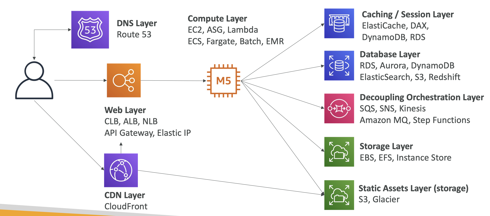

## Identity & Federation

### IAM Policies精细控制用户权限
- IAM Role和Resource Based Policies：
  - IAM Role是用户赋予一个Role进行资源操作（这个时候，完全无法使用user原有的权限了）
  - RBP是在资源中进行Polies限制（比如S3 Bucket Policies）（这个时候user不需要放弃自己的其他权限）
  - 后者似乎应用场景更灵活
- IAM Permission Boundary：权限边界，这是一个高级功能，限制了用户的权限边界，对用户定义的任何权限如果超过了这个设置，都是不可用的
  - 三者结合：组织SCP + IAM Permission Boundary + 用户个人权限
- IAM Access Analyzer：分析任何针对资源的*外部用户* -- 若有，通过finding进行记录
  - 设置Zone of Trust：表示对一个资源的信任主体集合，超出这个集合的，都会被finding记录
  - 自动生成Policy的功能构架：通过Cloud Trail记录过去90天的资源的API call记录，来自动生成Policy，这种构架默认你90天内的活动是合规的，但是如何保证是合规的呢，如果有人错误使用了该服务进行了外部连接？
    - 不过说回来，是可以通过人工检查进行细节调整的

### STS认证
- 跨账户的临时用户权限，通过发行token，使得其他账户的用户可以使用自己账户的临时Role进行操作
- 对于第三方账户用户，可以通过*ExternalID*进行精准控制，保证进来的是特定的用户，该ID是秘密的
  - 在没有ExternalID识别的情况下，如果Role的*ARN被泄漏*，就可能造成攻击者擅自进行assume-role，进行访问攻击
- session tag：也是一种控制用户访问权限的方法，在IAM Policy中可以通过该tag设置权限条件
- CLI流程：`assume-role`命令，然后通过得到的临时Credentials，设置环境变量
  - 当有使用MFA的时候，使用[官方手顺](https://repost.aws/knowledge-center/authenticate-mfa-cli)，`get-session-token`参数为账号信息，你的设备名和token code（当时显示的），然后同样得到临时认证信息后，设置环境变量，就可以使用了
- 相比较sts spi，AWS推介使用cognito来控制权限

### Identity Federation

- 如果不想给用户创建AWS user，并且有自己组织的AD等认证系统的情况
- 使用web/mobile应用进行服务连接的情况
- SAML和SSO都是这个范畴
  - AssumeRoleWithSAML
  - SAML的构成图可以看到其认证过程，是先在公司内部得到认证服务器的认证，然后通过AWS的STS获得访问资源的权限
    - 该过程不管是访问资源，还是登陆浏览器的Console界面，还是用ADFS访问公司资源，都是*用户通过STS*，界面访问，返回的是控制台的sign-in URL
  - Custom Identity Broker的工作机制略有不同，他不是认证用户后由用户取得token，而是*broker自己去AWS拿临时role的token或者URL*，发给user使用
- Cognito很高级，很像是user版本的Workload Identity，不再需要用户直接去STS取得token，而是用cognito的token去STS交换token
  - 人称 Token Vending Machine（*TVM*）代币贩卖机！基本就是一个交换token的小机器w
  - 有匿名功能，数据同步功能，和MFA功能

### Micorsoft的AD目录服务回顾

- 组织中的个体是object，包括各种用户和设备
- 他们以tree的形式进行组织，他们的集合是forest
- 域控制器（Domain Controller, DC） 是实现和托管目录服务的服务器，在Microsoft的环境中，它指的是运行Active Directory服务的服务器。
- 微软有自己的ADFS（AD Federation Service）服务，也是一个联合认证的服务
- 支持单点登录SSO
- Sharepoint也是和它的AD服务集成的应用

### AWS的目录服务

- *AWS Managed Microsoft AD*
  - 可以在AWS的云中创建AD服务
  - 和本地AD之间建立Trust连接（AD two-way forest trust），可以同时进行管理
    - 通过 DX 或者 VPN 连接才能建立
    - 这种信任，包括单向和双向，这影响app的访问认证路径
  - 高可用性：可以分布式AZ构架
  - 集成多种AWS资源管理
  - 这种服务本质是一个目录*数据库*，就像是RDS，可以进行backup备份
  - 将本地AD复制到AWS中，以降低服务延迟
    - 这需要在VPC中的EC2中实现，将本地AD直接复制到这个EC2中，同时EC2的AD服务也需要和AWS Managed AD之间建立trust连接
    - 在DX或者VPN不可用的时候，这保证了user可以继续使用AWS服务
- *AD Connector*
  - 和上面的不同，本质上只是一个连接本地AD的Gateway
  - 需要 DX 或者 VPN 连接
  - 没有缓存服务
- *Simple AD*服务则没什么大的功能，就是便宜简单，小规模，不可scale，也不能连接本地AD，不能建立trust连接等

### AWS OU

- 组织管理，是账户的集合，有价格优惠，所有的子账户共享优惠，因为他们被看成一个账户
- 账户的移动需要先脱离原本的OU，再接受新OU的邀请

### SCP

- OU级别管理的黑白名单
- 应用于OU和Account级别
- 它默认not allow anything，所以需要显式允许
- 不起作用：Management Account，服务相关角色（service-linked role）
- 起作用：Users，Roles，Root User
- 每个OU层级的SCP都受制于上面一层OU的SCP

- *权限判断顺序*：
  - 显式Deny则不可用
  - OU SCP
  - Resource-based policies
  - Identity-based policies
  - IAM permissions boundaries
  - Session Policies

- *Tags限制策略*：资源控制policy
  - 当满足tag条件，则可以使用资源
  - 满足一个任何tags（条件ForAnyValue），或者满足所有tags（条件ForAllValues）
- *region限制条件*：RequestedRegion条件
- *Opt-out policies*：限制你的内容被AWS用于AI/ML服务提升
- *Backup Policies*：设置备份计划的策略，在 member 账户中只能浏览不能修改

### IAM Identity Center

- SSO，单点登录服务
- 集成多个账户，单界面登录
- 登录的时候可以集成*AD目录服务的认证功能*，也可以用它*内置的identity store*进行认证管理
- 认证后就可以接到如下服务：
  - AWS资源（*EC2 Linux Instances不支持*，因为Identity Center一般和AD紧密集成，但是Linux一般是非AD环境）
  - Business Cloud Apps：比如Box，365，Slack，salesforce等
  - Custom SAML2.0-enabled Apps
- 连接服务受*Permission Sets*的限制，定义了用户可以使用哪些服务
  - 用户可以被group，然后对不同的group设置不同的Permission Set，比如对某OU的full access权限，对某OU的只读权限等
- *ABAC*（Attribute-based access control）：对用户还可以基于属性进行权限控制

### Control Tower

- 基于OU的服务，快速管理多账户组织
- 安全和合规管理
- 有dashboard
- Account Factory：快速创建账户
- 集成Service Catalog服务管理
- Guardrails（护栏）：
  - 护栏通过 AWS Config 规则和 AWS 服务控制策略（SCPs）来实现。AWS Config 规则检查资源的合规性，而 SCPs 则在 AWS 账户间管理权限。
- Guardrails的三个级别：
  - *Mandatory* 强制性Guardrails：是应用于 AWS Control Tower 下所有账户的不可移除的护栏。它们执行关键的安全和合规要求。
  - *Strongly Recommended* 强烈推介的Guardrails： 默认未启用，但是强烈建议，是基于best practice的
  - *Elective* 可选的Guardrails：允许组织根据其独特的需求定制治理

### RAM（Resource Access Manager）

- 在OU内跨账户共享资源，避免资源重复
- 可以在同一个（分享subnet的情况）subnet内进行账户间的资源共享，各账户 的资源（比如EC2）可以相互通信，但是不能使用，因为他们所属于不同账户
- CIDR（Prefix）list的共享，在高级网络的部分也有提到
- Route53 Outbound Resolver：分享 Forwarding rules 给其他账户的Resolver Outbound Endpoint

## Security

### CloudTrail

- 默认开启
- 主体是AWS account
- 可以记录all region的也可以single region
- 集成CW Logs和S3
- events/API calls活动记录
- 资源被删了先看trail记录

*Events类型*：

- Management Events：
  - 默认开启
  - 所有的账户管理API，资源更改
  - Read Events/Write Events
- Data Events：
  - 默认不开启
  - 可以分为Read和Write Events
  - Lambda Function执行活动（Invoke API）可以显示被执行了多次
- Insights Events：
  - 会持续分析write events，通过正常events来生成一个baseline，然后detect非正常events
  - 异常情况会在CloudTrail的控制台显示，也可以发送到S3桶，基于自动化需要也可以生成EventBridge Event

*Event Retention（保留）*：

- 90天
- 存储用S3，分析用Athena

*Event Bridge 集成构架*：

- 基于特定的 API call logs，生成event，触发 EventBridge 后的操作，比如发送SNS等

### Architectures

- +S3：
  - 每五分钟将logs发送到S3进行dump，之后可以利用S3各种功能（lifecycle，SNS，SQS，Lambda，versioning，lock等
  - 当然CloudTrail自己也可以发送通知到SNS，然后触发SQS，或者Lambda

- +Multi-Account/Multi-Region：
  - 多账户集成logs，设置一个SecurityAccount，S3集成其他账户的Logs
  - 方法一：cross-account role / 方法二：设置bucket policy（需要允许cross-account delivery）

- +CW：
  - CloudTrail通过stream方式，传送logs到CW Logs
  - 后续使用CW的各种功能：Metric Filters，触发CW Alarm，接SNS和Lambda等

- OU Trail：OU级别的Trail聚合
  - 只能创建于Management Account中，然后聚合各个子账户的trails，并存在S3中

- 对Trails事件的快速响应组合服务：
  - EventBridge：是最快的响应方式
  - CW：stream传输，日志分析
  - S3：可以每五分钟传送一次，适合跨账户，长期存储，以及用Athena分析

### KMS

安全专家的[KMS部分内容](aws-with-security.md#KMS)

### Parameter Store

- 集成Cloud Formation
- 有版本管理功能
- 通过IAM Permission进行安全管理
- 通过文件夹形式的层级进行管理
- Parameter Policies可以设置TTL也就是过期时间，集成EventBridge，在过期前通知，或者在该发生变化，而没发生变化的时候通知

### Secrets Manager

- 强制在X天后进行Rotation
- 使用 Lambda 可以自动生成新的 Secrets：需要 Lambda 对 SecretManager 和数据库的访问许可，包括对subnet的网络设置（VPCEndpointorNATGateway）
- 内部使用KMS进行加密，对称加密，发送GenerateDataKeyAPI进行信封加密，需要双方service的权限
- 与各种DB集成用于密码存储和轮换
- 跨区复制功能，用于灾难恢复，跨区DB和跨区应用等
- 可以用Resource-Based policies来控制访问权限

- 集成很多服务，可以从中pull secrets
- ECS（worker/task）也集成使用SecretManager和SSMParameterStore的key进行RDS和API的连接。

*跨账户的Secret分享*：

- 无法使用RAM
- KMS给对方账户 viaService：SecretManager 的 kms：decrypt 解密权限
- SecretManager给对方账户 Resource-based Policies，使得对方账户可以访问

*Parameter Store 和 Secret Manager*：

- PStore更加便宜，但是没有自动rotation，但是可以通过Lambda和EventBridge进行自动rotation的设置
  - 如果设置RDS的密码，SecretManager可以每30天自动触发Lambda修改RDS密码，PStore则需要自己去设置EventBridge每30天触发Lambda更新RDS和PStore的密码
- SecretManager必须用KMS，但是P来说KMS不是必须选项
- 都和CloudFormation集成

### SSL/TLS和CA认证的基本过程

- TLS是SSL的进化，但是人们习惯说SSL，是在传输中加密的方式
- 加密过程非对称加密很贵，对称加密便宜。
- 在SSL传输过程中，一般第一次握手会通过一个非对称加密验证身份：
  - 客户端hello
  - 服务端发送SSL证书（也就是CA，是一种PublicKey）
  - 客户端使用该SSL证书，发送自己的对称加密后的MasterKey
  - 服务端用自己的私钥解密被加密的MasterKey，验证客户端身份
  - 开始对称加密的安全连接

### SSL SNI（Server Name Indication）

- 解决的问题：一个web server加载了多个SSL证书的情况，用于识别是哪个server
- 在ALB/NLB/CloudFront上起作用（CLB不行，它需要多个CLB，每个host一个证书）

### 防止中间人攻击

- 使用HTTPS而不是HTTP
- 使用DNSSEC

### ACM

- 维护SSL证书是非常难的，这个服务集成了AWS服务，并且自动更新，是非常好的服务
- 用于：
  - Load Balancers（包括在Elastic Beanstalk上创建的）
  - CloudFront distributions
  - APIs on API Gateways
- 使用方式：使用CLI上传自己的证书，自己维护和更新，或者使用ACM的，让他帮你自己管理和更新
- Load Balancer会在客户端和服务端之间，终止SSL传输，并验证，然后向服务端开启新的HTTP通信，这将降低EC2解密的CPU负荷
- 公有证书Public CA服务需要开启公有DNS服务，私有证书Private CA服务用于内部服务安全验证
- 它是一个*regional服务*，所以如果用于全球服务，需要在你app发布的每个region设置证书

### CloudHSM（Hardware Security Module）

- 硬件加密，专用硬件，硬件由AWS管理但是*加密是自我管理*，非free，必须*安装客户端软件和HSM进行SSL连接*，管理keys和users。
- 使用SSE-C加密的时候是一个好的选择。
- IAM permission：CRUD an HSM Cluster，意味着只能对Cluster进行创建删除等，但是内部的管理靠你自己
- Multi-AZ，高可用性
- 和KMS的CustomKeyStore集成，所以APIcall可以被CloudTrail捕获
- 和其他Account共享cluster：通过共享其所在的subnet，设置subnet的SG来允许traffic

### Architecture：SSL

- SSL on ALB:
  - client -> HTTPS -> ALB(SSL cert from ACM) -> HTTP -> Auto Scaling Group EC2 Servers
- SSL on web server EC2 Instances:
  - client -> TCP -> NLB -> HTTPS -> Auto Scaling Group EC2(M5) Servers -> (Retrieve SSL private key from) Parameter Store (user data) install cert on EC2
- SSL Offloading:
  - 上述构架中将cert载入EC2，会造成高CPU负荷，所以这里等解决方案，是在后端将cert，offload入HSM进行处理
  - 这种情况SSL的private key就不会离开HSM设备，这提高了安全性
  - 需要在HSM上设置一个加密用户（cryptographic user）（CU），将用户名和密码保存在Parameter Store中，EC2从PStore中获取用户名和密码，以访问HSM中的private key

### S3

- 存储中的数据有各种加密方式
- 传输中的数据（SSL/TLS加密），endpoint推介使用HTTPS
- 客户端加密SSE-C中，HTTPS是强制的
- 强制使用HTTPS可以设置Bucket Policy：aws:SecureTransport

- S3 Event Notification --> SNS/SQS/Lambda

- EventBridge事件驱动：
  - **需要有效化CloudTrail Object level logging on S3 first**
  - 也就是说EventBridge的使用，CloudTrail的log开启是必要条件，会记录data event log（Lambda之类）
  - SNS/SQS/Lambda

- S3 Bucket Policy：
  - SourceIp/VPCSourceIp
  - Source VPC/Source VPC Endpoint
  - CloudFront Origin Identity
  - MFA

- Pre-signed URLs
  - 有期限的URL用于上传和下载内容
  - 会继承，生成该URL的人的权限GET/PUT

- VPC Endpoint Gateway
  - Private Instance --> VPC Endpoint Gateway --> S3
  - 私有连接S3 bucket policy可以设置SourceVpce或者SourceVpc来限制访问源

- S3 Object Lock：防止version被删除，写一次读多次WORM
- Glacier Vault Lock：防止数据未来被修改，也是写一次读多次WORM

- S3 Access Points：
  - 文件夹可以作为一个访问入口
  - 分配不同的 Access Policy 控制访问
  - 每个访问点可以有自己的 DNS 名
  - VPC Origin：限制从自己的VPC的访问，需要*VPC Endpoint*，以及对*Access Point*和*Bucket*双方的访问Policy设置
- S3 Multi-Region Access Point：
  - 在基本功能的基础上，使区域间的bucket双向复制
  - Active/Passive
  - Failover

- S3 Object Lambda：
  - 通过Access Points和Lambda的过滤功能，对特定的object使用者提供不同的（cleansed）数据
  - 比如删除敏感数据，变更文件格式，以及和其他数据库进行数据新处理后进行使用等需求
  - 不需要创建新的bucket，在原有的bucket的基础上进行处理和数据使用即可

### DDoS 防御服务

- AWS Shield
- WAF（based on rules）
  - layer7:ALB/APIGateway/CloudFront/AppSync（保护GraphQL APIs）
  - 它不能直接防DDoS，但他可以设置ACL白名单过滤或者限制访问，甚至有针对BotControl的rule group
- CloudFront & Route53
- AutoScaling
- 分离静态（S3/CloudFront）和动态（EC2/ALB）资源

### Firewall manager

- 组织 Organization 级别的管理，各种防火墙服务在一处管理，Firewall Manager可以一次性统一部署FW在许多账户 accounts。
- 新创建的资源会立刻适用这些rules
- 包括：WAFrules/Shield/SG/NetworkFirewall/Route53ResolverDNSFirewall
- 创建的是Region level的Policy

### Block a IP

- 两种构架，block IP：
- client --> VPC(NACL)(ALB(with WAF ip filter) --> EC2)
- client --> CloudFront(with WAF ip filter) --> VPC(NACL)(ALB --> EC2)
- (组件之间通过SG的白名单允许通过)

### Inspector

- EC2的网络可达性
- 针对*EC2 instance/Container Images/Lambda Function*的网络漏洞分析 -> 会以一个risk score来表达漏洞的优先级

### AWS Config

- 根据Config rules检测*合规与否*以及*设置变化过程*而不阻止变化，无法deny，可以SNS通知
- view CloudTrail API calls if enabled
- region level，需要在每个region都设置
- 跨region和account聚合数据
- 修复：
  - Config -> EventBridge -> Lmabda
  - Config -> SSM Automations

### 各种AWS管理的logs

- Load Balancer access logs -> S3
- CloudTrail logs -> S3/CW Logs
- VPC Flow Logs -> S3/KDF/CW Logs
- Route53 access logs -> CW Logs
- S3 access logs -> S3
- CloudFront access logs -> S3
- AWS Config -> S3

### Guard Duty

[安全专家链接](aws-with-security.md#Guard-Duty)

### EC2 Instance Connect

[安全专家链接](aws-with-security.md#EC2-instance-connect)

### AWS Security Hub

[安全专家链接](aws-with-security.md#AWS-Security-Hub)

### Detective

[安全专家链接](aws-with-security.md#Detective)

## Compute & Load Balancing

### EC2 instance types

**image type**

- R(RAM):in-memory caches
- C(CPU):compute&databases
- M(medium/balanced):general/web app
- I(I/O):instance storage/databases
- G(GPU):video rendering/machine learning
- T2/T3:burstable in capacity
- T2/T3 unlimited:unlimited burst

**launch type**

- on demand instance
- spot instance
- reserved
  - 最短一年
- dedicated instances
  - 无人分享你的hardware
- dedicated hosts
  - 预定整个物理服务器

**EC2 included metrics**

- CPU
  - CPU利用率（CPU Utilization）
  - CPU Credit Usage/Balance：适用于T系列突发性能实例，表示使用的CPU积分和剩余的CPU积分，用于在短时间内提高性能
- Network：In/Out
  - 网络流量和带宽使用情况
  - In/Out表示接收和发送的数据量
- Status Check：
  - instance status = check the EC2 VM：实例运行健康状况
  - system status = check the underlying hardware：底层硬件的健康状况
- Disk：Read/Write for Ops/Bytes（only for instance store）
  - 实例存储的IO状况
  - 每秒读写操作数，每秒读写字节数
- 注意，RAM（内存使用情况）不包括在内
  - 内存是计算机系统中至关重要的组成部分，负责临时存储数据和指令，支持程序的高效执行和多任务处理。
  - 内存的性能和容量直接影响计算机系统的整体性能和用户体验。

### EC2 Graviton

- 基于 ARM 架构的高性能、低成本处理器
- 支持Linux各种而不支持windows instances

### EC2 placement group

- EC2的放置策略
  - Cluster：单个AZ中集合的instance群
    - low-latency但是rack损坏则全体不可用
    - 适合大数据低延迟计算，高网络吞吐
  - Spread：在多AZ上进行硬件的隔离分布，高可用性
    - 限制：7 instance per AZ per placement group
  - Partition：跨许多分区（partition）的spread，这些分区实际上坐落于不同racks的集合
    - rack是指物理数据中心的一组服务机架
    - Hadoop/Cassandra/Kafka/HDFS/HBase

### HPC

- 大数据传输服务：DX，Snowball&Snowmobile（数据到云），DataSync（本地到S3/EFS/FSx for Windows）
- 超级计算机是AWS中各种服务组合的运用
  - EC2 Placement Groups比如Cluster
  - instance type比如GPU，Spot instance/Spot Fleets + Auto Scaling
  - EC2 Enhanced Networking（SR-IOV）
  - Elastic Fabric Adapter（EFA）
  - [网络专家跳转链接](aws-with-networking.md#EC2-Network-performance-Optimization)
  - 存储：EBS/InstanceStore
  - 网络存储：S3/EFS/FSx for Lustre
  - 自动化和编排（Automation&Orchestration）：AWS Batch/AWS ParallelCluster
    - ParallelCluster是开源的HPC管理工具，用textfiles进行设置，自动创建各种服务组件比如VPC，subnet，EC2等

### Auto Scaling

- 通过设置目标值（比如average），或者CW的阈值进行自动伸缩
- Scheduled Actions：如果知道某时段需要增加unit，可以设置schedule
- Predictive Scaling：可预测性伸缩，不断学习和分析，ML技术
- 主要指标：CPU使用率，网络In/Out，RequestCountPertarge和其他自定义指标
- *Spot Fleet support*：支持spot和on-demand实例混合
- *Lifecycle Hooks*：在启动或者关闭一个实例之前可以进行特定的动作的功能，比如cleanUp，抽出日志等
- *Upgrade AMI*：必须update launch configuration/template
  - 然后可以手动关闭旧的实例，或者使用CloudFormation关闭
  - 也可使用*EC2 Instance Refresh*，在启动新的实例的时候会自动使用新的AMI
- 所有Auto Scaling Processes：
  - Launch
  - Terminate
  - HealthCheck：EC2，ELB
  - ReplaceUnhealthy
  - AZRebalance
  - AlarmNotification
  - ScheduledActions
  - AddToLoadBalancer
  - InstanceRefresh

- *AutoScaling 策略构架*
  - 在ALB的同一个target group中发布新的template，和旧的template同时使用，慢慢删除旧template实例，流量会在所有实例中分布
  - 在ALB的不同target group中发布新的template，只分配一小部分流量给新的实例查看效果，慢慢过渡
  - 创建全新的ALB和它的target group，发布新的template，使用*Route53 CNAME weighted record*，分配流量给两个ALB群组进行逐步过渡，以及对新的ALB群组进行手动testing

### Spot Instance & Spot Fleet

- 适合batch作业
- 定义max spot price，当没超过阈值的时候会自动增加spot instance数量，如果超过则自动关闭（在2分钟之内）
- Spot Fleets：set of Spot Instances + (Optional) on-demand Instances
  - 在满足最低价格的限制条件下，自动满足目标capacity需求

### Amazon Fargate work with ECS/EKS

- ECS use case：
  - Run MicroServices
  - Run Batch processing/Scheduled Tasks
  - Migrate Apps to Cloud
- ECS concepts:
  - ECS Cluster
  - ECS Services
  - Task Definitions(json file )
  - ECS Task
  - ECS IAM Roles
- ECS 集成 ALB：使用Dynamic Port Mapping，分配流量：可以在一个EC2实例上发布多个container

- Fargate是一个Serverless的服务，无需构架基础设置，直接添加container

- ECS安全：集成SSM ParameterStore和Secret Manager
- ECS Task Networking：None，host（使用底层host的interface），bridge（虚拟网络），awsvpc（使用自己的ENI和私有IP）

- ECR
  - 支持image漏洞扫描（on push），版本控制和lifecycle
    - 基础漏洞扫描由ECR进行，并触发EventBridge发布通知
    - 高级Enhanced扫描通过Inspector进行，由Inspector触发EventBridge发布通知
  - 通过CodeBuild可以register和push image到ECR
  - 可以cross-region 或者 cross-account 地 replicate image
- EKS
  - 开源框架
  - ELB - AutoScaling - nodes - Pods
  - with Fargate（use EFS）：完全托管
  - Managed Node Group
  - Self-Managed Nodes
  - 支持On-demand/Spot Instance

### App Runner

- 类似GCP的Cloud Run
- web apps构架，API构架，微服务构架，快速生产部署
- image + source code就可以进行设置和部署了，最终用URL访问

### ECS/EKS Anywhere

- ECS部署在包括你的数据中心的任何地方
- 安装*ECS Container Agent和SSM Agent*
- 使用EXTERNAL的launch type
- 必须要有稳定的AWS Region连接

- EKS则需要安装在数据中心，使用EKS Anywhere Installer
- 使用*EKS Connector*从AWS连接到本地的EKS Cluster
- 以上是有连接的设置
- 无连接的设置需要安装EKS Distro，以及依赖开源工具管理Clusters

### Lambda

- 和众多服务集成
- EventBridge + Lambda 可以设置无服务器的Cron Job
- 多语言，包括Go
- timeout 15分钟
- 并发执行限制1000，超过了会触发限流Throttle
- 代码部署：CodeDeploy，集成SAM的框架，部署方式有Linear，Canary，AllAtOnce等
- 日志和监控：CW，X-Ray，注意给Lambda正确的IAM执行权限

- Concurrency（并发）：任务在时间上交替进行，可以在单核CPU上实现。
- Parallelism（并行）：任务在时间上同时进行，通常需要多核CPU或多处理器系统。

- AWS云中的Lambda和私有Subnet中的Lamdba构架
  - 只有将Lambda放在私有的Subnet中才能连到私有的RDS等
  - 从私有Subnet出去需要走NAT - IGW路线，如果要固定IP，需要给NAT加ElasticIP

- 同步驱动Synchronous：
  - 通过CLI，SDK，API Gateway
  - 结果会立刻返回的那种
  - 客户端必须对应错误处理，比如retry和exponential backoff
- 非同步驱动Asynchronous：
  - 比如使用S3，SNS，EventBridge进行的驱动
  - Lambda会进行retry，一共三次
  - 请确保幂等性idempotent
  - 可以通过SNS或者SQL设置DLQ

- 并行构架和批处理构架
  - 使用SNS的构架会立刻触发Lambda的执行，进行并行处理
  - 使用SNS+SQS的处理则会通过队列进行批处理的构架

### SAM

- AWS SAM（Serverless Application Model）是一个用于构建和部署无服务器应用的框架。它是一个开源框架，专门设计用于简化AWS Lambda、API Gateway、DynamoDB、Step Functions等无服务器资源的定义和管理。
- 使用简化的模板语法（基于AWS CloudFormation）来定义无服务器应用。SAM模板是对CloudFormation模板的扩展，提供了特定于无服务器应用的简化语法。
- SAM与AWS CodePipeline、CodeBuild等持续集成和持续交付（CI/CD）工具紧密集成，支持自动化构建和部署流程。

### Load Balancers

- **CLB**已经废止，知道就好，它是7层HTTP和4层TCP的，只支持一个SSL证书，这是一个问题，有时候需要部署多个CLB来实现多SSL证书区分源

- **ALB**在layer7
- 集成ECS很好，有dynamic port mapping
- 支持HTTP/2 和 websocket：HTTP/2的多路复用、头部压缩和服务器推送等特性提高了网页加载速度和资源利用率，而WebSocket的低延迟和双向通信能力使得实时应用得以实现
- 支持重定向，比如HTTP到HTTPS
- 支持路由策略：path，headers，query string（URL中?后面的部分）
  - 路径（Path）：基于URL路径部分路由请求，常用于将不同URL路径的请求分配给不同的后端服务。
  - 标头（Headers）：基于HTTP请求头的内容路由请求，适用于根据客户端属性或请求元数据进行路由。
  - 查询字符串（Query String）：基于URL查询参数路由请求，适用于根据特定请求参数进行路由。
- TargetGroup：可health check
  - EC2 Instance
  - ECS tasks
  - Lambda Functions
  - IP Addresses（必须是私有IP）

- **NLB**在layer4
- TCP&UDP，高响应，低延迟
- 每个AZ会有一个staticIP，支持固定IP ElasticIP
- 性能很高，不免费
- TargetGroup：
  - EC2 Instance
  - IP Addresses（必须是私有IP）
  - *ALB*
- Zonal DNS Name：用于NLB的regional DNS名解决问题，这使得NLB在每个区域都有一个DNS名

- **GWLB**也在layer3
- 目的是管理第三方虚拟网络设备的部署，管理，扩展
- 比如防火墙，威胁检测和防御系统等
- 使用GENEVE协议，port6081，（Generic Network Virtualization Encapsulation）是一种网络虚拟化封装协议，用于在数据中心和云计算环境中实现网络虚拟化
- TargetGroup：
  - EC2 Instances
  - IP Addresses（必须是私有IP）

- **Cross-Zone**Load Balancing
  - 流量在所有的zone的server上均匀分布
  - 没有该功能，则只能在各自的zone中均匀分布
- 对ALB默认开启不收费，对NLB和GWLB默认关闭，要收费

- **Sticky Sessions**
  - 针对CLB和ALB的功能
  - 使用Cookie
  - 可能会带来流量不均衡

- 流量策略：最少访问/轮询/FlowHash

### API Gateway

- 暴露HTTP端点，Lambda（REST API），或者AWS Service为一个API服务
- 版本控制（stages），认证，流量管理（API keys，Throttles）
- 限制：29秒timeout，最大10MB的payload
- 构架探索：
  - 后面坐一个S3的话，用户上传文件收到10MB的限制，不是一个好的构架，可以*使用Lambda生成一个Pre-Signed URL返回给客户*用于上传大的文件（我预想到了这个构架，很不错，是一种进步）

- 部署的Endpoint类型
  - Edge Optimized（默认设置）为全球用户：通过CloudFront Edge locations
  - Edge Optimized API Gateway **只接受来自 us-east-1 区域的 ACM 证书**，无论 API Gateway 本身部署在哪个区域。这是 AWS 的一个特定要求。这是因为它是为全局内容分发优化的，它使用 AWS 的全球内容分发网络（CDN）来降低延迟并提高性能。为了简化和集中管理证书，AWS 选择了 us-east-1 作为集中颁发和管理 SSL/TLS 证书的区域。
  - Regional 用户，使用regional端点
  - Private 访问只能通过interface VPC endpoint（ENI）

- *Gateway Cache*
  - 缓存client的response
  - TTL默认300秒（0～3600s）
  - 可以在stage和method层面设置
  - 可以有加密功能的选项

- Error
  - 4xx为client错误
  - 5xx为Server错误，注意APIGateway的回复超时是29秒，会有5xx错误

- Security和Authentication
  - 支持SSL证书，使用Rou53设置CNAME
  - 资源权限限制，比如使用S3的bucketPolicy
  - 资源使用权限，比如对Lambda的IAMrole
  - CORS：cross-origin resource sharing：基于浏览器，控制哪个domain可以call你的API
  - 三种认证：IAM，Lambda集成第三方认证，Cognito

- 日志和监控
  - CW Logs：
    - 可以在stage层级开启logs
    - 可以发送API Gateway Access Logs
    - 可以直送日志到KinesisDataFirehose
  - CW Metrics：
    - IntegrationLatency，Latency，CacheHitCount，CacheMissCount
  - X-Ray：高级构架 X-Ray API Gateway + AWS Lambda
    - X-Ray 提供了详细的请求分析，包括响应时间、错误率、异常、冷启动等信息
    - 支持与多种 AWS 服务集成，包括 EC2、ECS、Lambda、Elastic Beanstalk、API Gateway 等。它还支持与多种第三方框架和库集成，如 Spring、Express 等

- 将API Gateway作为产品发布给客户的方法：
  - Usage Plan
  - API Keys
  - 429 Too Many Requests

- WebSocket API
  - 全双工，双向通信，实时聊天、在线游戏、金融交易
  - 使用Lambda，DynamoDB，或HTTP endpoints
  - URL中使用@connections关键字，用connectionId识别连接

- Private APIs
  - 使用VPC Interface Endpoint连接
  - 每一个VPC Interface Endpoint 都可以用于连接多个Private APIs
  - 对Interface Endpoint可以设置Endpoint Policy
    - aws:SourceVpc/aws:SourceVpce

### AWS AppSync

- 托管的 GraphQL 服务
  - **GraphQL**是一种用于 API 的查询语言以及一个用于执行这些查询的服务端运行时。GraphQL 由 Facebook 于 2012 年开发，并在 2015 年开源。与传统的 *REST API* 相比，具有更高的效率和灵活性。

- 在 AppSync 中，开发者定义 GraphQL 模式（schema），描述应用程序的数据模型和操作。
- GraphQL 模式包含*查询（queries）、变更（mutations）和订阅（subscriptions）*操作，用于获取、修改和监听数据变化。

- AppSync 支持多种数据源，包括 Amazon DynamoDB、AWS Lambda、Amazon RDS、Elasticsearch、HTTP 端点等。
- **解析器（Resolvers）**是连接 GraphQL 操作和数据源的桥梁。每个解析器包含一个请求映射模板和一个响应映射模板，使用 Apache Velocity Template Language (VTL) 来定义请求和响应的转换逻辑。
- 当客户端发起 GraphQL 请求时，AppSync 会根据 GraphQL 模式和解析器的定义，将请求映射到相应的数据源，并将结果返回给客户端。
- AppSync 支持 GraphQL 订阅，使客户端可以实时接收数据变化通知。订阅操作定义了客户端感兴趣的事件，当相应的变更操作触发时，AppSync 会将更新推送给订阅的客户端。
- 这种实时更新机制非常适用于需要即时数据同步的应用场景，如聊天应用、协作工具等。

- 多种身份验证和授权机制，包括 API 密钥、AWS Identity and Access Management (IAM)、*Amazon Cognito*用户池和 OpenID Connect (OIDC) 提供者。

### Route 53

[网络专家跳转链接](aws-with-networking.md#Route-53)

### AWS Global Accelerator

[网络专家跳转链接](aws-with-networking.md#AWS-Global-Accelerator)

### 构架一览

- EC2 with Elastic IP
  - 使用Elastic IP实现failover的构架
- Stateless web app - scaling horizontally
  - DNS based Load Balancing
  - TTL可能会让客户得到过时的信息，同时client需要解决hostname resolution failures
- ALB + ASG（Cross-Zone）
- ALB + ECS on EC2（backed by ASG）
  - ASG + ECS会使用dynamic port mapping
  - 但是ECS服务的auto-scaling和ASG的auto-scaling的编排是很难的，所以进化版本是下面的构架
- ALB + ECS on Fargate
  - 无服务器，托管型
  - 所以只需要在docker container的层面上进行构架
- ALB + Lambda
  - 被runtime限制，方便用Http端点的方式expose functions，而不需要API Gateway
  - 适合微服务的混合构架
  - 还可以部分服务用Lambda，部分服务用ECS
- API Gateway + Lambda
  - 高并发1000， 无服务器，全托管，集成APIGateway的功能，集成X-Ray
- API Gateway + AWS Services
  - 比如SQS，SNS，StepFunctions等
  - 注意API Gateway的10MB的payload限制
- API Gateway + HTTP backend（on-premises，ALB，第三方HTTP服务）

### AWS Outposts

- 一种混合构架
- AWS会把他自己的server racks，也就是服务机架安装在你的DC中，那么你就要维护它的安全，通过这个机架，就可以无缝使用AWS的云服务，在你的DC中
- 好处：低延迟，本地数据传输，便于数据迁移，全托管服务
- 服务包括：EC2，EBS，S3，EKS，ECS，RDS，EMR
- 关于S3：
  - 使用的是S3的API来从本地Outposts取得数据
  - 减少数据的跨区域传输
  - S3 Storage Class叫做*S3 Outposts*
  - 使用默认安全加密SSE-S3
  - 使用DataSync和云中的S3进行数据同步
  - AWS DataSync 是一种完全托管的数据传输服务，用于自动化和加速在本地存储、其他云存储服务和AWS存储服务（如Amazon S3、Amazon EFS、Amazon FSx for Windows File Server）之间的数据移动。

### AWS WaveLength

- 将基础设置部署在5G网络边缘，享受低延迟的网络服务
- traffic使用没有离开CSP网络（查询CSP网络解释：核心网络-传输网络-运营商接入网/云平台/电信网络），也就是说它没有在AWS的网络中通过
- 支持高带宽和安全地连接到AWS的region，比如你想连接AWS的RDS数据库
- 所有需要低延迟的适用场景

### AWS Local Zones

[网络专家跳转链接](aws-with-networking.md#AWS-Local-Zones)

## Storage

### EBS

- Instance store是物理硬盘，删除EC2就没了，但是重启，数据可以存活，写入快
- EBS是网络驱动存储
- EBS是zone级别的，zone之间的移动需要创建snapshot然后transfer
- 类型：
  - g开头的General类型，性价比高
  - io是为了高读写速度throughput，价格上io大于g类型
  - st和sc是HDD，是为了低价格
- Snapshot：
  - 增分备份
  - 会被存在S3中
  - 不需要detach，但是推介detach EC2，因为会导致数据不一致
  - 可以在region间copy
  - 可以从snapshot创建AMI
  - restore需要pre-warmed，包括传统方法直接读取整个volume，和FSR方法：Fast Snapshot Restore
- DLM（Data lifecycle manager）
  - 是针对于EBS的生命周期管理服务，包括备份打标签等
- EBS安全加密
  - 是在每个region中设置的
  - 是account level的
- io家族支持Multi-Attach：可以attach到多个EC2
  - 使用场景是应用高可用性需求，高并发写入操作（写入到一个io很高的EBS中）
  - 必须使用 file system 是cluster-aware

### EFS

- 全托管的网络文件系统，可以和很多EC2同时mount
- multi-AZ，高可用性，扩展性，每GB付费
- 感觉就像是sharepoint
- 使用SG控制权限
- 使用KMS进行加密
- 用于Linux不能用于Window系统
- 高并发，高扩展
- Storage Tiers：
  - Standard
  - IA（Infrequent access）
  - Archive
  - 有Lifecycle policies功能进行files的tier间移动，就像S3那种
- 可以和VPC Peering的其他VPC中的EC2进行mount
- 可以和On-premises的服务器进行mount，通过DX或者S2SVPN，和ENI连接
- 高冗余，高可用性
- Access Points限制访问，可以在文件夹层级设置policy来限制用户的访问
- 可以像S3 bucket policy那样，设置File System Policies
- 支持Region之间的复制replication，方便灾害恢复，服务持续

### S3

- Object存储，适合静态存储，不适合一直访问和修改的场景，不是文件系统那种使用方式
- 多种Class，支持Lifecycle Policy
- 跨区域和同区域replication功能
- S3 Event Notification - SQS/SNS/Lambda，fileter file name比如*.jpg
- **EventBridge** - 18种AWS服务，支持Json格式的file filter，多目的地
  - 事件发布（Publishing Events）：当事件源生成事件时，它会通过API调用将事件发送到EventBridge的事件总线。
  - 事件路由（Routing Events）：EventBridge内部使用事件规则匹配传入的事件，并决定将其路由到哪些目标。规则基于事件模式进行过滤，匹配的事件会通过API调用推送到目标服务。
  - 事件处理（Processing Events）：目标服务接收到事件后，会通过其对应的API处理事件。例如，Lambda函数作为目标时，EventBridge会通过Invoke API调用触发该函数执行。
  - 工作机制包含了事件总线、事件源、事件规则和事件目标等多个组件
- **Upload的高级功能**
  - *Multi-part upload*，并行文件上传功能，100MB以上的文件推介使用，5G以上的文件必须使用。
  - *Remove Incomplate Parts*：如果有一些文件只上传了部分part，可以通过bucket Lifecycle Policy，检查不完整文件，并且在指定时间后删除他们，自己也可通过API，list这些不完整的文件
  - *S3 Transfer Acceleration*：通过使用AWS的Edge location（AWS的私有内网加速）来跨区域传输文件，和Multi-part upload功能是同时可以使用的
- **Download的高级功能**
  - *S3 Byte-Range Fetches*：下载文件的时候，文件被分割为小的range进行下载，如果失败了只需要重新下载某些部分，同时支持只下载部分range

- **S3 Select&Glacier Select**
  - *client端*的数据选择需要先拿到整个数据然后filter，这会很慢很贵
  - S3 select 是一种*Server端*的先用*简单的 SQL* 选择*row或者col*然后再将filter的数据传送的功能，快速且便宜

- **S3 Analytics = Storage Class Analysis**
  - 同一个服务
  - 用于分析你的Class是否合适，建议你应该如何设置和移动lifecycle
  - 主要用于建议*Standard和Standard IA*，对One-Zone IA和Glacier不起作用
  - 会生成CSV报告

- **Storage Lens**
  - 在Organization，Account，Region，Bucket层面优化S3存储的使用，比如数据保护，和Cost效率
  - 用Dashboard表示
  - Metrics：
    - 存储量，Object数量
    - 费用cost：NonCurrentVersionStorageBytes / IncompleteMultipartUploadStorageBytes
    - 数据保护
    - 访问控制
    - 事件驱动
    - 性能，活动
    - 细节的status Code指标比如http 200

- **S3构架**
  - 静态内容：CloudFront - S3
  - Object索引数据库构架：
    - 写入S3后，驱动Lambda，将记录写入DynamoDB
    - 然后就可以用API访问object metadata DynamoDB table
  - **将Dynamic和Static内容分开**
    - Dynamic：ALB + ASG或API Gateway + Lambda，可以对S3上传静态内容
    - Static：CloudFront + S3，可以将object索引写入DynamoDB，也可给Client分发署名URL

### FSx

- 第三方高性能文件系统解决方案
- FSx for Windows
  - Windows的文件系统，但是也可以和Linux EC2 进行mount
  - 支持微软分布式文件系统DFS命名空间
- FSx for Lustre
  - Linux的Cluster文件系统
  - 适合机器学习用的HPC，超级计算机
  - 和S3无缝集成
  - 可以从On-premises服务器（通过DX或S2SVPN）进行访问
  - 部署方式，可以是临时的也可以是持续的，区别就是你分布了几个数据库，有replica的就是持久，使用的是ENI部署
- FSx for NetApp ONTAP
  - NFS，SMB，iSCSI协议支持
  - 支持Point-to-time instantaneous cloning点对点即时克隆
- FSx for OpenZFS
  - 也支持Point-to-time instantaneous cloning点对点即时克隆，方便对工作负载的测试

- *构架*：
- 降低文件系统大小的方法，只能重新创建一个新的小点的FSx系统，然后用DataSync进行数据转移，然后将应用重定向
- 在S3上直接使用FSx for Lustre，使用*Data Lazy Loading*的方式，意味着只有在客户request的时候，才会将数据从S3移动到FSx for Lustre

### DataSync

- 数据迁移transfer（S3，EFS，FSx之间），数据同步（S3，EFS，FSx），数据备份和归档，混合云构架
- 下载并安装 DataSync Agent 到你的本地文件服务器
- 使用文件共享协议NFS，SMB
- 构架：
  - 本地DataSync Agent - DX - PublicVIF - DataSync
  - 本地DataSync Agent - DX - PrivateVIF - PrivateLink - Interface VPC Endpoint - DataSync

### Data Exchange

- 查找、订阅和使用第三方的数据集
- 从多个数据提供商获取和使用数据的过程，适用于数据分析、机器学习、业务智能和应用开发等
- 一旦订阅数据集，AWS Data Exchange 会自动将数据交付到用户的 Amazon S3 存储桶中，确保数据及时可用
- 支持数据更新通知，确保用户始终使用最新的数据版本
- 可以使用多种 AWS 服务（如 Amazon Athena、Amazon Redshift、AWS Glue 和 Amazon SageMaker）访问和处理订阅的数据
- 支持通过 API 访问数据，便于集成到用户的应用程序和工作流中

### AWS Transfer Family

- 用于S3和EFS的文件in/out服务，并且这里是使用FTP协议
- 可以集成现有的认证系统比如AD
- AWS Transfer for FTP/FTPS/SFTP
- 构架方式：Client - Route53 - Transfer（IAM Role） - S3/EFS
- Endpoint类型：
  - 完全被AWS托管的public类型，没法设置任何控制
  - VPC Endpoint类型的内部访问类型，可以在自己的VPC内部有私有IP和完全的访问控制（SG）
  - VPC Endpoint类型的internet-facing访问类型，可以在VPC内部设置，并通过ElasticIP设置公有IP，同时可以通过SG进行访问控制

### 存储价格比较

*从贵到便宜*：

- EBS io
- EFS Standard/One-Zone
- EBS gp
- EBS st
- EFS Standard IA/S3 Standard
- EBS sc
- EFS One-Zone IA
- S3 Standard IA and blow it all

## Caching

越往里层越贵，所以缓存作用很大

### Cloud Front

[高级网络专家相关内容](aws-with-networking.md#cloud-front)

### ElastiCache

- 托管服务：Redis，Memcached
- Redis：
  - Multi-AZ，高可用性，自动Failover，读取复制，备份和恢复功能，本身很像一个DB
- Memcached：
  - Multi-node sharding 数据分区
  - 数据不会persistent
  - 没有备份和数据恢复功能
  - 是一个 Multi-threaded 构架
- 低延迟、高吞吐量的数据访问，适合需要快速响应时间的应用程序，如实时分析、游戏、金融交易等
- 构架：
  - 作为RDS的数据库缓存
  - User Session Store，存储客户的登录连接状态

## Databases

### DynamoDB

- 表table，项目item，属性attr（列）构成，每个项目由一个主键识别
- 简单主键，一个Partition Key
- 复合主键，Partition Key + Sort Key
- 索引Index：
  - 全局二级索引 (Global Secondary Index, GSI)：可以在表创建后添加，用于不同于主键的属性查询。
  - 本地二级索引 (Local Secondary Index, LSI)：必须在表创建时指定，支持基于排序键的不同属性查询。
- 数据一致性：
  - 最终一致性读取 (Eventually Consistent Reads)：默认选项，读取操作可能不会立即返回最新数据，但最终会一致。
  - 强一致性读取 (Strongly Consistent Reads)：保证读取操作返回最新写入的数据，但可能会有更高的延迟。
- 容量模式：
  - 按需模式 (On-Demand Mode)：自动扩展和缩减，按请求数量计费。
  - 预置容量模式 (Provisioned Mode)：需手动设置读写容量单位，适用于流量较为稳定的场景。
- 数据流 (DynamoDB Streams)：提供对表中项目的修改操作的时间顺序记录，可以用于数据复制、触发事件处理等。
  - 只能保留24小时，但是之后可以用Kinesis Data Streams将数据存储在其他地方，或者用Kinesis Analytics进行分实时分析
- 备份和恢复：
  - 按需备份 (On-Demand Backup)：随时创建数据快照。
  - 时间点恢复 (Point-in-Time Recovery)：恢复到过去任何一个时间点的状态。
- TTL：自动定期无效化一些rows
- Global Tables：cross-region复制，必须有效化DynamoDB Streams功能，适合低延迟和灾难恢复场景需求
- 类似于Apache Cassandra，分布式NoSQL数据库
- 适用场景比如：实时分析、物联网数据收集、时间序列数据存储。
- GCP：BigTable

- DAX：内存中缓存服务，用于加速对 Amazon DynamoDB 表的读取操作
  - DAX 提供与 DynamoDB API 兼容的接口，支持相同的读取和写入操作，包括 GetItem、BatchGetItem、Query 和 Scan。
  - 支持单个object的cache，Query，Scan，而 ElastiCache 则存储 Aggregation 的结果

### OpenSearch

- Use Cases：
  - Log分析
  - 实时应用监控
  - 安全分析
  - 全文本搜索
  - 点击流分析
  - 索引
- Logstash：
  - 是CW Logs的替代品
  - 使用Logstash Agent管理
- OpenSearch Dashboard（以前叫Kibana）：
  - 提供实时仪表盘服务
  - 是CW仪表盘的替代方案
- 构架
  - 可以收集和存放DynamoDB的数据流结果
  - 可以实时收集Kinesis Data Firehose的数据结果

### RDS

- 各种关系型数据库的引擎
- VPC + PrivateSubnet + SG + EBS
- 自动备份，point-to-time 恢复
- Snapshots：Cross-region复制
- RDS Events：操作和过期的通知 - SNS
- failover：Multi-AZ 实例复制和同步
- Read Replicas：Cross-region读取操作
- 分布式read构架：
  - 通过Route53的weighted record set设置，给不同的read备份不同的权重用于用户访问权重控制
- RDS Proxy：
  - 数据库连接管理
  - 和IAM认证集成
  - 自动清理非活跃的连接，提高应用访问性能

- Security：
  - KMS加密
  - Transparent Data Encryption（for Oracle and SQL Server）透明加密
  - SSL传输功能
  - CloudTrail无法trackRDS中的queries，因为不是API操作吧
  - EC2到RDS的IAM Role访问，依靠对RDS的API call，获取一个Auth Token

- Cross-Region Failover构架
  - 数据read replica
  - 通过Health Check和CW Alarm驱动CW Event
  - 驱动Lambda更新DNS，指向备份的read replica

### Aurora

（突出关键特性）

- 最多可以有15个read replica
- Cross-region read replica复制的是整个database
- 直接从S3，load/offload 数据
- 30秒内实现master的failover

- DB Cluster：
  - 一个Writer Endpoint - MasterDB
  - 多个Reader Endpoint - Read replica - 连接Load balancer，有Auto Scaling功能
  - Optional：分出两个read replica 作为Custom Endpoint比如进行客户自己的分析查询

- Troubleshooting
  - Performance Insights：可视化查询等待时间和用户使用情况
  - CloudWatch Metrics：CPU，Memory，Swap Usage
  - Enhanced Monitoring Metrics：at host level，process view，per-second metric
  - Slow Query logs

- Data API
  - 一种安全的用HTTPS端点，运行SQL的途径
  - 没有JDBC连接，没有持续的数据库连接
  - 必须赋予权限；Data API和Secret Manager

- RDS Proxy可以只对Read Replica进行端点连接

- Global Aurora：
  - Cross-Region read replica：高灾难恢复能力
  - Global Database：最多可以有5个备用region，每个region最多可以有16个read replica
  - Write Forwarding：通过对副DB的写入操作可以，forward到Primary的DB，主DB永远都会先更新，然后再复制到副DB

- 将RDS转换为Aurora：
  - 使用RDS的Snapshot可以重新Aurora数据库实例
  - 或者使用RDS可以直接创建Aurora的Read Replica然后直接升级为Aurora DB实例

## Service Communication

### Step Functions

- 使用 JSON 格式的状态机state machine定义，开发人员可以轻松地编排和管理跨多个 AWS 服务的任务
- 编排Lambda，Batch，ECS，DynamoDB，EMR，SQS，SNS等200多服务
- 可视化workflow的流程，有点像Airflow
- trigger：Console，SDK，CLI，Lambda，API Gateway，EventBridge，CodePipeline，StepFunctions
- 不能集成Mechanical Turk服务（在线人工劳动力），这里能集成它的服务是SWF服务
- Standard 和 Express Workflow两种类型：
  - 前者贵后者便宜
  - 前者执行时间可以长达1年，后者最大5分钟
  - 启动rate前者是每秒2000，后者是每秒10万
  - 前者确保执行一次，后者为最少执行一次
- Express Workflow：包括同步和异步驱动，同步会确保得到API返回执行结果，后者只确保启动，同步的更适合编排服务，错误处理，并行处理，重试策略等
- Error Handling：重试或者增加alert功能触发EventBridge-SNS

### SQS

- 无服务器，和IAM认证集成
- 能处理突然很大的扩展不需要预测provision
- 解藕服务
- message的最大size是256kb
- 可以从EC2，Lambda读取数据
- 可以作为DynamoDB的writebuffer
- SQS FIFO是先进先出的，原本的 SQS 是没有顺序的，我的天

- DLQ：当消息在visibility timeout的时间内多次都没被处理就会被送进dead letter queue，它适合之后的debug
  - Redrive to source：当你的代码问题修复了，可以将这些message重新放回原本的queue进行处理
  - 因为你可能会重复处理message，最好确保你的处理具有幂等性（Idempotency）比如upsert处理

- Lambda 的 *Event Source Mapping* 是一个配置，将 Lambda 函数与事件源（如 SQS 队列、DynamoDB 流、Kinesis 流等）关联起来。它使 Lambda 函数能够自动响应这些事件源的事件，无需手动触发。
  - 支持多种事件源，如 SQS 队列、DynamoDB Streams、Kinesis Streams、Amazon MQ、MSK 等。
  - 批量处理：Lambda 可以批量读取和处理事件，以提高效率和性能。例如，可以从 SQS 队列或 Kinesis 流中批量读取记录。
  - 并行处理：对于 Kinesis 和 DynamoDB Streams，Lambda 可以并行处理多个分片中的记录，提高吞吐量。
  - 重试机制：内置重试机制，确保在处理失败时自动重试，以提高事件处理的可靠性。
  - 自定义批量大小：可以配置每次读取的记录数量（批量大小），优化处理性能。

### Amazon MQ

- 托管的消息代理服务，支持开源的消息代理，例如 Apache ActiveMQ 和 RabbitMQ。
- 实现服务之间的异步通信和解耦

### SNS

GCP的PubSub对标的是SQS和SNS两个服务。

- No ordering，No retention数据留存
- SNS主要是发布订阅服务PubSub
- Event Producer发布到Topic：
  - CWAlarm，Budgets，Lambda，ASG，S3Bucket Events，DynamoDB，CloudFormation state change，RDS Events and so on
- 10万个topic上限，1250万个Subscriptions上限
- Publish方法：
  - Topic Publish（使用SDK）：创建topic和subscriptions，然后发布到topic
  - Direct Publish（为mobile apps SDK）
    - 创建platform application，创建platform endpoint
    - publish到endpoint，这更像是push操作
- publish的目的地：
  - SQS，Lambda，Kinesis Data Firehose，HTTP（S）endpoints，Emails
- Security
  - HTTPSAPI通信加密
  - KMS存储加密
  - IAM Policy访问限制
  - SNS访问Policy限制

- **SQS + SNS fan out 构架**
  - 一个 SNS topic，多个 SQS subscriber
  - 比如一个S3 Event可以通过该构架发布给多个后续服务

- **Kinesis Data Firehose**
  - SNS Topic - KDF - S3/other services

- **Message Filtering**
  - 如果subscription不过滤信息就会收到所有的message
  - 通过条件过滤可以收到各自想要的信息

- 服务器端发生错误则会自动应用重传策略
- 只有Http/s支持Custom delivery policies
- 当重传也失败了则会丢弃消息，除非设置了SNS Dead Letter Queues功能

### SWF

Amazon SWF（Simple Workflow Service）是一项托管的工作流服务，帮助开发人员构建、运行和扩展后台应用程序和分布式系统。SWF 允许你定义一系列步骤或任务，并通过可视化工作流管理这些任务的执行、跟踪进度和处理故障。

- SWF 可以协调分布式任务，确保每个任务按照预定的顺序执行，同时处理依赖关系和故障恢复。
- SWF 提供了内置的重试机制和故障处理功能，确保任务在失败时能够重新执行。
- 任务可以分配给不同的工作者（workers），这些工作者可以是人类或计算机程序。SWF 负责将任务分配给合适的工作者，并跟踪任务的执行情况。
- SWF 负责跟踪工作流的状态，记录每个任务的开始、完成、失败等状态，以及相关的输入和输出数据。
- SWF 可以根据工作负载的变化动态扩展，支持从小规模到大规模的应用程序。
- SWF 可以与其他 AWS 服务（如 EC2、S3、Lambda 等）集成，构建复杂的分布式应用程序。

- 主要组件
  - 域（Domain）：工作流的命名空间，用于隔离不同的工作流。每个域可以包含多个工作流类型和任务类型。
  - 工作流（Workflow）：定义了一系列任务及其执行顺序。工作流类型定义了工作流的结构和行为，包括任务的顺序和依赖关系。
  - 任务（Task）：是工作流中的基本工作单元，可以是活动任务（由工作者执行）或决策任务（由决策者执行）。任务类型定义了任务的属性和行为。
  - 工作者（Worker）：是执行任务的实体，可以是人类或计算机程序。工作者从 SWF 接收任务，执行任务并将结果返回给 SWF。
  - 决策者（Decider）：负责管理工作流的执行逻辑，决定下一个要执行的任务。决策者从 SWF 接收决策任务，根据工作流状态和业务逻辑作出决策。

- 使用场景：后台处理任务，分布式系统协调，业务流程自动化，故障处理和重试机制

## Data Engineering

### Kinesis

- 托管的，实时流数据处理，3AZ自动同步复制
- 数据可以是logs，IoT数据，客户点击数据
- Kinesis Stream是低延迟的，可扩展的，流数据摄取
- Kinesis Analytics是实时数据分析平台，可用SQL
- Kinesis Firehose将数据流载入S3，Redshift，ElasticSearch和Splunk
- 者三个服务可以相连的

**Kinesis Stream**

- 关键组件，*有序的Shard*，生产者，和消费者，有PubSub类似的功能
- *数据存留*为1天到一年，KDF没有数据存留机制，只能传输
- 实时处理和可扩展吞吐能力
- 一旦数据被插入，就无法被删除，它很像是放大版的SQS，但是SQS的message是可以被删除的
- 关于*Shard*：
  - 里面的records是有序的
  - 批处理或单个信息处理
  - 两种capacity模式：On-demand 或者 Provisioned
  - Shards的数量是可以evolve，也就是演变的，可以重新分shard，或者merge他们，增加和减少数量
- 消息生产者：
  - SDK是一种简单的生产者
  - Kinesis Producer Library（KPL）是 Amazon Kinesis 的一个关键组件，用于帮助开发者高效地将数据发送到 Kinesis 数据流中。它提供了优化的数据发送和处理机制，支持大规模、实时数据处理和分析，适用于需要快速处理和分析大量实时数据的应用场景。
  - Kinesis Agent：直接将服务器的log等送到Kinesis
  - 生产者每秒每shard，能发1000messages或者1MB消息
- 消息消费者：
  - SDK
  - Lambda，通过Event source mapping
  - KCL（Kinesis Client Library）是亚马逊 Kinesis 的客户端库，用于开发消费者应用程序（Consumer Applications），这些应用程序从 Kinesis 数据流中读取和处理数据，可以分布式使用，并将checkout写入DynamoDB进行检查点管理
  - 两种消费者模式，Classic和Enhanced Fan-Out模式：Classic模式中所有消费者总共可以每shard读取2MB信息，以及最多5个APIcall，在Fan-out模式中，每个消费者每个shard可以读取2MB模式，并且没有APIcall需求，因为是push model
- KDS是*real-time*的，这是它和KDF的一个区别

**Kinesis Data Firehose**

- 数据源中可以包括Kinesis Data Stream
- Record批大小最小可以有1MB
- 在KDF，可以用Lambda进行Data transformation，比如格式转换，数据变换，和压缩
- 数据写入目标：
  - S3
  - Redshift（是一种copy方法，需要通过从S3复制到redshift）
  - OpenSearch
  - 第三方：MongoDB，Datadog，Splunk等
  - HTTP/S Endpoint
- 它是一种近乎实时的*near real time*，因为它是batch写入的
  - buffer interval，可以从0到900秒
  - buffer size
  - 一旦到达buffer设置rule，就会进行批处理
- 如果需要实时构架，需要Kinesis Data Stream + Lambda的构架
- 可以将数据备份送往S3

**Kinesis Data Analytics**

- 可以对KDS和KDF等，实时数据进行分析
- 还可以结合其他的静态reference数据进行SQL分析
- 分析结果，可以继续作为流数据输出给KDS或者KDF，输出到S3或者Redshift等
- Use Case：
  - Streaming ETL
  - 持续指标生成，比如一个比赛中的leaderboard
  - 响应式数据分析
- 可以用Lambda作为数据pre-processing
- 数据处理可以用SQL或者Flink

**Kinesis Video Stream**

- 它的流输出*不能输出*到S3中去，底层数据是在S3中，但是我们无法直接访问它
- 它的输出可以接Rekognition进行识别任务，后续的识别后数据可以跟Kinesis其他服务

### 流数据工程构架

- KDS数据源 - KDA数据分析 - 生成结果送往KDF - S3 - Redshift，或者ElasticSearch
- KDF直接摄取数据 - S3
- DynamoDB Stream - Lambda构架十分贵，替代方案就是KDS - Lambda - KDF - S3

### Amazon MSK

- Managed Streaming for Apache Kafka
- Kafka 是一个分布式流处理平台，用于构建实时数据管道和流应用，以高吞吐量和低延迟可靠地处理数据流。
- Kafka 的关键组件包括主题（Topic）用于数据流的分类，生产者（Producer）发布消息，消费者（Consumer）读取消息，代理（Broker）存储消息，和 ZooKeeper 管理集群元数据。
- 多AZ部署高可用性
- 可以创建删除cluster，MSK会帮你管理nodes
- MSK的下游消费者：
  - Kinesis Data Analytics for Apache Flink
  - Glue Streaming ETL jobs powered by Apache Spark Streaming
  - Lambda
  - Application running on EC2，ECS，EKS

### AWS Batch

- Run batch job as Docker Images
- 两种方式一种是**AWS Fargate**，一种是Dynamic Provisioning for instance（EC2&Spot可设置price上限）
- fully serverless
- 处理高并发任务
- 可以用EventBridge设置schedule
- 可以用Step functions进行服务编排
- 构架方式：
  - 可以是我们案件那样的S3上传文件后Event驱动
    - 通过Lambda驱动APIcall启动Batch
    - 或通过EventBridge进行Batch trigger
  - 驱动后Batch会从ECR拉取镜像进行文件处理
  - 输出结果到S3或者DynamoDB等地方
- 这个构架很像我测试的GCP的Cloud Run的CICD方式，而且run的镜像部署是自动集成的
- AWS Batch和Lambda进行比较，就很像Cloud Run和Cloud Functions进行的比较

- *比较App runner和Batch：*
- AWS App Runner 如果你需要快速、简便地部署和运行 web 应用和 API 服务，而不想管理底层基础设施。
- AWS Batch 则更适合那些需要运行大规模批处理作业、数据分析和高性能计算工作负载的用户，它提供了强大的资源管理和调度能力。

- *Multi Node Mode*
  - 高扩展能力，适合HPC高性能计算机
  - 适合高耦合的workloads
  - 只是为了一个job而创建了许多的nodes来执行它
  - 对Spot Instance不起作用
  - 如果EC2的lanch mode是placement group cluster就能工作的更好

### Amazon EMR

- Elastic MapReduce
- Hadoop 集群 Big Data服务
- EBS作为HDFS分布式文件管理集群
- Apache Hive 是一个用于数据仓库的基础设施，它基于 Hadoop 构建，提供了一个 SQL 类似的查询语言，称为 HiveQL（Hive Query Language），用于查询和管理存储在 Hadoop 分布式文件系统（HDFS）中的大规模数据集
- Hive 从DynamoDB 读取数据
- EMRFS本地集成，S3永久性文件存储，server-side加密
- *Node类型*：
  - Master Node：管理集群，管理健康，long-running
  - Core Node：跑tasks和存储数据，long-running
  - Task Node：只是为了跑tasks，大部分情况是spot instance
- Instance的配置方式：
  - 有Auto Scaling功能的是Uniform instance group，是统一的image类型
  - 没有Auto Scaling功能的是Instance fleet，可以用不同的image类型
- Use Case：
  - data processing
  - machine learning
  - web indexing
  - big data

### Glue

- serverless ETL 服务
- Data Catalog：使用Data Crawler
- Glue job 从 Catalog 获取表信息
- Ahtena，Redshif Spectrum，EMR 也可以对 Data Catalog 进行数据发现探索

### Redshift

- 不是为了OLTP（适合RDS）而是为了OLAP
- 背后是PostgreSQL
- 列存储
- MPP：大规模并行计算
- 和QuickSight或者Tableau集成
- Leader node - Compute node
- 可以backup和restore
- 安全：VPC，IAM，KMS
- Provisioned的分析解决方案，比较稳定，反之推介Athena
- 数据load的源头：S3，KinesisFirehose，DynamoDB，DMS（数据库迁移服务）
- *Snapshot*每八小时，每5GB，或者自己定时
  - 可以创建新的集群
  - 可以将snapshot从一个region复制到另一个region
    - 对于加密的快照，使用snapshot copy grant，使快照可以在目标region进行加密

- **Redshift Specturm**
- 终于懂了！
- 使用的是Redshift的集群节点，层级如下：
  - top：leader Node
  - middle：Compute Nodes
  - Redshift Spectrum nodes
  - 通过Spectrum的节点对S3进行查询后，将结果返回给Compute节点，最后到达leader节点得到结果的

- **Redshift Workload Management**（WLM）
  - 针对以下查询，设置优先级，比如防止很短的SQL查询，因为在很长的查询后面，而久久无法执行
    - 超级用户查询，比如给更高的优先权
    - 短query执行
    - 长query执行
  - 将他们放入不同的queue，对queue设置不同的优先级
  - 有自动和手动WLM，一种是Redshift管理，一种自己管理

- **Redshift Concurrency Scaling**
  - 旨在自动提供额外的计算能力来处理峰值查询负载，从而确保高并发和低延迟的查询性能
  - 当 Redshift 集群检测到并发查询负载增加时，会自动启动一个或多个并发扩展集群来处理额外的查询

### DocumentDB

- 如果说Aurora是PostgreSQL/Mysql的服务，那么DocumentDB就是MongoDB的服务
- MongoDB是为了存储，查询，检索Json data的
- 可以跨3AZ的高可用性，全托管服务，快速扩展
- Pricing包括：
  - On-demand instance（replica）
  - Database I/O GB量
  - Database Storage GB量
  - Backup Storage GB量（S3）

### Amazon Timestream

- 一个专门的时间序列数据库
- 构架：
  - IoT/流数据 - Timestream - QuickSight/SageMaker/任何JDBC连接

### Athena

- 关键词：S3，SQL查询，serverless
- 提升查询性能的方法：
  - 使用columnar data：使用Glue将文件转化为Parquet或者ORC
  - Compress data
  - Partition数据集，比如将S3的文件path设置为year=2024之类的
  - 使用更大size的文件减少overhead，大于128MB
- Federated Query：
  - 使用Lambda的*Data Source Connectors*功能，和其他的数据库进行联合查询，一个数据源一个connector
  - 查询的结果会重新存储在S3中

### Amazon QuickSight

- 无服务器的，ML-powered BI可视化报表工具
- SPICE，将数据加载到QS中，in-memory计算
- CLS：Column-Level security：基于列的数据安全控制
- 集成各种AWS内外的数据服务，各种格式的数据，以及其他SAAS服务比如salesforce等
- 可以设置Users和Groups，他们和IAM里的不是一个东西
- 然后你创建了read-only的可视化报表，分享给用户和群组，他们看到报表就意味着看到底层数据

### Big Data Architecture

- 分析构架：S3 - EMR/Redshift/Ahena - QuickSight
- 数据获取构架：IoT等流数据 - KDS - KDF（Lambda Transformation） - S3 - SQS （option）- Lambda trigger- （Athena - S3）- S3 - QuickSight/Redshift

## Monitoring

### CW and CW Logs

[安全专家相关内容](aws-with-security.md#Cloud-Watch)

### Event Bridge

[安全专家相关内容](aws-with-security.md#Amazon-EventBridge)

### X-Ray

[安全专家相关内容](aws-with-security.md#XRay)

### Personal Health Dashboard

- 全球服务
- 主页的小铃铛标志
- 会显示，所有AWS要进行maintenance的活动
- 可以使用AWS Health API 进行访问
- 聚合组织的多账户信息
- Health Event Notification -- trigger EventBridge -- invoke其他服务

## DevOps

### CICD概念
- CI：持续集成：其实代码可以从feature分支到dev分支进行测试，如果测试通过则直接发步到main，反之则发送bug通知
- CD：持续发布：比如Elastic Beanstalk，比如CodeDeploy + CloudFormation，AWS的整个CodePipeline家族可以做
- test：可以用CodeBuild做，这个不错，还可以build docker image，然后传入ECR
- 可以用CodePipeline部署CloudFormation的stack基础设施
- *Github + CodePipeline*集成方式：
  - 历史版本是用Github发送HTTP webhook触发CP提取代码
  - 新版本是用CodeStar Source Connection（Github App）来自动联动
  - 这让我想起GCP的CloudRun也是自动联动的

### CodeGuru

- 机器学习加持的代码大师
- CodeGuru Reviewer：代码审查
- CodeGuru Profiler：理解应用程序，并提出性能优化的建议

### Elastic Beanstalk

- 开发者中心化视图界面，其实就是一个各种组件的wrapper：EC2，ASG，ELB，RDS等
- 可以自由控制这些组件的参数
- 服务本身free但是要为底层的instance付费的
- 支持很多platforms：语言，包括Java with Tomcat（适合从本地服务迁移），还有很多Docker化后就可以迁移的方式
- 底层被托管，开发者只需要对code负责
- 几种构架mode：
  - 单一instance开发模式，适合开发环境：ElasticIP + EC2 + RDS
  - LB + ASG适合网络应用开发的生产环境：ALB + ASG + RDS（master-standby）
  - ASG适合非网络应用生产环境，像是worker集群：worker tier：SQS + ASG
  - *Web Tier + Worker Tier*的结合：网络应用层如果有大量的task要处理，可以在中间设置*SQS*服务进行解藕，将工作交给后续的Worker Tier进行处理 / 可以用cron.yaml设置定期tasks
- *蓝绿部署*，可以设置不同stage的环境，用Route53设置URL权重，进行测试发布，最后用Beanstalk的*swap URLs*功能，将绿色环境提升为蓝色生产环境即可

### CodeDeploy

- 相当于是CodePipeline的部署部分的工具，前面还有commit，build等
- 部署对象：EC2，ASG，ECS，Lambda等
- 可以结合其他开源代码部署工具：Ansible，Terraform，Chef，Puppet等
- EC2部署：
  - appspec.yml
  - 可以一半一半地进行部署
  - 在部署前后运行hook代码来检测环境和结果
- ASG部署：
  - 直接部署和蓝绿部署两种方式，蓝绿需要ALB进行指向转换
- Lambda部署：
  - Traffic Shifting功能
  - 可以设置pre和post traffic hooks来进行部署前后的检验
  - 通过CW Alarm可以自动回滚到之前的版本
  - SAM在底层发布用的是CodeDeploy
- ECS部署：
  - 支持ECS和Fargate的蓝绿发布
  - 在ECS的definition中进行设置即可，不需要在CodeDeploy中进行什么设置

### CLoudFormation

- 是各种服务的backbone：Elastic Beanstalk，Service Catalog，SAM（Serverless Application Model）
- 删除策略：通常来说删除stack会删除所有的数据，但是通过设置可以留存数据
  - *DeletionPolicy*=Retain：留存数据 / Snapshot：留下快照 / Delete：完全删除，这是默认选项
- 对于CF还没支持的服务：可以使用*LambdaFunction进行自定义Custom服务*，然后通过API calls进行部署和操作
- *StackSets*：多区域多账户，组织级别的统一部署功能
- *Drift*：detect你部署的基础设施是否被手动修改了
- 集成Secret Manager，自动生成和索引使用link到你的认证密码
- *Resource Import*功能允许您将现有的 AWS 资源导入到 CloudFormation 堆栈中。这使得在不重新创建资源的情况下，能够将现有资源纳入 CloudFormation 管理，从而提高了管理和编排 AWS 资源的灵活性和一致性

### Service Catalog

- Admin设置的一个*CloudFormation模板*（实质就是CF模板的subset），并对该模版的服务设置了IAM Permission的产品目录
- User就可以在该产品列表中lanch产品使用，服务会按照CF的设置进行lanch，并让用户在*相应的权限内*使用服务
- governance,compliance,consistency

### SAM

- Serverless Application Model
- 开发和部署应用的框架，使用YAML
- 可以用CodeDeploy部署lambda functions（traffic shifting）
- backbone依靠的是CloudFormation
- CICD构架：
  - CodePipeline(CodeCommit -> CodeBuild -> CloudFormation + SAM)
  - SAM + CodeDeploy -> Lambda traffic shifting with alias
  - CloudFormation deploy other services(DynamoDB, API Gateway...)

### CDK

- Cloud Development Kit
- 使用自己熟悉的编程语言，写部署用的代码，AWS会将它compile为CloudFormation格式（yaml/json）进行部署
  - JS/TS/Python/Java/.NET

### System Manager

[安全专家跳转链接](aws-with-security.md#system-manager)

### Cloud Map

- 服务注册和发现：允许您注册任何应用程序资源(如数据库、队列、微服务等)并使其可被其他应用程序或服务发现
- 健康检查：可以配置健康检查来监控已注册资源的可用性
- DNS集成：支持通过DNS进行服务发现，可与Route 53集成
- API支持：提供API，方便应用程序以编程方式发现服务
- 跨AZ和Region：支持跨AWS可用区和区域的服务发现
- 可与ECS、EKS等容器服务以及EC2等计算服务无缝集成

## Cost Control

### Tag策略

- Tag Editor：可以在所有Region中的资源中进行tag编辑的服务
- Cost Allocation Tags：以列的形式在报告中出现，显示资源之间的关系

### Trusted Advisor

- 检查和建议。
- 六个方面：Cost-optimization，Performance，Security，FaultTolerance，ServiceLimits，OperationalExcellence。
- 但是 Free Plan 只能用很少的一部分比如安全和服务限制的一部分check，如果要 FullSetCheck 和 supportAPI 的使用，要求 Business&Enterprise Support Plan。
- 可以每周发送邮件
- 可以检查服务的配额Quotas和限制Limits，可以跨账户，可以发送通知
- 它可以知道Bucket是否是public，但是不能知道Object是否是public的

### AWS Service Quotas

- 通知你是否要接近服务配额阈值了，防止服务滥用
- 在该服务的console页面，创建CWAlarm
- 比如Lambda是否高并发执行

### AWS Saving Plan

- 与传统的EC2 Reserved Instances（预留实例）相比，Savings Plans 提供了更大的灵活性
- 适用于 EC2 实例、AWS Lambda、AWS Fargate 等多种 AWS 计算服务
- 它不像 Reserved Instances 需要预先指定特定类型和区域，而是基于整体的计算使用量提供折扣
- Savings Plans 可以跨 AWS 的所有区域和实例类型使用

### S3 Cost Saving

- S3 Select& Glacier Select：在network和CPU cost上省钱了
- Lifecycle rules
- Compress Objects
- S3 Requester Pays：数据使用者为下载，传输付费，你还是需要为存储付费
  - 需要设置Bucket Policy
  - 但是你不能让你的用户使用你的账户设置的role，这时候还是你付费，因为这个role是你创建的，所以你不能用role，而是用bucket policy，允许其他账户自己的role来访问
- 使用S3 Intelligent-Tiering：月度监控，自动帮你移动Object在各种class之间，帮你省钱

### AWS Budgets

- 预算服务，阈值前通知
- *Budget Actions*：可以在快到阈值的时候执行一些动作，比如附加限制policy，附加组织SCP限制，停止EC2或者RDS实例
- 中心化的预算构架，可以在一个管理账户中组织所有预算，当有账户快到阈值了，可以将它移动到限制性OU中进行SCP限制
- 非中心化管理构架，各个member账户各有自己的email和阈值通知服务，为每个账户使用CloudFormation部署预算

### Cost Explorer

- 可视化，理解，管理你的账户花费和使用情况
- 创建custom 报告进行分析
- 可预测未来一年的使用情况

### Compute Optimizer

- 通过CW Alarm收集服务器数据，需要安装CW Agent
- 通过机器学习，提出建议
- 支持的服务：EC2，ASG，EBS，Lambda

## Migration

### 7Rs migration 策略

- Retire
- Retain
- Relocate
- Rehost
- Replatform
- Repurchase
- Refactor/Re-architect（重构）

### Storage Gateway

- **混合构架存储解决方案**
- 云和本地DC的数据桥梁：灾难恢复，数据备份，本地数据缓存和低延迟文件访问
- 类型：
  - S3 File Gateway：
    - HTTPS连接
    - 在gateway中会有*最近使用*的文件的cache功能
    - File Gateway需要访问S3的IAM Role
    - 可设置lifecycle将不常用的文件转移到Glacier
    - NFS，SMB文件访问协议集成AD用户认证
    - UseCase：User/Group file shares
  - FSx File Gateway：
    - HTTPS连接
    - 访问Amazon FSx for Windows File Server
    - 本地缓存*最频繁使用*的数据
    - 集成Windows的NTFS，SMB，AD
  - Volume Gateway：
    - HTTPS连接
    - Block存储iSCSI协议，可以将本地卷存储备份在S3中，而EBS的Snapshot可以帮助restore数据到你的本地
    - VolumeGateway可缓存最近访问的数据
    - UseCase：Application Server
  - Tape Gateway：
    - HTTPS连接
    - 磁带存储，历史悠久，iSCSI协议，可以将你的虚拟磁带数据存储在S3中以及Glacier tier
    - UseCase：Backup Application
- Hardware Appliance：上面的这些Gateway需要安装在你的本地虚拟设备中，但是你没有的话，哦你可以跟AWS买！
  - 满足你的硬件需求，对于小DC的每日NFS备份很有帮助
- 由于背后坐落的是S3，所以增加了很多云中构架的可能性

### Snow Family

- 两种功能：Data Migration和Edge Computing
- Snow家族是离线数据传输设备，解决大量数据传输过慢的问题，AWS会发送你设备，你把数据装进去再发回给AWS
- Snowcone有离线发回数据的方式，还有使用DataSync发回数据的方式
- 需要安装snowball client/AWS OpsHub在你的服务器上
- Data Migration：
  - Snowcone
  - Snowball Edge（Storage Optimized）
  - Snowmobile（10PB-100PB）
- Edge Computing：edge location基本是一个离线的网络不行的地方，进行数据处理，机器学习等，甚至最后可以发回AWS
  - Snowcone
  - Snowball Edge（Compute Optimized）
  - 可以跑EC2或者AWS Lambdafunctions（使用AWS IoT Greengrass）
- 可以使用OpsHub来管理snow家族，是一个可安装的软件（以前需要用CLI）
- 本地传输加速：Amazon S3 Adapter for Snowball

### DMS

- Database Migration Service
- 构架很简单：SourceDB - 安装了DMS的EC2 - targetDB
- SCT：DMS中自带Schema Conversion Tool，转换数据库结构用的，数据库相同就不用了谢谢
- 数据转移过程中SourceDB是可以使用的
- Source和Target可以是众多的本地或者云的数据库和服务，很多，但是*下面三个只能是target*：
  - Amazon Redshift，Kinesis Data Stream，OpenSearch

- Works over VPC Peering, VPN, DX
- 支持以下load方式：
  - Full Load
  - Full Load + CDC（**Change data Capture**）
  - CDC
- Continuous Data Replication实时或近实时地将数据从源系统复制到目标系统的过程目的，是保持两个或多个数据存储的同步。
- CDC在此过程中持续监控源数据库的变更，实时捕获这些变更，将变更以最小延迟传输到目标系统

**Snowball + DMS 数据迁移过程**
- 本地用SCT将你数据进行转换并放进snowball设备，发给AWS
- AWS将数据load进S3
- DMS将S3的数据载入你的数据库

### CART

- AWS Cloud Adoption Readiness Tool
- 帮助组织有效地计划云适应和迁移计划
- 给你很多问题做问卷一样，然后给你一个结果report

### DR灾难恢复（重要）

- **RPO**：Recovery Point Objective（目标），是你灾难后数据要恢复到的时间节点，这预示着你的data loss有多少
- **RTO**：Recovery Time Objective，这是你灾难恢复要花费的时间，这预示着你服务downtime是多少
- 这俩指标你要求的越高，那么就越贵

**策略**

- RTO从慢到快⬇️
  - Backup and Restore：有很高的RPO，简单不贵，花费的也就是存储快照的费用
  - Pilot Light：持续地跑一个服务的轻量版本（也许只有数据库部分），恢复快
  - Warm Standby：整个系统各个组件以小的scale在一边同时跑standby
  - Hot Site / Multi Site Approach：整个系统的复制版本，都是active的，很贵，RPO和RTO都非常小

### FIS（Fault Injection Simulator）

- 故障注入模拟器
- **Chaos Engineering**：混沌工程，好酷
- 支持的服务：EC2，ECS，EKS，RDS
- 让我想起了安全领域的渗透测试！
- 过程：使用该服务创建一个实验模板，然后开始测试，结束后查看结果报告

### VM 迁移服务

- Application Discovery Services：会被发现到S3中，所以可以用Athena进行查询
- Application Migration Services（原为Server Migration Services（SMS））
- AWS Elastic Disaster Recovery
- AWS Migration Evaluator：收集评估现有环境状态，可以用QS可视化，用于帮助制定迁移计划

### AWS Backup

- 托管的服务备份服务
- 包括各种服务器存储和数据库
- 支持Cross-region，Cross-account备份
- 备份计划：
  - 备份频率，备份window，存储class转换
- 支持定期和on-demand备份
- 支持tag-based policy
- 支持Point to Time recovery
- 存储到S3
- Backup Vault Lock：一次写入多次读取，永远无法删除

## VPC

### VPC

[高级网络专家相关内容](aws-with-networking.md#vpc)

### VPC Peering

[高级网络专家相关内容](aws-with-networking.md#vpc-peering)

### Transit Gateway

[高级网络专家相关内容](aws-with-networking.md#Transit-Gateway)

### VPC Endpoint

[高级网络专家相关内容](aws-with-networking.md#VPC-Endpoint)

### PrivateLink

[高级网络专家相关内容](aws-with-networking.md#VPC-Interface-Endpoint（PrivateLink）)

### S2SVPN

[高级网络专家相关内容](aws-with-networking.md#Site-to-site-VPN)

### Client VPN

[高级网络专家相关内容](aws-with-networking.md#Client-VPN)

### DX

[高级网络专家相关内容](aws-with-networking.md#Direct-Connect（DX）)

### VPC Flow Logs

[高级网络专家相关内容](aws-with-networking.md#DVPC-flow-logs)

### Network Firewall

[高级网络专家相关内容](aws-with-networking.md#AWS-Network-Firewall)

## Machine Learning

### 托管服务

[机器学习专家相关内容](aws-with-ml.md#ML相关的AWS服务)搜索（SAP考试）关键字

### Sagemaker

[机器学习专家相关内容](aws-with-ml.md#Sagemaker的生态服务)

## Others

### AWS WorkSpace

- 托管的桌面服务
- Cross-Region的方式只能用ADconnector进行认证连接
- 有类似于SG的IP Access Control功能

### Amazon AppStream

- 应用程序流媒体服务，可以把桌面应用程序从云端流式传输到任何设备的网络浏览器，而无需重新编写应用程序代码
- WorkSpace需要通过VDI，AppStream不需要，之需要浏览器
- VDI 代表虚拟桌面基础设施（Virtual Desktop Infrastructure）

### AWS Device Farm

- 帮你测试网络应用程序的框架
- 是在真的浏览器和真的mobile设备中测试
- 你可以远程登录进行debug

### SES

- Simple Email Service
- 发送批量电子邮件的
- Configuration Sets功能，可以将实时服务分析发送到后面的KDF，KDA中进行分析和处理

### PinPoint

- 发SMS短信的服务
- 可以收到回复的
- 其他SNS，SES你需要设置很多，自己控制，Pinpoint需要设置的是模板和计划

### EC2 Image Builder

- 自动创建和维护EC2的VM镜像AMI
- 创建后可以被自动test
- 可以publish到多个regions和多个accounts
- 可以集成到CICD流程

### IoT Core

- 连接设备到云的服务
- 构架：
  - 设备MQTT协议 - 发送到IoT Topic - IoTRules会触发Actions - AWS的其他服务
  - Rules触发的结果发送至：KDF，S3，Redshift，OpenSearch
