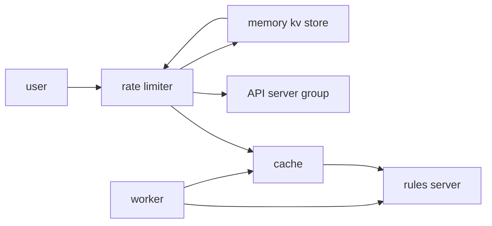

- 关注整个构架，或者关注某个功能，理解scope很重要。
- **功能性设计 functional**和**非功能性设计 non-functional**。
- 功能性是实际的具体的功能。
- 非功能性一般是：Scalability可扩展性，Throuthput，StorageCapacity，Performance，Availibility
- *Back of the envelope calculation*：很多非功能性标准，无法立刻得到一个十分精确的计算结果，“信封背后的计算”是一种方便快捷的方法，用于在不需要高精度的情况下，快速得到一个大致的估算结果。这种方法强调的是效率和实用性，常用于需要快速决策的场合。
- 分布式系统很重要。
- 四步法：确定问题范围，总体设计，细节设计，总结

角度：

- 功能性设计，非功能性设计
- 功能性是实际的具体的功能。
- 非功能性一般是：Scalability可扩展性，Throuthput，StorageCapacity，Performance，Availibility
- 系统构架

## 回答框架

### 1. 明确需求
   - what are the requirements?
   - **澄清问题**：首先和面试官确认需求，确保对系统的目标和功能有清晰理解。例如：这个系统的用户规模是多少？系统的核心功能有哪些？
   - **非功能性需求**：了解性能要求（如响应时间、吞吐量）、可靠性（SLA、故障恢复）、可扩展性、存储需求、安全要求等。

### 2. 系统组件划分
   - high level design, what are the components we need
   - **高层次架构**：给出系统的总体架构图，定义主要的组件（例如：API 层、数据库、缓存、负载均衡等）。
   - **模块划分**：详细说明每个模块的职责和如何交互。这里可以引入微服务、单体架构或分布式架构等概念。

### 3. 数据库设计
   - talk about the database design
   - **数据模型**：讨论要存储的数据类型以及选择何种数据库（SQL vs NoSQL）。解释如何设计表结构或文档格式。
   - **索引与查询优化**：考虑数据的查询模式，如何优化查询性能（如索引、分片）。
   - **数据一致性**：讨论是否需要强一致性（例如，使用事务），或者可以接受最终一致性。

### 4. 扩展性与负载均衡
　 - scalability
   - **水平与垂直扩展**：说明系统如何扩展以应对用户增长，是通过增加更多服务器（水平扩展）还是通过增加硬件能力（垂直扩展）。
   - **负载均衡**：讨论负载均衡器的使用，确保请求能够均匀分发，避免系统过载。

### 5. 缓存与优化
   - cache!
   - **缓存策略**：决定哪些数据可以缓存（如常用的查询结果、静态内容），以及使用何种缓存机制（如 Redis、Memcached）。
   - **缓存失效机制**：讨论缓存的失效策略（LRU、TTL）和缓存一致性问题。

### 6. 故障处理与容错
   - availability: backup and recovery
   - **高可用性设计**：讨论如何确保系统的高可用性，避免单点故障（如引入副本、自动故障转移）。
   - **备份与恢复**：考虑数据库和服务的备份策略，以及如何快速恢复服务。

### 7. **安全性设计**
   - security: data(store and transfer), person(auth), system(firewall)
   - **身份验证与授权**：选择适当的身份验证机制（如 OAuth、JWT），确保用户的权限管理。
   - **数据加密**：讨论数据在传输和存储中的加密策略，避免数据泄露。

### 8. **性能监控与日志**
   - log and alarm
   - **监控与报警**：说明如何通过监控系统（如 Prometheus、Grafana）监控服务性能，以及如何设置报警。
   - **日志记录与分析**：考虑如何记录关键日志，便于问题排查和性能分析。

### 9. **总结与扩展**
   - **总结系统优缺点**：快速总结所设计系统的优点和潜在的风险点。
   - **未来扩展**：讨论系统将如何根据业务需求变化进行扩展和优化。

这个框架旨在帮助你从系统的整体到细节逐步展开，展示你对架构设计的深刻理解。在每个环节中，不要忘记强调设计决策的原因，并结合实际案例或经验来强化你的观点。

## Rate Limiter

- 限速的目的是，*防止users或者bots发送过量的请求*，有些出于安全（比如密码尝试次数），有些出于cost和availability考虑，或UX用户体验

- **fuctional**（表达它是什么东西）上来说可以设计一个*backend API*，针对API的各个功能（比如upload的各个instance）设计一个*共享的限速器*，封装为一个组件，存储所有实例的执行情况，这个很像模式设计中的，单例模式里的共享实例，然后可以设计比如*429*这种适用于http的错误码
- *Client端的比如浏览器里的JS中的限速OK？NO*，可能这会很simple，但是很多user可以直接bypass浏览器，而是用curl等直接hit你的API，然后就crush了，所以一定要有一个这样的limiter组件

- **Non-functional**（表达它的性能）主要关系到*throughput*和*latency*，这两个永远是最重要的考量点，我们当然不能用延迟换取限速，目的是限速器存在但是对用户来说似乎不存在的样子，考虑的要素：
  - limiter中设置的rules的数量，它决定了需要过滤多少规则，应该不会很多
  - Users和IPs的数量，一个IP大小是132byte，1一个billion的用户IP就是132GB？可以放进一个memory？
  - Availability：可用性和安全性的trade-off的考虑，call在fail后是open还是close

组件：

- Reverse Proxy：它本身应该是一个反向代理，来决定是否要发送请求到后端
- Rule server：存放要进行过滤的rules
  - 规则服务器可以存在于后端，那么用于交互的就需要一个*cache服务器*，同时需要一个*worker*在规则变化的时候进行事件驱动，然后重写cache里的规则
- Memory key-value store like redis：需要读写功能，在一定时间内存储用户数据！this is fit
  - schema：key可以是userID，value可以是counts，通过redis的expire功能进行count重置0，api对象，timeUnit（用于滑动窗口的算法控制等），总之这里的数据是为了之后的算法功能实现
- APIs to forward，最终就是要进行路由的API了

算法：

- 固定窗口Fixed Window：挺好，但是不灵活
- 滑动窗口Sliding Window：灵活，精确，过去的一段时间的速率计算，缺点就是需要存储每个请求的timestamp

## TinyURL

- client
- web server -> URL generator
  * 为了避免哈希冲突，甚至可以输出大部分的组合存储在一个数据库中，如果key被使用了则标记used
  - 多用户的并发请求要求ACID处理的原子性（atomic）和隔离性（isolation），来放置同时使用一个url
  - 事务一致性和cache速度之间是一种trade-off
- DB: NoSQL
- cache: in memory to get generated url(LRU算法)
- clean up server：非同步处理过期链接的服务器，对不再使用的url进行used标签解锁，并释放对长url的存储

- LB和数据库replica都是惯用伎俩

## Twitter

功能有哪些：

- follow others
- create tweets
- view feed：这个可能会需要机器学习算法之类的

组件：

- client
- App servers（*LB*）- *cache*（最流行的tweets，使用*LRU*算法）加速必须
- DB：*Graph DB* instead of NoSQLDB 存储follow数据
- 数据库*Sharding*技术，使用uid来分区
- *Object Storage* 存储的是tweets数据包括文字图片音像等
- *CDN*：用文件分发系统（read-only）
- *PubSub* 处理新创建的tweet -> *Cluster/Worker*处理 -> 创建client可以立刻查阅的*Feed Cache*，所以多个cache有多种功能也是常态
  - 这些都是为了**降低延迟**

## Discord/Slack/Teams

- background: groups, chaneels, chats
- arch: users -(web socket)-> server --> databases(MongoDB)
  - server --> cache

- *messages db*:
  - id, uid, memtionId, serverId, channelId, sent_at
- *User Activity db*:
  - id, uid, serverId, channelId, last_read_at
  - (so user can return to where they left the channel)

## Youtube

- *functional*: upload, watch, and search, recommendation, comments, analytics and so on
- focus on upload and watch video

- *non-functional*:
  - reliability: scale
  - availibility
  - consistary
  - secure: bots, rate limiter
  - low latency

- *arch*:
  - users - CDN(popular videos) fetch files from storage (mobiles, pcs)
  - users - load balancer - App Servers
  - users - Object Stores / metadata (upload(title, uid, video)) in NoSQL MongoDB
                          - compression video files - Message Queue - encoding - Object Storage
                          - video is chunked!!

## Google Drive

- file system (HDFS) / object store (GCS) --> object store is good
- arch:
  - users --> App servers --> cache --> kv store
                          --> object store
                          --> ZooKeeper handle heartbeat
                          --> Garbage Collection

- reduce cost:
  - block-level storage 块存储，降低数据传输量
  - deduplication 去重技术
