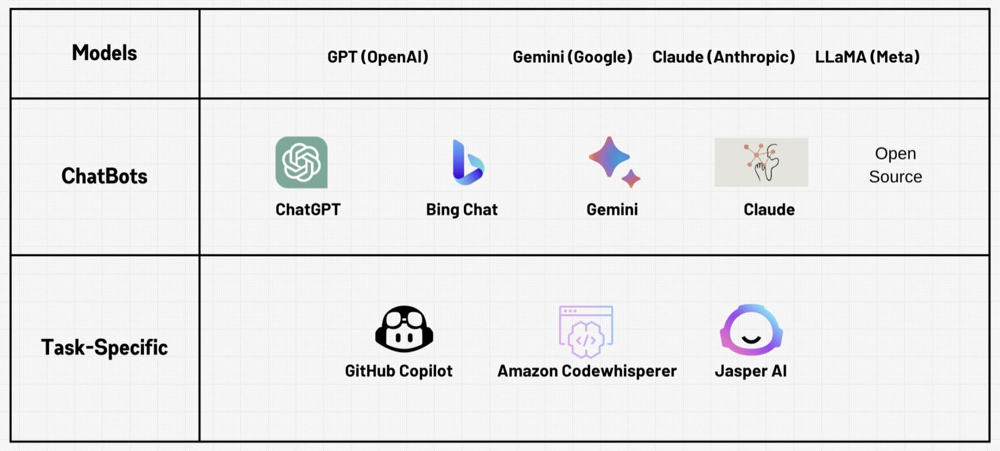

## AI 时代提问准则

---
### My Break down LLM Memo

- 顺序不同会带来结果的不同。他们依照已有的内容输出。It think as it types - 边打边输出。
- 已输出的内容，会和下一次输入一起作为输入。
- 无非是统计结果的选择和输出。温度指标代表了随机性，随机性是这个世界的确定性。如果你让LLM掷骰子，温度设置为0，那么它会给出training数据中，出现概率最大的那个数字。统计和概率论始终支配着这个世界，LLM在这个世界中，它只是给出了这个世界中它训练数据中，分布概率最高的结果罢了。
- 然而神奇的是，只是设置了概率和输出，LLM可以将离散的结果连接成话，那是这个世界的共同意识。
- Pre-trained 得到 Base model，通过微调得到聊天应用。
- The Reversal Curse：同一个问题反过来问，它一个知道一个不知道了。他知道A是B，但是不知道B是A。这是因为它学习的是语言，而不是数学。比如我们说A是B的妈妈，但是网上很少说B是A的儿子，那么大模型就不知道了，因为他不具备知识，他不懂在没有前后语境的情况下，联系妈妈和儿子的关系。
- LLM是在数字维度的模型，他们对提问的细节非常敏感，一个细微的计算差别就会有不同的结果产生。
- 自然语言就是LLM的编程语言。就像编程语言之于计算机，就像数学之于这个宇宙。
- LLM的涌现能力（Emergent Abilities）的可能性。在一个点突然爆发。
- LLM的不可解释性，这需要人去弄懂。小的prompt的变化可能会给一个模型带来很大的不同。
- 对自然语言这种编程语言的最大化应用。要想要好的答案，就要有好的问题。

### 挑战简单解释大语言模型

#### 挑战原因

我将我学过的关于机器学习和深度学习的各种内容，抛开其中80%的复杂原理部分，将浅显易懂的解释提炼写了这篇内容。我想挑战通俗易懂地解释什么是现在很火的大语言模型。人们可以跳过它基础的理论学习，但是人类的好奇心驱使着人们进步，人们值得理解它，而不是在重重迷雾中面对它。

进行解释的目的，是为了在一个更高的层面上，让人理解它，是为了让软件工程师和系统工程师，在进行系统构架的时候，都能更清楚自己面对的大模型是什么。

至少现在的我在进行开发的时候，如果遇到不懂的概念，我会觉得如鲠在喉，我希望工程师们，未来开发AI系统的时候，没有这种感觉。在战略上轻视它，在战术上重视它，高层面理解它，更专注开发。

大语言模型不只是想人们现在推崇的那么火爆，更是因为它确实是一个科技重要节点，它包含的那些有逻辑的语言，至今科学家还无法解释，只能归结为一种涌现现象，科学家说，它是一种对世界的整体知识的镜像，一种缩影，一种初步的反应，当你在和它对话的时候，你实际上是在和整个世界的镜像对话。如果你能理解它是什么，挖掘它的潜力，那对于自己的认知，生活都会有一个好的助力。

尤其是软件和系统开发者，未来不免遇到开发AI系统，之类的相关构架，所以我想有必要在一个比较高的层面上去理解它。

（声明，解释中抛开了复杂的原理解释，仅从一个工程师应用的角度，来解释大模型的结构。如果是对复杂原理感兴趣的人们，请自行学习。Tensorflow和Pytorch库，以及无数的网络教程都值得探索。）

#### 初步解释

首先解释范畴：机器学习包含深度学习，深度学习包含自然语言处理，自然语言处理算法得到的就是，大语言模型(LLM)。

他们都是通过算法 + 数据，产出模型的过程。

什么是模型，对于使用模型，并且懂得编程语言的人，解释起来模型就是一个**实例方法**， 或者更简单的说，就是一个**函数**而已。

而对于系统构架的工程师，或者软件开发工程师的任务，仅仅是使用API调用这个函数，达成系统中的一个任务而已。

模型如何来的，这是数据科学家的事情。这部分即使不关心，也不影响工程师在AI时代与时俱进。

#### 具体打个比方

模型的执行包括两个文件：假设一个是parameters（任何可以读取的文件），一个是run.py

（实际上如果你把Meta公司的llama-2-70b模型安装在自己的计算机上，打开设置文件看到的就是两个文件，一个叫parameters，一个叫run.c，只不过我这里想用Python的代码打比方而已。）

好了那么当我们运行大模型的时候我们就像是在执行这个run.py文件：

```python
from parameters import param
def run(input):
    result = 0
    for x in param:
        input *= x
        result += input
    return result 
```

仅此而已。虽然这种写法有点愚蠢，但是用一句话说明就是，parameters文件中只是一组又一组的矩阵。这些矩阵作为一种变换的方式，和你的输入进行相乘和相加的计算，最后吐出结果。只不过我省略了复杂的数学，用直观的方式表示，从直观上来说没错。

（另外这段代码逻辑，正是Pytorch进行前向传播，也就是推理时候的，类方法的简单表达，推理就是我们用模型预测的过程，非常简洁。）

在模型使用上，机器学习（基于统计的模型），和现在的大模型（基于Transformer算法训练出的模型），在使用他们的时候，都是这样一种输入加处理加输出的方式而已。

以上是对模型的讲解，一句话来说，它就是一种使用用户的输入，进行数学计算后，得到结果返回给用户的过程。没有别的。

#### 那么LLM模型的特殊之处是什么？

没有特殊之处，因为在计算机的世界，他们训练模型的过程，就是把所有的语言进行从单词到令牌（token），再到向量的处理过程。结果来说，就是语言在计算机的世界也是数字，那么事情就简单了，大模型和一般的机器模型没什么区别也是数字的计算。

那为什么最热门的Transformer那么复杂和显得高级，单纯是因为它解决了人类语言中很多不确定的语言联系问题。不过恕我直言，这种解决问题的方法，还是一堆矩阵相乘，完全是线性代数。

硬要说和其他模型的不同，真有一个，那就是你上次输入的内容可以作为下次输出的材料，也就是说你输入的内容越详细，模型的输出效果就越好，这让大模型显得很智能，但其实仅仅是因为它进行判断和计算的数字更多了，它可以为你输出更相关的内容，仅此而已。

#### 模型版本有好多，他们的区别是什么？

只要理解了参数越多，也就是刚刚说的 parameters 文件中的参数，越多预示着模型计算量越多，结果越好，这就是 GPT3.5 和 GPT4 的区别。3.5训练完后把参数打包给你用了，然后在3.5的基础上继续增加参数继续训练（微调）就能得到更好的模型。

模型越高级，可以处理的工作就越多，比如输入语言输出图像，输入图像输出文字，输入文字输出语音，这种不同类型的转换，就是人们说的多模态。

多模态的意义就是希望模型得到像人一样的能力，能看会说还会听会画。

#### 拆解ChatGPT概念

GPT模型和ChatGPT不是一个概念。ChatGPT只是在GPT模型基础上在网页的应用而已。GPT三个字母代表Generative Pre-trained Transformer。

我们拆解一下：

- Generative 代表了它就是为了输出的。相反的还有一个编码式，编码代表通过模型训练，将巨大的网页世界的文字都转换成parameters（刚刚比喻的文件又登场了）。
- Pre-trained代表预训练，就代表它是一个基础模型：base-model。这个阶段是没法对话的，它就像一个聪明的哑巴，输出的是很奇怪的内容，比如下图：

- Transformer就是几乎现在所有大语言模型的基础算法。谷歌出品。
- Chat，意味着它是在基础模型的基础上,针对特定的交互式对话任务进行了进一步训练和优化。这个过程叫做微调，微调的结果是助手模型：Assistant-model。

付费用户可以在OpenAI后台进行自己的微调，创建自己的助手机器人，比如专门用于翻译的，专门用于写代码的。ChatGPT就是专门用于聊天的助手而已。

什么是微调？就是对模型进行指导，和再次轻微训练。比如，冻结大部分的参数，只对输出部分进行指导和规范，进行小范围参数训练，生成新的调整过的模型，这就是微调。

另外我很喜欢手机版的ChatGPT，即使是免费版本，也有语音识别功能，外出的时候，可以直接进行语音提问。是我很喜欢的功能。

#### 现在为止的大模型种类有哪些？



**OpenAI**：众所周知，大语言模型先锋公司。

- GPT3.5：上一代模型。网页应用ChatGPT就是基于它的。
- GPT4：最新模型。付费后，可以在ChatGPT网页应用中选择该模型，可以使用API，可以在控制台进行模型微调（也就是用你手中自己的数据，让模型变得更懂你的需求）来创建自己的AI助手。如果你的工作是重复性很多的那种，你用这个助手就基本可以通过助手自动化你的工作，然后做一个躺平的上班族了。
- DALLE：付费模型。在控制台可以选择该模型，可以给你画图，也就是生成式算法GAN（只要知道这个算法可以教模型画图就可以了）的成果模型。
- Embeddings：将文字转换为数字，针对那些想自己进行模型微调的人，因为你要喂数据给模型，就要把你的文字转换为数字。（刚刚说了计算机里都是数字，仅此而已），所以这属于一个用于模型准备的工具（简单理解）。

**Anthropic**：这个公司很有趣，它的创始人是从OpenAI跑出来的，他不满OpenAI的做法，觉得他们处理模型太随便了不安全，所以他自立门户了。他们家的模型是现在非常热门的！！他们的原则是安全，强大，又开放。

- Claude3：这就是他们家最新的模型。使用这个模型的网页应用就叫Claude。可以生成文字，还可以上传图像进行看图说话。但是我只用了它的网页应用，它很聪明。目前为止非常满意，我没有购买pro，所以不知道API和后台情况。想要当作学习伙伴，又不想付费，Claude是一个非常好的选择。我在AWS的Bedrock中也见到了它，它是热门的模型。

**Google**：

- Gimini：网页应用非常好用，精度不错，查东西的话，配合Claude足够了。同时它集成了GoogleMap等多个应用，仿佛只是在Google的众多应用中加了一个工具一样自然。API对于免费账户，每天可以尝试50条，我之前学习完了Gimini的API使用的小课程，还没用完当天的限额。

我喜欢Gimini的地方就是它会告诉我内容出处，我可以进一步调查。

说一件非常有趣的事，我有一次问他GCP和AWS中某个服务的区别，它给我付了链接，GCP的链接显示了，但是AWS的链接它显示链接无效不可显示ww。是商业原因吗哈哈。

**Meta**：

- Llama3：开源最新最强的模型，比GPT4还厉害，之前新闻上很爆炸，甚至可以在我自己的Mac上运行。网站在[这里](https://lmstudio.ai/)，检查一下你的机器型号是否可以带动该模型，OK的话就可以在下载模型到本地，也就是那个parameters文件（我的比喻又出现了），但它真的叫做parameters，而且它的大小是140GB。然后就可以在本地运行你的模型了，完全离线，很酷。

**Microsoft**：

- Bing也内置GPT4，毕竟OpenAI也是他们的。但我不常用，所以这里不做解释了可以自己尝试，只要知道它内部也是GPT即可。

总结一下，这些模型都是Transformer算法产出的结果，他们性能好坏，只取决于各个公司的算力和数据。

#### 该如何看待大语言模型

- 学习伙伴：查询工具，文章总结工具，快速获得答案的工具。但他最多只是参谋，给你的建议和结果你要审核再用，但是它的建议采用性很高。
- 它脑中的信息是这个世界正态分布的结果：如果你问他随机掷骰子会出几，它会说4，为什么？因为这是统计的结果。人们倾向于在充满文字的网络世界中说4，也许吧，总之统计的力量在支配。
- 不善于表达的博学家：所以在你提问的时候，越是详细，得到的答案越好，你的思考方式越是有逻辑，提问越是能引导，就越能得到正确的结果。你就像是大学的博士生导师，面对一个高智商的博士，你的任务就是引出它知识库中的宝藏。比如你要写一个游戏代码。相比较直接让他写，不如你先让他输出编码流程，然后再让他按照该流程进行编码的效果，会好很多。这代表着你让他把自己的输出当成输入继续进行创作了。
- 工具而已：很多人害怕AI替代了自己，但是能替代自己的只有会用AI工具的人而已。而不是AI。仅仅是工具而已，如果不纠结内部原理，仅仅是使用的话，完全没什么难度。重要的是自己的思考的逻辑性，和通过工具提高学习效率而已。

虽然理解Transformer让我很快乐，但是没有计算资源（大型GPU）的我们也就是只能理解而已。但是有一些基础的知识后，再去学习一些稍稍高级的概念就会更加简单，比如一般人可以处理的微调，Rag，LangChain实装，API使用，都是使用模型的方法。这些是一个工程师应该知道的。

如果手写代码，从零训练模型，在过程中当然可以更好的体会，但是对于非AI领域的工程师，知道模型的实质就足够了。

一句话总结模型：使用算力和数据，将一组随机的parameter通过不断的迭代训练，得到看似可以预测的数据的一组parameters，使用这些parameters，将你的输入进行处理，得到输出。工程师，只需要关注训练后的部分。

这是一个巨大的领域，如此的说明非常粗糙，但是对于一个目的是应用模型，到实际系统中去的工程师来说，首先理解了它的本质，就会让很多问题变得简单了。

#### 大语言模型和其他大模型带来的技术流程变革

研究模型内部原理的都是算法工程师，那么工程师该如何接纳和融入新的环境？

这里就是想解答这个问题。

我查找了一些文章和看法，其中又一些观点我觉得暂时可以接受，比如这条比较舒适的路径：

提示词工程 -> 调用api -> AI应用开发框架 -> RAG技术 -> Agent-> 模型微调相关 -> 模型产品部署和交付

如果未来需要进行相关项目的构架，那么这条路径或许是一个好的切入点。至少我现在看到的项目没有逃出这个范围。

下面就简单的介绍每一个是什么，从一个高的层面理解。当开发有需要的时候，再去查概念，就能知道它在那个位置了。

**1，提示词工程**：

基于提示词对大模型的使用，研究怎样问问题才能激发出大模型的能力。虽然只是用人的语言去问问题，但是他有一套清晰的流程和方法。

正确的提问可以得到更正确的回答，在Langchain的库中那些系统信息，用户信息，都是基于原理而来的重要部分。知道要添加这些要素，却不知道为什么，就是因为缺少对这些部分的认知。

提示工程的每一个元素，都是针对内部原理，合理设置的，无论是生活还是开发中，都是需要注意的部分。

编程是针对计算机的语言，人类语言就是针对大语言模型的编程语言。

**2，调用API**：

这是每个工程师，程序员必备技能，就不再多说，会用API就可以直接，或者使用框架调用基础模型，然后进行提示工程，和系统构架了。

**3，AI应用开发构架**：

现在的大语言模型应用，从产品形态上正在沿着 AIGC（内容生成）、Insight（知识洞察）、Copilot（智能助手）、Agent（数字代理）四个阶段演进。

在构建不同应用时，会接触到各种开发框架和工具，比如最广为人知的LangChain。这些新的框架和工具尚处在探索发展过程中，因此需要程序员和开发者具备快速学习和适应的能力。

但是我觉得一通百通，在理解了大致原理的基础上，学会一个，再来新的也不会觉得太陌生。

**4，RAG技术**：

当大语言模型本身的知识不够专有、不够垂直的情况下，可以通过RAG（Retrieval-Augmented Generation）技术引入外部知识库的方式增强模型的生成能力。

RAG的意思就是检索和生成，意味着你给他提供检索的内容，它从中查找，并用大语言模型自身的语料库，进行更连贯的生成结果的任务。

适合一个公司内部的信息检索，和结果生成项目。

**5，Agent**：

大模型领域的“自动化”。通过加入“感知”、“记忆”、“规划”等机制，让大模型自主思考、决策、规划、执行，来解决问题。

关键词就是自动化，所以在使用LangChain框架的时候，在使用它的代理工具的模块，就会显得代码很少，非常简单和强大。因为他是自主解决问题的。

**6，模型微调**：

从这一层开始就有些专业了，一般来说到Agent就足够一个开发者的构架理解了。

但是为了流程的完整性，我决定还是简单解释完。

微调是在已有预训练模型的基础上，针对特定任务进行局部参数调整。一个最近的例子，是将GPT模型微调成ChatGPT机器人。

微调领域还有很多不同的方法。这里没必要增加文章的复杂度，就不罗列了。

**7，模型产品部署和交付**：

了解常见的部署平台和工具，了解私有化部署的硬件选型知识，学会如何进行模型的打包、测试和发布。

我没有做过不太了解，但是从我见过的知识来说，比如AWS上的AI自动化，Databricks的AutoML等都是自动化部署模型等平台。

私有化部署比如将模型部署在区域边缘加速推理等技术。

打包模型，测试，发布等更接近工程师工作的部分还没有大规模投入实践，我自己也正在学习过程中。

#### 总结

我希望AI成为大部分程序员的助力，而不是替代品。

这也是每个工程师自己需要意识到的。当新的词汇出现，脑中不是疑问，而是大概知道它是什么。

利用它，让自己更轻松。适应它，让自己进化。

### 一些其他的Topic

- 模型训练被很多人称为炼金术。我觉得确实如此，因为没有任何两个人训练的模型是一样的，显示了这个世界的随机性。
- 模型的训练和推理，完全只是数字计算，线性代数，但是却能得到逻辑合理的结果，没人可以解释，这被叫做涌现。已经超出了科技范畴了。
- 除非你真的感兴趣，我不建议去尝试编码和学习机器学习和深度学习算法，因为很难出成果。如果是小的数据集预测，还是很值得学习机器学习的。深度学习算法虽然厉害，但是也要根据问题选择，有时候传统的机器学习算法更合适，这个世界还没有发明出泛用算法和泛用AI。
- AI的边界，其实就是数学的边界，数学是这个宇宙的编程语言，然而数学都不能解决的问题还非常多，更别说AI了，所以他一点都不可怕，只是一种算法而已。但我觉得最棒的算法永远是这三个：爱因斯坦质能方程，熵增定律，和1+1=2。AI还是弱的。最厉害的还是人脑。

