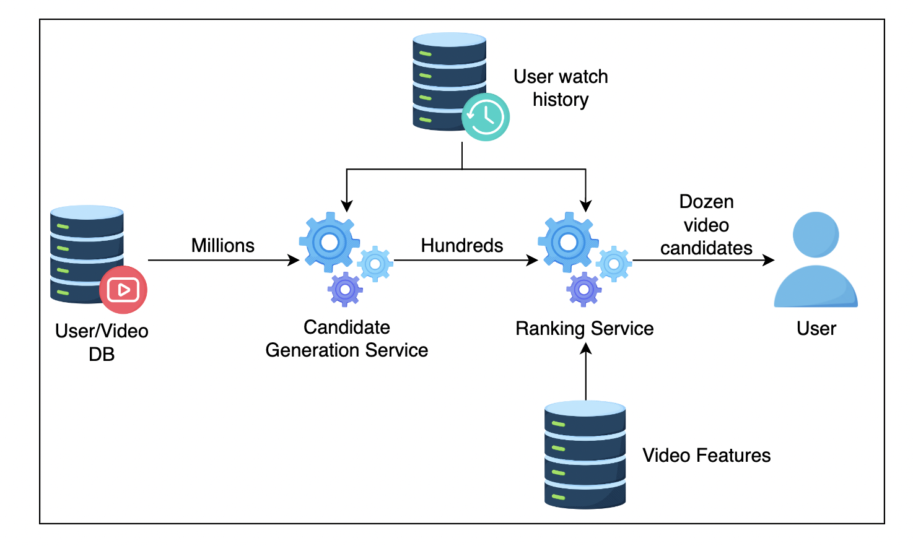

## 系统设计流程

机器学习的标准开发周期包括数据收集、问题制定、模型创建、模型实施和模型增强。

机器学习系统设计涉及多个步骤，从问题陈述到模型的扩展，每一步都至关重要。以下是详细的步骤和它们的相互关系：

### 1. 问题陈述（Problem Statement）
首先，需要明确你要解决的问题。这一步非常关键，因为它决定了整个项目的方向和目标。

**关键问题**：
- 你要解决的是什么问题？是分类问题、回归问题还是其他？
- 问题的背景是什么？
- 为什么这个问题重要？

**示例**：
- **问题**：预测客户流失
- **背景**：电信公司希望减少客户流失率，提高客户保留率
- **重要性**：通过预测客户流失，可以提前采取措施保留客户

### 2. 确定指标（Identify Metrics）
明确衡量模型性能的指标。选择合适的指标对于评估模型的有效性和实际应用至关重要。

**关键问题**：
- 哪些指标最能反映模型的性能？
- 是否需要考虑多个指标？
- 是否需要考虑特定领域的要求？

**常见指标**：
- 分类问题：准确率（Accuracy）、精确率（Precision）、召回率（Recall）、F1分数（F1 Score）
- 回归问题：均方误差（MSE）、平均绝对误差（MAE）、R^2

### 3. 确定需求（Identify Requirements）
定义系统的具体需求，包括功能需求和非功能需求。

**关键问题**：
- 系统需要哪些功能？
- 数据存储和处理的需求是什么？
- 系统的性能需求是什么（如响应时间、处理能力等）？
- 安全性和隐私需求是什么？

**示例**：
- 功能需求：实时预测客户流失
- 数据需求：需要每天更新的数据
- 性能需求：响应时间小于1秒

### 4. 训练和评估模型（Train and Evaluate Model）
选择合适的算法，训练模型并评估其性能。这个步骤通常包括数据预处理、特征工程、模型选择和超参数调优。

**关键步骤**：
- 数据清洗和预处理
- 特征工程（特征选择和特征提取）
- 模型训练（选择合适的算法并进行训练）
- 模型评估（使用确定的指标评估模型性能）

**示例**：
- 使用随机森林进行分类
- 评估模型的准确率、精确率和召回率
- 使用交叉验证和超参数调优提升模型性能

### 5. 设计高层系统（Design High Level System）
设计系统的高层架构，包括数据流、系统组件和交互。

**关键元素**：
- 数据流设计（数据如何流动和处理）
- 系统组件（数据收集、存储、处理、模型服务等）
- 组件交互（各组件之间如何通信）

**示例**：
- 数据流：客户数据 -> 数据预处理 -> 模型预测 -> 结果存储
- 系统组件：数据收集模块、预处理模块、预测服务、存储模块
- 交互：预处理模块将数据传递给预测服务，预测结果存储在数据库中

### 6. 扩展设计（Scale the Design）
考虑系统在实际应用中的扩展性，包括处理大规模数据和高并发请求的能力。

**关键考虑**：
- 数据扩展性（如何处理大规模数据）
- 计算扩展性（如何处理高并发请求）
- 模型扩展性（如何部署和更新模型）
- 基础设施（是否需要云服务、分布式计算等）

**示例**：
- 使用分布式数据存储（如Hadoop或Spark）处理大规模数据
- 使用微服务架构和负载均衡处理高并发请求
- 使用容器化（如Docker）和容器编排（如Kubernetes）部署和管理模型

## 特征选择和特征工程技巧

### One hot encoding

问题：计算量大，内存消耗高，不适合自然语言处理，有多少个unique特征就有多少特征向量。

可以尝试将不重要的特征分类到“其他”标签中。

可以使用的方法：`pandas.get_dummies`,sklearn `OneHotEncoder`。但是前者不会记住进行了编码的值，如果加入了新的值，会导致前后不一致。但是后者则可以在训练和预测期间保持变换的一致性，所以推介后者。

其实这个方法处理大基数特征的时候是不切实际的，所以很多公司都采用更高级的技术。

### Feature hashing

哈希技巧或哈希技巧法，是一种用于将高维稀疏特征向量映射到较低维度的稠密向量的技术。

Feature hashing通过哈希函数将特征索引到固定大小的向量中，从而减少特征的维度。这种方法在处理大量稀疏特征时非常有效，常用于文本数据和高维数据。

工作原理
- 哈希函数：使用一个哈希函数将每个特征映射到一个固定大小的向量索引。
- 哈希冲突：多个特征可能映射到同一个索引，这称为哈希冲突。Feature hashing通过将这些冲突特征的值累加或使用签名函数处理冲突。
- 签名函数：有时会引入签名函数（例如，取正负号）来减少哈希冲突带来的影响。

下面是一个使用 Python 实现的简单 Feature Hashing 示例，利用哈希函数将文本特征映射到固定大小的特征向量中。

假设我们有几条文本数据，我们将使用 Feature Hashing 将这些文本数据转换为固定大小的特征向量。

```python
import numpy as np
from sklearn.feature_extraction.text import HashingVectorizer

# 示例文本数据
documents = [
    "I love machine learning",
    "Machine learning is amazing",
    "I love coding in Python"
]

# 使用 HashingVectorizer 进行 Feature Hashing
vectorizer = HashingVectorizer(n_features=10, alternate_sign=False)  # 设定特征向量的固定大小为 10

# 转换文本数据为哈希特征向量
hashed_features = vectorizer.transform(documents)

# 转换结果为数组形式以便查看
hashed_features_array = hashed_features.toarray()

# 打印哈希特征向量
for i, doc in enumerate(documents):
    print(f"Document {i+1}: {doc}")
    print(f"Hashed Features: {hashed_features_array[i]}")
    print()
```

1. **`HashingVectorizer`**:
   - `n_features=10`：指定目标特征向量的长度为 10。
   - `alternate_sign=False`：默认情况下哈希冲突会累加特征值，设为 False 表示不使用签名函数。

2. **转换文本数据**：
   - `vectorizer.transform(documents)`：将文本数据转换为稀疏矩阵形式的哈希特征向量。

3. **结果查看**：
   - `hashed_features.toarray()`：将稀疏矩阵转换为密集数组，方便查看结果。

假设上述代码的输出如下：

```plaintext
Document 1: I love machine learning
Hashed Features: [ 0.  0.  1.  0.  1.  1.  0.  0.  1.  0.]

Document 2: Machine learning is amazing
Hashed Features: [ 0.  0.  1.  0.  1.  0.  0.  1.  0.  1.]

Document 3: I love coding in Python
Hashed Features: [ 1.  0.  1.  0.  0.  1.  1.  0.  0.  0.]
```
每个文档都被转换为长度为 10 的特征向量，这些向量可以直接用于后续的机器学习模型中。通过这种方式，Feature Hashing 可以有效地将高维特征映射到低维空间。

用一个更简单的解释方法，就是和implement哈希数据结构的时候用的公式一样，mode。
```
h(the) mod 5 = 0
h(quick) mod 5 = 4
h(brown) mod 5 = 4
h(fox) mod 5 = 3
```
如此得到结果[1, 0, 0, 1, 2]。这里mod5表示分5组。这里因为1，和2都没有所以为0，在index为4的有两个所以为2，这里执行了累加。

很多大公司会使用这种方法，但是这种方法需要权衡，因为空间太小会引起哈希冲突，太大则会增加计算量。

### Crossed feature

**交叉特征**：交叉特征是通过将两个或多个原始特征的值组合起来创建的新特征。例如，假设我们有两个类别特征“性别”和“职业”，可以通过交叉特征将它们组合成一个新的特征“性别_职业”。不如叫特征组合。

- 捕捉特征交互：通过交叉特征，可以捕捉到原始特征之间的交互关系，这对于模型性能提升非常重要。
- 提高模型复杂度：增加了特征的多样性和复杂度，使模型能够学习更复杂的模式。
- 维度爆炸：交叉特征可能会显著增加特征的数量，导致特征空间维度爆炸，增加计算和存储成本。
- 稀疏性问题：如果特征值组合太多，可能导致很多稀疏特征，影响模型训练效率。

交叉特征在推荐系统、广告点击率预测等领域应用广泛。例如，在推荐系统中，可以通过用户ID和商品ID的交叉特征来捕捉用户对特定商品的偏好。

简单来说就是进行特征组合，我觉得这在特定的问题中可能会比较有效。比如经纬度组合，这肯定是必须的。

在大公司中这也是常用技巧，比如爱彼迎。

### Embedding

Embedding（嵌入）是一种将高维稀疏数据转换为低维稠密向量的方法，广泛应用于自然语言处理（NLP）、推荐系统、图像处理等领域。

特征嵌入是一种新兴技术，旨在将特征从原始空间转换到新空间以支持有效的机器学习。嵌入的目的是捕捉特征的语义含义；例如，相似的特征在嵌入向量空间中会彼此接近。

最重要的好处就是可以*捕捉复杂的语义特征*，并且是可以被训练的。

Doordash 公司使用 Store Embedding (store2vec) 类似于word2vec技术，用来个性化商店信息流。以此找到商店和用户的关系。

```python
# tensorflow example
# Embed a 1,000 word vocabulary into 5 dimensions.
embedding_layer = tf.keras.layers.Embedding(1000, 5)
```

### Numeric features

Numeric features（数值特征）是指数据集中以数值形式表示的特征。它们是连续的，可以进行算术运算，如加减乘除。数值特征在机器学习和数据分析中非常常见，通常用于描述定量信息。以下是数值特征的详细介绍：

数值特征可以分为两类：

- **连续特征**：这些特征可以取任何值，例如温度、身高、体重等。
- **离散特征**：这些特征只能取有限的几个值，但这些值是数值形式的，例如考试分数、家庭成员数量等。

特点：

- **可度量**：数值特征表示可以精确测量的量。
- **有序性**：数值特征有自然的顺序，可以比较大小。
- **可运算**：可以对数值特征进行各种数学运算。

以下是一些数值特征的示例：

- **人口统计数据**：年龄、收入、房价、家庭成员数量等。
- **科学测量数据**：温度、压力、湿度、浓度等。
- **金融数据**：股票价格、交易量、利率等。

常见的预处理方法包括：

- **归一化（Normalization）**：MinMaxScaler将特征值缩放到特定范围（如 0 到 1）内，以便于处理不同量级的数据。
- **标准化（Standardization）**：StandardScaler将特征值调整为均值为 0、标准差为 1 的标准正态分布，以提高模型收敛速度和效果。
- **缺失值处理**：用均值、中位数、特定值或插值方法填补缺失值。

数值特征广泛应用于各类机器学习和数据分析任务中，例如：

- **回归分析**：预测数值目标变量，例如房价预测、股票价格预测等。
- **分类任务**：使用数值特征作为输入，进行分类任务，例如疾病诊断、客户分类等。
- **聚类分析**：根据数值特征将数据分组，例如市场细分、图像分割等。

以下是一个处理数值特征的示例，展示了归一化和标准化的过程：

```python
import numpy as np
from sklearn.preprocessing import MinMaxScaler, StandardScaler

# 示例数据
data = np.array([[25, 50000], [30, 54000], [35, 58000], [40, 62000]])

# 归一化
min_max_scaler = MinMaxScaler()
normalized_data = min_max_scaler.fit_transform(data)

print("Normalized Data:")
print(normalized_data)

# 标准化
standard_scaler = StandardScaler()
standardized_data = standard_scaler.fit_transform(data)

print("\nStandardized Data:")
print(standardized_data)
```
## 训练管道 Training Pipeling

训练管道（Training Pipeline）是机器学习和深度学习中用于构建、训练和评估模型的一系列步骤和过程。它的主要目的是将原始数据转化为可以用于预测和决策的模型。一个典型的训练管道包括以下几个主要步骤：

### 1. 数据收集
首先，需要收集和准备训练所需的数据。数据可以来自各种来源，比如数据库、传感器、API、文件等。

训练管道需要以低成本处理大量数据。一种常见的解决方案是将数据存储为*列式格式*，如 Parquet 或 ORC。这些数据格式可为机器学习和分析用例提供高吞吐量。在其他用例中，TensorFlow 生态系统中广泛使用tfrecord数据格式。

为了提高效率，Parquet 和 ORC 文件通常按时间进行分区，这样可以避免扫描整个数据集。在此示例中，我们先按年分区，然后按月分区。实际上，AWS、RedShift和Athena上最常见的服务都支持 Parquet 和 ORC。与 csv 等其他格式相比，Parquet 可以将查询时间加快 30 倍，节省 99% 的成本，并将扫描的数据量减少 99%。


### 2. 数据预处理
数据通常需要进行清洗和预处理，以确保其质量和一致性。预处理步骤可能包括：
- **数据清洗**：处理缺失值、异常值和重复数据。
- **数据变换**：标准化或归一化数据，使其符合模型的要求。
- **特征工程**：创建新的特征或选择有用的特征，以提高模型的性能。
- **数据分割**：将数据集分为训练集、验证集和测试集。

### 3. 特征提取
特征提取是从原始数据中提取有用的信息。对于图像数据，这可能涉及边缘检测和颜色直方图；对于文本数据，这可能涉及词频统计和词向量表示。

### 4. 模型选择
选择适合问题的模型。模型可以是线性回归、决策树、支持向量机、神经网络等。

### 5. 模型训练
使用训练数据来训练模型。在这一步中，模型会通过迭代算法不断调整自身的参数，以最小化预测误差。对于神经网络，这通常涉及反向传播和梯度下降算法。

### 6. 模型验证
使用验证集来评估模型的性能，调整模型的超参数以获得最佳性能。超参数调整可能涉及网格搜索、随机搜索或贝叶斯优化。

### 7. 模型评估
使用测试集对模型进行最终评估，以了解其在未见过的数据上的表现。常用的评估指标有准确率、精确率、召回率、F1分数、均方误差等。

### 8. 模型部署
将训练好的模型部署到生产环境，以便进行实际的预测或分类任务。部署方式可以是本地部署、云部署或边缘部署。

### 9. 模型监控和维护
在模型部署后，持续监控其性能，确保模型在实际环境中仍然表现良好。当模型性能下降时，可能需要重新训练模型或调整模型。

## 数据不平衡问题

分类不平衡问题是指在分类任务中，不同类别的样本数量差异很大，导致某些类别的样本数量远远少于其他类别。这个问题在实际应用中非常常见，如欺诈检测、医疗诊断等领域。以下是一些常用的方法来处理分类不平衡问题：

### 1. 数据层面的方法

#### a. 过采样（Oversampling）
增加少数类样本的数量，使其与多数类样本数量平衡。常用的过采样技术包括：
- **随机过采样**：简单地复制少数类样本。
- **SMOTE（Synthetic Minority Over-sampling Technique）**：通过插值法生成新的少数类样本。它的工作原理是从少数类中随机选择一个点，并计算该点的 k 个最近邻。合成点会添加到所选点和其邻居之间。

#### b. 欠采样（Undersampling）
减少多数类样本的数量，使其与少数类样本数量平衡。常用的欠采样技术包括：
- **随机欠采样**：随机删除多数类样本。
- **Tomek Links**：删除与少数类样本最接近的多数类样本。

#### c. 数据增强（Data Augmentation）
通过数据变换（如旋转、裁剪、翻转等）生成更多少数类样本，特别适用于图像分类任务。

### 2. 算法层面的方法

#### a. 加权损失函数（Weighted Loss Function）
在模型训练过程中，给少数类样本赋予更高的权重，使模型更关注少数类样本。常用的方法包括：
- **调整损失函数的权重**：在损失函数中为每个类别分配不同的权重，通常少数类权重大于多数类。
- **自定义损失函数**：根据数据分布和业务需求自定义损失函数。

#### b. 集成方法（Ensemble Methods）
使用多种模型组合来提高分类性能，特别是对少数类样本的分类性能。常用的集成方法包括：
- **Bagging**：如随机森林（Random Forest），通过多次抽样和训练不同的决策树来提高少数类样本的识别率。
- **Boosting**：如Adaboost和Gradient Boosting，通过加权训练多个弱分类器，使其逐步关注难以分类的少数类样本。

### 3. 评价指标的选择

在处理分类不平衡问题时，传统的准确率（Accuracy）往往不能反映模型的真实性能。因此，需要选择更适合的评价指标，如：
- **精确率（Precision）**：衡量被预测为正类的样本中实际为正类的比例。
- **召回率（Recall）**：衡量实际为正类的样本中被正确预测为正类的比例。
- **F1分数（F1 Score）**：精确率和召回率的调和平均数，综合考虑了模型的精确性和召回性。
- **ROC曲线和AUC值（ROC Curve and AUC）**：通过绘制ROC曲线和计算AUC值来评价模型在不同阈值下的性能。

### 示例：处理不平衡的欺诈检测

假设我们有一个信用卡欺诈检测的数据集，其中欺诈样本（正类）远少于正常样本（负类）。我们可以按以下步骤处理不平衡问题：

1. **数据预处理**：
   - 清洗数据：处理缺失值和异常值。
   - 特征工程：生成有用的特征，如交易金额、交易时间等。

2. **数据层面的处理**：
   - 过采样：使用SMOTE生成新的欺诈样本。
   - 欠采样：使用随机欠采样减少正常样本。

3. **算法层面的处理**：
   - 使用加权损失函数：在模型训练时，给欺诈样本赋予更高的权重。
   - 使用集成方法：如随机森林或Adaboost，提高模型对欺诈样本的识别能力。

4. **模型评估**：
   - 使用F1分数和AUC值来评价模型性能，而不是仅看准确率。
   - 绘制混淆矩阵，直观展示模型对各类样本的分类效果。

通过这些方法，我们可以有效处理分类不平衡问题，提高模型对少数类样本的识别能力。

## 选择正确的损失函数

选择正确的损失函数是构建有效机器学习模型的关键步骤之一。损失函数衡量模型预测值与实际值之间的差异，直接影响模型训练的方向和效果。选择损失函数时需要考虑以下几个因素：

### 1. 任务类型
不同的任务类型对应不同的损失函数：

#### a. 回归任务
- **均方误差（MSE, Mean Squared Error）**：常用的回归损失函数，计算预测值与实际值之间的平方差的平均值。适用于预测误差服从正态分布的场景。
- **平均绝对误差（MAE, Mean Absolute Error）**：计算预测值与实际值之间的绝对差的平均值，对异常值（outliers）更为鲁棒。
- **Huber损失（Huber Loss）**：结合了MSE和MAE的优点，对小误差使用MSE，对大误差使用MAE，控制了异常值的影响。

#### b. 分类任务
- **交叉熵损失（Cross-Entropy Loss）**：常用于分类任务。对于二分类问题，使用二元交叉熵损失（Binary Cross-Entropy）；对于多分类问题，使用类别交叉熵损失（Categorical Cross-Entropy）。交叉熵损失常用于神经网络、多分类等需要处理多个类别的问题。
- **对数损失（Log Loss）**：常用于解决分类问题，尤其是涉及概率预测的分类问题。优点是，它对于正确分类的损失为0，而对于错误分类的损失则增大。这种特性使得模型在训练时会更加关注那些预测错误的样本，从而提高泛化能力。对数损失常用于逻辑回归等只有两个类别的分类问题。

### 2. 数据特点
数据的特性也会影响损失函数的选择：

- **异常值（Outliers）**：如果数据中存在异常值，选择对异常值鲁棒的损失函数，如MAE或Huber损失。
- **类别不平衡（Class Imbalance）**：对于类别不平衡的问题，使用加权交叉熵损失或焦点损失来调整各类样本的权重。

### 3. 模型特点
不同类型的模型对损失函数的敏感度不同：

- **线性模型**：线性回归通常使用MSE，逻辑回归使用交叉熵损失。
- **神经网络**：神经网络可以使用各种类型的损失函数，视具体任务而定，如MSE用于回归，交叉熵用于分类。

### 4. 业务需求
具体的业务需求也会影响损失函数的选择：

- **预测精度**：对于需要高精度预测的任务，选择能最好地捕捉数据特性的损失函数。
- **解释性**：某些任务中，损失函数的选择可能影响模型的解释性，如选择MAE可能使模型更易解释。

### 5. 损失函数示例
以下是一些具体的损失函数及其用途：

#### a. 二分类任务 - 交叉熵损失
```python
import tensorflow as tf

# 二元交叉熵损失
loss_fn = tf.keras.losses.BinaryCrossentropy()
```

#### b. 多分类任务 - 类别交叉熵损失
```python
import tensorflow as tf

# 类别交叉熵损失（用于独热编码标签）
loss_fn = tf.keras.losses.CategoricalCrossentropy()
```

#### c. 回归任务 - 均方误差
```python
import tensorflow as tf

# 均方误差
loss_fn = tf.keras.losses.MeanSquaredError()
```

#### d. 处理异常值的回归任务 - Huber损失
```python
import tensorflow as tf

# Huber损失
loss_fn = tf.keras.losses.Huber()
```

### 6. 自定义损失函数
在某些情况下，你可能需要根据具体需求自定义损失函数：

```python
import tensorflow as tf

# 自定义损失函数
def custom_loss(y_true, y_pred):
    loss = tf.reduce_mean(tf.square(y_true - y_pred))
    return loss

loss_fn = custom_loss
```

## 推理 Inference

在生产环境中的推理（Inference）涉及多方面的复杂性。以下是对给定角度的详细解释：

### 1. Imbalance Workload (不平衡的工作负载)

在生产环境中，处理推理任务时，可能会面临不平衡的工作负载，尤其是在同时服务多个逻辑和模型时。这种情况下的挑战包括：

- **不平衡的请求量**：不同时间段的推理请求量可能差异巨大，例如白天高峰期和夜间低谷期的差异。系统需要能够动态扩展和缩减资源，以应对负载变化。
- **模型负载的差异**：不同模型的计算复杂度和资源需求不同。一些模型可能需要较多的计算资源和时间，而另一些模型则较为轻量。需要确保负载均衡器能够智能地分配资源，避免某些模型过载。
- **优先级处理**：在多个推理任务同时到来时，可能需要根据业务需求设置优先级。比如，实时性要求高的任务需要优先处理，而批处理任务可以延迟。

解决方法：
- 使用自动扩展（Auto-scaling）和负载均衡（Load Balancing）技术来动态分配资源。
- 监控和分析请求模式，预先配置资源。
- 实现异步处理和队列机制，以平滑高峰负载。

### 2. Non-stationary Problem (非平稳问题)

非平稳问题指的是数据分布随时间变化，导致模型性能在生产环境中可能逐渐退化。这种情况在许多实际应用中常见，例如用户偏好变化、市场趋势波动等。

挑战包括：
- **概念漂移（Concept Drift）**：数据的统计特性随着时间变化，导致训练好的模型无法继续适应新数据。例如，电子商务中的用户行为和购买习惯可能会随着季节和促销活动发生变化。
- **数据分布的变化**：在生产环境中，数据分布可能会与训练数据不同，从而影响模型的预测准确性。

解决方法：
- 定期更新和重新训练模型，确保模型能够捕捉最新的数据分布。
- 使用在线学习（Online Learning）算法，模型能够随时更新，适应新数据。
- 监控模型性能，及时检测和处理概念漂移。

### 3. Exploration vs. Exploitation: Thompson Sampling (探索与利用：汤普森采样)

在生产环境中，特别是在推荐系统和广告投放等领域，需要在探索和利用之间进行权衡：

- **探索（Exploration）**：尝试不同的选项，以获取更多的信息，改进模型。例如，在广告推荐中，探索新的广告，以便了解其效果。
- **利用（Exploitation）**：利用现有的信息，选择已知效果最好的选项，以获得最大化的短期收益。

Thompson Sampling 是一种有效的策略，用于解决探索与利用的权衡问题。它基于贝叶斯方法，通过采样的方式动态调整策略。

工作原理：
- 维护每个选项的概率分布，表示对其效果的不确定性。
- 在每个决策点，从每个选项的分布中采样，并选择采样值最大的选项。
- 根据选择的结果更新概率分布，以反映新的信息。

优点：
- Thompson Sampling 在处理探索与利用的平衡时表现良好，尤其是在动态变化的环境中。
- 它能够自适应地调整策略，根据实时反馈优化选择。

应用：
- 广告推荐系统中，实时调整广告展示策略。
- 在线服务的个性化推荐，根据用户的实时行为调整推荐内容。

## 在线和离线评估

在机器学习中，评估模型性能是确保模型在实际应用中可靠和有效的关键步骤。模型的评估方法主要分为两类：离线评估和在线评估。以下是对这两种评估方法的详细解释。

### 离线评估（Offline Evaluation）

**定义**：离线评估是指在模型部署到生产环境之前，使用已有的历史数据对模型进行评估。这个过程通常在开发环境或测试环境中进行。

**目的**：评估模型在静态数据集上的性能，验证模型是否符合预期，筛选出最优模型用于上线。

**常用方法**：
1. **交叉验证（Cross-Validation）**：
   - 将数据集划分为多个子集，循环使用这些子集进行训练和测试。
   - 常见的有k折交叉验证（k-fold cross-validation）。

2. **训练集和测试集（Train/Test Split）**：
   - 将数据集分成独立的训练集和测试集，用训练集训练模型，用测试集评估模型。

3. **评价指标（Metrics）**：
   - **分类任务**：准确率（Accuracy）、精确率（Precision）、召回率（Recall）、F1分数（F1 Score）、AUC-ROC曲线。
   - **回归任务**：均方误差（MSE）、平均绝对误差（MAE）、R²（决定系数）。

4. **混淆矩阵（Confusion Matrix）**：
   - 用于详细评估分类模型的性能，显示真实类别和预测类别的分布。

5. **学习曲线（Learning Curves）**：
   - 通过展示模型的训练误差和验证误差随训练数据量变化的趋势，帮助理解模型的学习过程。

**优点**：
- **安全性**：不影响生产环境，可以在离线环境中安全地调整和测试模型。
- **可重复性**：可以在相同的数据集上多次测试，结果具有一致性。

**缺点**：
- **数据静态性**：只能评估模型在历史数据上的表现，无法反映模型在生产环境中处理实时数据的性能。
- **与实际应用的差距**：模型在离线环境中的表现可能与实际生产环境存在差异。

### 在线评估（Online Evaluation）

**定义**：在线评估是指在模型部署到生产环境后，实时评估模型在实际业务中的表现。这包括监控模型在生产环境中的行为和性能，并根据实际使用情况进行调整和优化。

**目的**：评估模型在实时数据和真实业务场景中的表现，确保模型能够在生产环境中稳定、高效地运行。

**常用方法**：
1. **A/B测试（A/B Testing）**：
   - 将用户或流量随机分为多个组，每组使用不同版本的模型（或一个版本模型和一个对照组）。
   - 比较各组之间的关键指标（如点击率、转换率等），判断哪个模型表现更好。

2. **多臂赌博机（Multi-Armed Bandit）**：
   - 动态分配流量给不同版本的模型，根据每个版本的实时表现来调整流量分配，优化整体表现。

3. **关键业务指标（Key Business Metrics）**：
   - 在生产环境中监控模型对关键业务指标的影响，例如销售额、用户留存率、点击率等。

4. **实时监控和报警（Real-time Monitoring and Alerting）**：
   - 实时监控模型的预测结果、输入数据分布、系统负载等，及时发现异常并报警。

5. **灰度发布（Canary Release）**：
   - 在上线新模型时，逐步增加新模型的流量占比，监控新模型的表现，确保新模型稳定后再完全替代旧模型。

**优点**：
- **反映实际表现**：在线评估直接反映模型在生产环境中的实际表现，更能体现模型的业务价值。
- **动态调整**：可以根据实时数据和业务需求，动态调整模型和参数。

**缺点**：
- **潜在风险**：在线评估直接在生产环境中进行，可能对用户体验或业务产生影响。
- **复杂性**：需要考虑更多的实际因素，如流量分配、用户行为、系统性能等。

### 离线评估与在线评估的比较

| 特性                  | 离线评估（Offline Evaluation）           | 在线评估（Online Evaluation）     |
|----------------------|----------------------------------------|-----------------------------------|
| 数据类型              | 历史静态数据                            | 实时动态数据                      |
| 评估环境              | 开发或测试环境                           | 生产环境                          |
| 风险                  | 无生产风险                              | 可能影响生产业务                  |
| 可重复性              | 结果可重复                              | 结果可能受实时变化影响            |
| 复杂性                | 相对简单                                | 相对复杂，需考虑多种实时因素       |
| 反映实际业务表现      | 可能与实际应用有差距                    | 直接反映实际业务表现              |
| 调整和优化            | 主要在离线进行调整                      | 实时动态调整和优化                |

- **离线评估**适用于模型开发和测试阶段，用于验证模型在历史数据上的性能，帮助筛选和优化模型。
- **在线评估**适用于模型部署后的生产环境，用于实时评估模型在真实业务场景中的表现，确保模型在实际应用中可靠和有效。

在实际的机器学习应用中，通常需要结合离线评估和在线评估，以全面、准确地评估和优化模型性能。

## 视频推介系统（笔记）



其中包括两种模型。

- 候选模型（Candidate Generation）会根据用户观看历史以及用户观看过的视频类型找到相关视频。
- 排名模型（Ranking Model）将针对观看可能性进行优化，即观看可能性高的视频应排名靠前。这与逻辑回归算法自然契合。

候选生成模型可以使用矩阵分解方法完成，还有一种是协同过滤。排名模型则接收候选模型的生成结果，然后估算视频被观看的概率，返回给上游流程。

*协同过滤*：根据相似性进行推介。比如基于用户，基于项目，或者基于用户+项目的，也就是基于模型的协同过滤。
