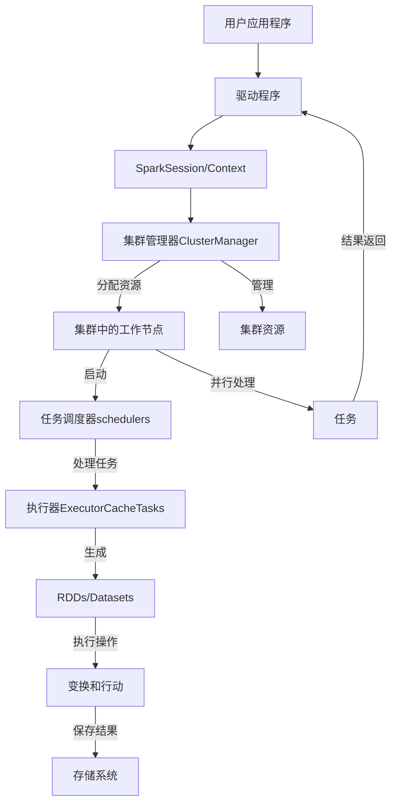

## Spark

* 分布式开源大数据框架
* in-memory caching，优化查询执行
* 支持Java，Scala，Python和R
* 实时分析，机器学习MLlib
* 交互式查询Spark SQL强大的一批
* 图计算Graph Processing
* 流计算Spark Streaming：集成AWS Kinesis，Apache Kafka，和AWS EMR
* 是为了 OLAP 而不是 OLTP



- Spark apps是以独立的进程运行在Cluster集群上的
- SparkContext通过ClusterManager工作
- 执行器Executors执行计算和存储
- SparkContext（内部任务调度scheduler）发送application代码和任务到执行器Executors

* 主流的包：
* Spark Streaming
* Spark SQL
* MLlib
* GraphX（已无）
* 他们在*Spark Core*之上工作：内存管理，灾难恢复，任务调度，分布和监控任务，和存储交互等核心任务，支持Scala，Java，Python，R语言

- *Spark Structured Streaming*，实质上是一个不断增涨的Dataset
- Spark中的Dataset可以看成是一个很大数据表，数据流进来等于stream，新的rows不断增加到表中
- 通过两行代码就可以处理将流数据导入关系型数据库，强大的
```scala
val inputDF = spark.readStream.json("s3://logs")
inputDF.groupBy($"actions", window($"time", "1hour")).count().writeStream.format("jdbc").start("jdbc:mysql//~")
```

## Hadoop 和 Spark

是两种用于处理大数据的分布式计算框架。它们各自有不同的设计目标、架构和应用场景。下面是它们的主要区别：

1. **核心组件和架构**

- **Hadoop:**
  - **存储**: Hadoop 使用 **Hadoop Distributed File System (HDFS)** 作为其主要的存储系统。HDFS 是一个分布式文件系统，专为大数据存储和处理而设计。
  - **处理**: Hadoop 的核心处理框架是 **MapReduce**，这是一种基于批处理的编程模型，用于处理和生成大数据集。

- **Spark:**
  - **存储**: Spark 可以与多种数据存储系统集成，包括 HDFS、Amazon S3、HBase、Cassandra 等，但本身不包含特定的存储系统。
  - **处理**: Spark 的核心是内存中计算引擎，支持多种处理模式，包括批处理、交互式查询、流处理、机器学习和图形计算。

2. **计算模型**

- **Hadoop:**
  - **批处理**: 采用 MapReduce 模型，适合处理需要全数据集扫描的批处理任务。每个 MapReduce 任务都从磁盘中读取数据并将中间结果写回磁盘，因此 I/O 操作较多，处理速度相对较慢。

- **Spark:**
  - **内存计算**: 使用 Resilient Distributed Datasets (RDDs) 和 DataFrames，通过在内存中存储中间结果来提高计算速度。Spark 可以进行多种类型的计算，包括批处理、流处理（Spark Streaming）、交互式查询（Spark SQL）、机器学习（MLlib）和图形计算（GraphX）。

3. **性能和效率**

- **Hadoop:**
  - **磁盘 I/O 频繁**: 每次 MapReduce 操作都涉及读写磁盘，导致延迟较高，尤其在多次迭代的计算中。

- **Spark:**
  - **内存优化**: Spark 将数据和中间结果保存在内存中，大幅减少磁盘 I/O，因而在需要快速数据处理和多次迭代计算的场景中比 Hadoop 快得多。

4. **易用性**

- **Hadoop:**
  - **编程模型复杂**: 编写 MapReduce 程序需要考虑多个步骤，通常需要更多的代码来实现复杂的逻辑。

- **Spark:**
  - **更高的抽象层次**: 提供了丰富的高级 API 和内置库，支持多种语言（如 Scala、Java、Python 和 R），易于编写和调试，更适合快速开发。

5. **应用场景**

- **Hadoop:**
  - **适用于大规模批处理任务**，如日志分析、索引生成和数据转换。
  - **擅长处理**大数据存储和管理任务**，通常用于需要可靠性和扩展性的离线处理。

- **Spark:**
  - **适用于需要快速响应的实时数据处理**，如流处理、实时分析和机器学习。
  - **支持多种数据处理需求**，适合在统一框架中处理不同类型的工作负载。

6. **生态系统和工具**

- **Hadoop:**
  - 拥有丰富的生态系统，包括 Pig、Hive、HBase、ZooKeeper 等工具，可以集成用于不同的数据处理任务。

- **Spark:**
  - 提供了集成工具和库，如 Spark SQL、Spark Streaming、MLlib 和 GraphX，支持多种数据处理和分析需求。

7. **兼容性和部署**

- **Hadoop:**
  - 通常运行在大型集群上，适合批处理和大规模存储。

- **Spark:**
  - 可以在 Hadoop YARN、Mesos、Kubernetes 等集群管理器上运行，灵活性更高，支持从小规模到大规模的部署。

8. 总结

| **特性**              | **Hadoop**                                   | **Spark**                                    |
|----------------------|----------------------------------------------|----------------------------------------------|
| **存储系统**          | HDFS                                         | 多种选择（HDFS、S3、Cassandra、HBase 等）    |
| **计算模式**          | 批处理                                       | 内存计算、批处理、流处理、交互式查询等      |
| **编程模型**          | MapReduce                                    | RDDs、DataFrames、Datasets                   |
| **性能**              | 磁盘 I/O 频繁，较慢                          | 内存中计算，快速                             |
| **易用性**            | 较复杂，代码量大                             | 高级 API，支持多语言，易用性强               |
| **应用场景**          | 离线批处理，日志分析                         | 实时分析，机器学习，流处理                   |
| **生态系统**          | Pig、Hive、HBase、ZooKeeper                  | Spark SQL、MLlib、GraphX、Spark Streaming    |
| **兼容性**            | YARN                                         | YARN、Mesos、Kubernetes                      |

Spark 通常被视为 Hadoop 的补充，而非完全替代。根据具体的需求和应用场景，选择合适的框架可以带来更好的性能和效率。
