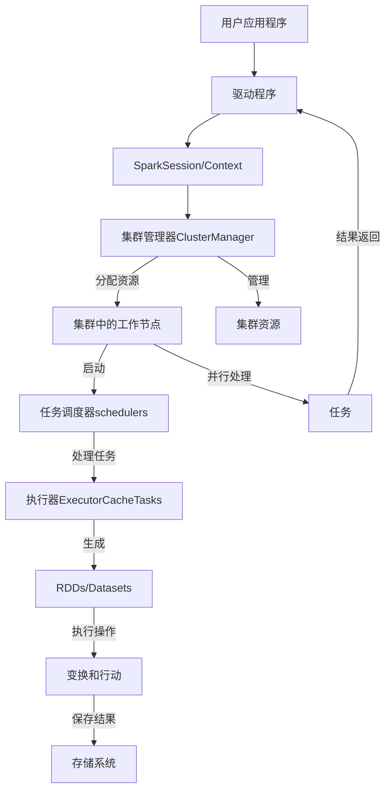

## Spark

* 分布式开源大数据框架
* in-memory caching，优化查询执行
* 支持Java，Scala，Python和R
* 实时分析，机器学习MLlib
* 交互式查询Spark SQL强大的一批
* 图计算Graph Processing
* 流计算Spark Streaming：集成AWS Kinesis，Apache Kafka，和AWS EMR
* 是为了 OLAP 而不是 OLTP



- Spark apps是以独立的进程运行在Cluster集群上的
- SparkContext通过ClusterManager工作
- 执行器Executors执行计算和存储
- SparkContext（内部任务调度scheduler）发送application代码和任务到执行器Executors

* 主流的包：
* Spark Streaming
* Spark SQL
* MLlib
* GraphX（已无）
* 他们在*Spark Core*之上工作：内存管理，灾难恢复，任务调度，分布和监控任务，和存储交互等核心任务，支持Scala，Java，Python，R语言

- *Spark Structured Streaming*，实质上是一个不断增涨的Dataset
- Spark中的Dataset可以看成是一个很大数据表，数据流进来等于stream，新的rows不断增加到表中
- 通过两行代码就可以处理将流数据导入关系型数据库，强大的
```scala
val inputDF = spark.readStream.json("s3://logs")
inputDF.groupBy($"actions", window($"time", "1hour")).count().writeStream.format("jdbc").start("jdbc:mysql//~")
```

## Hadoop 和 Spark

是两种用于处理大数据的分布式计算框架。它们各自有不同的设计目标、架构和应用场景。下面是它们的主要区别：

1. **核心组件和架构**

- **Hadoop:**
  - **存储**: Hadoop 使用 **Hadoop Distributed File System (HDFS)** 作为其主要的存储系统。HDFS 是一个分布式文件系统，专为大数据存储和处理而设计。
  - **处理**: Hadoop 的核心处理框架是 **MapReduce**，这是一种基于批处理的编程模型，用于处理和生成大数据集。

- **Spark:**
  - **存储**: Spark 可以与多种数据存储系统集成，包括 HDFS、Amazon S3、HBase、Cassandra 等，但本身不包含特定的存储系统。
  - **处理**: Spark 的核心是内存中计算引擎，支持多种处理模式，包括批处理、交互式查询、流处理、机器学习和图形计算。

2. **计算模型**

- **Hadoop:**
  - **批处理**: 采用 MapReduce 模型，适合处理需要全数据集扫描的批处理任务。每个 MapReduce 任务都从磁盘中读取数据并将中间结果写回磁盘，因此 I/O 操作较多，处理速度相对较慢。

- **Spark:**
  - **内存计算**: 使用 Resilient Distributed Datasets (RDDs) 和 DataFrames，通过在内存中存储中间结果来提高计算速度。Spark 可以进行多种类型的计算，包括批处理、流处理（Spark Streaming）、交互式查询（Spark SQL）、机器学习（MLlib）和图形计算（GraphX）。

3. **性能和效率**

- **Hadoop:**
  - **磁盘 I/O 频繁**: 每次 MapReduce 操作都涉及读写磁盘，导致延迟较高，尤其在多次迭代的计算中。

- **Spark:**
  - **内存优化**: Spark 将数据和中间结果保存在内存中，大幅减少磁盘 I/O，因而在需要快速数据处理和多次迭代计算的场景中比 Hadoop 快得多。

4. **易用性**

- **Hadoop:**
  - **编程模型复杂**: 编写 MapReduce 程序需要考虑多个步骤，通常需要更多的代码来实现复杂的逻辑。

- **Spark:**
  - **更高的抽象层次**: 提供了丰富的高级 API 和内置库，支持多种语言（如 Scala、Java、Python 和 R），易于编写和调试，更适合快速开发。

5. **应用场景**

- **Hadoop:**
  - **适用于大规模批处理任务**，如日志分析、索引生成和数据转换。
  - **擅长处理**大数据存储和管理任务**，通常用于需要可靠性和扩展性的离线处理。

- **Spark:**
  - **适用于需要快速响应的实时数据处理**，如流处理、实时分析和机器学习。
  - **支持多种数据处理需求**，适合在统一框架中处理不同类型的工作负载。

6. **生态系统和工具**

- **Hadoop:**
  - 拥有丰富的生态系统，包括 Pig、Hive、HBase、ZooKeeper 等工具，可以集成用于不同的数据处理任务。

- **Spark:**
  - 提供了集成工具和库，如 Spark SQL、Spark Streaming、MLlib 和 GraphX，支持多种数据处理和分析需求。

7. **兼容性和部署**

- **Hadoop:**
  - 通常运行在大型集群上，适合批处理和大规模存储。

- **Spark:**
  - 可以在 Hadoop YARN、Mesos、Kubernetes 等集群管理器上运行，灵活性更高，支持从小规模到大规模的部署。

8. 总结

| **特性**              | **Hadoop**                                   | **Spark**                                    |
|----------------------|----------------------------------------------|----------------------------------------------|
| **存储系统**          | HDFS                                         | 多种选择（HDFS、S3、Cassandra、HBase 等）    |
| **计算模式**          | 批处理                                       | 内存计算、批处理、流处理、交互式查询等      |
| **编程模型**          | MapReduce                                    | RDDs、DataFrames、Datasets                   |
| **性能**              | 磁盘 I/O 频繁，较慢                          | 内存中计算，快速                             |
| **易用性**            | 较复杂，代码量大                             | 高级 API，支持多语言，易用性强               |
| **应用场景**          | 离线批处理，日志分析                         | 实时分析，机器学习，流处理                   |
| **生态系统**          | Pig、Hive、HBase、ZooKeeper                  | Spark SQL、MLlib、GraphX、Spark Streaming    |
| **兼容性**            | YARN                                         | YARN、Mesos、Kubernetes                      |

Spark 通常被视为 Hadoop 的补充，而非完全替代。根据具体的需求和应用场景，选择合适的框架可以带来更好的性能和效率。

## Databricks

- 云中的环境（比如AWS）是通过创建**CloudFormation stack**来创建workspace的！会给你邮件发一个新的link作为云端环境的入口！cool，而你原本的community版本的环境还是可用的并且是用同样的账号登录。
- 当在Databricks中创建资源，我的理解是从**CloudFormation**创建changeset，然后创建新的资源！
- 推测，Databricks的前端界面放在docker等环境中，方便版本管理
- **Github集成**：通过add repo功能，实质上是在环境中进行repo的clone，从而连接到你的Github的repo！也可以在user setting中和你的Github账号建立连接！新创建的branch会和你的远程同步！
- 但是！Databricks的Notebook支持real-time同时编辑合作！cool

- **workflow**创建的就是有向无环图，连图形表示都和Airflow一样，深绿成功方块
- 使用CLI管理secrets，使用scope定义：put-secret，put-acl，delete-secret
  - 也可以使用*Azure Key Vault*存储，在UI就可以进行如此的scope和存储操作

- **SQLWarehouse**是一个计算引擎（snowflake的计算引擎也是warehouse），和Cluster一样，但是它只能运行markdown和sql！
  * *The best data warehouse is a lakehouse.*
- SQL执行的schedule可以设置每一分钟更新一次，这对于处理流数据很有用

- **Bamboolib**：是一个low code的EDA工具，内置于databricks了，实质是一个pandas的可视化版本
  - 就算是从catalog中load数据（是spark来load为sparkdf格式）也会转换为pandas df（toPandas）

- AI Assistant功能有点像vscode中的Github编码小助手

- Delta Lake provides the ACID guarantees of a Databricks lakehouse

- 在AWS中设置workspace通过*CloudFormation*创建环境
- 对流数据比如kafka的处理语法和一般的代码很像
- *delta*是一种数据格式
  * `describe history delta_table`
  * `select * from table version as of 0 limit 10` -- by version
  * `optimize table` -- merge small tables into large one, optimize way
  * `zorder by (col_name)` -- reorganize data in the storage to read fast
  * `vaccum table` -- clear up snapshots
- JDBC也是一种摄入数据的方式，需要下载jdbc driver上传到环境的library中，相当于安装了一个外部的包
- 和snowflake的交互也是通过创建option和认证信息的变量，然后呼出API进行交互
- 同一个notebook可以写不同的语言的代码python，scala，R，SQL，它是一个比朱庇特更强大的notebook
- dbfs文件系统就像是linux系统一样可以进行各种文件和目录操作，两种方法
  * `dbutils.fs.cp(path1, path2)`
  * `%fs cp path1, path2`
- SQL笔记本可以直接写SQL，可以直接对csv创建外部表，临时表
- Widget可以做为整个笔记本的动态变量来使用
- `%run`命令可以在一个notebook中run另一个notebook，被run的notebook中定义的`function`也可以使用了！

- DBFS的文件读取只能通过spark，而不能用pandas，之后可以通过转换变为pandasDF

- **在Databricks中创建的所有table都是delta格式的，创建的所有dataframe都首先是spark df格式的！**

**创建简单的ETL Pipeline**
- 创建一个笔记本，然后编写处理代码
- ETL data pipeline：Bronze -> Silver(staging,SQL) -> Gold(Bi/AI/ML)
- 从云Object存储载入`Bronze`数据：`AutoLoader`工具或者`COPY INTO`sql
  * `readstream`, `writestream`ingest的是json等各种格式的数据
  * 所谓的铜数据，就是未被处理的数据，经过处理后，进化为`Silver`数据，就可以被SQL查询，处理方式就是Spark的语法
- 将客户的csv等已经处理好的数据同样通过`AutoLoader`载入为银色数据
- 将银色数据进行数据结合等DM的处理后成为`Gold`数据，就可以用于后续的ML等操作
- 创建一个job，可选择的处理单位可以是笔记本，也可以是其他脚本，然后就有可视化的界面，进行job的增加和，schedule，notification等的设置

**关键词**：
- On Cloud
- Lakehouse：数据湖的优点是支持批和流的处理
- Unity Catalog
- Streaming
- Workflows
- Datawarehouse
- ML/Data Scientist
- Feature Engineering
- Spark
- dbfs system
- dbutils

**必读doc**

[官方文档GCP版](https://docs.gcp.databricks.com/en/index.html)

- 这整个文档似乎不大的样子，读读看
- 关于**data model**方面有几个考虑点很好：
  * 也是我的现在项目有考虑的，就是*事务处理的数据*的变更，是如何的，对其他数据的影响如何，是独立的吗
  * *主键和外键*的定义，在数据湖时代不是必须的，但是过去的传统数据库则经常必须
  * 虽然内部的查询优化器会尽量优化查询，但是有时候*join*太复杂了，会导致失败
  * 嵌套数据类型和半结构化数据类型的考量，储存在各种数据类型中：variant，json，structs，maps，arrays
- **Delta Live Tables** datasets are the *streaming tables*, *materialized views*, and views maintained as the results of declarative（陈述性） queries.
- A **pipeline** is the main unit used to configure and run data processing **workflows** with **Delta Live Tables**.
  * 处理管道中定义两个内容：一种是处理内容比如notebook和files等，一种是定义设置选项比如依赖关系和如何运行等。
- 关系：**Delta Live Tables** extends the functionality of **Delta Lake**.
- All Delta Live Tables *Python APIs* are implemented in the **dlt** module.
- Data Quality using **Expectations**
- Databricks recommends using Unity Catalog to manage access to all data.
- Model and feature serving endpoints.是API
- Job是CICD的基础单位
- Delta Live Table解决的问题：好的数据，Job管理，Query的前后依存关系

- **Unity Catalog**：
  - 它是一个数据和管理统筹的catalog服务，就像是Glue的Catalog，它内部不存储数据，只是管理数据，安全，认证，用户等，它会给你发token，最终还是要从object和数据库拿数据
  - 所以它可以连接外部的catalog，从而将外部和内部的catalog一起结合使用
  - metastore -> catalog -> schema
  - 在数据统筹上它有ACL trees以进行灵活的数据管理
  - Volumes用于存储非结构化数据（原本是dbfs）
  - Grant权限管理命令
  - 数据mask，在行和列上进行数据访问限制
  - 可以集成Terraform进行自动化部署
  - system.information_schema, system.operational_data, system.table_lineage

- **机器学习领域：**
- MLOps is a set of processes and automated steps for managing code, data, and models to improve performance, stability, and long-term efficiency of ML systems. It combines **DevOps, DataOps, and ModelOps**.
  * 使用Git进行版本管理
  * 将数据存储在lakehouse的构架中的Delta tables中
  * 使用MLflow管理模型，并用Unity Catalog管理模型的生命周期
- **Depployment Stage**：
  * Data Source：对于开发dev catalog科学家拥有read-write权限，对于生产prod catalog环境拥有read-only权限，并且可以通过snapshot将生成prod环境的数据
  * EDA：探索性数据分析，依赖可视化可迭代的分析环境，比如Notebook或者AutoML
  * Code：完整的代码管理环境和流程
  * Train Model：这是开发阶段，包括使用开发环境和生产环境的数据进行训练和微调，以及评估，*pipeline的输出*使用MLflow进行追踪。模型存储在MLflow Tracking server中，进行staging或者prod环境的pipeline的构筑。最终训练好的模型存储在*Unity Catalog*中。
  * Validate and deploy model：模型验证通过获得流水线中的URI获得模型地址，然后从UnityCatalog中载入模型（**模型通过UnityCatalog管理，但是模型地址的追踪还是要用MLflow**）进行验证和比较，冠军模型和挑战者模型通过比较进行更新，模型的发布，实质上就是看要不要替换冠军模型和挑战者模型。
  * Commit Code：最后可以Commit工作了，这是git的部分
- **Staging Stage**：
  * 这个stage的目的是为了测试，包括单元和集成测试，其CI/CD流程的输出是生产环境的部署
  * Data：这个阶段应该有自己的catalog，数据应该在stage catalog中
  * Merge Code：在PR中应该有自动化测试的代码集成（CI阶段），如果测试失败，则拒绝PR
  * Integration tests：CI阶段，集成测试将运行整个pipelines (including feature engineering, model training, inference, and monitoring)，如果ML应用是一个实时推理的项目，那么也要测试基础设置中的服务器，是否可以正常载入模型等
  * Merge to staging branch：如果代码通过了CI/CD集成测试，则会自动merge部署，反之则通知user或者在PR发布信息
  * Create a release branch：通过CI测试和代码dev - main的merge，创建发布用的分支（正是因为这样可以看到网上的各种版本控制），通过新版本分支的创建triggers the CI/CD system to update production jobs，比如是一个*用于推理的endpoint*
- **Production stage**：
  * 生产环境的pipeline主要将结果发布到下游的table和应用中，科学家拥有read-only权限观察model的结果和日志
  * 生产环境也和开发环境一样要对模型进行*training和validate*的过程最后发布，在评估过程中，如果有failed的模型，科学家可以在生产环境再次load模型进行调查和微调
  * 发布模型，对于实时预测，必须设置基础架构以将模型部署为 REST API 端点，可以使用 **Mosaic AI Model Serving** 创建和管理端点，这是他们收购的公司，部署的时候内部CI/CD系统会通过自动比较挑战者和冠军的性能，自动发布
  * 此外的步骤：模型服务，推理方式选择流还是批，lakehouse监控，以及重新training等
  * 这部分就比较像运维了
- **Feature Engineering**：
  * 每一个feature table必须有一个primary key，没的时候要自己加上去，虽然说是特征表，其实任何delta live table都可以是feature table
  * Feature Engineering in Unity Catalog or Workspace Feature Store


- **感受**：果然还是要学习官方文档最有感觉
  * Notebook应该是最应该学习的地方，包括初始化init脚本之类的，因为Notebook可以作为一个job的单位，这是一个最基本的元素
  * Workspace算是一个协作的集成环境，包括了Notebook，Job，Git等，可以分配集群资源管理，权限管理，编辑合作，流处理，机器学习等各种工作
  * Job创建出来，是用脚本，Notebook等组件作为Task，然后进行编排，这种编排是一种DAG
  * 数据工程中主要有data，compute，job等组件列在左边，他有自己的数据连接功能，直接可以开始进行代码运行，Job运行是DAG
  * 所以说它是一个结合体：*Glue的所有功能，Job编排，Airflow的编排，流处理，lakehouse，太强大了，它还有自己的file arrival事件驱动*
  * Job Sceduler也是管理Job在分布式系统中的代码管理的
  * Hive metastore是传统的元数据管理方式，但是Databricks更推崇自己的Unity Catalog
  * 基础的表格叫做Delta Live Table，我觉得这是一种更加适应streaming的方式
  * 机器学习中主要组件：
    - *Data(Unity Catalog)* -> *Feature Store* -> *Model training(AutoML/Notebook)* -> *Model Tracking(MLflow)* -> *Model Management(Unity Catalog/Workspace model registry)* -> *Production(Model Serving/Batch Inference)*
    - 监控和统筹：*Lakehouse Monitoring(Data quality metrics/Model quality metrics/Drift)*
  * 关于模型部署的思考，部署方式如果是LLM机器人，则是通过API直接部署即可，如果是模型作为函数，那使用UDF进行数据处理，然后流入数据库供应用端使用即可


### delta table 和 delta live table

在Databricks中，Delta Table和Delta Live Table是两种用于管理数据的表类型，但它们的用途和功能有所不同。以下是它们之间的主要区别：

### 1. **Delta Table:**
   - **定义**: Delta Table是基于Delta Lake格式的表，它是一种存储格式，支持ACID事务和数据版本管理。这种表允许对存储在Apache Parquet文件中的数据进行事务处理，并且能够进行增量加载和时间旅行。
   - **用途**: Delta Table主要用于传统的数据湖操作，用户可以通过Delta Table来实现数据的插入、更新、删除等操作，并利用其事务性和历史数据管理能力。
   - **创建方式**: 通过SQL、Python、Scala或R直接创建Delta Table。例如，可以使用`CREATE TABLE`语句创建Delta Table，或者通过转换现有的Parquet表为Delta Table。
   - **管理**: 需要用户手动管理表的版本控制、数据质量、数据更新等。

### 2. **Delta Live Table (DLT):**，像是MV或者流数据表！！！
   - 具体化されたビューを作成するための CREATE OR REFRESH LIVE TABLE 構文は*非推奨*です。 代わりに、 CREATE OR REFRESH MATERIALIZED VIEW.
   - **定义**: Delta Live Table是Databricks上管理数据流水线的服务，专门用于自动化数据工程工作流。DLT使用Delta Lake技术来确保数据的质量和一致性，同时简化了数据流水线的构建和管理。
   - **用途**: Delta Live Table更侧重于数据流水线的自动化管理。它不仅支持数据的增量加载和版本管理，还能自动处理数据的依赖关系、数据质量检查和数据刷新。DLT非常适合需要频繁更新或复杂数据处理的场景，例如ETL过程。
   - **创建方式**: 通过DLT管道定义DSL来定义表的逻辑，Databricks会自动管理表的创建和更新过程。用户定义的是表的逻辑和数据处理规则，系统会自动执行和维护。
   - **管理**: 自动化管理，DLT管道会自动处理数据的质量监控、数据刷新和更新等过程。

### 总结
- **Delta Table** 是更传统的数据表，用户手动管理数据及其版本控制。
- **Delta Live Table** 是为自动化数据流水线设计的，提供更高级的数据管理和处理能力，减少手动干预。

根据具体需求，可以选择使用Delta Table进行灵活的数据管理，或使用Delta Live Table来简化和自动化数据流水线。


## PySpark

在 Spark 的机器学习库 MLlib 中，`Local Vectors` 和 `LabeledPoint` 是用于表示和处理机器学习数据的两种基本数据结构。

### 1. **Local Vectors**

`Local Vectors` 是 MLlib 中用于表示数据点特征的向量。每个向量包含一组特征值，可以用来表示数据集中的一个实例。Spark 中有三种类型的 `Local Vectors`：

- **Dense Vectors（密集向量）**：所有的向量元素都存储在一个数组中，适合用于大部分元素都是非零值的情况。

  ```python
  from pyspark.ml.linalg import Vectors

  dense_vector = Vectors.dense([1.0, 0.0, 3.0])
  # dense_vector = [1.0, 0.0, 3.0]
  ```

- **Sparse Vectors（稀疏向量）**：仅存储非零值的索引和对应的值，适合用于大部分元素都是零值的情况。

  ```python
  from pyspark.ml.linalg import Vectors

  sparse_vector = Vectors.sparse(3, [0, 2], [1.0, 3.0])
  # sparse_vector = (size=3, indices=[0, 2], values=[1.0, 3.0])
  ```

- **Named Vectors**: 尽管 Spark MLlib 中没有原生的“Named Vectors”类型，有时你可以用字典或其他方式在特征向量中附加名字。

### 2. **LabeledPoint**

`LabeledPoint` 是 MLlib 中表示带标签的特征向量的一种数据结构，通常用于监督学习（例如分类和回归任务）。一个 `LabeledPoint` 包含两个部分：

- **标签 (label)**：表示特征向量所属的类别或目标变量的值（在分类任务中是类别，在回归任务中是数值）。

- **特征向量 (features)**：表示数据点的特征，通常以 `Local Vectors` 的形式表示。

假设你有一个分类问题，每个数据点由三个特征表示，并且有一个二元分类标签（0 或 1）。可以使用 `LabeledPoint` 来表示这样的数据点：

```python
from pyspark.mllib.linalg import Vectors
from pyspark.mllib.regression import LabeledPoint

# 创建一个密集向量
features = Vectors.dense([1.0, 0.5, 3.0])

# 创建一个标签为1的 LabeledPoint
labeled_point = LabeledPoint(1.0, features)

# labeled_point = (label=1.0, features=[1.0, 0.5, 3.0])
```

在 Spark 的监督学习任务中，数据集通常由许多 `LabeledPoint` 组成，每个 `LabeledPoint` 代表一个训练样本，包含其特征和对应的标签。

- **Local Vectors** 是用来表示特征的向量，可以是稠密或稀疏的。
- **LabeledPoint** 是带有标签的特征向量，用于监督学习任务。

通过使用这些数据结构，MLlib 可以有效地处理和训练大规模机器学习模型。

### 3. **Pipeline是什么**

在 PySpark 中，`Pipeline` 是用于构建和管理机器学习工作流的高层次 API。它帮助将数据预处理、特征提取、模型训练等步骤串联起来，以简化机器学习任务的执行和管理。

`Pipeline` 是一个由多个**阶段**（Stages）组成的有序序列，每个阶段可以是一个数据转换器（Transformer）或一个估计器（Estimator）。Pipeline 可以被看作是一个数据处理的流水线，数据按顺序通过各个阶段，逐步被转换、处理和预测。

- **Transformer**: 是一个可以将输入的 DataFrame 转换为另一个 DataFrame 的对象。常见的 transformer 包括 `StandardScaler`（标准化数据）、`StringIndexer`（将分类特征转换为数值）、`VectorAssembler`（将多个列组合成一个向量列）等。

- **Estimator**: 是一个可以在数据集上进行拟合（fit）并生成 transformer 的对象，通常是机器学习模型，如 `LogisticRegression`、`DecisionTreeClassifier` 等。

### 4. **Pipeline 的基本工作流程**

1. **创建数据预处理和模型对象**：首先创建一系列 transformers 和 estimators，对应机器学习任务的各个步骤。
2. **将步骤组合成 Pipeline**：使用 `Pipeline` 类将所有步骤组合成一个管道。
3. **拟合 Pipeline**：使用训练数据拟合整个 pipeline，pipeline 会按顺序执行各个步骤，并生成一个训练好的模型。
4. **预测或转换**：使用拟合后的 pipeline 进行预测或数据转换。

### 5. **Pipeline 示例**

以下是一个简单的示例，用于构建和使用 PySpark 的 Pipeline 来处理数据并训练一个机器学习模型。

我们有一个包含特征的 DataFrame，并且目标是预测某个分类标签。

```python
from pyspark.sql import SparkSession
from pyspark.ml import Pipeline
from pyspark.ml.feature import StringIndexer, VectorAssembler
from pyspark.ml.classification import LogisticRegression

# 创建 SparkSession
spark = SparkSession.builder.appName("PipelineExample").getOrCreate()

# 假设我们有一个包含特征的数据集
data = spark.createDataFrame([
    (0, "a", 1.0, 10.0),
    (1, "b", 2.0, 20.0),
    (2, "a", 3.0, 30.0),
    (3, "b", 4.0, 40.0)
], ["id", "category", "feature1", "feature2"])

# 步骤1: 将类别特征转换为数值
indexer = StringIndexer(inputCol="category", outputCol="categoryIndex")

# 步骤2: 将所有特征列组合成一个向量列
assembler = VectorAssembler(inputCols=["categoryIndex", "feature1", "feature2"], outputCol="features")

# 步骤3: 使用逻辑回归进行分类
lr = LogisticRegression(featuresCol="features", labelCol="id")

# 将所有步骤组合到 Pipeline 中
pipeline = Pipeline(stages=[indexer, assembler, lr])

# 拟合 pipeline
model = pipeline.fit(data)

# 使用 pipeline 对新数据进行预测
predictions = model.transform(data)

# 显示结果
predictions.select("id", "features", "prediction").show()
```

**代码解释**

- **StringIndexer**: 将类别特征 `category` 转换为数值索引 `categoryIndex`。这是一个 transformer。

- **VectorAssembler**: 将多个特征列（`categoryIndex`、`feature1`、`feature2`）组合成一个向量列 `features`，用于模型训练。也是一个 transformer。

- **LogisticRegression**: 使用逻辑回归模型对数据进行分类。它是一个 estimator，在 `fit` 时会生成一个模型（transformer）。

- **Pipeline**: 将 `indexer`、`assembler` 和 `lr` 三个阶段（stages）组合在一起。pipeline 是一个 estimator，调用 `fit` 时会按顺序执行每个阶段的操作。

- **model.transform(data)**: 对输入数据执行 transformer 操作，得到最终的预测结果。

### 6. **Pipeline 的优势**

- **简化工作流**：通过 pipeline，数据处理和模型训练的步骤可以被自然地组合在一起，形成一个可复用的工作流。
- **统一接口**：无论是数据预处理步骤还是机器学习模型，都有一致的 API 调用（fit 和 transform），提高了代码的可读性和维护性。
- **方便调参**：结合 Spark 的 `CrossValidator` 或 `TrainValidationSplit`，可以轻松对 pipeline 进行参数调优。

使用 PySpark 的 Pipeline，可以让你更有效地管理和执行复杂的机器学习工作流。

### 7. **Feature Extraction&Transformation技术**

在 PySpark 中，**Feature Extraction** 是从原始数据中提取有用的特征以供机器学习模型使用的过程。PySpark 提供了多种工具和技术来实现特征提取，主要针对文本数据、数值数据、类别数据等不同类型的输入数据。以下是一些常见的 Feature Extraction 技术及其使用方法。

#### 1. **Tokenizer 和 RegexTokenizer**
- **Tokenizer**: 将文本字符串分割为单词序列（tokens）。通常用于将一段文本转化为单独的词，之后可以用来构建特征。
- **RegexTokenizer**: 与 `Tokenizer` 类似，但允许使用正则表达式进行更复杂的文本分割。

```python
from pyspark.ml.feature import Tokenizer, RegexTokenizer
from pyspark.sql import SparkSession

# 创建 SparkSession
spark = SparkSession.builder.appName("TokenizerExample").getOrCreate()

# 示例数据
data = spark.createDataFrame([
    (0, "Hello, how are you?"),
    (1, "I'm doing fine, thank you!")
], ["id", "sentence"])

# 使用 Tokenizer
tokenizer = Tokenizer(inputCol="sentence", outputCol="words")
words_data = tokenizer.transform(data)

# 使用 RegexTokenizer
regex_tokenizer = RegexTokenizer(inputCol="sentence", outputCol="words", pattern="\\W")
regex_words_data = regex_tokenizer.transform(data)

words_data.show(truncate=False)
regex_words_data.show(truncate=False)
```

#### 2. **CountVectorizer**
- **CountVectorizer**: 是一种常用于文本数据的特征提取方法。它将一个文档（文本）转换为一个词汇表中每个词项的计数向量。结果向量的长度等于词汇表中词项的数量。

```python
from pyspark.ml.feature import CountVectorizer

# 示例数据
data = spark.createDataFrame([
    (0, ["spark", "is", "great"]),
    (1, ["pyspark", "is", "awesome"]),
    (2, ["spark", "and", "pyspark", "are", "powerful"])
], ["id", "words"])

# 使用 CountVectorizer
cv = CountVectorizer(inputCol="words", outputCol="features", vocabSize=5, minDF=1.0)
model = cv.fit(data)
vectorized_data = model.transform(data)

vectorized_data.show(truncate=False)
```

#### 3. **TF-IDF (Term Frequency-Inverse Document Frequency)**
- **TF-IDF** 是一种衡量一个词在文档集中的重要性的方法。TF 是词频，表示某个词在文档中出现的频率。IDF 是逆文档频率，衡量词在所有文档中的普遍性。TF-IDF 通过减少常见词的权重并增加罕见词的权重来提高特征质量。

```python
from pyspark.ml.feature import HashingTF, IDF

# 假设 words_data 是之前使用 Tokenizer 生成的 DataFrame
hashingTF = HashingTF(inputCol="words", outputCol="rawFeatures", numFeatures=20)
featurized_data = hashingTF.transform(words_data)

# 计算TF-IDF
idf = IDF(inputCol="rawFeatures", outputCol="features")
idf_model = idf.fit(featurized_data)
tfidf_data = idf_model.transform(featurized_data)

tfidf_data.select("id", "features").show(truncate=False)
```

#### 4. **Word2Vec**
- **Word2Vec**: 将文本中的词项转换为向量表示，它将每个词项表示为一个实数向量，捕捉了词与词之间的语义关系。这种方法对于自然语言处理（NLP）任务非常有用。

```python
from pyspark.ml.feature import Word2Vec

# 使用 Word2Vec
word2Vec = Word2Vec(vectorSize=3, inputCol="words", outputCol="features")
model = word2Vec.fit(data)
word2vec_data = model.transform(data)

word2vec_data.show(truncate=False)
```

#### 5. **PCA (Principal Component Analysis)**
- **PCA** 是一种降维技术，用于减少特征的数量，同时保留数据中的大部分信息。PCA 提取数据的主成分，从而减少维度但保留尽可能多的变异。

```python
from pyspark.ml.feature import PCA
from pyspark.ml.linalg import Vectors

# 示例数据
data = spark.createDataFrame([
    (0, Vectors.dense([1.0, 2.0, 3.0, 4.0, 5.0])),
    (1, Vectors.dense([6.0, 7.0, 8.0, 9.0, 10.0]))
], ["id", "features"])

# 使用 PCA
pca = PCA(k=2, inputCol="features", outputCol="pcaFeatures")
model = pca.fit(data)
pca_result = model.transform(data)

pca_result.show(truncate=False)
```

#### 6. **StringIndexer**
- **StringIndexer**: 将类别型数据（字符串形式）转换为数值型索引。它常用于处理分类特征，使得这些特征可以被 MLlib 模型接受。

```python
from pyspark.ml.feature import StringIndexer

# 示例数据
data = spark.createDataFrame([
    (0, "a"),
    (1, "b"),
    (2, "c"),
    (3, "a"),
    (4, "b"),
    (5, "c")
], ["id", "category"])

# 使用 StringIndexer
indexer = StringIndexer(inputCol="category", outputCol="categoryIndex")
indexed_data = indexer.fit(data).transform(data)

indexed_data.show(truncate=False)
```

#### 7. **OneHotEncoder**
- **OneHotEncoder**: 将类别型数据的数值索引转换为独热编码（one-hot encoded）向量。这种表示方式适用于大多数分类机器学习模型。

```python
from pyspark.ml.feature import OneHotEncoder

# 假设 indexed_data 是使用 StringIndexer 生成的数据
encoder = OneHotEncoder(inputCol="categoryIndex", outputCol="categoryVec")
encoded_data = encoder.fit(indexed_data).transform(indexed_data)

encoded_data.show(truncate=False)
```

#### 8. **VectorAssembler**
- **VectorAssembler**: 将多个特征列组合成单一的向量列。通常用于将原始特征、转化特征、和其它数值特征合并为一个特征向量列，以便于输入到机器学习模型中。

```python
from pyspark.ml.feature import VectorAssembler

# 示例数据
data = spark.createDataFrame([
    (0, 1.0, 0.1, 3.0),
    (1, 2.0, 0.2, 6.0),
    (2, 3.0, 0.3, 9.0)
], ["id", "feature1", "feature2", "feature3"])

# 使用 VectorAssembler
assembler = VectorAssembler(inputCols=["feature1", "feature2", "feature3"], outputCol="features")
assembled_data = assembler.transform(data)

assembled_data.show(truncate=False)
```

PySpark 提供了多种特征提取工具来处理不同类型的数据，包括文本、数值和类别数据。这些工具可以帮助你将原始数据转化为适合机器学习模型的数值向量，从而提高模型的表现力和准确性。通过结合使用这些特征提取技术，你可以构建更复杂和有效的机器学习管道。

### 8. **Improve Model**

可能改进我们代码的模型评估指标的方法：

**特征工程**：

- 探索其他文本预处理技术，如词干提取和停用词删除，以提高标记词的质量。
- numFeatures尝试使用转换中参数的不同值HashingTF来查看不同数量的特征是否能产生更好的结果。

**超参数调整**：

- 继续调整我们之前讨论过的逻辑回归分类器中的超参数，例如maxIter、regParam和elasticNetParam，以找到适合我们特定数据集的最佳组合。
- 考虑在网格搜索期间使用更大范围的超参数值，以确保全面搜索最佳设置。

**集成方法**：

- 探索随机森林或梯度提升等集成方法，以组合多种模型，从而获得更好的预测性能。

**文本矢量化方法**：

- 尝试不同的文本矢量化技术（如Word2Vec或），TF-IDF看看n-grams它们是否为文本数据提供更好的表示。

**平衡数据集**：

- 检查数据集在类别分布方面是否不平衡。如果是这样，请考虑使用过采样或欠采样等技术来平衡数据集，这可能会提高精度和召回率等指标。

**先进的评估技术**：

- 考虑使用更先进的评估技术，例如 ROC 曲线、精确召回曲线和分层交叉验证，以更深入地了解模型性能。

**增加数据**：

- 如果可用，请考虑合并可以增强模型预测能力的其他数据源或功能。

**错误分析**：

- 进行详细的错误分析，了解模型所犯的错误类型。这可以指导进一步的改进。

**模型选择**：

- 尝试使用逻辑回归以外的不同分类算法，看看其他模型是否在我们的数据集上表现更好。尝试决策树、支持向量机或神经网络。

**正则化强度**：

- regParam根据观察到的模型性能，调整正则化强度（例如）以减少过度拟合或欠拟合。

### 9. **Performance Optimization**

当然！在PySpark中，提升性能的关键点包括分区优化、广播变量使用和DataFrame操作优化。下面是每个方面的详细讲解：

#### 1. **分区（Partitioning）**

- **合理设置分区数**：分区数过少可能导致单个分区的数据过大，进而导致内存溢出；分区数过多则可能引入过多的任务调度开销。一般来说，目标是使每个分区的大小适中，通常每个分区的大小在128MB到256MB之间。
- **使用`repartition()`和`coalesce()`**：`repartition()`可以增加或减少分区数并重新分配数据，适用于需要增加分区的场景；`coalesce()`适用于减少分区数，通常用于合并小分区，以减少计算开销。

  ```python
  df = df.repartition(200)  # 增加分区数
  df = df.coalesce(50)      # 减少分区数
  ```

- **合理选择分区键**：对数据进行分区时，选择合适的分区键可以有效地减少数据倾斜。例如，分区键应该具有足够的唯一性和均匀分布，以避免部分分区的数据量过大。

#### 2. **广播变量（Broadcast Variables）**

- **广播变量的作用**：广播变量用于将小数据集复制到每个节点的内存中，以避免在每个任务中都传输数据。适用于小的查找表或配置数据。read-only!

  ```python
  from pyspark.sql import SparkSession
  from pyspark.sql.functions import broadcast

  spark = SparkSession.builder.appName("example").getOrCreate()
  large_df = spark.read.csv("large_data.csv")
  small_df = spark.read.csv("small_data.csv")

  # 广播小表
  broadcasted_small_df = broadcast(small_df)

  joined_df = large_df.join(broadcasted_small_df, "key")
  ```

- **避免广播大数据**：仅应将小的数据集广播到所有节点。广播大数据集会导致内存压力，反而影响性能。

#### 3. **DataFrame操作优化（Optimizing DataFrame Operations）**

- **避免使用`collect()`和`toPandas()`**：这两个操作将数据从集群中收集到驱动程序上，这会引发网络传输和内存问题。尽量使用分布式操作来处理数据。

  ```python
  # 不推荐
  df.collect()
  df.toPandas()

  # 推荐
  df.show()
  ```

- **使用`filter()`代替`select()`**：在进行数据筛选时，尽量使用`filter()`在早期阶段减少数据量，以提高处理效率。

  ```python
  # 先过滤再选择
  df_filtered = df.filter(df["age"] > 30).select("name", "age")
  ```

- **避免宽依赖（Wide Dependencies）**：宽依赖通常涉及到shuffle操作，如`groupBy()`和`join()`。在可能的情况下，减少宽依赖的操作，或通过预先进行小范围的筛选来减少shuffle的开销。

- **利用DataFrame API的优化**：PySpark的DataFrame API内部包含许多优化策略，如列裁剪、谓词下推等。尽量使用DataFrame API而非RDD操作，因为DataFrame API通常能更好地利用Catalyst优化器进行查询优化。

- **使用`cache()`和`persist()`**：对于经常被重用的数据集，可以使用`cache()`或`persist()`将数据缓存在内存中，减少重复计算的开销。

  ```python
  df_cached = df.cache()
  ```

- **启用`spark.sql.shuffle.partitions`**：调整`spark.sql.shuffle.partitions`的值可以影响shuffle操作的分区数，从而影响性能。根据数据规模和集群配置调整这个值可以提高性能。

  ```python
  spark.conf.set("spark.sql.shuffle.partitions", "200")
  ```
#### 4. **Accumulator**

（累加器）是一种用于在任务之间汇总信息的工具，主要用于在分布式计算过程中进行统计或计数。累加器的常见用途包括统计错误、计数操作以及汇总中间结果等。

### **Accumulator的特点**

1. **只读变量**：累加器在任务执行过程中只会增加，不会减少。它们只能由驱动程序读取，但不能由任务进行修改。这保证了累加器的值在分布式计算中的一致性和准确性。

2. **跨任务共享**：累加器的值在所有工作节点间共享。任务可以对累加器进行累加，但不能进行其他类型的操作。

3. **支持不同的数据类型**：PySpark提供了对`long`类型的累加器支持，同时自定义累加器可以用于复杂的数据类型（如集合、列表等）。

**如何使用Accumulator**

以下是使用PySpark累加器的基本步骤：

1. **创建累加器**

在Spark中，累加器通过`SparkContext`创建。Spark内置支持`LongAccumulator`和`DoubleAccumulator`，也可以自定义累加器。

```python
from pyspark import SparkContext

sc = SparkContext(appName="AccumulatorExample")

# 创建一个Long累加器
accumulator = sc.accumulator(0)
```

2. **在任务中使用累加器**

在RDD的转换操作（如`map`或`foreach`）中使用累加器。例如，可以在`foreach`操作中增加累加器的值。

```python
def process_partitions(x):
    global accumulator
    accumulator.add(1)

rdd = sc.parallelize([1, 2, 3, 4, 5])
rdd.foreach(process_partitions)

print("Accumulated value: ", accumulator.value)
```

3. **使用自定义累加器**

自定义累加器需要继承`AccumulatorParam`类，定义累加器的行为。

```python
from pyspark import AccumulatorParam

class ListAccumulatorParam(AccumulatorParam):
    def zero(self, value):
        return []

    def addInPlace(self, acc1, acc2):
        return acc1 + acc2

list_accumulator = sc.accumulator([], ListAccumulatorParam())

def add_to_list(x):
    list_accumulator.add([x])

rdd = sc.parallelize([1, 2, 3])
rdd.foreach(add_to_list)

print("Accumulated list: ", list_accumulator.value)
```

- **累加器的更新可能不会立即反映在驱动程序中**：如果某些任务未成功执行或失败，累加器的值可能不准确。因此，累加器主要用于调试和日志记录，而不是业务逻辑。

- **累加器的设计限制**：累加器不应被用于驱动程序之外的逻辑，因为任务的执行顺序和重复执行可能会导致累加器的值不一致。

- **在转换操作中**：如果累加器用于转换操作，注意累加器的值可能不会在所有操作中得到更新。因此，在行动操作（如`count`、`collect`）之后读取累加器的值。

使用累加器可以帮助在分布式计算中进行简单的汇总和统计，但需要注意其局限性和在任务执行中的行为。

通过以上方法，可以显著提高PySpark作业的性能，减少计算时间和资源消耗。根据具体的工作负载和数据特性，选择合适的优化策略。

## 概念总结

Apache Spark、PySpark 和 Databricks 之间存在紧密的关系，它们都是用于处理大规模数据的技术工具，但它们在生态系统中的角色和功能有所不同。

### 1. **Apache Spark**
Apache Spark 是一个开源的分布式计算引擎，设计用于快速处理大规模数据集。它支持批处理、流处理、SQL查询、机器学习和图计算等多种任务。Spark 可以在多种计算资源上运行，包括独立集群、Hadoop YARN、Apache Mesos 以及 Kubernetes。

Spark 的主要特点包括：
- **内存计算**：将数据集保存在内存中进行处理，极大提高了处理速度。
- **多样性**：支持多种数据处理模型，包括批处理和流处理。
- **容错性**：通过数据重算（RDDs和DAGs），保证任务在失败后能够重新执行。

### 2. **PySpark**
PySpark 是 Spark 的 Python API，它允许开发者使用 Python 编写 Spark 程序。PySpark 提供了与 Spark 原生 Scala API 类似的功能，使得 Python 用户可以利用 Spark 强大的分布式计算能力。

PySpark 的主要特点包括：
- **Python 集成**：让 Python 开发者能够使用熟悉的语言和工具（如 Pandas 和 NumPy）来操作大规模数据。
- **简化开发**：提供了高级 API，使得编写复杂的分布式程序更加简单和直观。
- **跨平台**：与 Spark 的其他 API（如 Scala 和 Java）无缝集成。

### 3. **Databricks**
Databricks 是一个基于云的企业级数据平台，最初由 Apache Spark 的创始团队创建。它在云环境中托管 Spark，并提供了一个易于使用的集成开发环境（IDE），结合了大规模数据处理、机器学习和数据分析的功能。Databricks 提供了丰富的工具和集成，帮助企业在云上快速部署和管理 Spark 应用程序。

Databricks 的主要特点包括：
- **托管服务**：在云端提供完全托管的 Spark 环境，简化了集群管理和扩展。
- **可扩展性**：轻松处理从小型到超大规模的数据集。
- **协作平台**：提供了笔记本界面，支持团队之间的协作与实时共享。
- **深度集成**：与各种数据源、工具和服务（如 AWS、Azure、Kafka、Delta Lake）无缝集成。

### 4. **共通使用的包**
以下是 Spark、PySpark 和 Databricks 中常用的一些库和工具包：

- **pyspark**: PySpark 提供的核心库，允许使用 Python 来操作 Spark。

- **spark-sql**: 提供了 SQL 接口，用于查询结构化数据。

- **MLlib**: Spark 的机器学习库，支持各种常见的机器学习算法。

- **Delta Lake**: Databricks 提供的开源存储层，构建在 Spark 之上，提供了 ACID 事务、可扩展元数据处理和时间旅行等功能。可以在 Databricks 和其他 Spark 环境中使用。

- **koalas**: 由 Databricks 提供的库，使得 Pandas API 在 Spark 上运行成为可能，允许使用 Pandas 语法来处理大规模数据。

- **mlflow**: 另一个由 Databricks 开发的开源平台，用于管理机器学习生命周期，包括实验跟踪、模型部署和注册。

- **matplotlib** 和 **seaborn**: PySpark 中常用的 Python 可视化库。

通过这些工具和包，Spark、PySpark 和 Databricks 为处理大规模数据提供了一个强大而灵活的生态系统，帮助用户快速开发、测试和部署数据驱动的应用程序。
