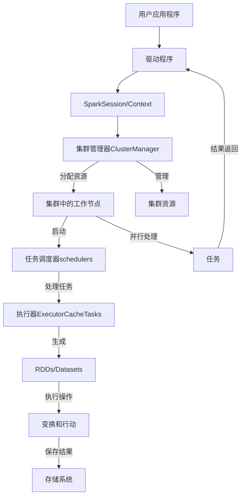
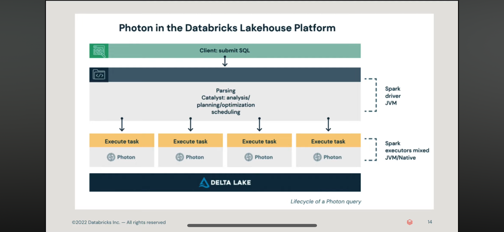
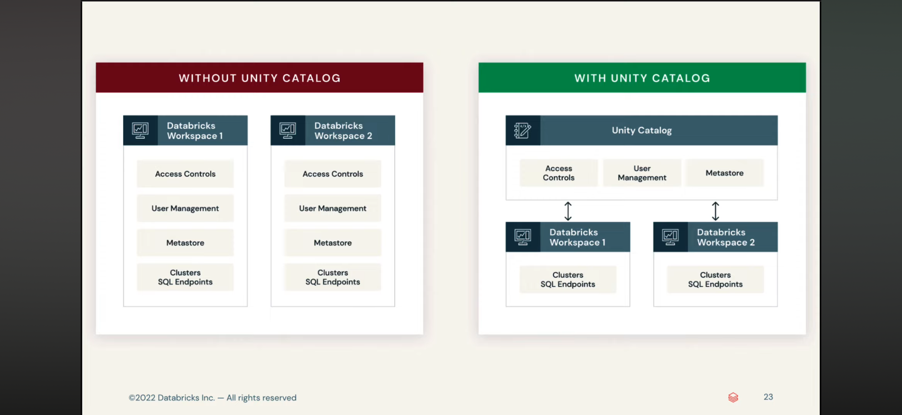
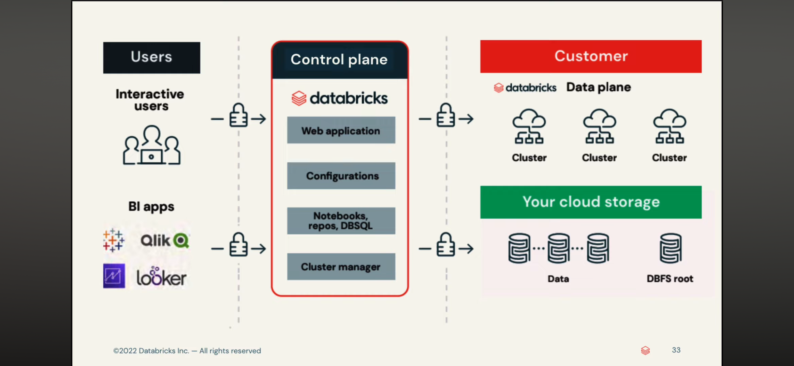
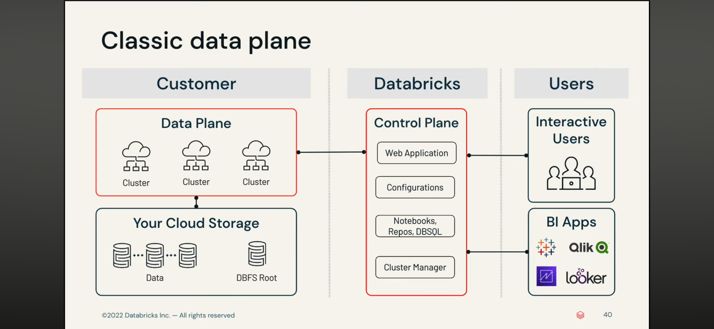
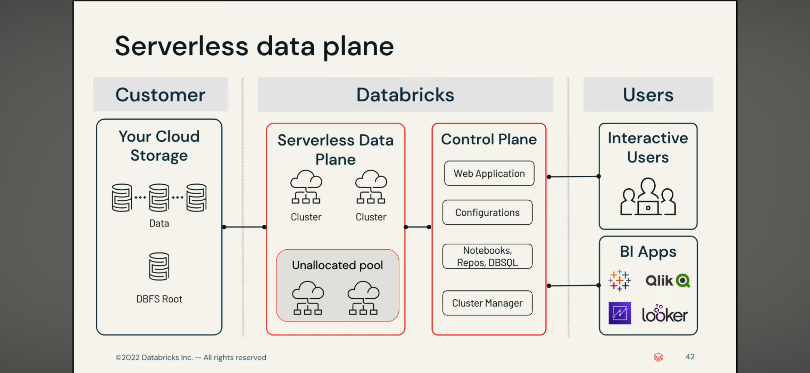
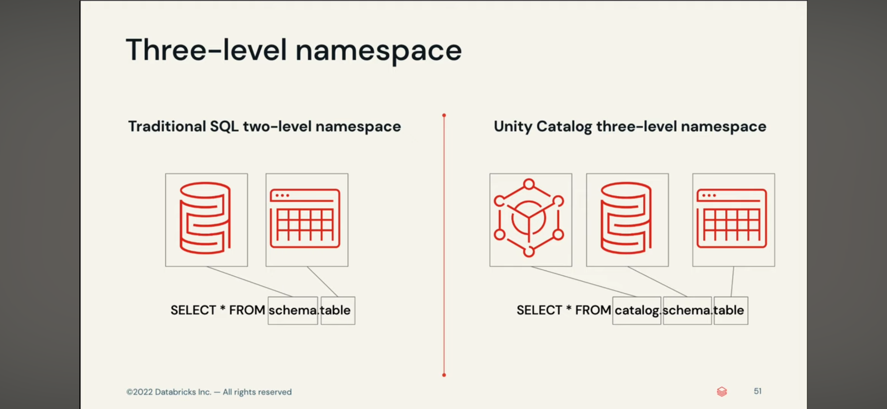
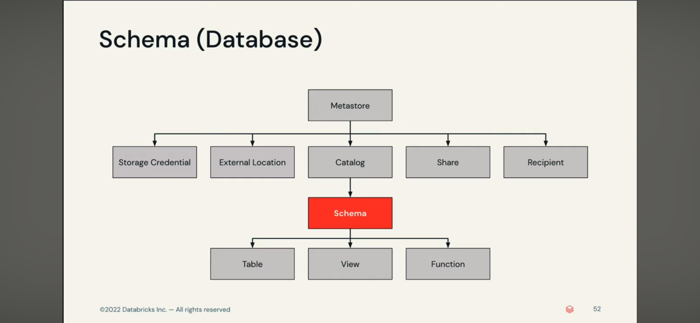

## Spark

* 分布式开源大数据框架
* in-memory caching，优化查询执行
* 支持Java，Scala，Python和R
* 实时分析，机器学习MLlib
* 交互式查询Spark SQL强大的一批
* 图计算Graph Processing
* 流计算Spark Streaming：集成AWS Kinesis，Apache Kafka，和AWS EMR
* 是为了 OLAP 而不是 OLTP



- Spark apps是以独立的进程运行在Cluster集群上的
- SparkContext通过ClusterManager工作
- 执行器Executors执行计算和存储
- SparkContext（内部任务调度scheduler）发送application代码和任务到执行器Executors

* 主流的包：
* Spark Streaming
* Spark SQL
* MLlib
* GraphX（已无）
* 他们在*Spark Core*之上工作：内存管理，灾难恢复，任务调度，分布和监控任务，和存储交互等核心任务，支持Scala，Java，Python，R语言

- *Spark Structured Streaming*，实质上是一个不断增涨的Dataset
- Spark中的Dataset可以看成是一个很大数据表，数据流进来等于stream，新的rows不断增加到表中
- 通过两行代码就可以处理将流数据导入关系型数据库，强大的
```scala
val inputDF = spark.readStream.json("s3://logs")
inputDF.groupBy($"actions", window($"time", "1hour")).count().writeStream.format("jdbc").start("jdbc:mysql//~")
```

## Hadoop 和 Spark

是两种用于处理大数据的分布式计算框架。它们各自有不同的设计目标、架构和应用场景。下面是它们的主要区别：

1. **核心组件和架构**

- **Hadoop:**
  - **存储**: Hadoop 使用 **Hadoop Distributed File System (HDFS)** 作为其主要的存储系统。HDFS 是一个分布式文件系统，专为大数据存储和处理而设计。
  - **处理**: Hadoop 的核心处理框架是 **MapReduce**，这是一种基于批处理的编程模型，用于处理和生成大数据集。

- **Spark:**
  - **存储**: Spark 可以与多种数据存储系统集成，包括 HDFS、Amazon S3、HBase、Cassandra 等，但本身不包含特定的存储系统。
  - **处理**: Spark 的核心是内存中计算引擎，支持多种处理模式，包括批处理、交互式查询、流处理、机器学习和图形计算。

2. **计算模型**

- **Hadoop:**
  - **批处理**: 采用 MapReduce 模型，适合处理需要全数据集扫描的批处理任务。每个 MapReduce 任务都从磁盘中读取数据并将中间结果写回磁盘，因此 I/O 操作较多，处理速度相对较慢。

- **Spark:**
  - **内存计算**: 使用 Resilient Distributed Datasets (RDDs) 和 DataFrames，通过在内存中存储中间结果来提高计算速度。Spark 可以进行多种类型的计算，包括批处理、流处理（Spark Streaming）、交互式查询（Spark SQL）、机器学习（MLlib）和图形计算（GraphX）。

3. **性能和效率**

- **Hadoop:**
  - **磁盘 I/O 频繁**: 每次 MapReduce 操作都涉及读写磁盘，导致延迟较高，尤其在多次迭代的计算中。

- **Spark:**
  - **内存优化**: Spark 将数据和中间结果保存在内存中，大幅减少磁盘 I/O，因而在需要快速数据处理和多次迭代计算的场景中比 Hadoop 快得多。

4. **易用性**

- **Hadoop:**
  - **编程模型复杂**: 编写 MapReduce 程序需要考虑多个步骤，通常需要更多的代码来实现复杂的逻辑。

- **Spark:**
  - **更高的抽象层次**: 提供了丰富的高级 API 和内置库，支持多种语言（如 Scala、Java、Python 和 R），易于编写和调试，更适合快速开发。

5. **应用场景**

- **Hadoop:**
  - **适用于大规模批处理任务**，如日志分析、索引生成和数据转换。
  - **擅长处理**大数据存储和管理任务**，通常用于需要可靠性和扩展性的离线处理。

- **Spark:**
  - **适用于需要快速响应的实时数据处理**，如流处理、实时分析和机器学习。
  - **支持多种数据处理需求**，适合在统一框架中处理不同类型的工作负载。

6. **生态系统和工具**

- **Hadoop:**
  - 拥有丰富的生态系统，包括 Pig、Hive、HBase、ZooKeeper 等工具，可以集成用于不同的数据处理任务。

- **Spark:**
  - 提供了集成工具和库，如 Spark SQL、Spark Streaming、MLlib 和 GraphX，支持多种数据处理和分析需求。

7. **兼容性和部署**

- **Hadoop:**
  - 通常运行在大型集群上，适合批处理和大规模存储。

- **Spark:**
  - 可以在 Hadoop YARN、Mesos、Kubernetes 等集群管理器上运行，灵活性更高，支持从小规模到大规模的部署。

8. 总结

| **特性**              | **Hadoop**                                   | **Spark**                                    |
|----------------------|----------------------------------------------|----------------------------------------------|
| **存储系统**          | HDFS                                         | 多种选择（HDFS、S3、Cassandra、HBase 等）    |
| **计算模式**          | 批处理                                       | 内存计算、批处理、流处理、交互式查询等      |
| **编程模型**          | MapReduce                                    | RDDs、DataFrames、Datasets                   |
| **性能**              | 磁盘 I/O 频繁，较慢                          | 内存中计算，快速                             |
| **易用性**            | 较复杂，代码量大                             | 高级 API，支持多语言，易用性强               |
| **应用场景**          | 离线批处理，日志分析                         | 实时分析，机器学习，流处理                   |
| **生态系统**          | Pig、Hive、HBase、ZooKeeper                  | Spark SQL、MLlib、GraphX、Spark Streaming    |
| **兼容性**            | YARN                                         | YARN、Mesos、Kubernetes                      |

Spark 通常被视为 Hadoop 的补充，而非完全替代。根据具体的需求和应用场景，选择合适的框架可以带来更好的性能和效率。

## Databricks memo

- Delta Lake provides the ACID guarantees of a Databricks lakehouse

- 在AWS中设置workspace通过*CloudFormation*创建环境
- 对流数据比如kafka的处理语法和一般的代码很像
- *delta*是一种数据格式
- JDBC也是一种摄入数据的方式，需要下载jdbc driver上传到环境的library中，相当于安装了一个外部的包
- 和snowflake的交互也是通过创建option和认证信息的变量，然后呼出API进行交互

**创建简单的ETL Pipeline**
- 创建一个笔记本，然后编写处理代码
- ETL data pipeline：Bronze -> Silver(staging,SQL) -> Gold(Bi/AI/ML)
- 从云Object存储载入`Bronze`数据：`AutoLoader`工具或者`COPY INTO`sql
  * `readstream`, `writestream`ingest的是json等各种格式的数据
  * 所谓的铜数据，就是未被处理的数据，经过处理后，进化为`Silver`数据，就可以被SQL查询，处理方式就是Spark的语法
- 将客户的csv等已经处理好的数据同样通过`AutoLoader`载入为银色数据
- 将银色数据进行数据结合等DM的处理后成为`Gold`数据，就可以用于后续的ML等操作
- 创建一个job，可选择的处理单位可以是笔记本，也可以是其他脚本，然后就有可视化的界面，进行job的增加和，schedule，notification等的设置

## 必读doc

[官方文档GCP版](https://docs.gcp.databricks.com/en/index.html)

- 这整个文档似乎不大的样子，读读看
- 关于**data model**方面有几个考虑点很好：
  * 也是我的现在项目有考虑的，就是*事务处理的数据*的变更，是如何的，对其他数据的影响如何，是独立的吗
  * *主键和外键*的定义，在数据湖时代不是必须的，但是过去的传统数据库则经常必须
  * 虽然内部的查询优化器会尽量优化查询，但是有时候*join*太复杂了，会导致失败
  * 嵌套数据类型和半结构化数据类型的考量，储存在各种数据类型中：variant，json，structs，maps，arrays
- **Delta Live Tables** datasets are the *streaming tables*, *materialized views*, and views maintained as the results of declarative（陈述性） queries.
- A **pipeline** is the main unit used to configure and run data processing **workflows** with **Delta Live Tables**.
  * 处理管道中定义两个内容：一种是处理内容比如notebook和files等，一种是定义设置选项比如依赖关系和如何运行等。
- 关系：**Delta Live Tables** extends the functionality of **Delta Lake**.
- All Delta Live Tables *Python APIs* are implemented in the **dlt** module.
- Data Quality using **Expectations**
- Databricks recommends using Unity Catalog to manage access to all data.
- Model and feature serving endpoints.是API
- Job是CICD的基础单位
- Delta Live Table解决的问题：好的数据，Job管理，Query的前后依存关系

- **Unity Catalog**：
  - 它是一个数据和管理统筹的catalog服务，就像是Glue的Catalog，它内部不存储数据，只是管理数据，安全，认证，用户等，它会给你发tokken，最终还是要从object和数据库拿数据
  - 所以它可以连接外部的catalog，从而将外部和内部的catalog一起结合使用
  - metastore -> catalog -> schema
  - 在数据统筹上它有ACL trees以进行灵活的数据管理
  - Volumes用于存储非结构化数据（原本是dbfs）
  - Grant权限管理命令
  - 数据mask，在行和列上进行数据访问限制
  - 可以集成Terraform进行自动化部署
  - system.information_schema, system.operational_data, system.table_lineage

- **机器学习领域：**
- MLOps is a set of processes and automated steps for managing code, data, and models to improve performance, stability, and long-term efficiency of ML systems. It combines **DevOps, DataOps, and ModelOps**.
  * 使用Git进行版本管理
  * 将数据存储在lakehouse的构架中的Delta tables中
  * 使用MLflow管理模型，并用Unity Catalog管理模型的生命周期
- **Depployment Stage**：
  * Data Source：对于开发dev catalog科学家拥有read-write权限，对于生产prod catalog环境拥有read-only权限，并且可以通过snapshot将生成prod环境的数据
  * EDA：探索性数据分析，依赖可视化可迭代的分析环境，比如Notebook或者AutoML
  * Code：完整的代码管理环境和流程
  * Train Model：这是开发阶段，包括使用开发环境和生产环境的数据进行训练和微调，以及评估，*pipeline的输出*使用MLflow进行追踪。模型存储在MLflow Tracking server中，进行staging或者prod环境的pipeline的构筑。最终训练好的模型存储在*Unity Catalog*中。
  * Validate and deploy model：模型验证通过获得流水线中的URI获得模型地址，然后从UnityCatalog中载入模型（**模型通过UnityCatalog管理，但是模型地址的追踪还是要用MLflow**）进行验证和比较，冠军模型和挑战者模型通过比较进行更新，模型的发布，实质上就是看要不要替换冠军模型和挑战者模型。
  * Commit Code：最后可以Commit工作了，这是git的部分
- **Staging Stage**：
  * 这个stage的目的是为了测试，包括单元和集成测试，其CI/CD流程的输出是生产环境的部署
  * Data：这个阶段应该有自己的catalog，数据应该在stage catalog中
  * Merge Code：在PR中应该有自动化测试的代码集成（CI阶段），如果测试失败，则拒绝PR
  * Integration tests：CI阶段，集成测试将运行整个pipelines (including feature engineering, model training, inference, and monitoring)，如果ML应用是一个实时推理的项目，那么也要测试基础设置中的服务器，是否可以正常载入模型等
  * Merge to staging branch：如果代码通过了CI/CD集成测试，则会自动merge部署，反之则通知user或者在PR发布信息
  * Create a release branch：通过CI测试和代码dev - main的merge，创建发布用的分支（正是因为这样可以看到网上的各种版本控制），通过新版本分支的创建triggers the CI/CD system to update production jobs，比如是一个*用于推理的endpoint*
- **Production stage**：
  * 生产环境的pipeline主要将结果发布到下游的table和应用中，科学家拥有read-only权限观察model的结果和日志
  * 生产环境也和开发环境一样要对模型进行*training和validate*的过程最后发布，在评估过程中，如果有failed的模型，科学家可以在生产环境再次load模型进行调查和微调
  * 发布模型，对于实时预测，必须设置基础架构以将模型部署为 REST API 端点，可以使用 **Mosaic AI Model Serving** 创建和管理端点，这是他们收购的公司，部署的时候内部CI/CD系统会通过自动比较挑战者和冠军的性能，自动发布
  * 此外的步骤：模型服务，推理方式选择流还是批，lakehouse监控，以及重新training等
  * 这部分就比较像运维了
- **Feature Engineering**：
  * 每一个feature table必须有一个primary key，没的时候要自己加上去，虽然说是特征表，其实任何delta live table都可以是feature table
  * Feature Engineering in Unity Catalog or Workspace Feature Store


- **感受**：果然还是要学习官方文档最有感觉
  * Notebook应该是最应该学习的地方，包括初始化init脚本之类的，因为Notebook可以作为一个job的单位，这是一个最基本的元素
  * Workspace算是一个协作的集成环境，包括了Notebook，Job，Git等，可以分配集群资源管理，权限管理，编辑合作，流处理，机器学习等各种工作
  * Job创建出来，是用脚本，Notebook等组件作为Task，然后进行编排，这种编排是一种DAG
  * 数据工程中主要有data，compute，job等组件列在左边，他有自己的数据连接功能，直接可以开始进行代码运行，Job运行是DAG
  * 所以说它是一个结合体：*Glue的所有功能，Job编排，Airflow的编排，流处理，lakehouse，太强大了，它还有自己的file arrival事件驱动*
  * Job Sceduler也是管理Job在分布式系统中的代码管理的
  * Hive metastore是传统的元数据管理方式，但是Databricks更推崇自己的Unity Catalog
  * 基础的表格叫做Delta Live Table，我觉得这是一种更加适应streaming的方式
  * 机器学习中主要组件：
    - *Data(Unity Catalog)* -> *Feature Store* -> *Model training(AutoML/Notebook)* -> *Model Tracking(MLflow)* -> *Model Management(Unity Catalog/Workspace model registry)* -> *Production(Model Serving/Batch Inference)*
    - 监控和统筹：*Lakehouse Monitoring(Data quality metrics/Model quality metrics/Drift)*
  * 关于模型部署的思考，部署方式如果是LLM机器人，则是通过API直接部署即可，如果是模型作为函数，那使用UDF进行数据处理，然后流入数据库供应用端使用即可









