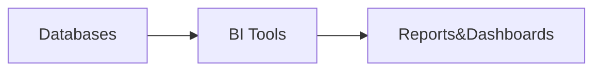
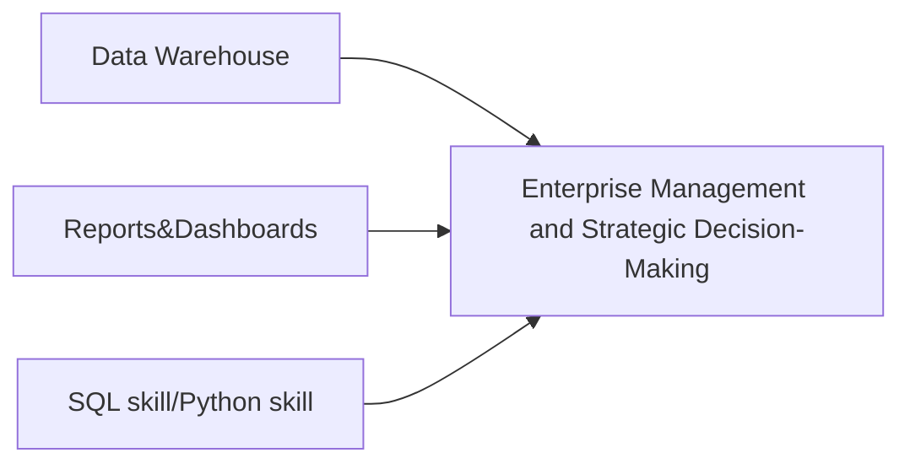

## BI（Create Report）


---
SKILL:
- BI tool
- Databases
- SQL

## Data Analytics & Data Architect


---
SKILL:
- BI tool
- SQL expert
- Databases
- Data Warehouse
- **Domain Knowledge**


## Full Picture
```mermaid
graph LR
    A[WebApp/Software/MS360data]
    B[StreamingData]
    C[]
    E[Enterprise Management and Strategic Decision-Making]
    B --> E
    C --> E
    D --> E
```
