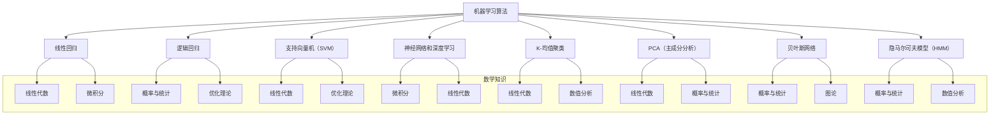

在机器学习领域，算法的设计涉及广泛的数学知识。以下是一些关键的数学领域及其在机器学习中的应用：

### 1. 线性代数
**应用**：线性代数是机器学习的核心，广泛用于数据表示和算法设计。
- **矩阵和向量操作**：数据通常以矩阵形式表示，向量用于特征表示。
- **特征值和特征向量**：用于降维算法，如PCA（主成分分析）。
- **矩阵分解**：如SVD（奇异值分解）、LU分解，用于推荐系统和降维。

### 2. 微积分
**应用**：微积分在优化算法中至关重要，用于计算梯度和优化目标函数。
- **导数和梯度**：用于梯度下降法等优化算法，帮助找到损失函数的最小值。
- **链式法则**：用于反向传播算法，以更新神经网络的权重。
- **积分**：在概率密度函数和期望值计算中使用。

### 3. 概率与统计
**应用**：概率和统计用于处理不确定性和数据分布，构建概率模型。
- **概率分布**：如正态分布、伯努利分布，用于模型假设。
- **贝叶斯定理**：用于贝叶斯学习和贝叶斯网络。
- **假设检验**：用于评估模型性能和显著性。
- **最大似然估计**：用于估计模型参数。

### 4. 数值分析
**应用**：数值分析用于实现和优化机器学习算法。
- **数值优化**：如牛顿法、共轭梯度法，用于解决大规模优化问题。
- **数值积分和微分**：用于处理连续数据和函数。

### 5. 离散数学
**应用**：离散数学用于处理组合问题和图结构数据。
- **组合和排列**：用于特征选择和模型组合。
- **图论**：用于图形模型、网络分析和社交网络分析。
- **集合论**：用于数据预处理和特征工程。

### 6. 信息论
**应用**：信息论用于衡量信息和不确定性，优化通信和数据压缩。
- **熵和交叉熵**：用于衡量不确定性和构建损失函数，如在分类问题中。
- **互信息**：用于特征选择和评估变量间的相关性。

### 7. 优化理论
**应用**：优化理论用于构建和解决机器学习模型的优化问题。
- **凸优化**：许多机器学习问题是凸优化问题，如SVM（支持向量机）。
- **约束优化**：用于处理带有约束的优化问题，如正则化。

### 具体算法与数学知识

1. **线性回归**：
   - **线性代数**：求解参数向量。
   - **微积分**：最小二乘法，梯度下降。

2. **逻辑回归**：
   - **概率与统计**：对数几率、最大似然估计。
   - **优化理论**：梯度下降。

3. **支持向量机（SVM）**：
   - **线性代数**：高维空间中的几何解释。
   - **优化理论**：凸优化问题的求解。

4. **神经网络和深度学习**：
   - **微积分**：反向传播算法。
   - **线性代数**：矩阵运算，加速计算。

5. **K-均值聚类**：
   - **线性代数**：距离计算和质心更新。
   - **数值分析**：迭代算法。

6. **PCA（主成分分析）**：
   - **线性代数**：特征值分解，奇异值分解。
   - **概率与统计**：数据分布和协方差矩阵。

7. **贝叶斯网络**：
   - **概率与统计**：贝叶斯定理、条件独立性。
   - **图论**：有向无环图（DAG）。

8. **隐马尔可夫模型（HMM）**：
   - **概率与统计**：马尔可夫过程、条件概率。
   - **数值分析**：动态规划算法，如前向-后向算法。

这些数学知识是机器学习算法设计和实现的基础，理解和掌握这些知识能够更深入地理解机器学习模型的工作原理和优化方法。
