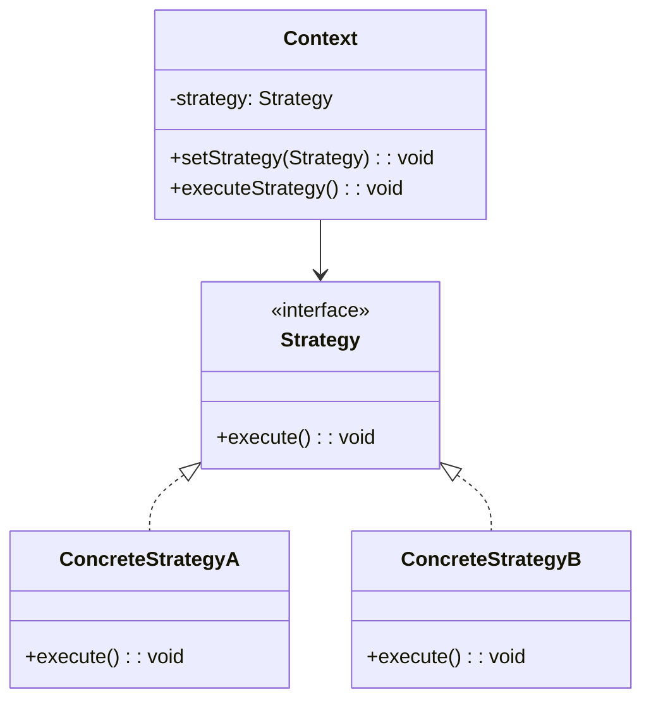
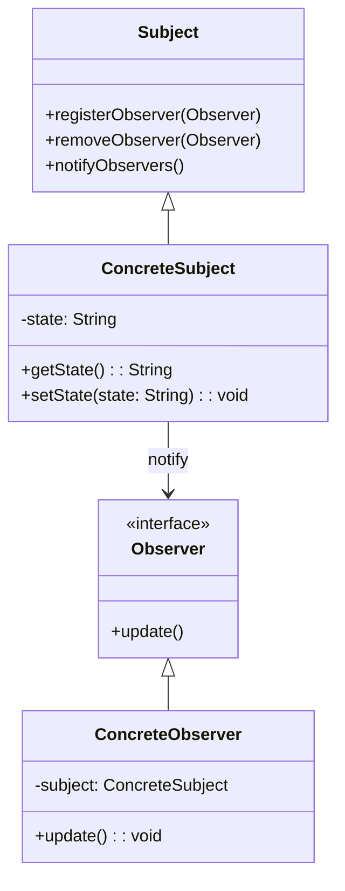

[代码地址](https://github.com/sherryuuer/cheatsheets/tree/main/core_code)

包含Java和Python写法。

## Creational Patterns

### Factory Method Pattern

工厂方法模式(Factory Method Pattern)。

工厂方法模式是一种创建型设计模式，它提供了一种创建对象的最佳方式。

在代码的例子中，它定义了一个抽象类Vehicle和三个具体的子类Car、Bike和Truck。同时还定义了一个抽象工厂类VehicleFactory和三个具体的工厂类CarFactory、BikeFactory和TruckFactory。

通过不同的工厂类，可以创建出不同类型的Vehicle对象。每个具体的工厂类都实现了createVehicle()方法，用于创建对应类型的Vehicle对象。
最后，代码展示了如何使用这些工厂类来创建不同类型的Vehicle对象，并调用它们的getType()方法来获取对象类型。

`@abstractmethod`是Python中用于定义抽象方法的装饰器。它来自于abc(Abstract Base Class)模块，用于标记某个方法为抽象方法。
抽象方法是指在基类中声明的方法，但没有实现具体的功能，只定义了方法签名。抽象方法必须在子类中**被重写(override)**，否则在实例化子类时将引发TypeError异常。

### Singleton Pattern

是一种创建型设计模式，它确保一个类只有一个实例，并提供一个全局访问点。主要解决的问题是保证一个类只有一个实例，并提供一个全局访问点。

Singleton模式的优点是:

- 对于需要频繁创建和销毁的对象可以提高性能。
- 由于单例模式中只存在一个实例，所以可以节省内存。
- 避免对资源的多重占用。
- 可以设置全局访问点，优化和共享资源访问。

但是你要是改变心意了咋办，这不是一个好的设计方法，所以这个模式经常被当成反面教材。

Singleton模式在现实开发中有广泛的应用，例如*线程池、缓存、日志对象、配置对象*等都可以使用单例模式进行设计。

该模式确保了，无论调用多少次实例，总是返回同一个实例。

在Python版本中，使用__new__方法来控制实例的创建。__new__是在创建实例时由Python解释器自动调用的方法。通过重写__new__方法，我们可以做到只创建一个实例，并将其存储在_instance类属性中。
当第一次调用Singleton()时，_instance为None，会创建一个新的实例并赋值给_instance。后续调用则直接返回已创建的实例。这样就实现了单例模式。

### Builder Pattern

生成器模式是一种创建型设计模式，旨在简化复杂对象的创建过程。它通过将对象的构建过程与其表示分离，使得相同的构建过程可以创建不同的表示。Builder Pattern 对于那些具有多个可选参数或构造步骤的对象特别有用。

Builder Pattern 通常包括以下几个部分：

- Builder（生成器）：定义构建对象的步骤，并且提供方法来设置对象的各个部分。
- ConcreteBuilder（具体生成器）：实现 Builder 接口，构建并装配各个部分。
- Product（产品）：要创建的复杂对象。
- Director（指挥者）：使用 Builder 对象构建 Product 的各个部分。Director 知道如何使用 Builder 来构建对象。

Builder Pattern（生成器模式）是一种创建型设计模式，旨在简化复杂对象的创建过程。它通过将对象的构建过程与其表示分离，使得相同的构建过程可以创建不同的表示。Builder Pattern 对于那些具有多个可选参数或构造步骤的对象特别有用。

```java
// 使用示例
public class BuilderPatternExample {
    public static void main(String[] args) {
        Computer computer = new Computer.Builder("Intel i7", "16GB")
                                .setUSBPorts(4)
                                .setHasGraphicsCard(true)
                                .build();
        System.out.println(computer);
    }
}
```

Builder Pattern 是一种创建复杂对象的有效方法，特别适用于那些具有多个可选参数的对象。通过将对象的构建过程与其表示分离，Builder Pattern 提高了代码的可读性和可维护性，同时增加了对象创建的灵活性。

### Prototype Pattern

Prototype（原型）是原型范式（Prototype Paradigm）的一部分，主要与基于原型的编程（Prototype-based Programming）有关。这种编程范式特别常见于面向对象编程（OOP）的一种实现方式，与传统的基于类的面向对象编程不同。

1. **对象而非类**:
    - 在原型范式中，编程的基本单位是对象而不是类。对象是具体实例，而类在这种范式中并不显式存在。

2. **对象复制**:
    - 新的对象通过复制现有的对象（即原型）来创建，而不是通过类的实例化。这种方式允许灵活地创建和修改对象。

3. **动态行为修改**:
    - 对象可以动态地修改其结构和行为。你可以在运行时向对象添加属性和方法，或改变它们的属性和方法。

4. **继承机制**:
    - 继承是通过委托（delegation）机制实现的。一个对象可以指向另一个对象作为其原型，从而继承其属性和方法。

原型范式的一个典型示例是 JavaScript。在 JavaScript 中，每个对象都有一个内部链接指向另一个对象（即其原型）。当试图访问一个对象的属性时，如果该对象自身没有这个属性，JavaScript 会沿着原型链向上查找，直到找到该属性或者到达原型链的末端。

```javascript
// 创建一个原型对象
let person = {
    type: 'human',
    sayHello: function() {
        console.log(`Hello, I am a ${this.type}`);
    }
};

// 通过复制原型对象创建一个新对象
let john = Object.create(person);
john.type = 'developer'; // 修改新对象的属性
john.sayHello(); // 输出: Hello, I am a developer

// 创建另一个对象
let jane = Object.create(person);
jane.type = 'designer';
jane.sayHello(); // 输出: Hello, I am a designer
```

在这个例子中，`person` 是一个原型对象。`john` 和 `jane` 是通过 `Object.create(person)` 创建的新对象，并继承了 `person` 的属性和方法。


- **Prototype（原型）** 是 **原型范式**（Prototype Paradigm）的核心概念。
- 原型范式强调对象的直接使用和**深度复制**，而不是依赖类的定义和实例化。
- 通过对象的复制和动态修改，原型范式提供了灵活的对象创建和继承机制。

原型范式提供了一种不同于基于类的面向对象编程的方法，更加灵活和动态，适合某些特定的编程需求和环境。

### Adapter Pattern

适配器模式（Adapter Pattern）是一种结构型设计模式，它的主要目的是将一个接口转换成客户端期望的另一个接口，从而使原本*接口不兼容*的类可以一起工作。适配器模式使得原本由于接口不兼容而不能一起工作的那些类可以在一起工作。

适配器模式的主要角色：
1. **目标接口（Target）**：
   - 这定义了客户端所使用的特定接口。

2. **需要适配的类（Adaptee）**：
   - 这是一个已经存在的接口或类，需要被适配成目标接口。

3. **适配器（Adapter）**：
   - 这个类实现了目标接口，并且持有一个需要适配的类的实例。适配器通过将目标接口的方法调用转发给需要适配的类来实现目标接口的方法。

4. **客户端（Client）**：
   - 通过目标接口与适配器交互。

适配器模式的两种实现方式：
1. **类适配器（Class Adapter）**：
   - 使用继承来实现适配器模式。适配器继承自需要适配的类，并实现目标接口。
   - 由于使用了多重继承（在Java等单继承语言中不常用），所以在C++等支持多重继承的语言中更常见。

2. **对象适配器（Object Adapter）**：
   - 使用组合来实现适配器模式。适配器持有一个需要适配的类的实例，并实现目标接口。
   - 更加常用，因为它不依赖于多重继承，可以在大多数面向对象的编程语言中使用。

假设我们有一个旧的类`OldPrinter`，它有一个方法`oldPrint`，但是我们希望在新系统中使用一个`Printer`接口，定义了一个方法`print`。

OldPrinter 类：
```java
class OldPrinter {
    void oldPrint(String text) {
        System.out.println("Old Printer: " + text);
    }
}
```

Printer 接口：
```java
interface Printer {
    void print(String text);
}
```

对象适配器实现：
```java
class PrinterAdapter implements Printer {
    private OldPrinter oldPrinter;

    public PrinterAdapter(OldPrinter oldPrinter) {
        this.oldPrinter = oldPrinter;
    }

    @Override
    public void print(String text) {
        oldPrinter.oldPrint(text);
    }
}
```

客户端代码：
```java
public class Client {
    public static void main(String[] args) {
        OldPrinter oldPrinter = new OldPrinter();
        Printer printer = new PrinterAdapter(oldPrinter);
        printer.print("Hello, World!");
    }
}
```

在这个示例中，`PrinterAdapter`实现了`Printer`接口，并将`print`方法的调用委托给`OldPrinter`类的`oldPrint`方法。客户端代码通过`Printer`接口与适配器进行交互，而无需了解底层的`OldPrinter`类。

### Decorator Pattern

装饰器设计模式（Decorator Design Pattern）是一种结构型设计模式，用于动态地向对象添加行为或职责，而不影响其他对象。与继承相比，装饰器模式提供了一种更灵活的方法来扩展对象的功能。以下是对装饰器设计模式的介绍：

1. **组件接口（Component Interface）**：
   - 定义了对象可以执行的方法，所有具体组件和装饰器都必须实现这个接口。

2. **具体组件（Concrete Component）**：
   - 实现了组件接口，表示可以动态添加职责的对象。

3. **装饰器（Decorator）**：
   - 实现了组件接口，包含一个指向具体组件的引用。装饰器可以在调用具体组件的方法前后添加额外的行为。

4. **具体装饰器（Concrete Decorator）**：
   - 继承自装饰器，向组件添加具体的职责。

**UML类图**

```
Component
  + operation()
    |
ConcreteComponent
  + operation()
    |
Decorator
  - component: Component
  + operation()
    |
ConcreteDecoratorA
  - addedState: Type
  + operation()
  + addedBehavior()
    |
ConcreteDecoratorB
  + operation()
  + addedBehavior()
```

下面是一个使用装饰器设计模式的示例，演示如何向对象动态添加职责。假设我们有一个简单的接口 `Coffee`，定义了 `cost` 和 `description` 方法。

```python
from abc import ABC, abstractmethod

# 组件接口
class Coffee(ABC):
    @abstractmethod
    def cost(self) -> float:
        pass

    @abstractmethod
    def description(self) -> str:
        pass

# 具体组件
class SimpleCoffee(Coffee):
    def cost(self) -> float:
        return 5.0

    def description(self) -> str:
        return "Simple Coffee"

# 装饰器
class CoffeeDecorator(Coffee):
    def __init__(self, decorated_coffee: Coffee):
        self.decorated_coffee = decorated_coffee

    def cost(self) -> float:
        return self.decorated_coffee.cost()

    def description(self) -> str:
        return self.decorated_coffee.description()

# 具体装饰器A
class MilkDecorator(CoffeeDecorator):
    def cost(self) -> float:
        return self.decorated_coffee.cost() + 1.5

    def description(self) -> str:
        return self.decorated_coffee.description() + ", Milk"

# 具体装饰器B
class SugarDecorator(CoffeeDecorator):
    def cost(self) -> float:
        return self.decorated_coffee.cost() + 0.5

    def description(self) -> str:
        return self.decorated_coffee.description() + ", Sugar"

# 使用装饰器模式
coffee = SimpleCoffee()
print(f"Cost: {coffee.cost()}, Description: {coffee.description()}")

coffee_with_milk = MilkDecorator(coffee)
print(f"Cost: {coffee_with_milk.cost()}, Description: {coffee_with_milk.description()}")

coffee_with_milk_and_sugar = SugarDecorator(coffee_with_milk)
print(f"Cost: {coffee_with_milk_and_sugar.cost()}, Description: {coffee_with_milk_and_sugar.description()}")
```

输出：
```
Cost: 5.0, Description: Simple Coffee
Cost: 6.5, Description: Simple Coffee, Milk
Cost: 7.0, Description: Simple Coffee, Milk, Sugar
```

*适用场景*：

- 需要在不影响其他对象的情况下动态地添加职责或行为。
- 使用继承无法有效扩展类的功能。
- 需要透明地对待被装饰的对象。

*优点*：

- 更灵活地扩展对象的功能，而不需要继承多个类。
- 可以动态组合多个装饰器，实现复杂的功能。

*缺点*：

- 会增加系统中类和对象的数量，导致系统更加复杂。
- 多层装饰器的调试比较困难。

装饰器设计模式是面向对象编程中强大且灵活的工具，用于动态地向对象添加新的功能。

### Facade Pattern

Facade模式是一种结构型设计模式，提供了一个简化的接口，使得复杂系统的子系统之间更加容易使用和理解。该模式通过隐藏系统的复杂性并提供一个统一的接口来访问子系统，从而简化了客户端与系统的交互。

**主要特点**：

1. **简化接口**：通过提供一个统一的接口，Facade模式使得客户端可以更简单地与复杂的子系统交互。
2. **隐藏复杂性**：Facade模式隐藏了子系统的复杂性，客户端不需要了解子系统的细节，只需通过Facade接口进行操作。
3. **松散耦合**：Facade模式降低了客户端与子系统之间的耦合度，子系统的变化不会直接影响客户端。

**适用场景**：

1. **简化复杂系统**：当一个系统由多个子系统组成且系统的复杂度很高时，可以使用Facade模式来简化客户端与系统的交互。
2. **子系统之间的依赖**：当多个子系统之间存在依赖关系且客户端需要与这些子系统交互时，Facade模式可以为客户端提供一个统一的接口。
3. **松散耦合**：希望降低客户端与子系统之间的耦合度，使得子系统的变化不会影响客户端。

**实现示例**：

以下是一个使用Facade模式的简单示例。假设我们有一个家庭影院系统，包含多个子系统：DVD播放器、音响系统和投影仪。我们可以使用Facade模式来简化这些子系统的操作。

```python
# 子系统类
class DVDPlayer:
    def on(self):
        print("DVD Player is on.")
    
    def play(self, movie):
        print(f"Playing movie: {movie}")

class SoundSystem:
    def on(self):
        print("Sound System is on.")
    
    def setVolume(self, level):
        print(f"Setting volume to {level}.")

class Projector:
    def on(self):
        print("Projector is on.")
    
    def setInput(self, source):
        print(f"Setting input source to {source}.")

# Facade类
class HomeTheaterFacade:
    def __init__(self, dvd_player, sound_system, projector):
        self.dvd_player = dvd_player
        self.sound_system = sound_system
        self.projector = projector
    
    def watchMovie(self, movie):
        print("Get ready to watch a movie...")
        self.dvd_player.on()
        self.dvd_player.play(movie)
        self.sound_system.on()
        self.sound_system.setVolume(10)
        self.projector.on()
        self.projector.setInput("DVD Player")

# 客户端代码
dvd_player = DVDPlayer()
sound_system = SoundSystem()
projector = Projector()

home_theater = HomeTheaterFacade(dvd_player, sound_system, projector)
home_theater.watchMovie("Inception")
```

**优点**：

1. **简化客户端代码**：客户端只需要与Facade交互，而不需要直接操作多个子系统。
2. **提高可维护性**：子系统的修改不会直接影响客户端，因为客户端只依赖于Facade接口。
3. **松散耦合**：Facade模式降低了客户端与子系统之间的耦合度。

**缺点**：

1. **可能导致封装不当**：如果Facade设计不当，可能会导致系统的部分功能无法使用。
2. **不适用于所有系统**：对于简单系统，引入Facade可能会增加不必要的复杂性。

Facade模式通过提供一个简化的接口，使得客户端可以更方便地与复杂的子系统交互。它隐藏了系统的复杂性，降低了客户端与子系统之间的耦合度，适用于需要简化复杂系统接口的场景。


### Strategy Pattern

策略模式（Strategy Pattern）是一种*行为设计模式*，它定义了一系列算法，并将每个算法封装起来，使它们可以相互替换。策略模式使得算法可以在不影响客户端的情况下发生变化。

**核心概念**

1. **策略（Strategy）**：定义了一组可以互换的算法或行为，这些算法或行为可以在运行时动态替换。
2. **上下文（Context）**：持有一个策略对象的引用，负责与客户端进行交互，并在需要时调用策略对象的方法。
3. **接口或抽象类（Strategy Interface）**：定义了一系列通用的行为或算法接口，具体的策略类实现这个接口。

**结构图**



- **Context**：上下文类，持有一个策略对象的引用，可以动态地改变所使用的策略。
- **Strategy**：策略接口，定义了所有具体策略类必须实现的方法。
- **ConcreteStrategyA 和 ConcreteStrategyB**：具体的策略类，分别实现了不同的算法或行为。

**实例代码**

假设我们有一个应用，需要计算商品的折扣，不同的客户有不同的折扣策略：

```python
from abc import ABC, abstractmethod

# 策略接口
class DiscountStrategy(ABC):
    @abstractmethod
    def apply_discount(self, amount):
        pass

# 具体策略：无折扣
class NoDiscountStrategy(DiscountStrategy):
    def apply_discount(self, amount):
        return amount

# 具体策略：百分比折扣
class PercentageDiscountStrategy(DiscountStrategy):
    def __init__(self, percentage):
        self.percentage = percentage

    def apply_discount(self, amount):
        return amount * (1 - self.percentage / 100)

# 具体策略：固定金额折扣
class FixedAmountDiscountStrategy(DiscountStrategy):
    def __init__(self, discount):
        self.discount = discount

    def apply_discount(self, amount):
        return max(0, amount - self.discount)

# 上下文类：使用策略
class Order:
    def __init__(self, amount, discount_strategy: DiscountStrategy):
        self.amount = amount
        self.discount_strategy = discount_strategy

    def get_total(self):
        return self.discount_strategy.apply_discount(self.amount)

# 使用策略模式
order1 = Order(100, NoDiscountStrategy())
print(f"Total (No Discount): ${order1.get_total()}")  # Total: $100

order2 = Order(100, PercentageDiscountStrategy(10))
print(f"Total (10% Discount): ${order2.get_total()}")  # Total: $90

order3 = Order(100, FixedAmountDiscountStrategy(15))
print(f"Total ($15 Discount): ${order3.get_total()}")  # Total: $85
```

策略模式适用于以下场景：

1. **需要动态选择算法或行为**：在运行时根据不同条件选择不同的算法或行为。
2. **避免使用多个条件分支（if-else 或 switch-case）**：通过策略模式将不同的逻辑封装到不同的策略类中，简化代码结构。
3. **需要对算法的变化保持开放**：当需要增加新算法或修改现有算法时，可以通过添加或修改策略类来实现，而不影响其他部分的代码。

优点：

- **开闭原则**：增加新的策略非常容易，不需要修改现有的代码。
- **复用性高**：策略可以在多个上下文中复用，且可以与上下文独立开发和测试。
- **灵活性和可维护性**：通过将算法或行为封装到独立的类中，提高了代码的灵活性和可维护性。

缺点：

- **可能增加类的数量**：每个具体策略都需要一个类，可能会增加系统的复杂性。
- **上下文类需要了解所有策略**：上下文类需要知道不同策略的存在和使用时机，可能导致一定的耦合。

现实中的应用：

1. **支付处理系统**：根据不同的支付方式（如信用卡、支付宝、微信支付等），使用不同的支付处理策略。
2. **文件压缩工具**：根据选择的压缩算法（如 ZIP、RAR、GZIP 等），使用不同的压缩策略。
3. **数据排序**：根据不同的排序需求（如升序、降序、自定义排序等），选择不同的排序策略。

策略模式在实际应用中非常常见，特别是在需要灵活调整行为或算法的场景中，为代码的扩展和维护提供了极大的便利。

### Observer Pattern

观察者模式（Observer Pattern）是一种行为设计模式，用于定义对象间的一种一对多的依赖关系，当一个对象的状态发生变化时，所有依赖于它的对象都会自动收到通知并更新。

**核心概念**

1. **主题（Subject）**：被观察的对象，它持有对观察者的引用，并在其状态变化时通知所有的观察者。
2. **观察者（Observer）**：观察者对象，它定义了一个更新接口，以便接收来自主题对象的通知。
3. **订阅机制**：观察者通过注册自己到主题上，来订阅主题的更新；同样，观察者也可以随时取消订阅。

**结构图**



- **Subject**：主题接口，定义了注册、移除和通知观察者的方法。
- **ConcreteSubject**：具体的主题类，包含一些状态，并在状态改变时通知所有注册的观察者。
- **Observer**：观察者接口，定义了一个更新方法，当主题发生变化时，观察者会收到通知。
- **ConcreteObserver**：具体的观察者类，实现了观察者接口，在收到主题通知时执行相应的更新操作。

假设我们有一个天气监测系统，气象站会监测天气数据，并通知所有注册的显示设备（观察者）更新显示数据：

```python
from abc import ABC, abstractmethod

# 主题接口
class Subject(ABC):
    @abstractmethod
    def register_observer(self, observer):
        pass

    @abstractmethod
    def remove_observer(self, observer):
        pass

    @abstractmethod
    def notify_observers(self):
        pass

# 观察者接口
class Observer(ABC):
    @abstractmethod
    def update(self, temperature, humidity, pressure):
        pass

# 具体主题类
class WeatherStation(Subject):
    def __init__(self):
        self.observers = []
        self.temperature = 0
        self.humidity = 0
        self.pressure = 0

    def register_observer(self, observer):
        self.observers.append(observer)

    def remove_observer(self, observer):
        self.observers.remove(observer)

    def notify_observers(self):
        for observer in self.observers:
            observer.update(self.temperature, self.humidity, self.pressure)

    def set_measurements(self, temperature, humidity, pressure):
        self.temperature = temperature
        self.humidity = humidity
        self.pressure = pressure
        self.notify_observers()

# 具体观察者类
class DisplayDevice(Observer):
    def update(self, temperature, humidity, pressure):
        print(f"Display updated: Temperature={temperature}, Humidity={humidity}, Pressure={pressure}")

# 使用观察者模式
weather_station = WeatherStation()
display = DisplayDevice()

weather_station.register_observer(display)

# 更新天气数据，并通知观察者
weather_station.set_measurements(25, 65, 1013)  # Display updated: Temperature=25, Humidity=65, Pressure=1013

# 再次更新天气数据
weather_station.set_measurements(22, 70, 1012)  # Display updated: Temperature=22, Humidity=70, Pressure=1012

# 移除观察者
weather_station.remove_observer(display)

# 更新天气数据，不会再通知观察者
weather_station.set_measurements(20, 60, 1011)  # No output, as the observer is removed
```

观察者模式适用于以下场景：

1. **对象之间存在一对多依赖关系**：当一个对象的状态变化需要通知其他对象时，适合使用观察者模式。
2. **数据变化频繁，且需要动态调整依赖关系**：例如，GUI 组件中，模型变化时需要更新多个视图。
3. **需要分离对象之间的紧耦合**：观察者模式可以将观察者和主题的依赖关系解耦，促进模块化设计。

优点：

- **松耦合**：观察者和主题之间的依赖是抽象的，不直接依赖具体实现，促进模块的独立性和可复用性。
- **动态订阅机制**：观察者可以在运行时动态订阅或取消订阅主题，灵活应对变化。
- **简化了维护**：当主题发生变化时，所有的观察者都会自动接收到通知，无需手动更新。

缺点：

- **潜在的性能开销**：如果主题有大量观察者，通知所有观察者可能会带来性能问题。
- **复杂性增加**：系统中引入观察者模式后，增加了维护观察者和主题之间关系的复杂性。
- **通知的顺序不保证**：观察者模式中，通知的顺序不一定有保障，可能会导致更新的竞争和不一致性问题。

现实中的应用：

1. **GUI 事件处理**：如按钮点击事件的监听，多个组件可以订阅同一个事件。
2. **实时数据推送**：如股票价格更新、新闻推送等系统，多个客户端订阅数据更新。
3. **日志系统**：不同的日志处理程序（如写入文件、输出到控制台等）可以观察日志系统，并根据日志事件采取不同的操作。
4. **消息通知系统**：在社交媒体应用中，用户关注了某个主题或账号，当该主题或账号有新动态时，用户会收到通知。

观察者模式通过解耦对象之间的依赖关系，为系统的扩展和维护提供了更高的灵活性和可维护性。

### State Pattern

状态模式（State Pattern）是一种行为设计模式，它允许对象在其内部状态改变时，改变其行为。也就是说，对象看起来似乎修改了它的类。状态模式的核心在于将与状态相关的行为封装到独立的状态对象中，使得对象的行为能够根据其内部状态的变化而变化。

**关键要点**

1. **状态对象的封装**：
   - 每一个状态对应一个类，这些类实现相同的接口。
   - 状态对象的职责是根据当前的状态执行相应的行为，并在必要时切换到其他状态。

2. **上下文（Context）对象**：
   - 上下文对象持有当前状态的引用。
   - 上下文对象将请求委托给当前的状态对象来处理。

3. **状态的切换**：
   - 状态对象负责定义如何在不同状态之间进行切换。
   - 上下文对象通常提供一个方法来设置和改变当前状态。

状态模式的结构包括以下几个部分：

1. **Context（上下文）**：
   - 维护一个 `State` 对象的引用，这个对象定义了当前的状态。
   - 向 `State` 对象委派所有与状态相关的请求。

2. **State（状态）**：
   - 定义一个接口，用于封装与上下文的一个特定状态相关的行为。

3. **ConcreteState（具体状态）**：
   - 实现 `State` 接口，提供对应于 `Context` 的特定状态的行为。
   - 在适当的时候，能够将上下文的状态转换到另一个状态。

```plaintext
+----------------------+
|      Context         |
+----------------------+
| - state: State       |
+----------------------+
| + request(): void    |
+----------------------+
         |
         V
+----------------------+
|       State          |
+----------------------+
| + handle(context):   |
|   void               |
+----------------------+
         |
         V
+--------------------------+
|    ConcreteStateA        |
+--------------------------+
| + handle(context): void  |
+--------------------------+
         |
         V
+--------------------------+
|    ConcreteStateB        |
+--------------------------+
| + handle(context): void  |
+--------------------------+
```

假设：一个简单的电梯系统：

考虑一个简单的电梯系统，电梯可以处于以下几种状态之一：`停止`、`上升` 和 `下降`。我们可以使用状态模式来实现电梯的行为。

```python
from abc import ABC, abstractmethod

class Context:
    def __init__(self, state: State):
        self._state = state

    def set_state(self, state: State):
        self._state = state

    def request(self):
        self._state.handle(self)

class State(ABC):
    @abstractmethod
    def handle(self, context: Context):
        pass

class StoppedState(State):
    def handle(self, context: Context):
        print("Elevator is stopped. Switching to rising state.")
        context.set_state(RisingState())

class RisingState(State):
    def handle(self, context: Context):
        print("Elevator is rising. Switching to falling state.")
        context.set_state(FallingState())

class FallingState(State):
    def handle(self, context: Context):
        print("Elevator is falling. Switching to stopped state.")
        context.set_state(StoppedState())

# 客户端代码
if __name__ == "__main__":
    # 创建初始状态
    stopped_state = StoppedState()

    # 创建上下文对象
    elevator = Context(stopped_state)

    # 请求行为
    elevator.request()  # Elevator is stopped. Switching to rising state.
    elevator.request()  # Elevator is rising. Switching to falling state.
    elevator.request()  # Elevator is falling. Switching to stopped state.
    elevator.request()  # Elevator is stopped. Switching to rising state.
```

**代码解析**：

- `Context` 类：
  - 保存当前的状态（`State`）。
  - 提供 `set_state` 方法来改变状态。
  - 提供 `request` 方法来处理请求，这个方法会调用当前状态的 `handle` 方法。

- `State` 抽象类：
  - 定义了一个 `handle` 方法，所有具体的状态都要实现这个方法。

- `StoppedState`、`RisingState` 和 `FallingState` 类：
  - 具体的状态类，每个类实现了 `handle` 方法，定义了状态的具体行为。
  - 在 `handle` 方法中，状态类不仅处理请求，还负责改变上下文的状态。

- **对象的行为依赖于它的状态，并且必须在运行时根据状态改变其行为。**
- **一个操作中含有庞大的分支条件语句，这些条件语句的每个分支都对应不同的状态。**

优点：

- **易于扩展**：增加新的状态类，只需扩展现有的状态类，不需要修改上下文类。
- **消除复杂的条件语句**：避免了在一个操作中使用大量的 `if-else` 或 `switch-case` 分支条件。
- **封装状态转换**：状态转换的逻辑被封装在具体的状态类中，简化了上下文类的逻辑。

缺点：

- **状态类增加**：随着状态的增加，可能会导致状态类的数量变多，增加系统的复杂性。
- **过度设计**：在状态较少且状态切换逻辑简单的情况下，使用状态模式可能显得复杂。

状态模式通过将状态转换的行为封装在独立的状态类中，使得对象的行为可以根据状态变化而变化，从而简化了代码逻辑和提高了扩展性。在设计需要根据状态变化而改变行为的系统时，状态模式是一种非常有用的设计模式。
