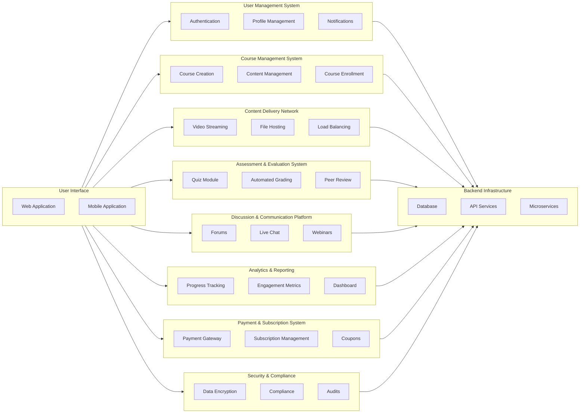

- 涉及的是一个工程问题，不是一个小的代码，而是一种大规模开发。包括团队组织，代码开发组织，未来易于维护性等
- Bad Code和错误的开发实践（development practices），导致金钱浪费和项目失败
- 最初的设计，非常重要
- 从**范畴**大小来说：
  - 最里层的是*具体的开发，实践，设计模式，代码编程，构架，运维等技术方面*
  - 然后是统筹这些的*SDLC*框架，用合适的框架进行开发
  - 最终支持整个交付的是*项目管理PM*

## Software Lifecycle

- **软件开发生命周期（SDLC, Software Development Life Cycle）**是一个系统化的方法论，用于定义软件项目的开发过程。它包括从概念到交付和维护的各个阶段，帮助开发团队在项目中保持一致性和质量
  - 关注*技术和方法*
  - 最终目标是*交付高质量的软件产品*
- **项目管理（PM, Project Management）**是应用知识、技能、工具和技术来执行项目活动，以满足项目要求。项目管理关注的是项目的总体成功，包括资源的有效利用、风险管理和项目交付的按时完成
  - *范围，时间，成本，质量，沟通*
  - 关注*项目整体的管理和交付*，支持*SDLC*的执行
  - 目标是*成功交付项目，满足时间、成本和质量要求*

- Requirements = what
- Design = how
- Implementation = build
- Verification = test(do they meet the requirements)
- Maintenane = new cycle(debug, new features)
- [Reference](https://www.tutorialspoint.com/sdlc/sdlc_overview.htm)

## Requirements / WRSPM

- **Requirements**是一种谁都可以懂的东西，客户要达到何种目的和功能，是一种**用户user**的要求
- **Specifications**则是一种规格说明，不会用太多的专业词汇，用于指导之后*开发者*的设计，是一种**系统system**的要求

- **Functional vs Non-Functional**：功能性是系统能做什么，非功能性要求则是基于产品，组织，外部的一些基准的要求，必须加密用什么方式之类的

- **WRSPM**：
  - *Environment*：
  - world：周围的所有环境需求，电力，网络，温度
  - requirements：各方用户所需的功能要求
  - *Interface*：
  - specifications：规格要求，芯片技术，加密方式，传输协议，付款方式
  - *System*：
  - program：编程需求
  - machine：硬件需求

  - 可以看出他们是对应的关系，现实的世界**world**和机器的世界**machine**，现实的需求**requirements**对应**program**程序代码的实现，中间的接口是**specifications**

- **WRSPM Variables**:
  - *Environment*：
  - Eh：Elements of the environment which are hidden from the system，必须一个ATM机器来说，你的银行卡就是这样的元素
  - *Interface*：
  - Ev：Elements of the environment which are visible to the system，比如银行卡的芯片，通过这个芯片的内容，系统才可以进行交互，什么元素，可以让系统识别到世界中的内容，比如机器学习中，对文字来说，机器不可识别，但是可以识别数字，所以需要embedding
  - Sv：Elements of the system which are visible to the environment，系统中对环境来说也是可见的东西，比如按钮，屏幕，UI等
  - *System*：
  - Sh：Elements of the system which are hidden from the environment，系统中对环境来说不可见的东西，比如你的网络应用的后端，对用户是不可见的

- **WRSPM：从左到右就是环境，接口，和系统的顺序**，called *world-machine model*

## Design：Architecture

- 高层次的设计
- 想法是否可以落实到现实的蓝图计划
- *错误的构架无法靠代码弥补*，因为它设计基础的地方，当工程开始，基础很难改变
- 一个好的构架师，一个好的PM，都应该首先是一个优秀的技术者，从细节到上层全面把握

- 系统构架和软件构架是两件事，这里谈*软件构架*
- **软件构架都是关于，如何将一个大的系统，分解成小的子系统和其中的模块**
- *解藕*和*交互API*非常重要
- 好的构架很难，错误的构架在之后很难修正，有时候你甚至需要重建
- 好的构架在之后很容易维护和进化

- 好的设计构架都会有好的doc，作为使用接口的人，**阅读文档**太重要了

- 构架例子：
  - 前端 - 逻辑 - 服务器（贪吃蛇游戏如果做成一个应用服务，是如何的）
  - 一个系统都有什么*组件*，哪些组件之间需要*交互*，哪些不需要，如何交互
- architecture of the Online Learning Platform:

### Pipe and Filter

**管道和过滤器（Pipe and Filter）**是在软件架构和设计模式中，一种非常常见的设计模式。它被用来处理数据流，并将复杂的处理过程分解为一系列简单的步骤。

- *管道（Pipe）*：在这个模式中，管道用于连接一系列的过滤器。管道负责传递数据，从一个过滤器的输出端到下一个过滤器的输入端，类似于管道中水的流动。
- *过滤器（Filter）*：过滤器是独立的处理组件，每个过滤器接收数据流，处理数据，然后将其输出传递给下一个过滤器。
  - 独立性：每个过滤器作为一个独立的单元，可以被重用和独立开发。
  - 数据处理：每个过滤器负责执行特定的数据处理任务，例如转换、过滤、排序等。
  - 无状态性：大多数过滤器是无状态的，这意味着它们不会存储处理过的数据，处理过程不依赖于之前的数据状态。
- 管道和过滤器的工作流程：
  - 数据输入：初始数据被输入到第一个过滤器中。
  - 数据处理：数据流经第一个过滤器进行处理，处理后的数据通过管道传递到下一个过滤器。
  - 逐步处理：这一过程在每个过滤器中重复，直到数据流通过所有的过滤器。
  - 数据输出：最终处理完成的数据被输出或存储。

- 现实案例，比如shell的管道符号｜，大数据处理的ETL，编排服务的数据流等，Airflow编排服务也是这种软件构架也许

### Client-Server

**Client-Server**（客户端-服务器）是一种经典的软件设计模型。它是*分布式计算架构*的一种，其中任务和负载被分配到两个主要的组件：客户端和服务器。这种模型被广泛用于各种网络应用程序和系统设计中。

1. **请求-响应循环**：
  - 客户端向服务器发送请求，服务器接收到请求后进行处理，然后将结果返回给客户端。

2. **网络通信**：
  - 客户端和服务器通过网络进行通信，常用的协议有HTTP、HTTPS、FTP、TCP/IP等。

3. **异步处理**：
  - 在许多现代应用中，客户端可以异步地发送请求，而无需等待服务器的响应才能继续进行其他操作。

Client-Server 的应用示例
- Web 应用：浏览器作为客户端，Web 服务器（如Apache、Nginx）作为服务器。
- 数据库系统：应用程序作为客户端，数据库服务器（如MySQL、PostgreSQL）作为服务器。
- 电子邮件系统：邮件客户端（如Outlook、Gmail）和邮件服务器（如SMTP服务器）。

Client-Server 与其他模型的对比
- **对等网络（Peer-to-Peer，P2P）**：
  - 在P2P网络中，每个节点既可以是客户端，也可以是服务器。这种架构更适合于资源共享和分布式计算。
- **微服务架构**：
  - 微服务架构将应用程序拆分成多个独立的小服务，每个服务负责特定的功能。这与传统的Client-Server模型不同，因为它强调服务的独立性和去中心化。

### Master-Slave

**Master-Slave 模式**是一种分布式计算架构，广泛应用于数据库、计算任务调度和系统管理中。它将任务和数据在主服务器（Master）和从服务器（Slave）之间进行分配，以提高系统的可用性、性能和容错性。

1. **主从角色**：
   - **主服务器（Master）**：负责管理和协调，从属于控制中心。它分配任务、存储数据，并对系统进行整体控制。
   - **从服务器（Slave）**：接收来自主服务器的任务，并执行指定的操作。它可以将结果返回给主服务器或独立存储数据。

2. **任务分配**：
   - 主服务器分配任务，从服务器执行。通常在计算任务中，主服务器会根据任务的复杂度和从服务器的负载情况进行分配。

3. **数据复制**：
   - 在数据库系统中，主服务器将数据更新推送给从服务器，从而实现数据的冗余和备份。这样可以提高数据读取的效率和系统的容错能力。

4. **容错性和高可用性**：
   - 从服务器的存在提高了系统的容错能力。如果主服务器出现故障，从服务器可以作为备份进行故障切换（Failover）。

5. **读写分离**：
   - 通过将写操作集中在主服务器，而将读操作分散到从服务器，从而提高系统的性能。

Master-Slave 模式的应用示例

1. **数据库系统**：
   - 在 MySQL、PostgreSQL 等数据库中，Master-Slave 模式用于实现数据复制和负载均衡。主数据库负责写操作，从数据库负责读操作。

2. **分布式计算**：
   - 在 Hadoop 中，NameNode 作为主节点，DataNode 作为从节点。NameNode 负责元数据管理，DataNode 负责实际的数据存储。

3. **任务调度系统**：
   - 诸如 Apache Kafka 之类的消息队列中，主节点负责管理主题和分区，从节点负责实际的消息存储和传递。

**优点**:

- 性能优化：通过读写分离和任务分配，提高了系统的整体性能。
- 高可用性：从服务器提供冗余和备份，提高了系统的可靠性。
- 易于扩展：可以通过增加从服务器来扩展系统的处理能力。

**缺点**:

- 单点故障：主服务器故障可能导致整个系统的停滞，需要额外的机制来实现主服务器的故障切换。
- 数据一致性：数据复制延迟可能导致暂时的不一致性，需要仔细设计数据同步机制。

Master-Slave 模式通过角色分配和任务调度，实现了高效的数据处理和系统管理。它在性能优化和高可用性方面表现出色，但也面临单点故障和数据一致性等挑战。通过合理的设计和实施，Master-Slave 模式能够为复杂的分布式系统提供强大的支持。

想起了k8s和Airflow的scheduler

### Layered Model

分层模型是一种软件架构设计模式，通过将系统划分为多个层次，每个层次承担不同的职责，以实现更好的结构化和模块化。这种模型通常用于设计复杂的软件系统，使系统更易于开发、维护和扩展。

1. **分层结构**：
   - 系统被划分为多个层，每一层在其上层之下并依赖于其下层。
   - 每层负责特定的功能，并通过接口与其他层进行交互。

2. **模块化**：
   - 每一层可以独立开发、测试和修改，降低系统复杂度。
   - 层与层之间的相互依赖减少，增强了系统的灵活性和可维护性。

3. **职责分离**：
   - 不同层次负责不同的职责，如数据访问、业务逻辑、用户界面等。
   - 职责的分离有助于明确系统的功能边界，提高代码的可读性和可维护性。

4. **可扩展性**：
   - 通过增加或修改特定层的功能，可以轻松扩展系统，而不影响其他层。

5. **可移植性**：
   - 底层的实现细节可以独立于高层，增强了系统的可移植性。

Layered Model 通常由以下几个主要层次组成：

1. **Presentation Layer（表示层）**：
   - 负责与用户的交互，包括用户界面的显示和输入处理。
   - 例如：Web 应用中的 HTML/CSS/JavaScript，桌面应用中的 GUI 组件。

2. **Application Layer（应用层）或 Business Logic Layer（业务逻辑层）**：
   - 负责处理应用程序的核心业务逻辑和规则。
   - 将用户的请求转化为具体的操作，通过与数据层交互来处理数据。

3. **Data Access Layer（数据访问层）**：
   - 负责与数据库或其他持久化存储系统进行交互。
   - 包括数据的查询、插入、更新和删除操作。

4. **Data Layer（数据层）或 Persistence Layer（持久层）**：
   - 负责实际的数据存储和管理，包括数据库系统和文件存储。
   - 管理数据的物理存储，确保数据的持久性和一致性。

以一个电子商务应用为例，Layered Model 的各层可能包含以下内容：

1. **Presentation Layer（表示层）**：
   - 负责显示产品信息、处理用户输入和结账流程。
   - 通过 *RESTful API* 或者 *GraphQL* 与应用层进行交互。

2. **Application Layer（应用层）**：
   - 实现产品搜索、购物车管理和订单处理等业务逻辑。
   - 负责用户认证和授权，确保用户的操作符合业务规则。

3. **Data Access Layer（数据访问层）**：
   - 负责从数据库中读取产品信息、订单状态，并进行数据持久化。
   - 使用 ORM（对象关系映射）工具或 SQL 查询与数据库交互。

4. **Data Layer（数据层）**：
   - 使用 MySQL 或 MongoDB 等数据库存储用户信息、产品目录和订单记录。
   - 维护数据库的架构和索引，确保数据的完整性和查询效率。

**优点**：

- 易于理解和维护：分层结构清晰，职责分离明确，使得系统易于理解和维护。
- 提高可重用性：各层可以独立开发并重用于不同项目，减少重复劳动。
- 增强可测试性：每层的功能可以单独测试，提高测试的覆盖率和效率。

**缺点**：

- 性能开销：层与层之间的交互可能带来额外的性能开销，特别是在高频调用的情况下。
- 灵活性不足：严格的分层可能导致一些特定需求难以实现，需要在架构上进行调整。
- 复杂性增加：对于简单的应用，分层模型可能引入不必要的复杂性。

Layered Model 被广泛应用于各种软件系统，包括但不限于：

- **Web 应用开发**：常见于 *MVC（Model-View-Controller）*架构中。
- **企业级应用**：如 ERP 和 CRM 系统，常采用三层或多层架构。
- **操作系统设计**：如 OSI 模型，将网络协议栈划分为多个层次。

**Layered Model 与其他架构的对比**：

- **Microservices Architecture（微服务架构）**：
  - 微服务架构将应用拆分为多个独立的服务，强调服务的独立性和去中心化。
  - Layered Model 强调职责分离和模块化，适用于系统内部的组织结构。

- **Event-Driven Architecture（事件驱动架构）**：
  - 事件驱动架构通过事件触发系统中的动作，适用于需要高度响应性和解耦的系统。
  - Layered Model 强调各层的交互和依赖，适合于逻辑清晰的业务系统。

- **Client-Server Architecture（客户端-服务器架构）**：
  - 客户端-服务器架构强调请求-响应机制，适用于网络应用和分布式系统。
  - Layered Model 可以作为客户端或服务器内部的结构化方式。

Layered Model 是一种经典的架构模式，通过分层实现系统的职责分离和模块化，适用于大多数复杂的业务系统。虽然在性能和灵活性上存在一些挑战，但其易于理解、维护和扩展的特点，使得它在软件设计中具有重要地位。通过合理的分层和接口设计，Layered Model 可以为复杂的系统提供清晰的结构和强大的支持。

### 其他构架

**Microservices Architecture（微服务架构）**

- 微服务架构是一种构建应用的架构模式，它将应用分解为一系列小型、独立的服务，每个服务都可以独立部署和扩展。这些服务通常通过轻量级的协议（如 HTTP/REST、gRPC）进行通信。
- 特点：
- 独立部署：各服务可以独立于其他服务进行部署。
- 可独立扩展：根据需要扩展特定服务。
- 强大的技术栈：每个服务可以选择适合自身的技术栈和编程语言。
- 应用示例：
- 大型互联网公司，如 Netflix、Amazon。
- 需要灵活扩展和快速迭代的企业应用。

**Event-Driven Architecture（事件驱动架构）**

- 事件驱动架构是一种基于事件的架构模式，强调通过事件来驱动系统行为。
- 特点：
- 异步处理：事件驱动的系统通常是异步的。
- 解耦：生产者和消费者之间没有直接联系。
- 可伸缩性：事件可以在多个消费者之间分发。
- 应用示例：
- 实时数据处理系统。
- 物联网（IoT）系统。
- 系统通知和消息传递。

**Service-Oriented Architecture（面向服务架构）**

- SOA 是一种基于服务的设计模式，类似于微服务架构，但通常采用较重的通信协议（如 SOAP），并更注重企业级的应用集成。
- 特点：
- 组件松耦合：服务独立于平台和技术。
- 标准化接口：使用标准协议定义服务接口。
- 高复用性：服务可重用性高，支持不同应用集成。
- 应用示例：
- 企业级应用集成，特别是在传统企业中广泛应用。

**Repository Pattern（仓储模式）**

- Repository Pattern 是一种用于数据访问逻辑分离的模式，通过定义一个接口来实现对数据访问的抽象。
- 特点：
- 隔离数据访问逻辑：通过仓储接口来操作数据源。
- 提高测试性：业务逻辑与数据访问逻辑分离，更易于单元测试。
- 应用示例：
- 数据访问层设计，如在 DDD（领域驱动设计）中应用广泛。

### 资源链接

- [微软构架模型文档](https://learn.microsoft.com/en-us/azure/architecture/patterns/)

## Design：Modularity

**模块化**是一种软件设计原则，旨在将软件系统分解为**子系统**，然后再分解为若干个相对独立的**模块（Module）**，以便于开发、理解、维护和重用。这些模块可以是代码、组件、功能模块或子系统，它们通过清晰的接口进行交互。

**和上一部分的系统构架不同，这部分专注于系统内部的，功能分离的设计模式**

**何为设计？**：设计行动本身，和设计文档

**Design is not coding, coding is not design.What important is the real world solutions.**

*模块化的基本概念*：
- **独立性**：每个模块应该尽可能独立运作，具有明确的功能和责任，减少对其他模块的依赖。
- **高内聚、低耦合**：模块内部的元素应紧密相关（高内聚），而模块之间应尽量少的依赖（低耦合）。
- **接口**：模块之间通过接口进行通信，这些接口定义了模块提供的服务和可供其他模块调用的功能。

### 应用领域

- **代码层面的模块化**：在代码层面上，模块化通常体现在类、函数和库的设计中：
  - *类和方法*：在面向对象编程中，类和方法是模块化设计的基本单位。每个类或方法应该负责单一功能或责任。
  - *模块和包*：在许多编程语言中，模块和包用于组织和管理代码库中的相关功能。例如，Python 的 `module` 和 Java 的 `package`。
- **系统架构层面的模块化**：在系统架构层面上，模块化体现在微服务架构、插件架构等：
  - *微服务架构*：将应用程序拆分为一组小型、独立部署的服务，每个服务负责特定的业务功能。
- **插件架构**：允许开发者通过插件来扩展或修改系统功能，而无需更改核心系统。浏览器的插件系统允许用户自定义浏览器的功能
- **框架和库的模块化**：许多软件框架和库也采用模块化设计，以提高可扩展性和易用性
  - *前端框架（如 React、Angular）*：这些框架通常使用组件（Component）作为模块化单元，每个组件封装了特定的 UI 逻辑和样式
  - *后端框架（如 Django、Spring和Node.js）*：通过模块化设计，开发者可以使用或替换特定功能模块，如身份验证、数据库访问等

### Stages of Design：设计的各个阶段

- 将大*问题分解*为小的问题
- 理解每一个问题
- 试图找到每一个问题的*解决方案*
- 抽象地描述每一个解决方案
- 重复上述步骤，直到每一个问题*都被抽象*，可以用画图的方式表达比如*UML*等流程图，或者数据库等*ER*图
- 设计*组件*
- 设计*数据结构*
- 设计*算法*

### Modularity 的目的

* 软件设计是一个神奇的世界，就像是造物主，从抽象的混沌的阴阳中，创造了世界

- 抽象和封装
- 解藕
- 可读性
- 并行开发
- 可重用，可维护，可扩展

**Information Hiding**:

* 目的就是*用各种方法隐藏程序的复杂性*
- Function
- Macro
- Library
- Classes
- Method

* 就像计算机是一个 black box 一样，模块的目的也是将信息，装进一个黑箱中，在内部进行编码，和解码的终极过程，这个过程对外不可见。

**Data Encapsulation**：

- 目的在于*对用户隐藏细节，保护数据的完整性，并且只提供接口*
- 比如`get`和`set`方法，就是为了数据保存和封装存在，比如在`get`的时候获取用户的认证，比如在`set`的时候，设置某些必要条件

### 强内聚 & 低耦合

强内聚（Strong Cohesion）：意味着*模块内*的代码和功能高度相关，目标明确，通常关注单一职责。这种设计使模块更专注于其核心功能，避免了混杂不同功能的代码。

低耦合（Loose Coupling）：强调*模块间*的独立性和灵活性。低耦合设计允许模块在互不干扰的情况下演变和发展，使得系统的修改和扩展变得更加容易。

### Coupling 耦合

- 在软件设计中，**耦合**（Coupling）指的是模块或组件之间的依赖程度。
- **降低耦合**是软件设计中的重要原则，有助于提高系统的可维护性和扩展性。

* **紧耦合**：
* *内容耦合*：模块直接访问或修改另一个模块的*内部数据或逻辑*，会导致模块间强依赖，难以维护。
* *公共耦合*：多个模块共享同一个*全局数据*。如果数据不变，只是读取倒还好，模块对公共数据的依赖增加，修改复杂。
* *外部耦合*：模块依赖于*外部环境、系统配置或外部设备*。比如分享同一个I/O之类，系统移植和部署变得困难。

* **中耦合**：
* *控制耦合*：一个模块通过控制参数影响另一个模块的行为，增加了模块之间的复杂性和依赖。
* *数据结构耦合*：模块之间通过共享复杂数据结构进行交互，从而导致对数据结构的具体实现有较强依赖的一种耦合形式。

* **松耦合**：
* *数据耦合*：模块通过参数传递进行数据交换，不涉及内部实现。耦合性较低，提高了模块独立性，比如数据处理模块的实现
* *消息耦合*：模块通过消息传递进行通信，只需了解接口而无需实现细节。最弱的耦合，增强系统的灵活性和可扩展性。*Pub/Sub模型*就是如此

### Cohesion 内聚

- 内聚（Cohesion）是软件工程中的一个概念，用于衡量一个模块或类内部各个元素之间的紧密性和关联度。
- 简单来说，内聚描述的是一个模块内部的*功能是如何彼此关联和协作完成任务的*。

* **弱内聚**：
* *偶然内聚（Coincidental Cohesion）*：模块内的各个元素之间几乎没有关联，只是偶然放在一起。一个模块内有不相关的功能，如同时处理文件和发送邮件。
* *时间内聚（Temporal Cohesion）*：模块中的功能在时间上相关，通常在同一时间执行。比如程序启动或关闭时执行的初始化或清理操作。
* *逻辑内聚（Logical Cohesion）*：模块中的功能属于同一逻辑类别，但并不直接相关。比如处理多种不同格式的输入（如 XML、JSON）的函数集合。

* **中内聚**：
* *过程内聚（Procedural Cohesion）*：模块内的功能按照特定的过程顺序执行。比如处理订单的多个步骤组合在一起（验证、计算总价、生成发票）。
* *通信内聚（Communicational Cohesion）*：模块中的功能共享同一数据或操作同一数据结构。比如对同一数据库表的读写操作组合在一起。
* *顺序内聚（Sequential Cohesion）*：模块内的功能按顺序执行，其中一个功能的输出作为下一个功能的输入。流水线式的数据处理（如数据解析、处理、输出）。似乎像是过程内聚和通信内聚的结合体。

* **强内聚**：
* *功能内聚（Functional Cohesion）*：模块内所有元素共同实现单一、明确的功能。实现特定算法或提供单一服务的函数或类。
* *对象内聚（Object Cohesion）*：指的是对象内部方法和属性之间的关联性和一致性程度。对象内聚确保一个对象的所有行为和数据都与其所承担的单一职责或功能密切相关。一个对象的所有方法和属性共同协作来实现一个清晰明确的功能或目标。

## Implementation & Deployment

### Implementation

- 技术债（Technical Debt）是软件开发过程中，由于赶工、资源限制、或决策失误而产生的代码质量欠佳或架构不佳的问题。这种“债务”就像金融债务一样，需要在未来进行“偿还”，即通过重构、修复、优化等手段改善代码质量。
- **代码实现（implementation）**是一个很重要的部分。
  * 统一的编码原则和指导
  * 更短更好更容易理解，代码是写给人看的
  * 可以试验但是记得清理
  * 做每件事之前有一个plan

- **Coding Principal**：[链接](https://www.makeuseof.com/tag/basic-programming-principles/)
  - 1. Keep It Simple, Stupid (KISS)：保持代码简洁
  - 2. Write DRY Code：不要重复你自己
  - 3. Open/Closed：对扩展开放，对变化封闭
  - 4. Composition Over Inheritance：组合优于继承
  - 5. Single Responsibility：简化依赖关系
  - 6. Separation of Concerns：分离原则
  - 7. You Aren't Going to Need It (YAGNI)：不要试图去解决一个还不存在的问题
  - 8. Document Your Code：留下注释
  - 9. Refactor：不断优化代码
  - 10. Clean Code at All Costs：不惜一切代价写出干净的代码

- Buy Or Build：**不要重新发明轮子，如何可以找到template和开源范本，为何不用**

### Deployment

*built with the idea of retreat*

- **Deployment Planing**：
  - 计划的内容多少，取决于作出变化的size的大小
  - 主要关注的是哪里会发生大的问题，也就是风险在哪里，*failure point*在哪里
  - 关注点：比如如下部分
    * 数据库活动监控
    * 第三方软件集成
    * Runtime变化
    * Training确保用户和利益相关方了解系统的变化
    * 如何应对Downtime
    * Backups备份该如何进行
    * Network是否有问题
    * Memory监控是否没问题
  - 最后，还需要一个撤退计划，如何跳回上一个节点

- **Deployment Rollback**:
  - Deployment Rollback 是将当前部署（Deployment）状态恢复到先前的一个可用状态，以解决当前版本中的错误或问题。
  - *版本控制系统（如Git）*是实现回滚的重要工具
  - *CI/CD（持续集成/持续交付）*工具（如 Jenkins、GitLab CI、GitHub Actions 等）常被用于自动化部署流程，这些工具通常提供了自动回滚的功能
  - 使用*容器化技术（如 Docker 和 Kubernetes）*，回滚操作更加方便和迅速
  - *蓝绿部署（Blue-Green Deployment）*是通过运行两个环境来实现回滚的一种策略
  - *金丝雀部署（Canary Deployment）*是一种逐步发布新版本的策略，通过对一小部分用户发布新版本来验证其性能

## Testing

- 可以测试的对象是，代码，实现，文档，甚至是其他的测试，它的目的是**find errors**。
- 不可能做到100%没有bug，只能是general来说OK
- **Test Data（测试数据）**：是在测试过程中使用的输入数据，用于验证软件应用程序的功能、性能和安全性。它是设计测试用例时需要考虑的一个关键因素。
  * 包括*有效数据，无效数据，边界数据，空数据*。
- **Test Case（测试用例）**：是用于验证软件应用程序的特定功能或特征是否正常工作的步骤集合。它包括测试输入、预期输出和执行条件。
  * 测试用例ID：唯一标识符。
  * 测试描述：简要描述测试的目的。
  * 前置条件：执行测试前的系统状态或配置。
  * 测试步骤：执行测试的具体步骤。
  * 测试数据：用于执行测试的输入数据。
  * 预期结果：根据需求文档定义的预期输出。
  * 实际结果：执行测试后的实际输出。
  * 执行状态：Pass、Fail、Blocked等。
  * 优先级：标识测试用例的优先级（高、中、低）。
- **Oracle（测试Oracle）**：是一种机制或资源，用于判断测试结果是否正确。它可以是文档、脚本、程序或手动检查的方法，帮助测试人员验证实际结果与预期结果的一致性。
  * 指定Oracle：有明确的规则或公式来计算预期结果。
  * 比较Oracle：通过与已知正确版本进行比较来验证结果。
  * 一致性Oracle：基于不变特性或一致性条件的验证。
  * 手动Oracle：人工检查和判断测试结果。

- **测试可以证明bug存在，但是不能确保bug不存在。**
- *Verification*验证，关注的是开发过程的正确性和规范性，而*Validation*确认关注的是产品的最终表现和用户满意度。两者都是软件质量保证的重要组成部分，确保软件不仅技术上正确，而且在功能和用户需求上也是正确的。

### Unit - Integration - Incremental

- **Unit Testing**：测试软件的最小单元，关键词是隔离，isolation
- **Integration Testing**：测试的是各个单元之间的沟通
- **Incremental Testing**：创建一个module测试一个module

### Top-Down & Bottom-Up

- **自顶向下测试（Top-Down Testing）**：系统的顶层模块开始，逐步向下集成和测试的策略
  - 先集成和测试控制模块（高层模块），然后逐步替换桩（Stubs）模块，测试下层被控模块（低层模块）
  - 能够早期验证系统构架
- **自底向上测试（Bottom-Up Testing）**：从底层模块开始进行测试，逐步向上集成到顶层模块
  - 需要编写驱动（Driver）程序来测试底层模块，但不需要桩
  - 先集成和测试基础模块（低层模块），然后逐步测试控制模块（高层模块）
  - 能够早期发现底层模块的错误

### Back-to-back testing

- 这很像我现在的GCP基盘转移
- 是一种软件和系统测试方法，通常用于验证和确认新系统（或更新的系统）与现有系统的行为一致性。其基本原理是通过在相同的条件下运行两个系统，比较它们的输出和行为，以检测可能存在的差异和错误。
- *特点与步骤*：
  * 基准系统：选择一个已知良好的系统作为参考，这通常是现有的生产系统或稳定版本。
  * 输入条件：使用相同的输入数据和测试条件同时运行两个系统。
  * 输出对比：对比两个系统的输出结果和行为，识别任何不一致或偏差。
  * 分析差异：对发现的差异进行分析，判断是由于新系统的缺陷还是预期的改进导致。
- *应用场景*：
  * 系统迁移：在新旧系统迁移时，确保新系统能正确执行相同的功能。
  * 软件升级：验证升级后版本的功能一致性和兼容性。
  * 多平台一致性：保证跨不同硬件或软件平台的系统表现一致。

### Who Should test

- 开发者**developer**：创造了系统的人，会轻微进行测试，测试功能是否完备，理解系统，懂得测试技术
- 测试员**tester**：必须理解系统，并且是拿着锤子试图将系统break的人，从而发现bugs
- 用户**user**：目的是为了使用，不会过度测试，需要理解系统

### Manual & Automatic test

- 手动测试：适合简单测试，一次性测试，或者小的项目
  * 成本低：不需要投入时间和资源来编写自动化脚本，适用于小型项目或初步测试阶段。
  * 但是重复性高：对于需要频繁重复的测试任务，手动测试效率较低。
  * 容易出错：人为操作可能导致测试不一致和遗漏。
- 自动化测试：是指使用自动化工具和脚本来执行测试用例、比较实际和预期结果、生成测试报告的过程
  * 自动化测试旨在提高测试效率和准确性
  * 适合自动化执行频繁变化和更新的功能模块 / 复杂功能和模块间依赖较多的项目 / 大规模负载测试和压力测试 / 跨平台测试
- 持续集成和发布：自动化测试在CI/CD流水线中运行，确保快速反馈和高质量发布

### Black Box & White Box

- **黑箱测试**，也称为功能测试，是在不考虑程序内部结构的情况下进行的测试。测试人员通过检查输入和输出结果来验证软件的功能是否符合预期。黑箱测试适用于功能验证和用户*接口测试*，因为测试人员无需了解代码实现，只需根据需求和规范来设计测试用例。
- **白箱测试**，也称为结构测试，是在了解程序内部工作机制的情况下进行的测试。测试人员需要了解代码逻辑、控制流和数据流，通过检查代码的每个路径来确保实现的功能正确无误。白箱测试适用于代码复杂性评估和路径覆盖，如单元测试和代码审查。
- 黑箱测试关注软件的*功能行为*，而白箱测试关注软件的*内部逻辑和实现*。两者结合使用能够全面保证软件的质量和性能。

## Software Development

### Software Development models

- *可预测的线性的predictive/liner*模型，是说它没有可能没有很大的变化空间，过程很清晰，而且已经有这样的经历了，知道该如何去做
- *灵活的可适应性的flexiable/adaptive*模型，新的项目，没有经验，有很多变化的可能，没有清晰的路径可以重现

### Waterfall Model

瀑布开发模型是一种线性和顺序的软件开发方法，常用于项目管理。其名称来源于开发过程像瀑布一样逐步向前推进。整个过程分为多个阶段，每个阶段必须完成后才能进入下一个阶段。这些阶段通常包括需求分析、系统设计、实现、集成与测试、部署、以及维护。

瀑布模型的优点在于其结构化和系统化的流程，使项目计划和管理相对简单，同时适合需求明确且变化较少的项目。然而，它的缺点在于*灵活性不足*，难以适应需求变化，可能导致*后期问题修复的成本高昂*。因此，瀑布模型适合于需求稳定且项目定义清晰的项目。

### V-Model

V-Model，又称为V字模型，是一种软件开发流程模型，体现了开发和测试的紧密结合。它是瀑布模型的扩展，将*测试阶段与开发阶段并行进行*，形成一个V字形的结构。模型左侧是开发阶段，包括需求分析、系统设计、详细设计和编码，而右侧是与这些阶段对应的测试阶段，分别是单元测试、集成测试、系统测试和验收测试。

*每个开发阶段都有相应的测试阶段，以确保每个部分都按预期工作。*V-Model的优点在于，它强调了在早期阶段进行验证和验证，从而减少了后期的错误和修复成本。然而，与瀑布模型相似，V-Model*不易适应需求频繁变化的项目*，适用于需求明确、变更较少的项目。它通过早期测试规划提高了项目的质量和可靠性。

### Sashimi Model

Sashimi（刺身）模型是一种项目管理方法论，与瀑布模型相似但更灵活。其核心思想是通过*并行*的方式逐步构建软件，将整个开发过程分成多个*小的、可重叠*的阶段，如同制作生鱼片时将鱼切成薄片。每个阶段包含了分析、设计、编码、测试等活动，允许团队在开发的不同阶段同时进行某些工作。这样，团队可以更快地发现问题，并在整个开发周期中保持灵活性和敏捷性。Sashimi模型适用于需要快速迭代和反馈的项目，并在应对需求变化时具有一定优势。

### Iterative Model

- Iterative Model（迭代模型）是一种开发方法论，它通过反复改进的过程来构建软件系统。与一次性完成所有需求的瀑布模型不同，迭代模型允许开发团队逐步完善产品。
- *每次迭代都是一个完整的开发周期*: 每个迭代包含需求分析、设计、编码、测试等步骤，最终交付一个可工作的软件版本。
- *增量发布*: 在迭代过程中，每个迭代都会产生一个可以工作的版本，这意味着软件可以更快地发布并开始使用。

### Incremental Model

- *Incremental Model*（增量模型）是一种软件开发方法，它将系统的开发过程分成多个增量（Increment），每个增量都是系统的一部分功能。最终通过多个增量的累加来构建完整的系统。
- 每个增量交付的功能是独立且可用的，用户可以在系统未完全完成时开始使用部分功能。
- 所以总的来说，增量模型是每次都增加一个部分都功能，客户可以用你的东西，但是它可能不是完整的，但是迭代模型从一开始就是有一个原型的，可以一开始就是用的完整的产品，然后产品会不断增强功能或者重构功能。

### Unified Process Framework

（统一过程框架，简称 UP 或 RUP）是一个面向对象的软件开发过程框架，最初由 Rational Software 公司开发，因此常被称为 Rational Unified Process (RUP)。它是一个*迭代的、面向架构的、以用例驱动*的软件开发过程框架。RUP 的目标是帮助开发团队以结构化和规范化的方式开发高质量的软件系统。

**主要特点**：

1. **迭代和增量**:
   - **迭代开发**: RUP 强调在开发过程中进行多个迭代，每个迭代都会构建和验证部分系统功能。
   - **增量交付**: 系统逐步构建，功能在多个迭代中逐渐完善并交付给用户。

2. **用例驱动**:
   - **以需求为中心**: RUP 是用例驱动的开发方法，通过用例（Use Case）来捕获和管理用户需求，用例也指导系统的设计、实现和测试。
   - **需求跟踪**: 每个用例都与系统的需求、测试用例和设计元素紧密关联，确保开发工作始终围绕用户需求进行。

3. **架构为中心**:
   - **重点关注架构**: 在项目早期，RUP 强调构建和验证系统的架构，以确保系统具有良好的结构和可扩展性。
   - **架构基线**: RUP 通过创建架构基线（Architecture Baseline）来管理系统的整体设计，减少开发中的重大变更风险。

4. **以风险为导向**:
   - **识别和管理风险**: 在项目早期识别潜在风险，并通过迭代进行风险的管理和缓解。每个迭代都优先处理高风险部分，从而减少后期的项目风险。

**核心工作流**：（一个轴）

RUP 包含多种核心工作流（也称为活动流或流程），其中主要包括：

1. **业务建模（Business Modeling）**: 理解和分析业务环境以及系统所需的业务功能。

2. **需求（Requirements）**: 通过用例来捕获和定义系统的需求。

3. **分析与设计（Analysis and Design）**: 创建系统的架构，并设计实现需求的解决方案。

4. **实现（Implementation）**: 编写代码，将设计转化为实际的软件系统。

5. **测试（Test）**: 验证系统是否符合需求，并找出和修复缺陷。

6. **部署（Deployment）**: 将系统交付给最终用户并进行安装、配置和用户培训。

**生命周期阶段**：（另一个轴）

RUP 将整个软件开发过程分为四个阶段，每个阶段由多个迭代组成：

1. **初始阶段（Inception）**:
   - 目标：定义项目范围，确定关键需求，评估项目的可行性和风险，制定项目计划。
   - 产出：项目愿景文档、初步用例模型、项目计划、业务风险评估。

2. **细化阶段（Elaboration）**:
   - 目标：定义并基线系统的体系结构，详细设计关键用例，并进一步识别和缓解风险。
   - 产出：详细的用例模型、架构基线、更新的项目计划。

3. **构建阶段（Construction）**:
   - 目标：逐步开发和测试系统功能，构建并集成系统各部分，达到可部署的状态。
   - 产出：可工作的系统版本、测试用例和结果、用户文档。

4. **移交阶段（Transition）**:
   - 目标：将系统移交给用户，包括安装、配置、用户培训、并解决任何出现的问题。
   - 产出：最终的系统版本、用户培训材料、系统文档、支持计划。

**RUP 的优势**：

- **灵活性**: RUP 的框架是高度可配置的，可以根据项目的规模和复杂性进行裁剪。
- **结构化过程**: 提供明确的开发过程指导，减少开发过程中的混乱和风险。
- **重点关注架构和需求**: 通过在早期阶段明确需求和架构，减少后期的变更风险。
- **持续验证**: 通过迭代和增量交付，确保系统的各个部分都经过充分验证。

Unified Process Framework（特别是 RUP）是一种结构化的、面向对象的软件开发框架，强调迭代开发、用例驱动、架构为中心以及风险管理。它适用于需要高质量软件开发的中大型项目，通过其灵活和结构化的流程，有助于管理复杂性并确保项目成功。

### Spiral Model

是一种*风险驱动*的软件开发模型，结合了*瀑布模型的系统性和迭代模型的灵活性*，特别适用于大型、复杂和高风险项目。其核心特点是通过多次迭代进行开发，每个迭代包含需求分析、设计、实现、测试和评估等阶段，并在每个阶段进行明确的风险评估和管理。与其他模型相比，Spiral Model强调风险控制和客户反馈，每个迭代结束后都会根据反馈调整开发计划，使项目能够灵活应对变化和不确定性。

## Agile

Agile开发是一种灵活、迭代的软件开发方法，强调在**不断变化的需求下**，通过**小步快跑的方式快速交付高质量的软件产品**。它起源于2001年发布的《敏捷宣言》，核心理念包括以人为核心、协作为重、适应变化和持续交付。

### Agile开发的主要特点（敏捷宣言）

1. **迭代和增量开发**：
   - 项目分为多个短周期（通常为2-4周）的迭代，每个迭代都会交付一个可以工作的产品增量。

2. **客户参与和反馈**：
   - 在整个开发过程中，客户和开发团队保持密切的沟通，客户的反馈会及时融入到后续迭代中。

3. **自组织团队**：
   - 开发团队自组织并具有高度的自主权，团队成员共同决定如何最好地完成任务。

4. **适应变化**：
   - Agile开发能够迅速适应需求变化，即使是在开发后期，团队也可以通过不断调整方向来满足客户需求。

与传统的瀑布模型相比，Agile开发更具灵活性和响应速度，适合需要快速适应变化并且注重客户满意度的项目。

---

Kanban是一种视觉化的工作管理方法，起源于制造业，特别是丰田生产系统，后来被广泛应用于软件开发和其他领域。Kanban的核心理念是通过可视化的任务流动和持续改进，帮助团队高效管理工作、减少浪费、优化流程。

### Kanban的核心要素

1. **可视化工作**：
   - Kanban板是Kanban方法的核心工具，通常由多个列组成，每列代表工作流中的不同阶段（如“待办”、“进行中”、“已完成”）。每个任务用卡片表示，卡片在不同列之间移动，反映工作进展情况。

2. **限制在制品（WIP）**
   - 为了避免团队过载，Kanban通过限制每个工作阶段的在制品（Work in Progress, WIP）数量，确保团队只专注于少量任务，避免多任务切换带来的效率下降。

3. **管理流程**
   - 通过持续监控和分析工作流，识别瓶颈和问题，团队可以不断调整和优化工作流程，提升效率和质量。

4. **明确流程**
   - Kanban强调明确和标准化的工作流程，确保每个团队成员都了解任务如何从一阶段流向另一阶段，促进*团队协作和一致性*。

5. **持续改进**
   - Kanban提倡通过定期的回顾和分析（如卡片流动时间、周期时间）来识别改进机会，推动团队持续进步。

### Kanban的特点

- **灵活性**：与Scrum等敏捷方法相比，Kanban没有规定固定的迭代周期，任务可以随时添加或调整，适合动态需求的项目。
- **可视化**：通过Kanban板，团队可以直观地看到工作流的状态、瓶颈和进展，有助于提高透明度和团队协作。
- **渐进式改进**：Kanban强调在现有流程的基础上进行渐进改进，而不需要进行大规模的变革。

Kanban特别适合持续交付环境、维护和支持团队，或需要灵活应对变化和多样化需求的项目。它可以单独使用，也可以与其他敏捷方法（如Scrum）结合使用，帮助团队实现更高的工作效率和质量。

---

Lean Startup是一种创业方法论，旨在通过持续创新、快速实验和数据驱动的决策来创建成功的创业公司。由埃里克·莱斯（Eric Ries）在其同名书籍《The Lean Startup》中提出，Lean Startup的核心理念是以最小化资源浪费为目标，通过快速验证市场需求和迭代开发来打造产品。

### Lean Startup的核心要素

1. **最小可行产品（MVP）**：
   - MVP是指在产品开发的早期阶段，以最少的功能和资源构建的产品原型，目的是快速验证市场需求。MVP允许创业者通过最小的投入获取用户反馈，从而判断产品的潜力。

2. **构建-测量-学习循环**：
   - 这个循环是Lean Startup的核心过程。创业者首先构建MVP，然后通过用户测试和反馈来测量其市场反应，最后根据反馈学习并调整产品或策略。这一循环可以帮助团队迅速调整方向，避免浪费时间和资源在不符合市场需求的产品上。

3. **基于数据的决策**：
   - Lean Startup提倡通过实验证明而非假设来指导产品开发。每一次迭代都以数据为依据，确保每个决定都是基于用户的实际需求和市场情况，而不是单纯的直觉或假设。

4. **快速迭代**：
   - 通过快速的构建-测量-学习循环，Lean Startup鼓励创业者迅速响应市场变化，不断改进产品，以便更快找到产品市场匹配（Product-Market Fit）。

5. **"Pivot" 或 "Persevere"**：
   - 在每个迭代结束时，创业团队要评估结果并决定是“转型（Pivot）”还是“坚持（Persevere）”。“转型”意味着对产品或商业模式进行重大调整，以更好地适应市场需求，而“坚持”则意味着当前方向有效，可以继续推进。

### Lean Startup的特点

- **以用户为中心**：通过直接与用户互动，确保产品开发始终围绕用户需求展开。
- **减少浪费**：MVP和快速迭代的策略减少了资源浪费，确保团队专注于开发用户真正需要的功能。
- **灵活性**：Lean Startup允许创业者根据市场反馈迅速调整方向，适应快速变化的市场环境。

Lean Startup的适用场景：

Lean Startup方法特别适合初创公司，以及希望在不确定环境中快速验证和开发新产品的大型企业。通过这种方法，团队能够快速确定市场需求，降低失败的风险，提高成功的可能性。

---

Scrum是一种敏捷开发框架，广泛用于软件开发中以管理复杂项目。它通过短周期的迭代（称为“Sprint”）来促进持续改进和交付高质量产品。Scrum强调团队合作、自组织和灵活应对变化。

### Scrum 框架 - 最广泛应用的框架

1. **角色（Roles）**：
   - **产品经理（Product Owner）**：负责定义产品愿景、管理产品待办事项（Product Backlog），确保团队工作与客户需求一致。他们对产品很懂。目的是降低cost，提高profit。总之很像是PM。
   - **Scrum经理（Scrum Master）**：负责确保Scrum流程顺利进行，移除障碍，帮助团队遵循Scrum原则。更像是周边support，包括硬件，软件，甚至精神支持。
   - **开发团队（Dev Team）**：跨职能团队，通常由5-9人组成，负责在每个Sprint（*冲刺*）内完成工作。真正在做技术的人，讨论，合作，解决问题。

2. **工件（Artifacts）**：
   - **产品待办事项（Product Backlog）**：一个动态的任务列表，包含所有需要完成的工作项，由产品负责人管理和优先排序。
   - **Sprint待办事项（Sprint Backlog）**：从产品待办事项中挑选出在当前Sprint中要完成的任务，由团队负责完成。
   - **产品增量（Product Increment）**：每个Sprint结束时，完成的工作将组成一个可以发布的产品增量。

3. **事件（Events）**：
   - **Sprint**：一个固定的迭代周期，通常为2-4周，每个Sprint结束时交付一个可工作的产品增量。意为*冲刺*
   - **Sprint计划会（Sprint Planning）**：在每个Sprint开始时，*团队与产品负责人一起*确定本Sprint的工作目标。
   - **每日站会（Daily Scrum）**：每天15分钟的快速会议，团队成员同步进度，讨论遇到的问题。
   - **Sprint回顾会（Sprint Review）**：在每个Sprint结束时，展示完成的工作，收集反馈。
   - **Sprint回顾（Sprint Retrospective）**：反思和讨论团队在Sprint中的表现，以便改进下一个Sprint。

4. **价值观（Values）**：
   - **专注（Focus）**在每个Sprint期间，团队的注意力集中在Sprint目标上，不被外部干扰分心。专注于当前的任务，避免多任务处理，确保团队高效完成工作。Scrum框架通过限制在制品（WIP）来帮助团队保持专注。
   - **尊重（Respect）**团队成员相互尊重，理解并尊重彼此的意见和专业知识。尊重意味着认可每个成员的贡献，鼓励多样性和包容性，建立一个信任的工作环境。尊重有助于团队内部形成良好的合作氛围，促进更有效的沟通和协作。
   - **承诺（Commitment）**：团队成员承诺全力以赴完成Sprint目标。每个成员都对自己承担的任务负责，并尽最大努力在Sprint结束前交付高质量的工作。承诺不仅仅是对任务的承诺，更是对团队的承诺，确保团队目标的实现。
   - **勇气（Courage）**团队成员有勇气面对挑战，提出问题并积极解决问题。勇气意味着不畏惧失败，敢于尝试新的方法和技术。团队成员要有勇气接受反馈，并在需要时推动变革，确保项目的成功。
   - **开放（Openness）**团队成员之间以及团队与外部利益相关者之间保持开放透明的沟通。开放意味着坦诚面对项目中的问题、挑战和进展。通过开放的态度，团队能够更好地合作，及时调整策略，适应变化。

5. **经验主义（Empiricism）**是一种认识论理念，主张知识主要来源于感官经验和观察，而不是依赖先天的逻辑或理论推理。在实践中，经验主义强调通过*观察、实验和实际操作*来获得理解和洞察。这个理念在科学方法中占有核心地位，因为科学家们通过观察自然现象、进行实验，并基于经验数据得出结论。

在Scrum中，经验主义是其核心原则，强调通过实际经验和持续反馈来指导决策和行动。Scrum基于“试验-观察-调整”的循环，通过透明性、检视和适应这三个支柱来实施经验主义。

   - **透明性（Transparency）**：确保项目的各个方面对团队和利益相关者都是清晰可见的，使得团队能够基于真实数据和观察作出决策。
   - **检视（Inspection）**：通过定期检查工作进展和产品增量，团队能够获得实际反馈，从中学习和识别需要改进的地方。
   - **适应（Adaptation）**：根据检视中获得的经验，团队迅速调整计划、策略和工作方式，以确保项目始终朝着正确的方向发展。

经验主义在Scrum中体现为一种**以数据和实际经验为基础**的工作方式，团队不断通过实践获得反馈，并根据这些反馈做出调整。这种方法确保了团队能够在不确定和复杂的环境中灵活应对变化，持续改进并交付高质量的产品。

Scrum通过明确的角色分工和周期性迭代，帮助团队在不确定和变化的环境中高效工作，是敏捷开发最广泛使用的框架之一。
