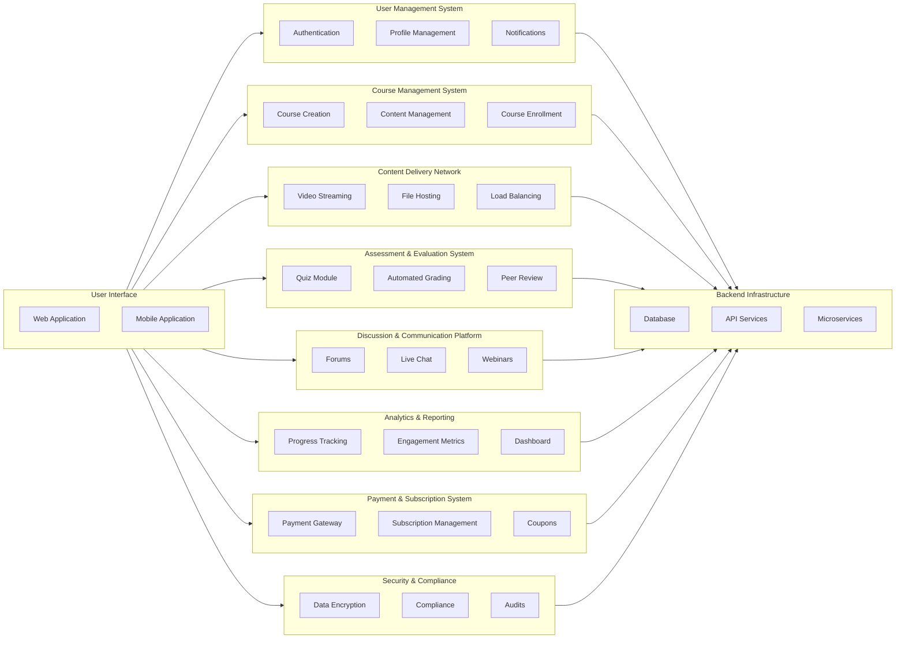

- 涉及的是一个工程问题，不是一个小的代码，而是一种大规模开发。包括团队组织，代码开发组织，未来易于维护性等
- Bad Code和错误的开发实践（development practices），导致金钱浪费和项目失败
- 最初的设计，非常重要
- 从**范畴**大小来说：
  - 最里层的是*具体的开发，实践，设计模式，代码编程，构架，运维等技术方面*
  - 然后是统筹这些的*SDLC*框架，用合适的框架进行开发
  - 最终支持整个交付的是*项目管理PM*

## Software Lifecycle

- **软件开发生命周期（SDLC, Software Development Life Cycle）**是一个系统化的方法论，用于定义软件项目的开发过程。它包括从概念到交付和维护的各个阶段，帮助开发团队在项目中保持一致性和质量
  - 关注*技术和方法*
  - 最终目标是*交付高质量的软件产品*
- **项目管理（PM, Project Management）**是应用知识、技能、工具和技术来执行项目活动，以满足项目要求。项目管理关注的是项目的总体成功，包括资源的有效利用、风险管理和项目交付的按时完成
  - *范围，时间，成本，质量，沟通*
  - 关注*项目整体的管理和交付*，支持*SDLC*的执行
  - 目标是*成功交付项目，满足时间、成本和质量要求*

- Requirements = what
- Design = how
- Implementation = build
- Verification = test(do they meet the requirements)
- Maintenane = new cycle(debug, new features)
- [Reference](https://www.tutorialspoint.com/sdlc/sdlc_overview.htm)

## Requirements / WRSPM

- **Requirements**是一种谁都可以懂的东西，客户要达到何种目的和功能，是一种**用户user**的要求
- **Specifications**则是一种规格说明，不会用太多的专业词汇，用于指导之后*开发者*的设计，是一种**系统system**的要求

- **Functional vs Non-Functional**：功能性是系统能做什么，非功能性要求则是基于产品，组织，外部的一些基准的要求，必须加密用什么方式之类的

- **WRSPM**：
  - *Environment*：
  - world：周围的所有环境需求，电力，网络，温度
  - requirements：各方用户所需的功能要求
  - *Interface*：
  - specifications：规格要求，芯片技术，加密方式，传输协议，付款方式
  - *System*：
  - program：编程需求
  - machine：硬件需求

  - 可以看出他们是对应的关系，现实的世界**world**和机器的世界**machine**，现实的需求**requirements**对应**program**程序代码的实现，中间的接口是**specifications**

- **WRSPM Variables**:
  - *Environment*：
  - Eh：Elements of the environment which are hidden from the system，必须一个ATM机器来说，你的银行卡就是这样的元素
  - *Interface*：
  - Ev：Elements of the environment which are visible to the system，比如银行卡的芯片，通过这个芯片的内容，系统才可以进行交互，什么元素，可以让系统识别到世界中的内容，比如机器学习中，对文字来说，机器不可识别，但是可以识别数字，所以需要embedding
  - Sv：Elements of the system which are visible to the environment，系统中对环境来说也是可见的东西，比如按钮，屏幕，UI等
  - *System*：
  - Sh：Elements of the system which are hidden from the environment，系统中对环境来说不可见的东西，比如你的网络应用的后端，对用户是不可见的

- **WRSPM：从左到右就是环境，接口，和系统的顺序**，called *world-machine model*

## Design：Architecture

- 高层次的设计
- 想法是否可以落实到现实的蓝图计划
- *错误的构架无法靠代码弥补*，因为它设计基础的地方，当工程开始，基础很难改变
- 一个好的构架师，一个好的PM，都应该首先是一个优秀的技术者，从细节到上层全面把握

- 系统构架和软件构架是两件事，这里谈*软件构架*
- **软件构架都是关于，如何将一个大的系统，分解成小的子系统和其中的模块**
- *解藕*和*交互API*非常重要
- 好的构架很难，错误的构架在之后很难修正，有时候你甚至需要重建
- 好的构架在之后很容易维护和进化

- 好的设计构架都会有好的doc，作为使用接口的人，**阅读文档**太重要了

- 构架例子：
  - 前端 - 逻辑 - 服务器（贪吃蛇游戏如果做成一个应用服务，是如何的）
  - 一个系统都有什么*组件*，哪些组件之间需要*交互*，哪些不需要，如何交互
- architecture of the Online Learning Platform:

### Pipe and Filter

**管道和过滤器（Pipe and Filter）**是在软件架构和设计模式中，一种非常常见的设计模式。它被用来处理数据流，并将复杂的处理过程分解为一系列简单的步骤。

- *管道（Pipe）*：在这个模式中，管道用于连接一系列的过滤器。管道负责传递数据，从一个过滤器的输出端到下一个过滤器的输入端，类似于管道中水的流动。
- *过滤器（Filter）*：过滤器是独立的处理组件，每个过滤器接收数据流，处理数据，然后将其输出传递给下一个过滤器。
  - 独立性：每个过滤器作为一个独立的单元，可以被重用和独立开发。
  - 数据处理：每个过滤器负责执行特定的数据处理任务，例如转换、过滤、排序等。
  - 无状态性：大多数过滤器是无状态的，这意味着它们不会存储处理过的数据，处理过程不依赖于之前的数据状态。
- 管道和过滤器的工作流程：
  - 数据输入：初始数据被输入到第一个过滤器中。
  - 数据处理：数据流经第一个过滤器进行处理，处理后的数据通过管道传递到下一个过滤器。
  - 逐步处理：这一过程在每个过滤器中重复，直到数据流通过所有的过滤器。
  - 数据输出：最终处理完成的数据被输出或存储。

- 现实案例，比如shell的管道符号｜，大数据处理的ETL，编排服务的数据流等，Airflow编排服务也是这种软件构架也许

### Client-Server

**Client-Server**（客户端-服务器）是一种经典的软件设计模型。它是*分布式计算架构*的一种，其中任务和负载被分配到两个主要的组件：客户端和服务器。这种模型被广泛用于各种网络应用程序和系统设计中。

1. **请求-响应循环**：
  - 客户端向服务器发送请求，服务器接收到请求后进行处理，然后将结果返回给客户端。

2. **网络通信**：
  - 客户端和服务器通过网络进行通信，常用的协议有HTTP、HTTPS、FTP、TCP/IP等。

3. **异步处理**：
  - 在许多现代应用中，客户端可以异步地发送请求，而无需等待服务器的响应才能继续进行其他操作。

Client-Server 的应用示例
- Web 应用：浏览器作为客户端，Web 服务器（如Apache、Nginx）作为服务器。
- 数据库系统：应用程序作为客户端，数据库服务器（如MySQL、PostgreSQL）作为服务器。
- 电子邮件系统：邮件客户端（如Outlook、Gmail）和邮件服务器（如SMTP服务器）。

Client-Server 与其他模型的对比
- **对等网络（Peer-to-Peer，P2P）**：
  - 在P2P网络中，每个节点既可以是客户端，也可以是服务器。这种架构更适合于资源共享和分布式计算。
- **微服务架构**：
  - 微服务架构将应用程序拆分成多个独立的小服务，每个服务负责特定的功能。这与传统的Client-Server模型不同，因为它强调服务的独立性和去中心化。

### Master-Slave

**Master-Slave 模式**是一种分布式计算架构，广泛应用于数据库、计算任务调度和系统管理中。它将任务和数据在主服务器（Master）和从服务器（Slave）之间进行分配，以提高系统的可用性、性能和容错性。

1. **主从角色**：
   - **主服务器（Master）**：负责管理和协调，从属于控制中心。它分配任务、存储数据，并对系统进行整体控制。
   - **从服务器（Slave）**：接收来自主服务器的任务，并执行指定的操作。它可以将结果返回给主服务器或独立存储数据。

2. **任务分配**：
   - 主服务器分配任务，从服务器执行。通常在计算任务中，主服务器会根据任务的复杂度和从服务器的负载情况进行分配。

3. **数据复制**：
   - 在数据库系统中，主服务器将数据更新推送给从服务器，从而实现数据的冗余和备份。这样可以提高数据读取的效率和系统的容错能力。

4. **容错性和高可用性**：
   - 从服务器的存在提高了系统的容错能力。如果主服务器出现故障，从服务器可以作为备份进行故障切换（Failover）。

5. **读写分离**：
   - 通过将写操作集中在主服务器，而将读操作分散到从服务器，从而提高系统的性能。

Master-Slave 模式的应用示例

1. **数据库系统**：
   - 在 MySQL、PostgreSQL 等数据库中，Master-Slave 模式用于实现数据复制和负载均衡。主数据库负责写操作，从数据库负责读操作。

2. **分布式计算**：
   - 在 Hadoop 中，NameNode 作为主节点，DataNode 作为从节点。NameNode 负责元数据管理，DataNode 负责实际的数据存储。

3. **任务调度系统**：
   - 诸如 Apache Kafka 之类的消息队列中，主节点负责管理主题和分区，从节点负责实际的消息存储和传递。

**优点**:

- 性能优化：通过读写分离和任务分配，提高了系统的整体性能。
- 高可用性：从服务器提供冗余和备份，提高了系统的可靠性。
- 易于扩展：可以通过增加从服务器来扩展系统的处理能力。

**缺点**:

- 单点故障：主服务器故障可能导致整个系统的停滞，需要额外的机制来实现主服务器的故障切换。
- 数据一致性：数据复制延迟可能导致暂时的不一致性，需要仔细设计数据同步机制。

Master-Slave 模式通过角色分配和任务调度，实现了高效的数据处理和系统管理。它在性能优化和高可用性方面表现出色，但也面临单点故障和数据一致性等挑战。通过合理的设计和实施，Master-Slave 模式能够为复杂的分布式系统提供强大的支持。

想起了k8s和Airflow的scheduler

### Layered Model

分层模型是一种软件架构设计模式，通过将系统划分为多个层次，每个层次承担不同的职责，以实现更好的结构化和模块化。这种模型通常用于设计复杂的软件系统，使系统更易于开发、维护和扩展。

1. **分层结构**：
   - 系统被划分为多个层，每一层在其上层之下并依赖于其下层。
   - 每层负责特定的功能，并通过接口与其他层进行交互。

2. **模块化**：
   - 每一层可以独立开发、测试和修改，降低系统复杂度。
   - 层与层之间的相互依赖减少，增强了系统的灵活性和可维护性。

3. **职责分离**：
   - 不同层次负责不同的职责，如数据访问、业务逻辑、用户界面等。
   - 职责的分离有助于明确系统的功能边界，提高代码的可读性和可维护性。

4. **可扩展性**：
   - 通过增加或修改特定层的功能，可以轻松扩展系统，而不影响其他层。

5. **可移植性**：
   - 底层的实现细节可以独立于高层，增强了系统的可移植性。

Layered Model 通常由以下几个主要层次组成：

1. **Presentation Layer（表示层）**：
   - 负责与用户的交互，包括用户界面的显示和输入处理。
   - 例如：Web 应用中的 HTML/CSS/JavaScript，桌面应用中的 GUI 组件。

2. **Application Layer（应用层）或 Business Logic Layer（业务逻辑层）**：
   - 负责处理应用程序的核心业务逻辑和规则。
   - 将用户的请求转化为具体的操作，通过与数据层交互来处理数据。

3. **Data Access Layer（数据访问层）**：
   - 负责与数据库或其他持久化存储系统进行交互。
   - 包括数据的查询、插入、更新和删除操作。

4. **Data Layer（数据层）或 Persistence Layer（持久层）**：
   - 负责实际的数据存储和管理，包括数据库系统和文件存储。
   - 管理数据的物理存储，确保数据的持久性和一致性。

以一个电子商务应用为例，Layered Model 的各层可能包含以下内容：

1. **Presentation Layer（表示层）**：
   - 负责显示产品信息、处理用户输入和结账流程。
   - 通过 *RESTful API* 或者 *GraphQL* 与应用层进行交互。

2. **Application Layer（应用层）**：
   - 实现产品搜索、购物车管理和订单处理等业务逻辑。
   - 负责用户认证和授权，确保用户的操作符合业务规则。

3. **Data Access Layer（数据访问层）**：
   - 负责从数据库中读取产品信息、订单状态，并进行数据持久化。
   - 使用 ORM（对象关系映射）工具或 SQL 查询与数据库交互。

4. **Data Layer（数据层）**：
   - 使用 MySQL 或 MongoDB 等数据库存储用户信息、产品目录和订单记录。
   - 维护数据库的架构和索引，确保数据的完整性和查询效率。

**优点**：

- 易于理解和维护：分层结构清晰，职责分离明确，使得系统易于理解和维护。
- 提高可重用性：各层可以独立开发并重用于不同项目，减少重复劳动。
- 增强可测试性：每层的功能可以单独测试，提高测试的覆盖率和效率。

**缺点**：

- 性能开销：层与层之间的交互可能带来额外的性能开销，特别是在高频调用的情况下。
- 灵活性不足：严格的分层可能导致一些特定需求难以实现，需要在架构上进行调整。
- 复杂性增加：对于简单的应用，分层模型可能引入不必要的复杂性。

Layered Model 被广泛应用于各种软件系统，包括但不限于：

- **Web 应用开发**：常见于 *MVC（Model-View-Controller）*架构中。
- **企业级应用**：如 ERP 和 CRM 系统，常采用三层或多层架构。
- **操作系统设计**：如 OSI 模型，将网络协议栈划分为多个层次。

**Layered Model 与其他架构的对比**：

- **Microservices Architecture（微服务架构）**：
  - 微服务架构将应用拆分为多个独立的服务，强调服务的独立性和去中心化。
  - Layered Model 强调职责分离和模块化，适用于系统内部的组织结构。

- **Event-Driven Architecture（事件驱动架构）**：
  - 事件驱动架构通过事件触发系统中的动作，适用于需要高度响应性和解耦的系统。
  - Layered Model 强调各层的交互和依赖，适合于逻辑清晰的业务系统。

- **Client-Server Architecture（客户端-服务器架构）**：
  - 客户端-服务器架构强调请求-响应机制，适用于网络应用和分布式系统。
  - Layered Model 可以作为客户端或服务器内部的结构化方式。

Layered Model 是一种经典的架构模式，通过分层实现系统的职责分离和模块化，适用于大多数复杂的业务系统。虽然在性能和灵活性上存在一些挑战，但其易于理解、维护和扩展的特点，使得它在软件设计中具有重要地位。通过合理的分层和接口设计，Layered Model 可以为复杂的系统提供清晰的结构和强大的支持。

### 其他构架

**Microservices Architecture（微服务架构）**

- 微服务架构是一种构建应用的架构模式，它将应用分解为一系列小型、独立的服务，每个服务都可以独立部署和扩展。这些服务通常通过轻量级的协议（如 HTTP/REST、gRPC）进行通信。
- 特点：
- 独立部署：各服务可以独立于其他服务进行部署。
- 可独立扩展：根据需要扩展特定服务。
- 强大的技术栈：每个服务可以选择适合自身的技术栈和编程语言。
- 应用示例：
- 大型互联网公司，如 Netflix、Amazon。
- 需要灵活扩展和快速迭代的企业应用。

**Event-Driven Architecture（事件驱动架构）**

- 事件驱动架构是一种基于事件的架构模式，强调通过事件来驱动系统行为。
- 特点：
- 异步处理：事件驱动的系统通常是异步的。
- 解耦：生产者和消费者之间没有直接联系。
- 可伸缩性：事件可以在多个消费者之间分发。
- 应用示例：
- 实时数据处理系统。
- 物联网（IoT）系统。
- 系统通知和消息传递。

**Service-Oriented Architecture（面向服务架构）**

- SOA 是一种基于服务的设计模式，类似于微服务架构，但通常采用较重的通信协议（如 SOAP），并更注重企业级的应用集成。
- 特点：
- 组件松耦合：服务独立于平台和技术。
- 标准化接口：使用标准协议定义服务接口。
- 高复用性：服务可重用性高，支持不同应用集成。
- 应用示例：
- 企业级应用集成，特别是在传统企业中广泛应用。

**Repository Pattern（仓储模式）**

- Repository Pattern 是一种用于数据访问逻辑分离的模式，通过定义一个接口来实现对数据访问的抽象。
- 特点：
- 隔离数据访问逻辑：通过仓储接口来操作数据源。
- 提高测试性：业务逻辑与数据访问逻辑分离，更易于单元测试。
- 应用示例：
- 数据访问层设计，如在 DDD（领域驱动设计）中应用广泛。

### 资源链接

- [微软构架模型文档](https://learn.microsoft.com/en-us/azure/architecture/patterns/)

## Design：Modularity

**模块化**是一种软件设计原则，旨在将软件系统分解为**子系统**，然后再分解为若干个相对独立的**模块（Module）**，以便于开发、理解、维护和重用。这些模块可以是代码、组件、功能模块或子系统，它们通过清晰的接口进行交互。

**和上一部分的系统构架不同，这部分专注于系统内部的，功能分离的设计模式**

**何为设计？**：设计行动本身，和设计文档

**Design is not coding, coding is not design.What important is the real world solutions.**

*模块化的基本概念*：
- **独立性**：每个模块应该尽可能独立运作，具有明确的功能和责任，减少对其他模块的依赖。
- **高内聚、低耦合**：模块内部的元素应紧密相关（高内聚），而模块之间应尽量少的依赖（低耦合）。
- **接口**：模块之间通过接口进行通信，这些接口定义了模块提供的服务和可供其他模块调用的功能。

### 应用领域

- **代码层面的模块化**：在代码层面上，模块化通常体现在类、函数和库的设计中：
  - *类和方法*：在面向对象编程中，类和方法是模块化设计的基本单位。每个类或方法应该负责单一功能或责任。
  - *模块和包*：在许多编程语言中，模块和包用于组织和管理代码库中的相关功能。例如，Python 的 `module` 和 Java 的 `package`。
- **系统架构层面的模块化**：在系统架构层面上，模块化体现在微服务架构、插件架构等：
  - *微服务架构*：将应用程序拆分为一组小型、独立部署的服务，每个服务负责特定的业务功能。
- **插件架构**：允许开发者通过插件来扩展或修改系统功能，而无需更改核心系统。浏览器的插件系统允许用户自定义浏览器的功能
- **框架和库的模块化**：许多软件框架和库也采用模块化设计，以提高可扩展性和易用性
  - *前端框架（如 React、Angular）*：这些框架通常使用组件（Component）作为模块化单元，每个组件封装了特定的 UI 逻辑和样式
  - *后端框架（如 Django、Spring）*：通过模块化设计，开发者可以使用或替换特定功能模块，如身份验证、数据库访问等

### Stages of Design：设计的各个阶段

- 将大*问题分解*为小的问题
- 理解每一个问题
- 试图找到每一个问题的*解决方案*
- 抽象地描述每一个解决方案
- 重复上述步骤，直到每一个问题*都被抽象*，可以用画图的方式表达比如*UML*等流程图，或者数据库等*ER*图
- 设计*组件*
- 设计*数据结构*
- 设计*算法*

### Modularity 的目的

* 软件设计是一个神奇的世界，就像是造物主，从抽象的混沌的阴阳中，创造了世界

- 抽象和封装
- 解藕
- 可读性
- 并行开发
- 可重用，可维护，可扩展

**Information Hiding**:

* 目的就是*用各种方法隐藏程序的复杂性*
- Function
- Macro
- Library
- Classes
- Method

* 就像计算机是一个 black box 一样，模块的目的也是将信息，装进一个黑箱中，在内部进行编码，和解码的终极过程，这个过程对外不可见。

**Data Encapsulation**：

- 目的在于*对用户隐藏细节，保护数据的完整性，并且只提供接口*
- 比如`get`和`set`方法，就是为了数据保存和封装存在，比如在`get`的时候获取用户的认证，比如在`set`的时候，设置某些必要条件

### 强内聚 & 低耦合

强内聚（Strong Cohesion）：意味着*模块内*的代码和功能高度相关，目标明确，通常关注单一职责。这种设计使模块更专注于其核心功能，避免了混杂不同功能的代码。

低耦合（Loose Coupling）：强调*模块间*的独立性和灵活性。低耦合设计允许模块在互不干扰的情况下演变和发展，使得系统的修改和扩展变得更加容易。

### Coupling 耦合

- 在软件设计中，**耦合**（Coupling）指的是模块或组件之间的依赖程度。
- **降低耦合**是软件设计中的重要原则，有助于提高系统的可维护性和扩展性。

* **紧耦合**：
* *内容耦合*：模块直接访问或修改另一个模块的*内部数据或逻辑*，会导致模块间强依赖，难以维护。
* *公共耦合*：多个模块共享同一个*全局数据*。如果数据不变，只是读取倒还好，模块对公共数据的依赖增加，修改复杂。
* *外部耦合*：模块依赖于*外部环境、系统配置或外部设备*。比如分享同一个I/O之类，系统移植和部署变得困难。

* **中耦合**：
* *控制耦合*：一个模块通过控制参数影响另一个模块的行为，增加了模块之间的复杂性和依赖。
* *数据结构耦合*：模块之间通过共享复杂数据结构进行交互，从而导致对数据结构的具体实现有较强依赖的一种耦合形式。

* **松耦合**：
* *数据耦合*：模块通过参数传递进行数据交换，不涉及内部实现。耦合性较低，提高了模块独立性，比如数据处理模块的实现
* *消息耦合*：模块通过消息传递进行通信，只需了解接口而无需实现细节。最弱的耦合，增强系统的灵活性和可扩展性。*Pub/Sub模型*就是如此

### Cohesion 内聚

- 内聚（Cohesion）是软件工程中的一个概念，用于衡量一个模块或类内部各个元素之间的紧密性和关联度。
- 简单来说，内聚描述的是一个模块内部的*功能是如何彼此关联和协作完成任务的*。

* **弱内聚**：
* *偶然内聚（Coincidental Cohesion）*：模块内的各个元素之间几乎没有关联，只是偶然放在一起。一个模块内有不相关的功能，如同时处理文件和发送邮件。
* *时间内聚（Temporal Cohesion）*：模块中的功能在时间上相关，通常在同一时间执行。比如程序启动或关闭时执行的初始化或清理操作。
* *逻辑内聚（Logical Cohesion）*：模块中的功能属于同一逻辑类别，但并不直接相关。比如处理多种不同格式的输入（如 XML、JSON）的函数集合。

* **中内聚**：
* *过程内聚（Procedural Cohesion）*：模块内的功能按照特定的过程顺序执行。比如处理订单的多个步骤组合在一起（验证、计算总价、生成发票）。
* *通信内聚（Communicational Cohesion）*：模块中的功能共享同一数据或操作同一数据结构。比如对同一数据库表的读写操作组合在一起。
* *顺序内聚（Sequential Cohesion）*：模块内的功能按顺序执行，其中一个功能的输出作为下一个功能的输入。流水线式的数据处理（如数据解析、处理、输出）。似乎像是过程内聚和通信内聚的结合体。

* **强内聚**：
* *功能内聚（Functional Cohesion）*：模块内所有元素共同实现单一、明确的功能。实现特定算法或提供单一服务的函数或类。
* *对象内聚（Object Cohesion）*：指的是对象内部方法和属性之间的关联性和一致性程度。对象内聚确保一个对象的所有行为和数据都与其所承担的单一职责或功能密切相关。一个对象的所有方法和属性共同协作来实现一个清晰明确的功能或目标。

## Implementation & Deployment

### Implementation

- 技术债（Technical Debt）是软件开发过程中，由于赶工、资源限制、或决策失误而产生的代码质量欠佳或架构不佳的问题。这种“债务”就像金融债务一样，需要在未来进行“偿还”，即通过重构、修复、优化等手段改善代码质量。
- **代码实现（implementation）**是一个很重要的部分。
  * 统一的编码原则和指导
  * 更短更好更容易理解，代码是写给人看的
  * 可以试验但是记得清理
  * 做每件事之前有一个plan

- **Coding Principal**：[链接](https://www.makeuseof.com/tag/basic-programming-principles/)
  - 1. Keep It Simple, Stupid (KISS)：保持代码简洁
  - 2. Write DRY Code：不要重复你自己
  - 3. Open/Closed：对扩展开放，对变化封闭
  - 4. Composition Over Inheritance：组合优于继承
  - 5. Single Responsibility：简化依赖关系
  - 6. Separation of Concerns：分离原则
  - 7. You Aren't Going to Need It (YAGNI)：不要试图去解决一个还不存在的问题
  - 8. Document Your Code：留下注释
  - 9. Refactor：不断优化代码
  - 10. Clean Code at All Costs：不惜一切代价写出干净的代码

- Buy Or Build：**不要重新发明轮子，如何可以找到template和开源范本，为何不用**

### Deployment

*built with the idea of retreat*

- **Deployment Planing**：
  - 计划的内容多少，取决于作出变化的size的大小
  - 主要关注的是哪里会发生大的问题，也就是风险在哪里，*failure point*在哪里
  - 关注点：比如如下部分
    * 数据库活动监控
    * 第三方软件集成
    * Runtime变化
    * Training确保用户和利益相关方了解系统的变化
    * 如何应对Downtime
    * Backups备份该如何进行
    * Network是否有问题
    * Memory监控是否没问题
  - 最后，还需要一个撤退计划，如何跳回上一个节点

## Testing
## Software Development
## Agile
## Scrum Deep Dive
